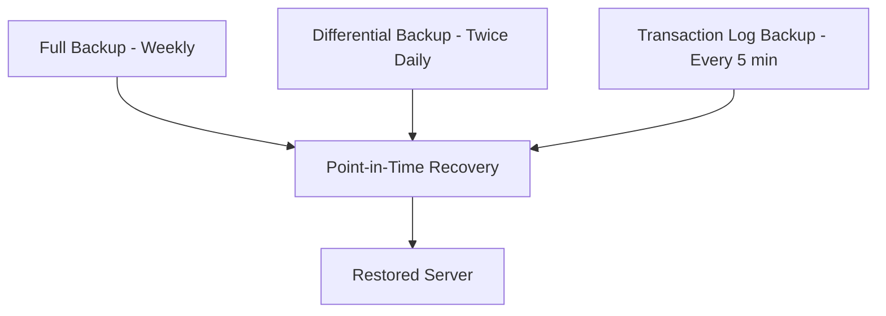

# How to Configure Automated Backups and Restore in Azure Database for MySQL

Author: [nawazdhandala](https://www.github.com/nawazdhandala)

Tags: Azure, MySQL, Backup, Restore, Disaster Recovery, Flexible Server, Data Protection

Description: Learn how to configure automated backups, point-in-time restore, and geo-redundant backups for Azure Database for MySQL Flexible Server.

---

Backups are the safety net you never want to use but absolutely need to have. Azure Database for MySQL Flexible Server handles backups automatically, but understanding how the backup system works and how to configure it properly is essential. A misconfigured backup strategy can leave you with data loss or extended downtime when you need recovery the most.

This post covers everything you need to know about automated backups in Azure Database for MySQL Flexible Server: how they work, how to configure them, and how to restore when things go wrong.

## How Automated Backups Work

Azure takes three types of backups automatically:

- **Full backups**: Taken once a week.
- **Differential backups**: Taken twice daily.
- **Transaction log backups**: Taken every five minutes.

These backups are stored in Azure Blob Storage and are redundant based on your backup redundancy configuration. You do not need to trigger them manually - they run on a schedule managed by Azure.



The combination of these three backup types enables point-in-time restore (PITR). You can restore to any second within your retention period, not just to specific backup points.

## Configuring Backup Retention

The backup retention period determines how far back you can restore. The range is 1 to 35 days, with a default of 7 days.

To change the retention period using the CLI:

```bash
# Set backup retention to 14 days
az mysql flexible-server update \
  --resource-group myResourceGroup \
  --name my-mysql-server \
  --backup-retention 14
```

In the portal, go to your server, click "Backup and restore" under Settings, and adjust the retention slider.

### How to Choose the Right Retention Period

Think about these factors:

- **Compliance requirements**: Some regulations require specific retention periods (e.g., 30 days for financial data).
- **Recovery scenarios**: How far back might you need to restore? If a bad deployment corrupts data and you do not notice for a week, a 7-day retention will not save you.
- **Cost**: Backup storage up to 100% of your provisioned server storage is free. Beyond that, you pay per GB per month.

For most production workloads, I recommend at least 14 days. For critical systems, go with 35 days.

## Backup Redundancy Options

Azure offers three backup storage redundancy options:

| Option | Description | Protection Level |
|--------|-------------|-----------------|
| Locally redundant (LRS) | Three copies in one datacenter | Hardware failure |
| Zone-redundant (ZRS) | Copies across availability zones | Zone failure |
| Geo-redundant (GRS) | Copies in a paired region | Regional disaster |

To configure backup redundancy during server creation:

```bash
# Create a server with geo-redundant backups
az mysql flexible-server create \
  --resource-group myResourceGroup \
  --name my-mysql-server \
  --location eastus \
  --admin-user myadmin \
  --admin-password 'StrongPassword123!' \
  --sku-name Standard_D4ds_v4 \
  --tier GeneralPurpose \
  --version 8.0.21 \
  --storage-size 128 \
  --backup-retention 14 \
  --geo-redundant-backup Enabled
```

Important: You cannot change the backup redundancy option after server creation. Choose wisely when provisioning.

For production databases that need regional disaster protection, enable geo-redundant backup. The additional cost is minimal compared to the protection it provides.

## Point-in-Time Restore

Point-in-time restore (PITR) is your primary recovery tool. It creates a new server from your backups at a specific point in time.

### Restore via Azure CLI

```bash
# Restore to a specific point in time
# This creates a new server with the restored data
az mysql flexible-server restore \
  --resource-group myResourceGroup \
  --name my-mysql-restored \
  --source-server my-mysql-server \
  --restore-time "2026-02-15T10:30:00Z"
```

The restore creates a completely new server. It does not overwrite the existing one. This is important because it means you can:

- Compare data between the original and restored servers.
- Selectively copy only the data you need.
- Test the restored data before making any decisions.

### Restore via Azure Portal

1. Go to your MySQL Flexible Server.
2. Click "Backup and restore" in the left menu.
3. Click "Restore."
4. Select the point in time using the date/time picker.
5. Enter a name for the new server.
6. Click "Review + Create."

### Choosing the Right Restore Point

Picking the right restore time is crucial. Here are some tips:

- If you know when the data corruption or deletion happened, restore to a point just before that event.
- If you are not sure, restore to a few different points and compare the data.
- The earliest available restore point depends on your retention period and when the oldest full backup was taken.

Check the earliest available restore point:

```bash
# Show the earliest restore point for your server
az mysql flexible-server show \
  --resource-group myResourceGroup \
  --name my-mysql-server \
  --query "backup.earliestRestoreDate"
```

## Geo-Restore

If your primary region goes down entirely, geo-restore lets you create a server in the paired region from your geo-redundant backups:

```bash
# Geo-restore to the paired region
az mysql flexible-server geo-restore \
  --resource-group myDRResourceGroup \
  --name my-mysql-geo-restored \
  --source-server my-mysql-server \
  --location westus2
```

Geo-restore has a recovery point objective (RPO) of up to one hour, meaning you might lose up to one hour of data. The recovery time objective (RTO) depends on the database size but is typically under an hour for most databases.

## Restoring Specific Data

Sometimes you do not need to restore the entire server - you just need to recover a few tables or rows. Here is the workflow:

1. Perform a PITR to a new server.
2. Connect to the restored server.
3. Export the specific data you need.
4. Import it into the production server.

```bash
# Step 1: Restore to a new server
az mysql flexible-server restore \
  --resource-group myResourceGroup \
  --name my-mysql-temp-restore \
  --source-server my-mysql-server \
  --restore-time "2026-02-15T10:30:00Z"

# Step 2: Export specific tables from the restored server
mysqldump \
  --host=my-mysql-temp-restore.mysql.database.azure.com \
  --user=myadmin \
  --password='StrongPassword123!' \
  --ssl-mode=REQUIRED \
  --single-transaction \
  myapp users orders > recovered_tables.sql

# Step 3: Import into the production server
mysql \
  --host=my-mysql-server.mysql.database.azure.com \
  --user=myadmin \
  --password='StrongPassword123!' \
  --ssl-mode=REQUIRED \
  myapp < recovered_tables.sql

# Step 4: Delete the temporary restored server
az mysql flexible-server delete \
  --resource-group myResourceGroup \
  --name my-mysql-temp-restore \
  --yes
```

## Backup Monitoring

You should monitor your backup status to make sure everything is working:

```bash
# Check the backup status and configuration
az mysql flexible-server show \
  --resource-group myResourceGroup \
  --name my-mysql-server \
  --query "{backupRetention:backup.backupRetentionDays, geoRedundant:backup.geoRedundantBackup, earliestRestore:backup.earliestRestoreDate}"
```

Set up Azure Monitor alerts for backup failures:

```bash
# Create a diagnostic setting to log backup events
az monitor diagnostic-settings create \
  --name mysql-backup-diagnostics \
  --resource "/subscriptions/{sub-id}/resourceGroups/myResourceGroup/providers/Microsoft.DBforMySQL/flexibleServers/my-mysql-server" \
  --workspace "/subscriptions/{sub-id}/resourceGroups/myResourceGroup/providers/Microsoft.OperationalInsights/workspaces/myWorkspace" \
  --logs '[{"category": "MySqlAuditLogs", "enabled": true}]'
```

## Testing Your Backups

A backup you have never tested is a backup you cannot trust. Schedule regular restore tests:

1. Pick a random point in time within your retention period.
2. Perform a PITR to a temporary server.
3. Connect and verify the data is intact and consistent.
4. Run a few application queries against it.
5. Delete the temporary server.

I recommend doing this quarterly at minimum and monthly for critical databases.

## Cost Considerations

Backup storage pricing:

- Backup storage up to 100% of your provisioned server storage is included at no extra charge.
- Additional backup storage is billed per GB per month.
- Geo-redundant backup storage costs more than locally redundant.
- Restored servers are billed as new servers from the moment they are created.

To keep costs manageable:

- Do not keep retention longer than you actually need.
- Delete temporary restored servers promptly after use.
- Right-size your primary server storage so the free backup allowance covers your needs.

## Common Backup and Restore Issues

**Cannot restore to a point in time**: Make sure the time is within your retention period and after the earliest restore point. Times are in UTC.

**Restore is slow**: Large databases take longer to restore. For databases over 1 TB, expect the restore to take several hours.

**Restored server has different settings**: The restored server inherits the source server's configuration at the time of backup, not the current configuration. Check server parameters after restore.

**Geo-redundant backup not available**: GRS is not available in all regions. Check the Azure documentation for region support.

## Summary

Automated backups in Azure Database for MySQL Flexible Server provide solid protection without manual intervention. Configure your retention period based on compliance and recovery needs, enable geo-redundant backup for critical workloads, and test your restores regularly. When you need to recover, PITR gives you second-level granularity, and geo-restore protects against regional disasters. The key is to set this up right from the start - backup is one of those things where the cost of getting it wrong far exceeds the cost of doing it properly.
