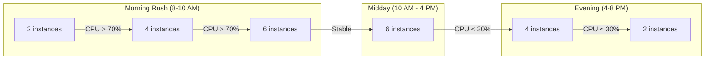

# How to Configure Autoscaling Rules for Azure Spring Apps

Author: [nawazdhandala](https://www.github.com/nawazdhandala)

Tags: Azure, Spring Apps, Autoscaling, Performance, Monitoring, Java, Cloud

Description: A hands-on guide to configuring autoscaling rules for Azure Spring Apps based on CPU usage, memory, HTTP requests, and custom metrics.

---

Running a fixed number of Spring Boot instances works until traffic patterns become unpredictable. At 2 AM, you are paying for instances that handle no traffic. During a marketing campaign, your two instances get overwhelmed. Autoscaling solves this by adjusting the instance count based on actual demand. Azure Spring Apps supports autoscaling based on CPU, memory, HTTP request rate, and custom metrics. This post covers how to configure rules that match your application's behavior.

## How Autoscaling Works in Azure Spring Apps

Autoscaling in Azure Spring Apps adjusts the number of application instances (horizontal scaling) based on metric thresholds you define. When a metric exceeds the scale-out threshold, new instances are added. When it drops below the scale-in threshold, instances are removed.

The scaling rules are evaluated on an aggregation window (typically 5 minutes), which means the system looks at the average metric value over the window before making a decision. This prevents scaling based on momentary spikes.

## Step 1: Enable Autoscaling via the CLI

Configure an autoscale setting for your application.

```bash
# Get the resource ID of the Spring Apps app
APP_RESOURCE_ID=$(az spring app show \
  --name order-service \
  --service my-spring-service \
  --resource-group spring-rg \
  --query "id" -o tsv)

# Create an autoscale setting with CPU-based rules
az monitor autoscale create \
  --resource $APP_RESOURCE_ID \
  --resource-group spring-rg \
  --name order-service-autoscale \
  --min-count 2 \
  --max-count 10 \
  --count 2
```

This creates an autoscale profile with a minimum of 2 instances, maximum of 10, and a default of 2. Now add scaling rules.

## Step 2: Add CPU-Based Scaling Rules

CPU usage is the most common trigger for scaling Spring Boot applications.

```bash
# Scale out when average CPU exceeds 70% over 5 minutes
az monitor autoscale rule create \
  --resource $APP_RESOURCE_ID \
  --autoscale-name order-service-autoscale \
  --resource-group spring-rg \
  --condition "CpuUsage > 70 avg 5m" \
  --scale out 2

# Scale in when average CPU drops below 30% over 10 minutes
az monitor autoscale rule create \
  --resource $APP_RESOURCE_ID \
  --autoscale-name order-service-autoscale \
  --resource-group spring-rg \
  --condition "CpuUsage < 30 avg 10m" \
  --scale in 1
```

The scale-out rule adds 2 instances when CPU exceeds 70%. The scale-in rule removes 1 instance when CPU drops below 30%. Notice that the scale-in window is longer (10 minutes vs 5 minutes) to prevent premature scale-down.

## Step 3: Add Memory-Based Scaling Rules

For memory-intensive Spring Boot applications, scale based on memory usage.

```bash
# Scale out when memory exceeds 80%
az monitor autoscale rule create \
  --resource $APP_RESOURCE_ID \
  --autoscale-name order-service-autoscale \
  --resource-group spring-rg \
  --condition "MemoryUsage > 80 avg 5m" \
  --scale out 1

# Scale in when memory drops below 40%
az monitor autoscale rule create \
  --resource $APP_RESOURCE_ID \
  --autoscale-name order-service-autoscale \
  --resource-group spring-rg \
  --condition "MemoryUsage < 40 avg 10m" \
  --scale in 1
```

## Step 4: Add HTTP Request-Based Scaling

For web applications, scaling based on the number of incoming HTTP requests is often more responsive than CPU-based scaling.

```bash
# Scale out when request count exceeds 1000 per instance over 5 minutes
az monitor autoscale rule create \
  --resource $APP_RESOURCE_ID \
  --autoscale-name order-service-autoscale \
  --resource-group spring-rg \
  --condition "IngressBytesReceived > 1048576 avg 5m" \
  --scale out 2

# Scale in when request count drops below 200 per instance
az monitor autoscale rule create \
  --resource $APP_RESOURCE_ID \
  --autoscale-name order-service-autoscale \
  --resource-group spring-rg \
  --condition "IngressBytesReceived < 204800 avg 10m" \
  --scale in 1
```

## Step 5: Configure Schedule-Based Scaling

If your application has predictable traffic patterns, combine metric-based scaling with schedule-based profiles.

```bash
# Create a profile for business hours (more capacity)
az monitor autoscale profile create \
  --resource $APP_RESOURCE_ID \
  --autoscale-name order-service-autoscale \
  --resource-group spring-rg \
  --name "business-hours" \
  --min-count 4 \
  --max-count 15 \
  --count 5 \
  --recurrence week Mon Tue Wed Thu Fri \
  --start "08:00" \
  --end "18:00" \
  --timezone "America/New_York"

# Create a profile for nights and weekends (less capacity)
az monitor autoscale profile create \
  --resource $APP_RESOURCE_ID \
  --autoscale-name order-service-autoscale \
  --resource-group spring-rg \
  --name "off-hours" \
  --min-count 1 \
  --max-count 5 \
  --count 2 \
  --recurrence week Mon Tue Wed Thu Fri \
  --start "18:00" \
  --end "08:00" \
  --timezone "America/New_York"
```

Schedule-based profiles set different minimum and maximum thresholds for different time periods. Metric-based rules still apply within each profile.

## Step 6: Configure Using Spring Boot Actuator Metrics

For more granular scaling, expose custom metrics from your Spring Boot application using Actuator and Micrometer.

Add the following to your `pom.xml`.

```xml
<!-- Dependencies for custom metrics -->
<dependency>
    <groupId>org.springframework.boot</groupId>
    <artifactId>spring-boot-starter-actuator</artifactId>
</dependency>
<dependency>
    <groupId>io.micrometer</groupId>
    <artifactId>micrometer-registry-azure-monitor</artifactId>
</dependency>
```

Create a custom metric in your application.

```java
// OrderController.java - Track active orders for scaling decisions
@RestController
@RequestMapping("/api/orders")
public class OrderController {

    private final MeterRegistry meterRegistry;
    private final AtomicInteger activeOrders;

    public OrderController(MeterRegistry meterRegistry) {
        this.meterRegistry = meterRegistry;
        // Register a gauge that tracks active orders
        this.activeOrders = new AtomicInteger(0);
        meterRegistry.gauge("orders.active", activeOrders);
    }

    @PostMapping
    public ResponseEntity<Order> createOrder(@RequestBody OrderRequest request) {
        activeOrders.incrementAndGet();
        try {
            Order order = orderService.create(request);
            // Track order creation throughput
            meterRegistry.counter("orders.created").increment();
            return ResponseEntity.ok(order);
        } finally {
            activeOrders.decrementAndGet();
        }
    }
}
```

Configure the Azure Monitor exporter in `application.yml`.

```yaml
# Export metrics to Azure Monitor
management:
  endpoints:
    web:
      exposure:
        include: health,info,metrics,prometheus
  metrics:
    export:
      azure-monitor:
        enabled: true
        instrumentation-key: ${APPLICATION_INSIGHTS_INSTRUMENTATION_KEY}
```

## Scaling Behavior Visualization

Here is how autoscaling responds to traffic patterns over a day.



## Step 7: Monitor Autoscale Events

Check the autoscale history to see when and why scaling decisions were made.

```bash
# View autoscale events
az monitor autoscale show \
  --name order-service-autoscale \
  --resource-group spring-rg \
  --query "profiles"

# View recent autoscale activity logs
az monitor activity-log list \
  --resource-group spring-rg \
  --caller "Microsoft.Insights/autoscaleSettings" \
  --start-time "2026-02-15T00:00:00Z" \
  --output table
```

You can also set up alerts for scaling events.

```bash
# Create an alert for scale-out events
az monitor metrics alert create \
  --name scale-out-alert \
  --resource-group spring-rg \
  --scopes $APP_RESOURCE_ID \
  --condition "avg CpuUsage > 85" \
  --description "App is scaling out due to high CPU"
```

## Tuning Tips

**Asymmetric thresholds:** Make the scale-in threshold much lower than the scale-out threshold. If you scale out at 70% CPU, scale in at 30%, not 69%. This prevents oscillation.

**Gradual scale-in:** Remove fewer instances during scale-in (1 at a time) than you add during scale-out (2-3 at a time). Scaling down too aggressively can leave you short during another spike.

**Cooldown periods:** Azure's autoscaler has built-in cooldown periods. After a scale-out event, it waits before evaluating again. Keep your evaluation windows at 5 minutes or more.

**JVM warm-up:** Spring Boot applications often need 30-60 seconds after startup before they perform optimally. The JIT compiler needs time to optimize hot paths. Consider slightly over-provisioning to account for this warm-up period.

**Connection pooling:** When scaling out, new instances need to establish database connections. Make sure your connection pool settings and database can handle the additional connections.

```yaml
# Configure HikariCP connection pool for scaling
spring:
  datasource:
    hikari:
      minimum-idle: 5
      maximum-pool-size: 20
      idle-timeout: 300000
      connection-timeout: 20000
```

## Common Mistakes

1. **Scaling based on average across all instances:** Make sure you are looking at per-instance metrics, not total metrics. A CPU average of 50% across 10 instances might mean 5 are idle and 5 are overloaded.

2. **No minimum instance count:** Setting min-count to 0 or 1 means cold start delays when the first request arrives. Keep at least 2 instances for production APIs.

3. **Not testing scaling behavior:** Load test your application to observe how it scales. Use tools like k6 or JMeter to simulate traffic patterns.

4. **Ignoring the cost of scaling:** Each additional instance costs money. Set max-count to a value that aligns with your budget.

## Summary

Autoscaling Azure Spring Apps ensures your applications have the right capacity at the right time. Start with CPU-based rules for most workloads, add memory-based rules if your application is memory-intensive, and use schedule-based profiles for predictable traffic patterns. The key to good autoscaling is asymmetric thresholds, gradual scale-in, and regular monitoring of scaling events to tune your configuration over time.
