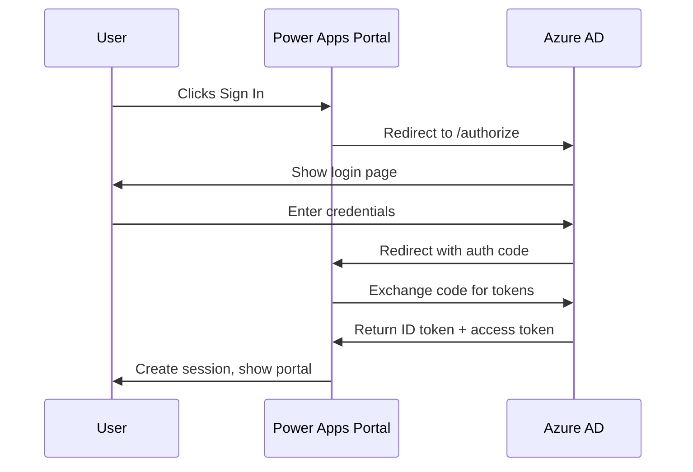

# How to Configure Azure Active Directory Authentication for Power Apps Portal Users

Author: [nawazdhandala](https://www.github.com/nawazdhandala)

Tags: Power Apps, Azure AD, Authentication, Portal, Power Platform, Identity, Azure Active Directory

Description: Configure Azure Active Directory as an identity provider for Power Apps portals to enable secure single sign-on for external and internal users.

---

Power Apps portals (now called Power Pages) provide a way to build external-facing websites backed by Dataverse data. Out of the box, portals support local authentication with email and password. But for enterprise scenarios, you want Azure Active Directory handling the authentication. This lets users sign in with their corporate credentials and gives you centralized identity management.

This guide covers configuring Azure AD as an identity provider for your Power Apps portal, including the Azure side setup, the portal side configuration, and troubleshooting common issues.

## Understanding the Authentication Flow

When a user visits your portal and clicks "Sign In," the following happens:

1. The portal redirects the user to Azure AD's authorization endpoint.
2. The user authenticates with Azure AD (entering credentials, completing MFA, etc.).
3. Azure AD redirects the user back to the portal with an authorization code.
4. The portal exchanges the code for tokens and creates a portal session.
5. The user is now authenticated and can access protected pages.

This is standard OpenID Connect (OIDC). The portal acts as a relying party, and Azure AD is the identity provider.

## Step 1: Register an App in Azure AD

You need an app registration that represents your portal.

1. Go to Azure portal > Azure Active Directory > App registrations > New registration.
2. Name it something like "Power Apps Portal Auth".
3. Under Supported account types, choose the option that fits:
   - "Accounts in this organizational directory only" for internal users
   - "Accounts in any organizational directory" for multi-tenant
   - "Accounts in any organizational directory and personal Microsoft accounts" if you want the broadest access
4. Set the Redirect URI to Web and enter: `https://yourportal.powerappsportals.com/signin-openid_1`

The redirect URI path depends on which identity provider slot you use in the portal settings. The convention is `/signin-openid_1` for the first OpenID Connect provider.

After registration, note the Application (client) ID and Directory (tenant) ID.

### Create a Client Secret

1. Go to Certificates & secrets.
2. Click New client secret.
3. Choose an expiration period and click Add.
4. Copy the value immediately.

### Configure Token Claims (Optional)

If you want additional user information in the portal, configure optional claims:

1. Go to Token configuration > Add optional claim.
2. Select ID token.
3. Add claims like `email`, `given_name`, `family_name`, and `groups` if needed.

## Step 2: Configure the Portal Site Settings

Portal authentication is configured through Dataverse site settings. You can edit these in the Portal Management app or the Power Apps maker portal.

Here are the site settings you need to create or update:

| Site Setting Name | Value |
|---|---|
| Authentication/OpenIdConnect/AzureAD/Authority | `https://login.microsoftonline.com/{tenant-id}/v2.0` |
| Authentication/OpenIdConnect/AzureAD/ClientId | Your Application (client) ID |
| Authentication/OpenIdConnect/AzureAD/ClientSecret | Your client secret value |
| Authentication/OpenIdConnect/AzureAD/RedirectUri | `https://yourportal.powerappsportals.com/signin-openid_1` |
| Authentication/OpenIdConnect/AzureAD/MetadataAddress | `https://login.microsoftonline.com/{tenant-id}/v2.0/.well-known/openid-configuration` |
| Authentication/OpenIdConnect/AzureAD/Scope | `openid email profile` |
| Authentication/OpenIdConnect/AzureAD/ResponseType | `code id_token` |
| Authentication/OpenIdConnect/AzureAD/ExternalLogoutEnabled | `true` |
| Authentication/OpenIdConnect/AzureAD/RegistrationEnabled | `true` |

Replace `{tenant-id}` with your actual tenant ID throughout.

### Creating Site Settings

To create these settings:

1. Open the Portal Management app in Power Apps.
2. Navigate to Site Settings.
3. Click New.
4. Enter the Name and Value from the table above.
5. Set the Website to your portal website record.
6. Save.

Repeat for each setting.

## Step 3: Map Azure AD Claims to Contact Records

When a user signs in through Azure AD for the first time, the portal creates a Contact record in Dataverse. You need to configure how Azure AD claims map to contact fields.

Add these site settings for claim mapping:

| Site Setting Name | Value |
|---|---|
| Authentication/OpenIdConnect/AzureAD/RegistrationClaimsMapping/FirstName | `http://schemas.xmlsoap.org/ws/2005/05/identity/claims/givenname` |
| Authentication/OpenIdConnect/AzureAD/RegistrationClaimsMapping/LastName | `http://schemas.xmlsoap.org/ws/2005/05/identity/claims/surname` |
| Authentication/OpenIdConnect/AzureAD/RegistrationClaimsMapping/Email | `http://schemas.xmlsoap.org/ws/2005/05/identity/claims/emailaddress` |

With v2.0 tokens, the claims may use shorter names. If the mapping does not work, try these values instead:

- FirstName: `given_name`
- LastName: `family_name`
- Email: `email`

Test with both claim formats to see which your token uses.

## Step 4: Configure the Login Button

By default, the portal shows a generic "OpenID Connect" button on the login page. Customize it:

| Site Setting Name | Value |
|---|---|
| Authentication/OpenIdConnect/AzureAD/Caption | `Sign in with Azure AD` |
| Authentication/OpenIdConnect/AzureAD/IconClass | `fa fa-windows` |

The `Caption` setting controls the button text, and `IconClass` sets the Font Awesome icon class.

## Step 5: Restrict Access by Azure AD Group

If you want only members of specific Azure AD groups to access the portal, you can configure group-based filtering.

First, enable group claims in your app registration:

1. Go to Token configuration > Add groups claim.
2. Select Security groups.
3. For the ID token, choose Group ID.

Then configure validation in the portal. Create a site setting:

| Site Setting Name | Value |
|---|---|
| Authentication/OpenIdConnect/AzureAD/ValidAudiences | Your Application (client) ID |

For group filtering, you need to implement custom logic in a portal web template or use Power Automate to check group membership after sign-in and assign web roles accordingly.

## Step 6: Assign Web Roles

Portal access is controlled by web roles. After a user authenticates through Azure AD, they need a web role to access protected content.

You can auto-assign a default web role:

| Site Setting Name | Value |
|---|---|
| Authentication/OpenIdConnect/AzureAD/LoginClaimsMapping/Role | The name of the Dataverse web role |

Alternatively, assign web roles through a Power Automate flow that triggers when a new Contact is created with an external identity provider.

## Step 7: Test the Configuration

1. Clear your browser cache and cookies (or use an incognito window).
2. Navigate to your portal URL.
3. Click the Sign In link.
4. You should see your Azure AD button with the caption you configured.
5. Click it and you should be redirected to the Azure AD login page.
6. Sign in with your Azure AD credentials.
7. After successful authentication, you should be redirected back to the portal.

Check the Contact record in Dataverse to confirm the claims mapping worked correctly.

## Troubleshooting Common Issues

### Error: Reply URL Does Not Match

This means the redirect URI in your app registration does not match what the portal is sending. Double check:

- The URI in the app registration matches the `RedirectUri` site setting exactly.
- There are no trailing slashes or case mismatches.
- The portal URL is correct (custom domain vs. default powerappsportals.com domain).

### Error: AADSTS50011

This is another redirect URI mismatch. If you are using a custom domain, add that domain's redirect URI to the app registration as well.

### User Gets Authenticated but Has No Access

The user signed in successfully but cannot see any content. This usually means they have no web role assigned. Check:

- The Contact record was created.
- A web role is assigned to the contact.
- The pages they are trying to access have the correct web role permissions.

### Token Claims Are Empty

If the contact fields are not populated:

- Verify the claim names in your mapping settings match what Azure AD actually sends.
- Use jwt.ms to decode the ID token and inspect the claims.
- Make sure you requested the right scopes (openid, email, profile).

### Multi-Tenant Setup Issues

If you configured multi-tenant and users from other tenants cannot sign in:

- Make sure the Authority URL uses `common` or `organizations` instead of a specific tenant ID.
- Verify the app registration is set to multi-tenant.
- Users from other tenants may need admin consent in their tenant first.

## Security Best Practices

- Rotate the client secret before it expires. Set a calendar reminder since expired secrets will break authentication silently.
- Use Conditional Access policies in Azure AD to require MFA for portal access.
- Enable audit logging in both Azure AD and the portal to track sign-in events.
- If the portal handles sensitive data, consider requiring reauthentication for specific pages by setting the `max_age` parameter.
- Disable local authentication if all users should sign in through Azure AD. Set `Authentication/Registration/LocalLoginEnabled` to `false`.

## Wrapping Up

Configuring Azure AD authentication for Power Apps portals centralizes identity management and gives users a familiar sign-in experience. The setup involves creating an app registration in Azure AD, configuring site settings in the portal, mapping claims to contact records, and assigning web roles. While the number of site settings can feel overwhelming, once configured, the system works reliably and supports enterprise features like MFA, Conditional Access, and group-based authorization.
