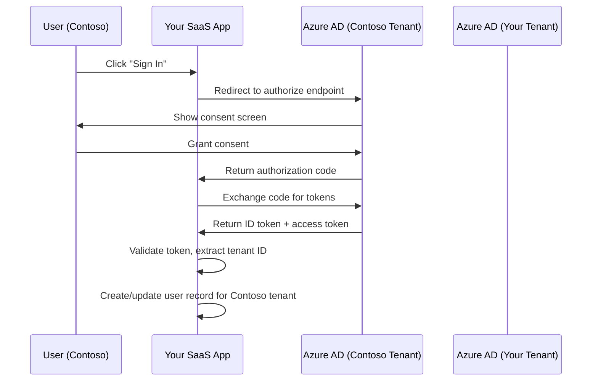

# How to Configure Azure Active Directory Multi-Tenant App Registration for SaaS Applications

Author: [nawazdhandala](https://www.github.com/nawazdhandala)

Tags: Azure Active Directory, Multi-Tenant, SaaS, App Registration, OAuth, Identity, Cloud Security

Description: Configure Azure Active Directory multi-tenant app registration for SaaS applications with consent flows, token validation, and tenant isolation.

---

If you are building a SaaS application, you want customers to sign in with their existing Azure AD accounts. A sales manager at Contoso should be able to log into your SaaS product using their contoso.com credentials without you creating a separate account for them. This is what multi-tenant app registration gives you.

A multi-tenant app registration allows users from any Azure AD tenant to authenticate against your application. When Contoso's IT admin consents to your app, all their users can sign in. When Fabrikam does the same, their users can too. Your application handles both seamlessly.

But multi-tenant apps come with additional complexity around consent, token validation, and tenant isolation. In this guide, I will walk through the full configuration and address the common pitfalls.

## How Multi-Tenant Auth Works



The key difference from single-tenant is that the authorization happens at the customer's Azure AD tenant, not yours. Your app redirects to a common endpoint, Azure AD figures out which tenant the user belongs to, and that tenant's policies (MFA, conditional access, etc.) apply.

## Step 1 - Register the Multi-Tenant Application

Create the app registration in your Azure AD tenant with multi-tenant support enabled.

```bash
# Register the application with multi-tenant audience
az ad app create \
  --display-name "MySaaSApp" \
  --sign-in-audience "AzureADMultipleOrgs" \
  --web-redirect-uris "https://app.mysaas.com/auth/callback" \
  --enable-id-token-issuance true

# Note the Application (client) ID from the output
# Create a client secret
az ad app credential reset \
  --id <app-id> \
  --append \
  --display-name "Production Secret" \
  --years 2
```

The `--sign-in-audience "AzureADMultipleOrgs"` setting is what makes this multi-tenant. It tells Azure AD that users from any organizational Azure AD tenant can authenticate.

If you also want to support personal Microsoft accounts (hotmail, outlook.com), use `AzureADandPersonalMicrosoftAccount` instead.

## Step 2 - Configure API Permissions

Define what permissions your app needs from the user's tenant. Start with the minimum necessary.

```bash
# Add Microsoft Graph permissions
# User.Read - basic profile info (delegated)
az ad app permission add \
  --id <app-id> \
  --api 00000003-0000-0000-c000-000000000000 \
  --api-permissions e1fe6dd8-ba31-4d61-89e7-88639da4683d=Scope

# If you need to read the user's organization info
az ad app permission add \
  --id <app-id> \
  --api 00000003-0000-0000-c000-000000000000 \
  --api-permissions 498476ce-e0fe-48b0-b801-37ba7e2685c6=Role
```

For multi-tenant apps, be very careful about what permissions you request. Every permission requires the customer's admin to consent. If you ask for too much, admins will reject the consent request. Only request what you actually need.

Delegated permissions (Scope) act on behalf of the signed-in user. Application permissions (Role) act as the app itself and require admin consent. Prefer delegated permissions when possible.

## Step 3 - Implement the Consent Flow

Multi-tenant apps need two types of consent:
- **User consent**: The individual user agrees to let the app access their profile
- **Admin consent**: The tenant administrator agrees to let the app access organizational data

For SaaS onboarding, you typically want admin consent first. When a new customer signs up, redirect their admin to the admin consent endpoint.

```javascript
const express = require('express');
const msal = require('@azure/msal-node');
const jwt = require('jsonwebtoken');
const jwksRsa = require('jwks-rsa');

const app = express();

const msalConfig = {
    auth: {
        clientId: process.env.CLIENT_ID,
        authority: 'https://login.microsoftonline.com/common',  // "common" for multi-tenant
        clientSecret: process.env.CLIENT_SECRET
    }
};

const msalClient = new msal.ConfidentialClientApplication(msalConfig);

// Admin consent endpoint - redirect the admin to grant org-wide permissions
app.get('/auth/admin-consent', (req, res) => {
    const adminConsentUrl =
        `https://login.microsoftonline.com/common/adminconsent` +
        `?client_id=${process.env.CLIENT_ID}` +
        `&redirect_uri=${encodeURIComponent(process.env.ADMIN_CONSENT_REDIRECT)}` +
        `&state=${generateStateToken()}` +
        `&scope=https://graph.microsoft.com/.default`;

    res.redirect(adminConsentUrl);
});

// Handle the admin consent callback
app.get('/auth/admin-consent/callback', async (req, res) => {
    const { tenant, admin_consent, error } = req.query;

    if (error) {
        console.error(`Admin consent failed: ${error}`);
        return res.redirect('/onboarding/consent-failed');
    }

    if (admin_consent === 'True') {
        // Tenant has consented - create their account in your system
        await provisionTenant(tenant);
        console.log(`New tenant onboarded: ${tenant}`);
        return res.redirect('/onboarding/success');
    }

    res.redirect('/onboarding/error');
});

// Standard sign-in for regular users
app.get('/auth/login', async (req, res) => {
    const authCodeUrl = await msalClient.getAuthCodeUrl({
        scopes: ['openid', 'profile', 'email', 'User.Read'],
        redirectUri: process.env.REDIRECT_URI,
        prompt: 'select_account'
    });

    res.redirect(authCodeUrl);
});

// Handle the sign-in callback
app.get('/auth/callback', async (req, res) => {
    try {
        const response = await msalClient.acquireTokenByCode({
            code: req.query.code,
            scopes: ['openid', 'profile', 'email', 'User.Read'],
            redirectUri: process.env.REDIRECT_URI
        });

        const claims = response.idTokenClaims;
        const tenantId = claims.tid;

        // Verify this tenant has been onboarded
        const tenant = await getTenantRecord(tenantId);
        if (!tenant) {
            return res.status(403).render('tenant-not-onboarded', {
                adminConsentUrl: '/auth/admin-consent'
            });
        }

        // Create the user session
        req.session.user = {
            id: claims.oid,
            tenantId: tenantId,
            email: claims.preferred_username,
            name: claims.name,
            roles: claims.roles || []
        };

        res.redirect('/dashboard');
    } catch (error) {
        console.error('Auth callback error:', error);
        res.redirect('/auth/login');
    }
});
```

## Step 4 - Validate Tokens Properly

Token validation for multi-tenant apps is different from single-tenant. You cannot validate against a single issuer because tokens come from different tenants.

```javascript
const jwksClient = jwksRsa({
    jwksUri: 'https://login.microsoftonline.com/common/discovery/v2.0/keys',
    cache: true,
    rateLimit: true
});

function getSigningKey(header, callback) {
    jwksClient.getSigningKey(header.kid, (err, key) => {
        if (err) return callback(err);
        callback(null, key.getPublicKey());
    });
}

function validateToken(token) {
    return new Promise((resolve, reject) => {
        jwt.verify(token, getSigningKey, {
            audience: process.env.CLIENT_ID,
            // For multi-tenant, do NOT validate issuer with a single value
            // Instead, validate the issuer format
            issuer: null  // We validate issuer manually below
        }, (err, decoded) => {
            if (err) return reject(err);

            // Validate the issuer format manually
            const issuer = decoded.iss;
            const tenantId = decoded.tid;

            // The issuer should match the pattern for Azure AD v2.0
            const expectedIssuer = `https://login.microsoftonline.com/${tenantId}/v2.0`;
            if (issuer !== expectedIssuer) {
                return reject(new Error(`Invalid issuer: ${issuer}`));
            }

            // Verify the tenant is in our system
            getTenantRecord(tenantId).then(tenant => {
                if (!tenant) {
                    return reject(new Error(`Unknown tenant: ${tenantId}`));
                }
                resolve(decoded);
            });
        });
    });
}
```

The critical point is the issuer validation. Each Azure AD tenant has its own issuer URL containing the tenant ID. You need to check that the format is correct and that the tenant ID belongs to a customer you have onboarded.

## Step 5 - Implement Tenant Isolation

Every query in your SaaS application must be scoped to the current user's tenant. This is the most important security consideration for multi-tenant SaaS.

```javascript
// Middleware that enforces tenant context on every request
function tenantContext(req, res, next) {
    if (!req.session?.user?.tenantId) {
        return res.status(401).json({ error: 'Not authenticated' });
    }

    // Attach tenant ID to the request for downstream use
    req.tenantId = req.session.user.tenantId;
    next();
}

// Every database query must include the tenant filter
app.get('/api/projects', tenantContext, async (req, res) => {
    // Always filter by tenant ID - never return data from other tenants
    const projects = await db.query(
        'SELECT * FROM projects WHERE tenant_id = $1 AND is_active = true',
        [req.tenantId]
    );
    res.json(projects);
});

app.post('/api/projects', tenantContext, async (req, res) => {
    const { name, description } = req.body;
    // Always stamp new records with the tenant ID
    const project = await db.query(
        'INSERT INTO projects (tenant_id, name, description) VALUES ($1, $2, $3) RETURNING *',
        [req.tenantId, name, description]
    );
    res.json(project.rows[0]);
});
```

Consider using row-level security at the database level as an additional safety net. PostgreSQL RLS or Azure SQL row-level security can enforce tenant isolation even if your application code has a bug.

## Step 6 - Handle Tenant Lifecycle Events

Tenants may revoke consent, and your app needs to handle that gracefully. Register for Azure AD lifecycle notifications.

```javascript
// Webhook endpoint for tenant lifecycle events
app.post('/webhooks/tenant-lifecycle', async (req, res) => {
    const event = req.body;

    switch (event.changeType) {
        case 'consentRevoked':
            // The tenant admin revoked consent for your app
            await deactivateTenant(event.tenantId);
            console.log(`Tenant ${event.tenantId} revoked consent`);
            break;

        case 'subscriptionDeleted':
            // Handle subscription cancellation
            await handleSubscriptionEnd(event.tenantId);
            break;
    }

    res.status(200).send('OK');
});
```

## Wrapping Up

Multi-tenant app registration in Azure AD is the foundation for any SaaS application serving organizational customers. The admin consent flow handles onboarding. Token validation with per-tenant issuer checking keeps things secure. Tenant isolation in your data layer prevents cross-tenant data leaks. Start with the basic sign-in flow, add admin consent for onboarding, and make tenant-scoped queries a non-negotiable pattern throughout your codebase. The flexibility of multi-tenant auth means your SaaS app can serve hundreds of organizations through a single deployment, each seeing only their own data.
