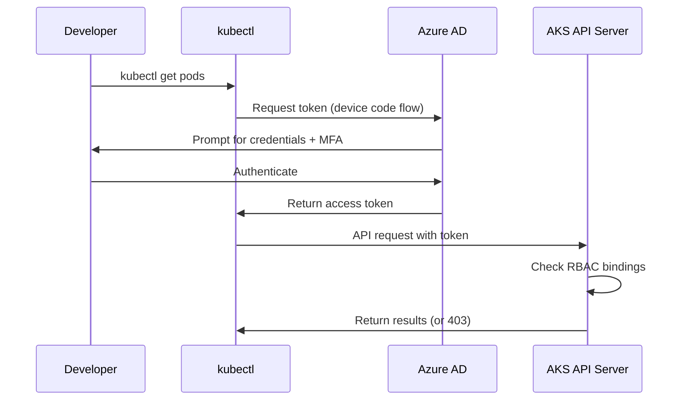

# How to Configure Azure AD RBAC for AKS Cluster Access with Conditional Access Policies

Author: [nawazdhandala](https://www.github.com/nawazdhandala)

Tags: AKS, Azure AD, RBAC, Conditional Access, Kubernetes, Security, Identity Management

Description: Learn how to integrate Azure AD with AKS for role-based access control and enforce conditional access policies for cluster authentication.

---

Giving every developer full admin access to your AKS cluster is a recipe for accidental (or intentional) damage. Azure AD integration with AKS lets you use your existing identity infrastructure to control who can access what in the cluster. Combined with Conditional Access policies, you can enforce multi-factor authentication, restrict access to managed devices, and block logins from untrusted locations.

## How Azure AD Integration Works with AKS

When Azure AD integration is enabled, kubectl authentication flows through Azure AD instead of using client certificates. The flow looks like this:



The AKS API server validates the Azure AD token and checks Kubernetes RBAC bindings to determine what the user is allowed to do.

## Prerequisites

- An AKS cluster (new or existing)
- Azure AD tenant with Global Administrator or Privileged Role Administrator access
- Azure AD groups created for different access levels (admins, developers, readers)
- Azure CLI 2.40+

## Step 1: Enable Azure AD Integration on AKS

For new clusters, enable Azure AD RBAC at creation time. For existing clusters, you can enable it with an update.

```bash
# Create an AKS cluster with Azure AD RBAC enabled
az aks create \
  --resource-group myResourceGroup \
  --name myAKSCluster \
  --enable-aad \
  --enable-azure-rbac \
  --aad-admin-group-object-ids "<admin-group-object-id>" \
  --node-count 3 \
  --generate-ssh-keys
```

For an existing cluster, run the following.

```bash
# Enable Azure AD integration on an existing cluster
az aks update \
  --resource-group myResourceGroup \
  --name myAKSCluster \
  --enable-aad \
  --aad-admin-group-object-ids "<admin-group-object-id>"
```

The `--aad-admin-group-object-ids` parameter specifies which Azure AD group gets cluster admin access. Members of this group can perform any operation in the cluster.

## Step 2: Create Azure AD Groups

Create separate groups for different access levels.

```bash
# Create an admin group
az ad group create \
  --display-name "AKS-Cluster-Admins" \
  --mail-nickname "aks-admins"

# Create a developer group
az ad group create \
  --display-name "AKS-Developers" \
  --mail-nickname "aks-developers"

# Create a read-only group
az ad group create \
  --display-name "AKS-Readers" \
  --mail-nickname "aks-readers"

# Add users to groups
az ad group member add \
  --group "AKS-Cluster-Admins" \
  --member-id "<user-object-id>"
```

## Step 3: Configure Kubernetes RBAC Bindings

There are two approaches: Azure RBAC (managing permissions in Azure) or Kubernetes RBAC (managing permissions in the cluster). You can use either or both.

### Option A: Using Azure RBAC (Recommended)

Azure RBAC lets you manage Kubernetes permissions through Azure role assignments, which means you can use Azure Policy, Privileged Identity Management (PIM), and access reviews.

```bash
# Get the AKS cluster resource ID
AKS_ID=$(az aks show \
  --resource-group myResourceGroup \
  --name myAKSCluster \
  --query id \
  --output tsv)

# Get the developer group object ID
DEV_GROUP_ID=$(az ad group show \
  --group "AKS-Developers" \
  --query id \
  --output tsv)

# Assign the Azure Kubernetes Service RBAC Writer role to the developer group
# This allows creating and updating resources in all namespaces
az role assignment create \
  --role "Azure Kubernetes Service RBAC Writer" \
  --assignee "$DEV_GROUP_ID" \
  --scope "$AKS_ID"
```

Azure provides four built-in RBAC roles for AKS:

- **Azure Kubernetes Service RBAC Admin**: Full access to all resources
- **Azure Kubernetes Service RBAC Cluster Admin**: Full access including cluster-level resources
- **Azure Kubernetes Service RBAC Writer**: Read/write access to most resources
- **Azure Kubernetes Service RBAC Reader**: Read-only access

For namespace-scoped access, add the namespace to the scope.

```bash
# Grant writer access only to the "staging" namespace
az role assignment create \
  --role "Azure Kubernetes Service RBAC Writer" \
  --assignee "$DEV_GROUP_ID" \
  --scope "$AKS_ID/namespaces/staging"
```

### Option B: Using Kubernetes RBAC

If you prefer managing RBAC within Kubernetes, create ClusterRoleBindings that reference Azure AD groups.

```yaml
# developer-binding.yaml
# ClusterRoleBinding that grants edit permissions to the Azure AD developer group
apiVersion: rbac.authorization.k8s.io/v1
kind: ClusterRoleBinding
metadata:
  name: aks-developers-edit
subjects:
- kind: Group
  # This is the Azure AD group object ID
  name: "<developer-group-object-id>"
  apiGroup: rbac.authorization.k8s.io
roleRef:
  kind: ClusterRole
  name: edit
  apiGroup: rbac.authorization.k8s.io
```

For namespace-specific access, use a RoleBinding instead.

```yaml
# namespace-binding.yaml
# RoleBinding granting view access in the production namespace only
apiVersion: rbac.authorization.k8s.io/v1
kind: RoleBinding
metadata:
  name: aks-readers-view
  namespace: production
subjects:
- kind: Group
  name: "<reader-group-object-id>"
  apiGroup: rbac.authorization.k8s.io
roleRef:
  kind: ClusterRole
  name: view
  apiGroup: rbac.authorization.k8s.io
```

## Step 4: Set Up Conditional Access Policies

Conditional Access policies in Azure AD add security requirements to the authentication flow. For AKS access, common policies include requiring MFA, blocking access from outside the corporate network, and requiring compliant devices.

Navigate to Azure AD > Security > Conditional Access in the Azure portal, or use the CLI.

### Require MFA for AKS Access

Create a Conditional Access policy that targets the Azure Kubernetes Service application.

```bash
# The Azure Kubernetes Service client app ID is a well-known GUID
# 6dae42f8-4368-4678-94ff-3960e28e3630

# Create the policy using the Azure portal or Microsoft Graph API
# Here is the policy configuration in JSON format for the Graph API
```

The policy configuration targets the AKS server application and requires MFA.

```json
{
  "displayName": "Require MFA for AKS Access",
  "state": "enabled",
  "conditions": {
    "applications": {
      "includeApplications": [
        "6dae42f8-4368-4678-94ff-3960e28e3630"
      ]
    },
    "users": {
      "includeGroups": [
        "<developer-group-id>",
        "<reader-group-id>"
      ],
      "excludeGroups": [
        "<break-glass-group-id>"
      ]
    }
  },
  "grantControls": {
    "operator": "OR",
    "builtInControls": [
      "mfa"
    ]
  }
}
```

Important: Always exclude a break-glass account group from Conditional Access policies. If MFA fails or Azure AD has an issue, you need a way to access the cluster.

### Restrict Access to Corporate Network

```json
{
  "displayName": "AKS Access - Corporate Network Only",
  "state": "enabled",
  "conditions": {
    "applications": {
      "includeApplications": [
        "6dae42f8-4368-4678-94ff-3960e28e3630"
      ]
    },
    "users": {
      "includeAll": true
    },
    "locations": {
      "includeLocations": ["All"],
      "excludeLocations": ["<corporate-named-location-id>"]
    }
  },
  "grantControls": {
    "operator": "OR",
    "builtInControls": [
      "block"
    ]
  }
}
```

This blocks AKS access from any location except your corporate network (defined as a Named Location in Azure AD).

## Step 5: Get Kubeconfig with Azure AD Authentication

Users authenticate through Azure AD when getting their kubeconfig.

```bash
# Get kubeconfig that uses Azure AD authentication
az aks get-credentials \
  --resource-group myResourceGroup \
  --name myAKSCluster

# The first kubectl command will trigger an Azure AD login prompt
kubectl get pods
```

On the first kubectl command, users see a device login prompt. They authenticate through Azure AD (including MFA if the Conditional Access policy requires it), and the token is cached locally.

For CI/CD pipelines that need non-interactive authentication, use a service principal or managed identity instead of Azure AD user tokens.

## Step 6: Disable Local Accounts

For maximum security, disable the local admin account so all access must go through Azure AD.

```bash
# Disable local admin accounts
# After this, az aks get-credentials --admin will stop working
az aks update \
  --resource-group myResourceGroup \
  --name myAKSCluster \
  --disable-local-accounts
```

With local accounts disabled, every cluster access is authenticated through Azure AD and subject to Conditional Access policies. This ensures consistent security enforcement.

## Step 7: Audit Access

Azure AD sign-in logs capture every authentication attempt to the cluster.

```bash
# View sign-in logs for the AKS application
az monitor activity-log list \
  --resource-group myResourceGroup \
  --query "[?authorization.action=='Microsoft.ContainerService/managedClusters/listClusterUserCredential/action']" \
  --output table
```

In the Azure portal, navigate to Azure AD > Sign-in logs and filter by the "Azure Kubernetes Service" application to see who accessed the cluster, from where, and whether Conditional Access policies were satisfied.

## Troubleshooting

**"Forbidden" errors after RBAC changes**: RBAC changes take a few minutes to propagate. Users may need to clear their cached token with `kubelogin remove-tokens` or `az account clear`.

**Conditional Access policy not enforcing**: Verify the policy targets the correct application ID (6dae42f8-4368-4678-94ff-3960e28e3630). Test the policy in Report-Only mode first before enabling it.

**Users locked out**: If Conditional Access is too restrictive, use the break-glass account to access the cluster with `az aks get-credentials --admin` (if local accounts are not disabled).

## Summary

Azure AD RBAC integration with AKS moves cluster access control into your existing identity platform. Group-based role assignments make it easy to manage who can do what, and Conditional Access policies add security layers like MFA and location restrictions. The combination of Azure RBAC, Conditional Access, and disabled local accounts gives you enterprise-grade access control that is auditable, enforceable, and consistent with your organization's broader security posture.
