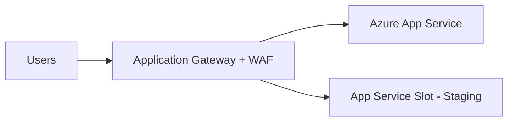

# How to Configure Azure App Service with Application Gateway and WAF

Author: [nawazdhandala](https://www.github.com/nawazdhandala)

Tags: Azure, App Service, Application Gateway, WAF, Security, Networking, Cloud Computing

Description: How to place Azure App Service behind an Application Gateway with Web Application Firewall for enhanced security and traffic management.

---

Running your Azure App Service directly on the internet is fine for many applications, but when you need advanced traffic management, SSL offloading, or protection against common web exploits, putting an Application Gateway in front of it makes sense. Add the Web Application Firewall (WAF) feature and you get protection against OWASP top-10 vulnerabilities out of the box.

This post walks through setting up an Application Gateway with WAF in front of an Azure App Service, including the networking details that trip people up.

## Architecture Overview

The setup looks like this:



The Application Gateway sits in a Virtual Network and forwards traffic to your App Service. The WAF component inspects incoming requests and blocks malicious ones before they reach your app.

Key benefits of this architecture:

- **WAF protection** - Blocks SQL injection, cross-site scripting, and other common attacks
- **SSL termination** - Offload SSL processing from your App Service
- **Path-based routing** - Route different URL paths to different backends
- **Connection draining** - Graceful handling of long-running requests during deployments
- **Custom health probes** - More sophisticated health checking than App Service provides

## Prerequisites

You need:

- A Virtual Network with at least two subnets (one dedicated to the Application Gateway)
- An Azure App Service already deployed
- A public IP address for the Application Gateway

## Step 1: Create the Virtual Network and Subnets

The Application Gateway requires its own dedicated subnet. No other resources can be deployed in this subnet.

```bash
# Create a resource group
az group create \
    --name my-resource-group \
    --location eastus

# Create a VNet with a subnet for the Application Gateway
az network vnet create \
    --resource-group my-resource-group \
    --name my-vnet \
    --address-prefix 10.0.0.0/16 \
    --subnet-name appgw-subnet \
    --subnet-prefix 10.0.1.0/24

# Create a second subnet for other resources if needed
az network vnet subnet create \
    --resource-group my-resource-group \
    --vnet-name my-vnet \
    --name backend-subnet \
    --address-prefix 10.0.2.0/24
```

## Step 2: Create a Public IP Address

The Application Gateway needs a public IP for its frontend:

```bash
# Create a static public IP for the Application Gateway
az network public-ip create \
    --resource-group my-resource-group \
    --name appgw-public-ip \
    --allocation-method Static \
    --sku Standard
```

## Step 3: Create the Application Gateway with WAF

This is the big step. The Application Gateway creation command has many parameters because it sets up the frontend, backend, listener, and routing in one go:

```bash
# Create the Application Gateway with WAF_v2 SKU
az network application-gateway create \
    --resource-group my-resource-group \
    --name my-appgw \
    --location eastus \
    --sku WAF_v2 \
    --capacity 2 \
    --vnet-name my-vnet \
    --subnet appgw-subnet \
    --public-ip-address appgw-public-ip \
    --http-settings-port 443 \
    --http-settings-protocol Https \
    --frontend-port 443 \
    --servers my-app-service.azurewebsites.net \
    --priority 100
```

This creates a basic Application Gateway with the WAF v2 SKU. The `--servers` parameter points to your App Service hostname.

## Step 4: Configure the Backend Pool

The backend pool tells the Application Gateway where to send traffic. For App Service, you use the FQDN (fully qualified domain name):

```bash
# Update the backend pool to point to your App Service
az network application-gateway address-pool update \
    --resource-group my-resource-group \
    --gateway-name my-appgw \
    --name appGatewayBackendPool \
    --servers my-app-service.azurewebsites.net
```

## Step 5: Configure Backend HTTP Settings

This is where many people get stuck. The Application Gateway needs to send the correct Host header to App Service, otherwise App Service will not recognize the request.

```bash
# Create HTTP settings that pass the correct host header
az network application-gateway http-settings update \
    --resource-group my-resource-group \
    --gateway-name my-appgw \
    --name appGatewayBackendHttpSettings \
    --host-name-from-backend-pool true \
    --protocol Https \
    --port 443
```

The `--host-name-from-backend-pool true` flag is critical. It tells the Application Gateway to use the App Service hostname in the Host header when forwarding requests. Without this, App Service will reject the request or route it incorrectly.

## Step 6: Configure a Custom Health Probe

The default health probe might not work well with App Service. Create a custom one:

```bash
# Create a health probe that checks your App Service
az network application-gateway probe create \
    --resource-group my-resource-group \
    --gateway-name my-appgw \
    --name app-health-probe \
    --protocol Https \
    --host-name-from-http-settings true \
    --path "/health" \
    --interval 30 \
    --timeout 30 \
    --threshold 3

# Associate the probe with the backend HTTP settings
az network application-gateway http-settings update \
    --resource-group my-resource-group \
    --gateway-name my-appgw \
    --name appGatewayBackendHttpSettings \
    --probe app-health-probe
```

## Step 7: Enable and Configure WAF

Now enable the WAF policy:

```bash
# Create a WAF policy
az network application-gateway waf-policy create \
    --resource-group my-resource-group \
    --name my-waf-policy

# Configure WAF to use the OWASP 3.2 rule set in Prevention mode
az network application-gateway waf-policy policy-setting update \
    --resource-group my-resource-group \
    --policy-name my-waf-policy \
    --state Enabled \
    --mode Prevention \
    --max-request-body-size-kb 128 \
    --file-upload-limit-mb 100

# Associate the WAF policy with the Application Gateway
az network application-gateway update \
    --resource-group my-resource-group \
    --name my-appgw \
    --set firewallPolicy.id="$(az network application-gateway waf-policy show --resource-group my-resource-group --name my-waf-policy --query id -o tsv)"
```

The WAF has two modes:

- **Detection** - Logs malicious requests but does not block them. Use this initially to see what would be blocked.
- **Prevention** - Actually blocks malicious requests. Switch to this after tuning.

## Step 8: Restrict App Service to Application Gateway Only

To ensure all traffic goes through the Application Gateway (and WAF), restrict direct access to the App Service:

```bash
# Get the Application Gateway's public IP
APPGW_IP=$(az network public-ip show \
    --resource-group my-resource-group \
    --name appgw-public-ip \
    --query ipAddress -o tsv)

# Add an access restriction to only allow traffic from the Application Gateway subnet
az webapp config access-restriction add \
    --resource-group my-resource-group \
    --name my-app-service \
    --rule-name "Allow AppGW Only" \
    --action Allow \
    --vnet-name my-vnet \
    --subnet appgw-subnet \
    --priority 100

# Set default action to deny
az webapp config access-restriction set \
    --resource-group my-resource-group \
    --name my-app-service \
    --default-action Deny
```

## Handling Custom Domains and SSL

If you want to use a custom domain with the Application Gateway:

1. Add an SSL certificate to the Application Gateway for your domain
2. Create a listener that uses the custom domain and certificate
3. Point your DNS record to the Application Gateway's public IP (not the App Service)

```bash
# Upload an SSL certificate to the Application Gateway
az network application-gateway ssl-cert create \
    --resource-group my-resource-group \
    --gateway-name my-appgw \
    --name my-ssl-cert \
    --cert-file ./certificate.pfx \
    --cert-password "your-cert-password"

# Create an HTTPS listener with the custom domain
az network application-gateway http-listener create \
    --resource-group my-resource-group \
    --gateway-name my-appgw \
    --name https-listener \
    --frontend-port appGatewayFrontendPort \
    --frontend-ip appGatewayFrontendIP \
    --ssl-cert my-ssl-cert \
    --host-name www.myapp.com
```

## WAF Tuning

After running in Detection mode for a while, review the WAF logs to identify false positives. Some legitimate requests might trigger WAF rules, especially if your app handles unusual input formats.

You can create custom exclusion rules:

```bash
# Create an exclusion for a specific rule that causes false positives
az network application-gateway waf-policy managed-rule exclusion add \
    --resource-group my-resource-group \
    --policy-name my-waf-policy \
    --match-variable "RequestHeaderNames" \
    --selector-match-operator "Equals" \
    --selector "X-Custom-Header"
```

## Monitoring

Monitor your Application Gateway and WAF through Azure Monitor:

- **Access logs** - All requests that pass through the gateway
- **Performance logs** - Latency and throughput metrics
- **Firewall logs** - Requests blocked or flagged by WAF

Enable diagnostic logging:

```bash
# Enable diagnostic logging for the Application Gateway
az monitor diagnostic-settings create \
    --name appgw-diagnostics \
    --resource "$(az network application-gateway show --resource-group my-resource-group --name my-appgw --query id -o tsv)" \
    --workspace "$(az monitor log-analytics workspace show --resource-group my-resource-group --workspace-name my-workspace --query id -o tsv)" \
    --logs '[{"category": "ApplicationGatewayAccessLog", "enabled": true}, {"category": "ApplicationGatewayFirewallLog", "enabled": true}]'
```

## Summary

Putting an Application Gateway with WAF in front of your Azure App Service adds a powerful security and traffic management layer. The setup requires careful attention to networking details, especially the Host header configuration and access restrictions. Start with WAF in Detection mode, tune out false positives, then switch to Prevention mode. The combination of Application Gateway routing, WAF protection, and App Service access restrictions creates a solid defense-in-depth architecture for your web applications.
