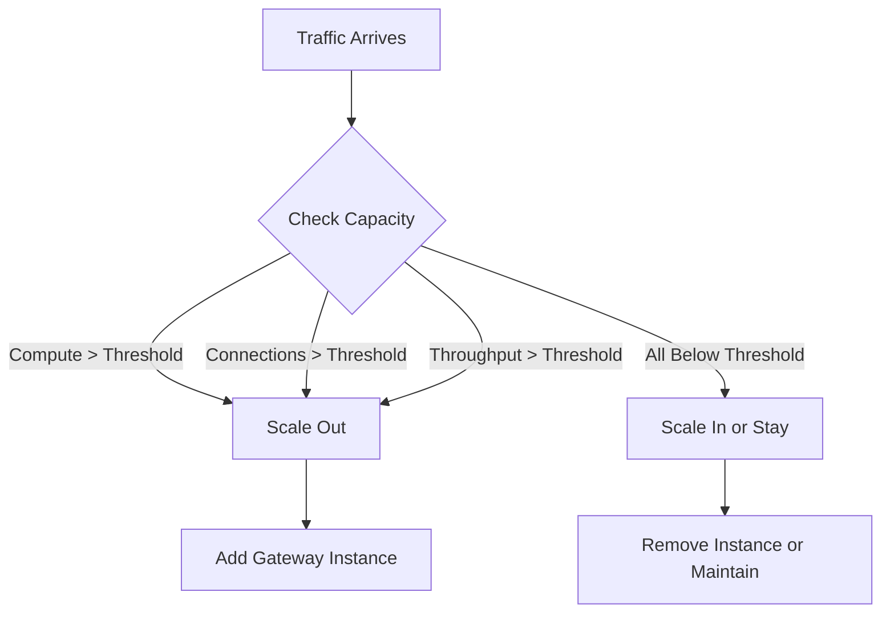

# How to Configure Azure Application Gateway Autoscaling Based on Traffic Load

Author: [nawazdhandala](https://www.github.com/nawazdhandala)

Tags: Azure, Application Gateway, Autoscaling, Load Balancing, Networking, Performance, WAF

Description: A practical walkthrough of configuring Azure Application Gateway v2 autoscaling to handle variable traffic loads efficiently and cost-effectively.

---

Azure Application Gateway v2 supports autoscaling, which means the gateway can automatically add or remove instances based on traffic load. This is a significant improvement over v1 where you had to manually set the instance count and hope it was enough for peak traffic. With autoscaling, the gateway handles traffic spikes by scaling out and reduces costs during low-traffic periods by scaling in.

In this post, I will show you how to configure autoscaling, set appropriate minimum and maximum instance counts, and monitor the scaling behavior.

## Why Autoscaling Matters

Running a fixed-size Application Gateway means you are either over-provisioned (wasting money during quiet periods) or under-provisioned (risking performance degradation during peaks). Autoscaling solves both problems:

- **During traffic spikes:** The gateway adds instances to handle increased load, preventing latency increases and connection failures
- **During quiet periods:** The gateway removes unused instances, reducing costs
- **During deployment:** New instances are provisioned automatically without manual intervention

The scaling happens at the instance level. Each instance is a full Application Gateway unit that can handle approximately 10 capacity units of traffic.

## Capacity Units Explained

Before diving into configuration, you need to understand capacity units. A capacity unit measures the gateway's consumption across three dimensions:

- **Compute units:** SSL/TLS connections processed per second, URL path map computations, and WAF rule evaluations
- **Persistent connections:** Up to 2,500 persistent connections per compute unit
- **Throughput:** Up to 2.22 Mbps per compute unit

The gateway scales based on whichever dimension is most constrained. If you are hitting the connection limit but throughput is fine, it scales based on connections.



## Prerequisites

- Application Gateway v2 SKU (Standard_v2 or WAF_v2). Autoscaling is not available on v1.
- A VNet with a dedicated subnet for the Application Gateway (at least /24 recommended for autoscaling)
- Backend pool configured with your target servers

## Creating an Autoscaling Application Gateway

Here is how to create an Application Gateway v2 with autoscaling enabled from the start:

```bash
# Create a public IP for the Application Gateway (Standard SKU required for v2)
az network public-ip create \
  --resource-group myResourceGroup \
  --name appGwPublicIP \
  --sku Standard \
  --allocation-method Static

# Create the Application Gateway with autoscaling
az network application-gateway create \
  --resource-group myResourceGroup \
  --name myAppGateway \
  --location eastus \
  --sku Standard_v2 \
  --public-ip-address appGwPublicIP \
  --vnet-name myVNet \
  --subnet appGwSubnet \
  --min-capacity 2 \
  --max-capacity 10 \
  --capacity 2 \
  --http-settings-port 80 \
  --http-settings-protocol Http \
  --frontend-port 80 \
  --servers 10.0.1.10 10.0.1.11
```

The key parameters for autoscaling:

- `--min-capacity 2` sets the minimum number of instances. The gateway will never scale below this.
- `--max-capacity 10` caps the maximum instances. This protects against runaway costs.
- `--capacity 2` sets the initial instance count.

## Updating an Existing Application Gateway to Use Autoscaling

If you already have a v2 Application Gateway with fixed capacity, you can enable autoscaling:

```bash
# Update existing Application Gateway to autoscale between 2 and 15 instances
az network application-gateway update \
  --resource-group myResourceGroup \
  --name myAppGateway \
  --min-capacity 2 \
  --max-capacity 15
```

To switch back to fixed capacity:

```bash
# Set fixed capacity (disables autoscaling)
az network application-gateway update \
  --resource-group myResourceGroup \
  --name myAppGateway \
  --capacity 5 \
  --no-wait
```

## Choosing Minimum and Maximum Capacity

Setting the right min and max is important for both cost and reliability.

**Minimum capacity:** This is your always-on baseline. Set it to handle your normal traffic load with some headroom. If your baseline traffic needs 3 instances, set minimum to 3 or 4. Setting it too low means the gateway has to scale up reactively when traffic hits, which takes a few minutes. During that scaling window, existing instances bear all the load.

**Maximum capacity:** This is your cost safety net. Set it high enough to handle peak traffic but not so high that a traffic spike (or an attack) causes massive unexpected costs. The hard limit is 125 instances.

Here is a sizing approach:

1. Run at fixed capacity for a week and monitor capacity unit consumption
2. Calculate peak capacity units and divide by 10 (roughly 10 CUs per instance)
3. Set minimum to handle the 80th percentile of your traffic
4. Set maximum to handle 150% of your observed peak

## Monitoring Autoscaling Behavior

Azure provides metrics to track how the gateway is scaling:

```bash
# Check current instance count
az monitor metrics list \
  --resource "/subscriptions/<sub-id>/resourceGroups/myResourceGroup/providers/Microsoft.Network/applicationGateways/myAppGateway" \
  --metric "CurrentConnections" \
  --interval PT1M \
  --output table
```

Key metrics to watch:

- **Capacity Units** - Current consumption of capacity units
- **Fixed Billable Capacity Units** - Minimum instances you are paying for
- **Estimated Billed Capacity Units** - What you will actually be billed for
- **Current Connections** - Active connections across all instances
- **Compute Units** - How much compute the gateway is using

You can set up alerts when capacity approaches the maximum:

```bash
# Create an alert when capacity units exceed 80% of max
az monitor metrics alert create \
  --resource-group myResourceGroup \
  --name highCapacityAlert \
  --scopes "/subscriptions/<sub-id>/resourceGroups/myResourceGroup/providers/Microsoft.Network/applicationGateways/myAppGateway" \
  --condition "avg EstimatedBilledCapacityUnits > 80" \
  --window-size 5m \
  --evaluation-frequency 1m \
  --action-group myActionGroup \
  --description "Application Gateway capacity above 80%"
```

## Subnet Sizing for Autoscaling

Each Application Gateway instance needs IP addresses in its subnet. When autoscaling, the gateway needs enough IPs for the maximum number of instances plus some overhead for the scaling process.

The recommended subnet size for autoscaling is /24 (251 usable IPs), which supports up to 125 instances. If your maximum capacity is lower, you can use a smaller subnet, but I would not go below /26.

```bash
# Verify your subnet has enough space
az network vnet subnet show \
  --resource-group myResourceGroup \
  --vnet-name myVNet \
  --name appGwSubnet \
  --query "addressPrefix" \
  --output tsv
```

## Scaling Behavior Details

Some things to know about how autoscaling actually works:

**Scale out** takes approximately 6-7 minutes. New instances need to be provisioned, configured, and health-checked before they start receiving traffic.

**Scale in** is more conservative. The gateway waits for a sustained period of low utilization before removing instances. This prevents flapping (rapid scale out/in cycles).

**Minimum capacity instances** are always running and billed, even when traffic is zero.

**During a scale event,** existing instances continue to handle traffic. There is no downtime.

**WAF mode** impacts scaling. WAF rule evaluation consumes more compute units than standard routing, so WAF-enabled gateways may scale earlier.

## Cost Optimization Tips

- Set minimum capacity to your true baseline, not your peak. Every minimum instance is billed 24/7.
- Use zone redundancy (available with v2) to spread instances across availability zones without needing to over-provision.
- Monitor the "Estimated Billed Capacity Units" metric to understand actual cost.
- Consider time-based manual scaling for predictable traffic patterns (like scheduled batch jobs) combined with autoscaling for unexpected spikes.

## Example: Handling a Flash Sale

Suppose you run an e-commerce site that normally needs 3 instances but expects 10x traffic during a sale. Here is how to prepare:

```bash
# Before the sale: increase minimum to pre-warm instances
az network application-gateway update \
  --resource-group myResourceGroup \
  --name myAppGateway \
  --min-capacity 10 \
  --max-capacity 30

# After the sale: return to normal minimum
az network application-gateway update \
  --resource-group myResourceGroup \
  --name myAppGateway \
  --min-capacity 3 \
  --max-capacity 15
```

Pre-warming by increasing the minimum before the event means instances are already running when traffic hits. Relying purely on reactive autoscaling means 6-7 minutes of under-provisioned capacity at the start of the spike.

## Summary

Application Gateway v2 autoscaling lets you match capacity to demand without manual intervention. Configure minimum capacity to cover your baseline traffic, maximum capacity to cap costs, and use Azure Monitor metrics and alerts to track scaling behavior. For predictable events, pre-warm by temporarily increasing the minimum. The key is understanding that autoscaling reacts to capacity unit consumption across compute, connections, and throughput, so monitor all three dimensions to understand how your gateway scales.
