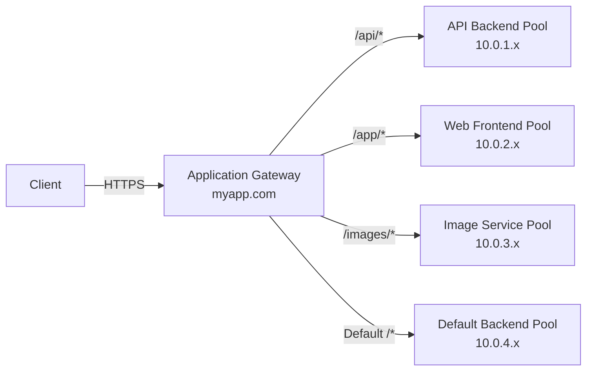
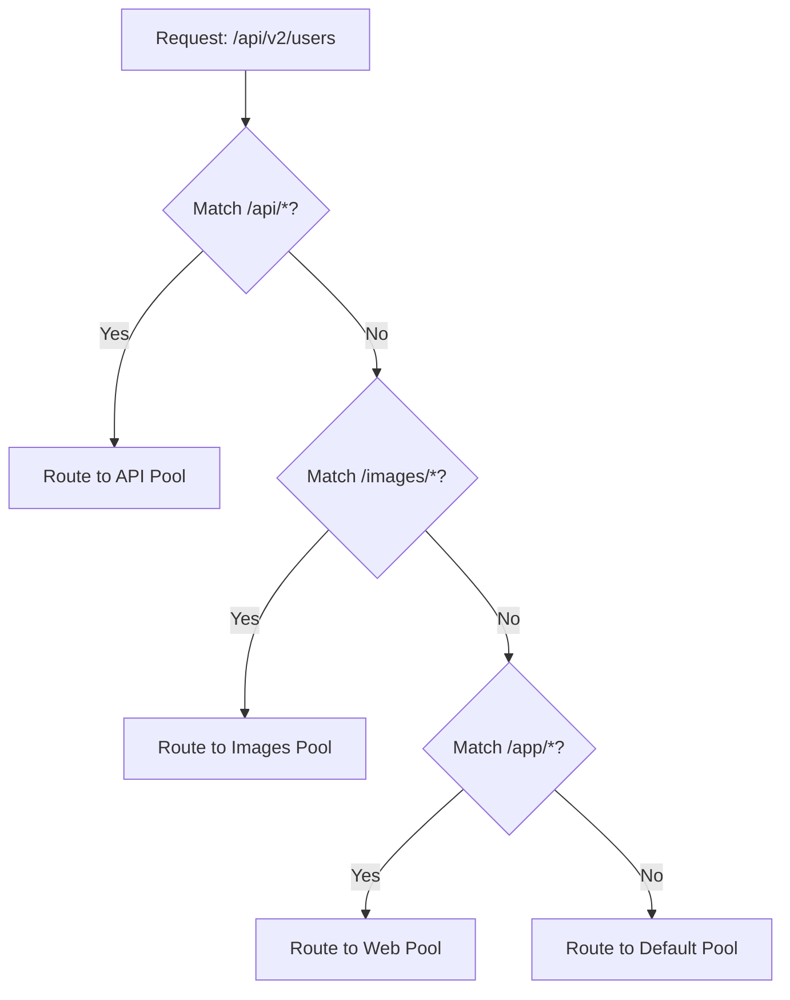

# How to Configure Azure Application Gateway URL Path-Based Routing

Author: [nawazdhandala](https://www.github.com/nawazdhandala)

Tags: Azure, Application Gateway, URL Routing, Path-Based Routing, Load Balancing, Azure Networking

Description: A step-by-step guide to configuring URL path-based routing on Azure Application Gateway to direct requests to different backend pools based on URL path.

---

Most web applications are not monolithic. You have an API serving JSON at `/api/*`, a static frontend at `/app/*`, and maybe an image service at `/images/*`. Each of these might run on different backend servers optimized for their specific workload. URL path-based routing on Azure Application Gateway lets you route requests to different backend pools based on the URL path, all through a single public endpoint.

Instead of deploying multiple load balancers or using DNS-based routing, you configure one Application Gateway that inspects the URL path of each request and forwards it to the appropriate backend. This simplifies your architecture and gives you a single point for SSL termination, WAF, and monitoring.

## How Path-Based Routing Works



The Application Gateway evaluates path rules in order. The first matching rule wins. If no path rule matches, traffic goes to the default backend pool.

## Prerequisites

- An Azure subscription
- Backend servers for each service (can be VMs, App Services, or any HTTP endpoint)
- Azure CLI installed

## Step 1: Create the Network Infrastructure

```bash
# Create a resource group
az group create --name rg-pathrouting-demo --location eastus

# Create a VNet with subnets for each backend tier
az network vnet create \
  --resource-group rg-pathrouting-demo \
  --name vnet-demo \
  --location eastus \
  --address-prefixes 10.0.0.0/16 \
  --subnet-name subnet-appgw \
  --subnet-prefixes 10.0.0.0/24

# Create backend subnets
az network vnet subnet create \
  --resource-group rg-pathrouting-demo \
  --vnet-name vnet-demo \
  --name subnet-api \
  --address-prefixes 10.0.1.0/24

az network vnet subnet create \
  --resource-group rg-pathrouting-demo \
  --vnet-name vnet-demo \
  --name subnet-web \
  --address-prefixes 10.0.2.0/24

az network vnet subnet create \
  --resource-group rg-pathrouting-demo \
  --vnet-name vnet-demo \
  --name subnet-images \
  --address-prefixes 10.0.3.0/24

# Create a public IP
az network public-ip create \
  --resource-group rg-pathrouting-demo \
  --name pip-appgw \
  --sku Standard \
  --allocation-method Static
```

## Step 2: Create the Application Gateway

Start with the basic Application Gateway. We will add path-based routing after creation.

```bash
# Create the Application Gateway with a default backend pool
az network application-gateway create \
  --resource-group rg-pathrouting-demo \
  --name appgw-pathrouting \
  --location eastus \
  --sku Standard_v2 \
  --capacity 2 \
  --vnet-name vnet-demo \
  --subnet subnet-appgw \
  --public-ip-address pip-appgw \
  --frontend-port 80 \
  --http-settings-port 80 \
  --http-settings-protocol Http \
  --priority 100
```

## Step 3: Create Additional Backend Pools

The default creation gives you one backend pool. Create additional pools for each service.

```bash
# Create the API backend pool
az network application-gateway address-pool create \
  --resource-group rg-pathrouting-demo \
  --gateway-name appgw-pathrouting \
  --name bp-api \
  --servers 10.0.1.4 10.0.1.5

# Create the web frontend backend pool
az network application-gateway address-pool create \
  --resource-group rg-pathrouting-demo \
  --gateway-name appgw-pathrouting \
  --name bp-web \
  --servers 10.0.2.4 10.0.2.5

# Create the images backend pool
az network application-gateway address-pool create \
  --resource-group rg-pathrouting-demo \
  --gateway-name appgw-pathrouting \
  --name bp-images \
  --servers 10.0.3.4 10.0.3.5

# Update the default backend pool
az network application-gateway address-pool update \
  --resource-group rg-pathrouting-demo \
  --gateway-name appgw-pathrouting \
  --name appGatewayBackendPool \
  --servers 10.0.2.4 10.0.2.5
```

## Step 4: Create Backend HTTP Settings for Each Service

Different backends might need different settings. The API might expect a different host header or port than the image service.

```bash
# HTTP settings for the API (different timeout since API calls may be longer)
az network application-gateway http-settings create \
  --resource-group rg-pathrouting-demo \
  --gateway-name appgw-pathrouting \
  --name settings-api \
  --port 8080 \
  --protocol Http \
  --cookie-based-affinity Disabled \
  --timeout 60 \
  --path "/"

# HTTP settings for images (longer timeout for large files)
az network application-gateway http-settings create \
  --resource-group rg-pathrouting-demo \
  --gateway-name appgw-pathrouting \
  --name settings-images \
  --port 80 \
  --protocol Http \
  --cookie-based-affinity Disabled \
  --timeout 120
```

## Step 5: Create Health Probes for Each Backend

Each backend type should have its own health probe checking the appropriate endpoint.

```bash
# Health probe for the API
az network application-gateway probe create \
  --resource-group rg-pathrouting-demo \
  --gateway-name appgw-pathrouting \
  --name probe-api \
  --protocol Http \
  --path /api/health \
  --interval 30 \
  --timeout 30 \
  --threshold 3 \
  --host-name-from-http-settings true

# Health probe for the images service
az network application-gateway probe create \
  --resource-group rg-pathrouting-demo \
  --gateway-name appgw-pathrouting \
  --name probe-images \
  --protocol Http \
  --path /health \
  --interval 30 \
  --timeout 30 \
  --threshold 3 \
  --host-name-from-http-settings true

# Associate probes with HTTP settings
az network application-gateway http-settings update \
  --resource-group rg-pathrouting-demo \
  --gateway-name appgw-pathrouting \
  --name settings-api \
  --probe probe-api

az network application-gateway http-settings update \
  --resource-group rg-pathrouting-demo \
  --gateway-name appgw-pathrouting \
  --name settings-images \
  --probe probe-images
```

## Step 6: Create the URL Path Map

This is the core configuration. The URL path map defines which paths go to which backend pools.

```bash
# Create the URL path map
az network application-gateway url-path-map create \
  --resource-group rg-pathrouting-demo \
  --gateway-name appgw-pathrouting \
  --name pathmap-main \
  --paths "/api/*" \
  --address-pool bp-api \
  --http-settings settings-api \
  --default-address-pool bp-web \
  --default-http-settings appGatewayBackendHttpSettings \
  --rule-name rule-api

# Add the images path rule
az network application-gateway url-path-map rule create \
  --resource-group rg-pathrouting-demo \
  --gateway-name appgw-pathrouting \
  --path-map-name pathmap-main \
  --name rule-images \
  --paths "/images/*" \
  --address-pool bp-images \
  --http-settings settings-images

# Add the web app path rule
az network application-gateway url-path-map rule create \
  --resource-group rg-pathrouting-demo \
  --gateway-name appgw-pathrouting \
  --path-map-name pathmap-main \
  --name rule-web \
  --paths "/app/*" \
  --address-pool bp-web \
  --http-settings appGatewayBackendHttpSettings
```

## Step 7: Create a Path-Based Routing Rule

Now create a request routing rule that uses the URL path map instead of a simple backend pool.

```bash
# Delete the existing basic rule first
az network application-gateway rule delete \
  --resource-group rg-pathrouting-demo \
  --gateway-name appgw-pathrouting \
  --name rule1

# Create a path-based routing rule
az network application-gateway rule create \
  --resource-group rg-pathrouting-demo \
  --gateway-name appgw-pathrouting \
  --name rule-pathbased \
  --rule-type PathBasedRouting \
  --http-listener appGatewayHttpListener \
  --url-path-map pathmap-main \
  --priority 100
```

The `--rule-type PathBasedRouting` is the key. This tells the Application Gateway to use the URL path map for routing decisions instead of sending all traffic to a single backend.

## Step 8: Verify the Configuration

```bash
# Check the URL path map
az network application-gateway url-path-map show \
  --resource-group rg-pathrouting-demo \
  --gateway-name appgw-pathrouting \
  --name pathmap-main \
  --output json

# Get the public IP for testing
PIP=$(az network public-ip show \
  --resource-group rg-pathrouting-demo \
  --name pip-appgw \
  --query ipAddress -o tsv)

# Test routing (assumes backends are running)
curl http://$PIP/api/users      # Should hit API backend pool
curl http://$PIP/app/index.html # Should hit web frontend pool
curl http://$PIP/images/logo.png # Should hit images backend pool
curl http://$PIP/other           # Should hit default backend pool
```

## Path Matching Behavior

Understanding how path matching works is important:

- Paths are matched in order. The first matching rule wins.
- Patterns support wildcards: `/api/*` matches `/api/users`, `/api/v2/orders`, etc.
- Path matching is case-sensitive by default.
- If no path rule matches, the default backend pool handles the request.



## Common Use Cases

**Microservices routing.** Route `/users/*` to the user service, `/orders/*` to the order service, and `/products/*` to the product service, all behind one domain.

**API versioning.** Route `/api/v1/*` to the legacy API backend and `/api/v2/*` to the new API backend.

**Static vs. dynamic content.** Route `/static/*` to a storage account or CDN origin, and everything else to your application servers.

**Blue-green deployments.** Temporarily route `/beta/*` to a new version of your application while the main path still hits production.

## Troubleshooting

**Requests going to the wrong backend.** Check the path rule order. More specific paths should come before general ones. `/api/admin/*` should be listed before `/api/*`.

**404 errors.** The backend might not recognize the full path. If your API backend expects `/users` but the Application Gateway sends `/api/users`, you need to configure path override in the HTTP settings or use URL rewrite rules.

**Inconsistent behavior.** Remember that path matching is case-sensitive. `/API/users` will not match `/api/*`.

## Cleanup

```bash
# Delete the resource group
az group delete --name rg-pathrouting-demo --yes --no-wait
```

## Wrapping Up

URL path-based routing on Azure Application Gateway lets you serve multiple backend services through a single endpoint. Define your backend pools, create a URL path map with rules for each path pattern, and associate it with a routing rule. Each service gets its own health probe and HTTP settings, while clients see a single domain. This is cleaner than running multiple load balancers and simpler than DNS-based routing, especially when all your services share the same domain name.
