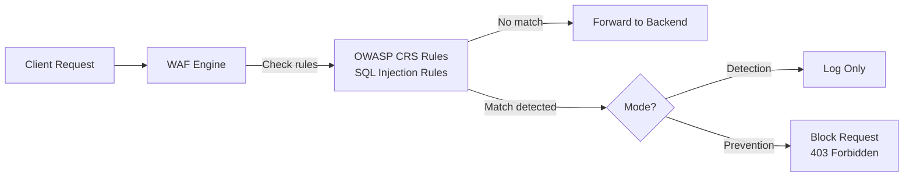

# How to Configure Azure Application Gateway WAF to Block SQL Injection Attacks

Author: [nawazdhandala](https://www.github.com/nawazdhandala)

Tags: Azure, WAF, Application Gateway, SQL Injection, Web Security, Azure Networking, OWASP

Description: A hands-on guide to configuring Azure Application Gateway WAF to detect and block SQL injection attacks using managed rule sets.

---

SQL injection remains one of the most common and dangerous web application vulnerabilities. Despite being well understood for decades, it consistently appears in the OWASP Top 10. An attacker slips malicious SQL into user input fields, and if your application does not properly sanitize inputs, the database executes the attacker's query. The consequences range from data theft to complete database destruction.

While input validation and parameterized queries are the primary defense, a Web Application Firewall (WAF) provides an additional layer of protection. Azure Application Gateway WAF inspects HTTP traffic at Layer 7 and can detect and block SQL injection attempts before they ever reach your application.

## How WAF Detects SQL Injection

The WAF uses rule sets based on the OWASP Core Rule Set (CRS). These rules pattern-match against request headers, query strings, request bodies, and URLs looking for SQL injection signatures. Common patterns include:

- SQL keywords in unexpected places (`SELECT`, `UNION`, `DROP`, `INSERT`)
- Comment sequences used to bypass filters (`--`, `/**/`)
- String concatenation tricks (`' OR '1'='1`)
- Encoded variations of the above (URL encoding, hex encoding)



## Prerequisites

- An Azure subscription
- An existing Application Gateway or we will create one with WAF enabled
- Azure CLI installed
- A backend application to protect

## Step 1: Create an Application Gateway with WAF

If you already have an Application Gateway, skip to Step 3. Otherwise, we need to create one with the WAF_v2 SKU.

```bash
# Create a resource group
az group create --name rg-waf-demo --location eastus

# Create a VNet
az network vnet create \
  --resource-group rg-waf-demo \
  --name vnet-waf \
  --location eastus \
  --address-prefixes 10.0.0.0/16 \
  --subnet-name subnet-appgw \
  --subnet-prefixes 10.0.0.0/24

# Create a public IP
az network public-ip create \
  --resource-group rg-waf-demo \
  --name pip-appgw-waf \
  --sku Standard \
  --allocation-method Static

# Create the Application Gateway with WAF_v2 SKU
az network application-gateway create \
  --resource-group rg-waf-demo \
  --name appgw-waf-demo \
  --location eastus \
  --sku WAF_v2 \
  --capacity 2 \
  --vnet-name vnet-waf \
  --subnet subnet-appgw \
  --public-ip-address pip-appgw-waf \
  --http-settings-port 80 \
  --http-settings-protocol Http \
  --frontend-port 80 \
  --priority 100
```

The key difference from a standard Application Gateway is the `--sku WAF_v2`. This SKU includes the WAF engine.

## Step 2: Create a WAF Policy

WAF policies define the rules, exclusions, and custom rules that the WAF enforces.

```bash
# Create a WAF policy
az network application-gateway waf-policy create \
  --resource-group rg-waf-demo \
  --name waf-policy-sqli \
  --location eastus
```

## Step 3: Configure Managed Rule Sets

Enable the OWASP CRS rule set. CRS 3.2 is the latest stable version and includes comprehensive SQL injection detection rules.

```bash
# Configure the managed rule set (OWASP CRS 3.2)
az network application-gateway waf-policy managed-rule rule-set add \
  --resource-group rg-waf-demo \
  --policy-name waf-policy-sqli \
  --type OWASP \
  --version 3.2
```

The OWASP CRS includes several rule groups. The ones most relevant to SQL injection are:

- **REQUEST-942-APPLICATION-ATTACK-SQLI**: The primary SQL injection rule group with dozens of individual rules targeting different injection techniques
- **REQUEST-941-APPLICATION-ATTACK-XSS**: Cross-site scripting rules (also important)
- **REQUEST-943-APPLICATION-ATTACK-SESSION-FIXATION**: Session attack rules

## Step 4: Set the WAF to Prevention Mode

WAF has two modes:

- **Detection mode**: Logs threats but does not block them. Use this initially to test without breaking legitimate traffic.
- **Prevention mode**: Actively blocks malicious requests with a 403 response.

Start with Detection mode to verify no legitimate traffic gets flagged, then switch to Prevention.

```bash
# Set WAF policy to Prevention mode
az network application-gateway waf-policy policy-setting update \
  --resource-group rg-waf-demo \
  --policy-name waf-policy-sqli \
  --mode Prevention \
  --state Enabled \
  --max-request-body-size-in-kb 128 \
  --request-body-check true
```

The `--request-body-check true` option is critical. Without it, the WAF only inspects headers and URL - SQL injection payloads in POST request bodies would not be caught.

## Step 5: Associate the WAF Policy with the Application Gateway

```bash
# Associate the WAF policy with the Application Gateway
az network application-gateway update \
  --resource-group rg-waf-demo \
  --name appgw-waf-demo \
  --waf-policy waf-policy-sqli
```

## Step 6: Add Custom Rules for Specific SQL Injection Patterns

In addition to the managed rules, you can add custom rules for patterns specific to your application.

```bash
# Add a custom rule to block requests with common SQL injection patterns in query strings
az network application-gateway waf-policy custom-rule create \
  --resource-group rg-waf-demo \
  --policy-name waf-policy-sqli \
  --name BlockSQLiInQueryString \
  --priority 10 \
  --rule-type MatchRule \
  --action Block

# Add match condition for SQL injection patterns
az network application-gateway waf-policy custom-rule match-condition add \
  --resource-group rg-waf-demo \
  --policy-name waf-policy-sqli \
  --name BlockSQLiInQueryString \
  --match-variables "QueryString" \
  --operator Contains \
  --values "UNION SELECT" "OR 1=1" "DROP TABLE" "INSERT INTO" "xp_cmdshell" \
  --transforms Lowercase
```

The `--transforms Lowercase` flag normalizes the input before matching, so it catches `UNION SELECT`, `union select`, and `Union Select` alike.

## Step 7: Configure Exclusions for False Positives

Sometimes legitimate traffic triggers WAF rules. For example, if your application has a field where users can enter SQL code (like a SQL learning platform), you need exclusions.

```bash
# Exclude a specific request header from SQL injection checks
az network application-gateway waf-policy managed-rule exclusion add \
  --resource-group rg-waf-demo \
  --policy-name waf-policy-sqli \
  --match-variable "RequestArgNames" \
  --selector-match-operator "Equals" \
  --selector "sql_query"
```

This excludes the `sql_query` parameter from WAF inspection. Be very careful with exclusions - each one creates a potential bypass path for attackers.

## Step 8: Enable WAF Logging

WAF logs are essential for monitoring detections, investigating attacks, and tuning rules.

```bash
# Create a Log Analytics workspace
az monitor log-analytics workspace create \
  --resource-group rg-waf-demo \
  --workspace-name law-waf \
  --location eastus

# Enable diagnostic logging
APPGW_ID=$(az network application-gateway show --resource-group rg-waf-demo --name appgw-waf-demo --query id -o tsv)
WORKSPACE_ID=$(az monitor log-analytics workspace show --resource-group rg-waf-demo --workspace-name law-waf --query id -o tsv)

az monitor diagnostic-settings create \
  --resource $APPGW_ID \
  --name diag-waf \
  --workspace $WORKSPACE_ID \
  --logs '[{"category":"ApplicationGatewayFirewallLog","enabled":true},{"category":"ApplicationGatewayAccessLog","enabled":true}]'
```

## Step 9: Test the WAF

Send some test requests to verify the WAF is blocking SQL injection attempts.

```bash
# Get the public IP
PIP=$(az network public-ip show --resource-group rg-waf-demo --name pip-appgw-waf --query ipAddress -o tsv)

# Test with a SQL injection attempt in the query string
curl -v "http://$PIP/?id=1%20OR%201=1"

# Test with a UNION-based injection
curl -v "http://$PIP/?search=test%27%20UNION%20SELECT%20username,password%20FROM%20users--"

# Test with a SQL injection in a POST body
curl -v -X POST "http://$PIP/login" \
  -d "username=admin'--&password=anything"
```

In Prevention mode, all of these should return a 403 Forbidden response. In Detection mode, the requests pass through but are logged.

## Analyzing WAF Logs

Query the WAF logs in Log Analytics to see what is being blocked.

```
// KQL query for WAF logs showing blocked SQL injection attempts
AzureDiagnostics
| where ResourceType == "APPLICATIONGATEWAYS"
| where Category == "ApplicationGatewayFirewallLog"
| where action_s == "Blocked"
| where ruleGroup_s == "REQUEST-942-APPLICATION-ATTACK-SQLI"
| project TimeGenerated, clientIp_s, requestUri_s, ruleId_s, message_s
| order by TimeGenerated desc
```

## WAF Tuning Best Practices

1. **Start in Detection mode.** Run for at least a week to identify false positives before switching to Prevention.
2. **Review logs regularly.** Look for blocked legitimate traffic and adjust exclusions.
3. **Keep rule sets updated.** New rule set versions add protection for newly discovered attack patterns.
4. **Use custom rules sparingly.** The managed rules are comprehensive. Custom rules are for edge cases.
5. **Do not disable entire rule groups.** If a rule causes false positives, create a targeted exclusion rather than disabling the whole group.

## Cleanup

```bash
# Delete all resources
az group delete --name rg-waf-demo --yes --no-wait
```

## Wrapping Up

Azure Application Gateway WAF with OWASP CRS provides strong protection against SQL injection attacks. Deploy the WAF_v2 SKU, enable the OWASP 3.2 rule set, start in Detection mode to tune out false positives, then switch to Prevention mode for active blocking. Enable logging to monitor attacks and tune rules over time. Remember that WAF is a defense-in-depth measure - your application should still use parameterized queries and input validation as the primary defense against SQL injection.
