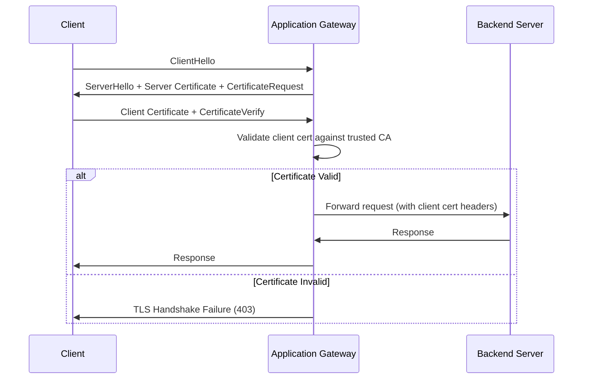

# How to Configure Azure Application Gateway with Mutual TLS Authentication

Author: [nawazdhandala](https://www.github.com/nawazdhandala)

Tags: Azure, Application Gateway, Mutual TLS, mTLS, Security, Certificate Authentication, Networking

Description: A detailed guide to configuring Azure Application Gateway with mutual TLS authentication for client certificate verification and zero-trust network access.

---

Standard TLS ensures that the client trusts the server, but it does not verify the client's identity at the network layer. Mutual TLS (mTLS) adds the other direction: the server also verifies the client by requiring a valid certificate. This is a fundamental building block for zero-trust architectures, API security between microservices, and scenarios where you need to ensure only authorized clients can connect.

Azure Application Gateway v2 supports mutual TLS authentication, allowing you to enforce client certificate validation at the gateway before traffic reaches your backend. In this post, I will walk through the complete setup.

## How Mutual TLS Works

In standard TLS, the server presents its certificate and the client verifies it. In mutual TLS, both sides present certificates:

1. Client connects to the gateway
2. Gateway presents its server certificate (same as normal HTTPS)
3. Client verifies the server certificate
4. Gateway requests the client's certificate
5. Client presents its certificate
6. Gateway validates the client certificate against a trusted CA
7. If valid, the connection is established and traffic flows to the backend



## Prerequisites

1. Azure Application Gateway v2 (Standard_v2 or WAF_v2)
2. A server SSL certificate for the gateway's HTTPS listener
3. A CA certificate (root and/or intermediate) that signed the client certificates
4. Client certificates issued by that CA

## Step 1: Prepare the Trusted CA Certificate

You need the CA certificate that signs your client certificates. This is typically a root CA certificate or an intermediate CA certificate in PEM format.

If you have the certificate in DER format, convert it:

```bash
# Convert DER to PEM format if needed
openssl x509 -inform DER -in myCA.cer -out myCA.pem -outform PEM
```

If you have a certificate chain (root + intermediate), combine them into a single PEM file:

```bash
# Combine root and intermediate certificates into a chain file
cat intermediate-ca.pem root-ca.pem > ca-chain.pem
```

## Step 2: Create an SSL Profile with Client Certificate Authentication

First, upload the trusted client CA certificate to Application Gateway:

```bash
# Upload the trusted client CA certificate
az network application-gateway client-cert add \
  --resource-group myResourceGroup \
  --gateway-name myAppGateway \
  --name myClientCA \
  --data @ca-chain.pem
```

Now create an SSL profile that enables client certificate verification:

```bash
# Create an SSL profile with client authentication
az network application-gateway ssl-profile add \
  --resource-group myResourceGroup \
  --gateway-name myAppGateway \
  --name mTLSProfile \
  --client-auth-configuration "{\"verifyClientCertIssuerDN\":true}" \
  --trusted-client-certificates myClientCA
```

The `verifyClientCertIssuerDN` setting ensures the gateway checks that the client certificate was issued by one of the trusted CAs.

## Step 3: Configure the HTTPS Listener

Associate the SSL profile with your HTTPS listener:

```bash
# Update the listener to use the mTLS SSL profile
az network application-gateway http-listener update \
  --resource-group myResourceGroup \
  --gateway-name myAppGateway \
  --name myHTTPSListener \
  --ssl-profile mTLSProfile
```

If you do not have an HTTPS listener yet, create one with the SSL profile:

```bash
# Upload the server SSL certificate first
az network application-gateway ssl-cert create \
  --resource-group myResourceGroup \
  --gateway-name myAppGateway \
  --name serverCert \
  --cert-file server.pfx \
  --cert-password "YourPfxPassword"

# Create an HTTPS listener with mTLS
az network application-gateway http-listener create \
  --resource-group myResourceGroup \
  --gateway-name myAppGateway \
  --name mtlsListener \
  --frontend-port myFrontendPort443 \
  --frontend-ip myFrontendIP \
  --ssl-cert serverCert \
  --ssl-profile mTLSProfile
```

## Step 4: Configure Client Certificate Header Forwarding

Application Gateway can forward client certificate information to your backend as HTTP headers. This lets your application code access the client's certificate details for authorization decisions:

```bash
# Update HTTP settings to include client certificate headers
az network application-gateway http-settings update \
  --resource-group myResourceGroup \
  --gateway-name myAppGateway \
  --name myHTTPSettings \
  --host-name-from-backend-pool false \
  --protocol Https \
  --port 443
```

The gateway adds these headers to the request:

- `X-Client-Cert-Issuer` - The issuer DN of the client certificate
- `X-Client-Cert-Subject` - The subject DN of the client certificate
- `X-Client-Cert-Serial` - The serial number of the client certificate
- `X-Client-Cert-Fingerprint` - The SHA1 fingerprint of the client certificate

Your backend application can use these headers to implement fine-grained authorization.

## Step 5: Test the Configuration

Test with a client that has a valid certificate:

```bash
# Test with a valid client certificate - should succeed
curl -v \
  --cert client.pem \
  --key client-key.pem \
  --cacert server-ca.pem \
  https://myappgateway.example.com/api/test
```

Test without a client certificate - this should fail:

```bash
# Test without a client certificate - should fail with 403
curl -v \
  --cacert server-ca.pem \
  https://myappgateway.example.com/api/test
```

Test with a certificate signed by a different CA - this should also fail:

```bash
# Test with an untrusted client certificate - should fail
curl -v \
  --cert untrusted-client.pem \
  --key untrusted-client-key.pem \
  --cacert server-ca.pem \
  https://myappgateway.example.com/api/test
```

## Client Certificate Revocation

Application Gateway supports checking client certificates against a Certificate Revocation List (CRL). Upload the CRL to ensure revoked certificates are rejected:

```bash
# Upload CRL for client certificate revocation checking
az network application-gateway ssl-profile update \
  --resource-group myResourceGroup \
  --gateway-name myAppGateway \
  --name mTLSProfile \
  --client-auth-configuration "{\"verifyClientRevocation\":\"OCSP\"}"
```

Options for revocation checking:

- **None:** No revocation check (default)
- **OCSP:** Check revocation status using Online Certificate Status Protocol

## Handling Different Client Certificate Policies

You might want different mTLS policies for different paths. For example, API endpoints require client certificates, but a health check endpoint does not.

Create multiple listeners on different ports or use path-based routing:

```bash
# Create a path rule that requires mTLS for /api/*
# and allows unauthenticated access for /health
az network application-gateway url-path-map create \
  --resource-group myResourceGroup \
  --gateway-name myAppGateway \
  --name myPathMap \
  --default-backend-pool backendPool \
  --default-backend-settings myHTTPSettings \
  --paths "/api/*" \
  --path-rule-name apiRule \
  --backend-pool backendPool \
  --backend-settings myHTTPSettings
```

Note that mTLS is enforced at the listener level, not the path level. If the listener has mTLS enabled, all paths on that listener require client certificates. To have some paths without mTLS, use a separate listener on a different port or hostname.

## Generating Test Client Certificates

For testing, you can create a self-signed CA and client certificates using OpenSSL:

```bash
# Generate a CA private key and certificate
openssl req -x509 -newkey rsa:4096 \
  -keyout ca-key.pem -out ca-cert.pem \
  -days 365 -nodes \
  -subj "/CN=Test CA/O=MyOrg"

# Generate a client private key and CSR
openssl req -newkey rsa:2048 \
  -keyout client-key.pem -out client.csr \
  -nodes \
  -subj "/CN=TestClient/O=MyOrg"

# Sign the client certificate with the CA
openssl x509 -req -in client.csr \
  -CA ca-cert.pem -CAkey ca-key.pem \
  -CAcreateserial -out client-cert.pem \
  -days 90
```

Upload `ca-cert.pem` as the trusted client CA on the Application Gateway. Use `client-cert.pem` and `client-key.pem` on the client side.

## Monitoring mTLS Activity

Monitor mTLS authentication failures in Application Gateway logs:

```
// KQL query for mTLS authentication failures
AzureDiagnostics
| where ResourceType == "APPLICATIONGATEWAYS"
| where Category == "ApplicationGatewayAccessLog"
| where sslClientCertificateVerifyResult_s != "PASSED"
| project
    TimeGenerated,
    clientIP_s,
    requestUri_s,
    sslClientCertificateVerifyResult_s,
    sslClientCertificateIssuerName_s
| order by TimeGenerated desc
```

This query surfaces failed mTLS attempts, helping you identify misconfigured clients or unauthorized access attempts.

## Common Issues

**All clients get 403.** Check that the uploaded CA certificate matches the CA that signed the client certificates. Verify the certificate chain is complete (include intermediate CAs).

**Certificate works in curl but not in the browser.** Browsers require the client certificate to be installed in the operating system's certificate store or provided through a smart card. PEM files do not work directly in browsers.

**Performance impact.** mTLS adds overhead to the TLS handshake. The gateway needs to validate the client certificate chain, which adds a few milliseconds per connection. For high-throughput scenarios, factor this into your capacity planning.

**Backend does not receive client certificate headers.** Make sure the backend HTTP settings are configured correctly and the gateway is not stripping custom headers.

## Summary

Mutual TLS on Azure Application Gateway adds a strong authentication layer before traffic reaches your backend. Upload your trusted CA certificate, create an SSL profile with client authentication, and associate it with your HTTPS listener. Client certificate details are forwarded to your backend as HTTP headers for additional authorization logic. Start with testing using self-signed certificates, validate the configuration, then deploy with production certificates from your organization's PKI. For revocation handling, enable OCSP checking to ensure compromised certificates are rejected promptly.
