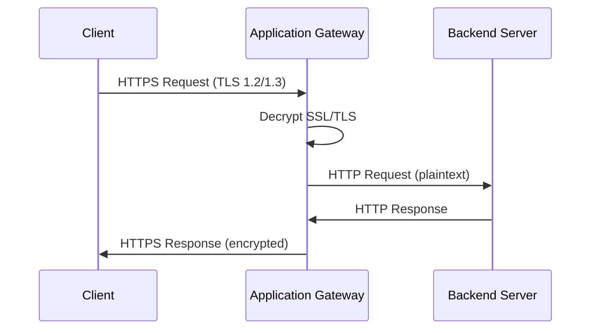

# How to Configure Azure Application Gateway with SSL Termination

Author: [nawazdhandala](https://www.github.com/nawazdhandala)

Tags: Azure, Application Gateway, SSL Termination, HTTPS, Load Balancing, Azure Networking

Description: Complete walkthrough for configuring Azure Application Gateway with SSL termination to offload TLS processing from backend servers.

---

SSL termination (sometimes called TLS offloading) is the practice of decrypting HTTPS traffic at the load balancer rather than at the backend server. This lets your backend servers handle plain HTTP traffic, which reduces their CPU overhead and simplifies certificate management. Azure Application Gateway supports this natively and is one of the most common ways to handle SSL in Azure.

In this guide, we will set up an Application Gateway that accepts HTTPS traffic from clients, terminates the SSL connection, and forwards plain HTTP requests to a backend pool of servers.

## How SSL Termination Works

When a client connects to your application over HTTPS, the TLS handshake happens between the client and the Application Gateway. The gateway decrypts the request, inspects it (optionally applying WAF rules), and forwards it to the backend over HTTP.



The certificate is stored on the Application Gateway, and backend servers never need to deal with it. This means you manage one certificate in one place rather than distributing it across multiple backend VMs.

## Prerequisites

- An Azure subscription
- A PFX certificate file for your domain (or you can use a self-signed cert for testing)
- Azure CLI installed and configured
- A virtual network with at least two subnets (one dedicated to the Application Gateway)

## Step 1: Prepare the Environment

Application Gateway requires its own dedicated subnet. This subnet cannot contain any other resources except other Application Gateways.

```bash
# Create a resource group
az group create --name rg-appgw-demo --location eastus

# Create a VNet with a subnet for Application Gateway and one for backends
az network vnet create \
  --resource-group rg-appgw-demo \
  --name vnet-appgw \
  --location eastus \
  --address-prefixes 10.0.0.0/16 \
  --subnet-name subnet-appgw \
  --subnet-prefixes 10.0.0.0/24

# Create a second subnet for backend VMs
az network vnet subnet create \
  --resource-group rg-appgw-demo \
  --vnet-name vnet-appgw \
  --name subnet-backends \
  --address-prefixes 10.0.1.0/24

# Create a public IP for the Application Gateway
az network public-ip create \
  --resource-group rg-appgw-demo \
  --name pip-appgw \
  --sku Standard \
  --allocation-method Static
```

The public IP must use the Standard SKU for Application Gateway v2. The Basic SKU is not supported.

## Step 2: Create a Self-Signed Certificate (for Testing)

For production, you would use a certificate from a trusted CA. For testing purposes, we can generate a self-signed certificate.

```bash
# Generate a self-signed certificate and export as PFX
openssl req -x509 -nodes -days 365 \
  -newkey rsa:2048 \
  -keyout server.key \
  -out server.crt \
  -subj "/CN=myapp.example.com"

# Convert to PFX format (Application Gateway requires PFX)
openssl pkcs12 -export \
  -out server.pfx \
  -inkey server.key \
  -in server.crt \
  -passout pass:MyP@ssw0rd123
```

## Step 3: Create the Application Gateway

This is a larger command because Application Gateway has several components that need to be configured together.

```bash
# Create the Application Gateway with SSL termination
az network application-gateway create \
  --resource-group rg-appgw-demo \
  --name appgw-demo \
  --location eastus \
  --sku Standard_v2 \
  --capacity 2 \
  --vnet-name vnet-appgw \
  --subnet subnet-appgw \
  --public-ip-address pip-appgw \
  --http-settings-cookie-based-affinity Disabled \
  --frontend-port 443 \
  --http-settings-port 80 \
  --http-settings-protocol Http \
  --cert-file server.pfx \
  --cert-password "MyP@ssw0rd123" \
  --priority 100
```

Let me break down what each option does:

- `--sku Standard_v2`: Uses the v2 SKU which supports autoscaling and zone redundancy
- `--capacity 2`: Starts with 2 instances for availability
- `--frontend-port 443`: Listens for HTTPS on port 443
- `--http-settings-port 80`: Forwards to backends on port 80 (plain HTTP)
- `--http-settings-protocol Http`: Backend protocol is HTTP, not HTTPS
- `--cert-file` and `--cert-password`: The PFX certificate for SSL termination

This single command creates all the building blocks: frontend IP configuration, frontend port, HTTP listener, backend address pool, backend HTTP settings, and a routing rule tying them together.

## Step 4: Add Backend Servers to the Pool

Now add your backend servers to the backend pool. These can be VMs, VM scale sets, or even FQDN addresses.

```bash
# Add backend servers by IP address
az network application-gateway address-pool update \
  --resource-group rg-appgw-demo \
  --gateway-name appgw-demo \
  --name appGatewayBackendPool \
  --servers 10.0.1.4 10.0.1.5
```

## Step 5: Configure Health Probes

By default, Application Gateway sends basic health probes. For production, you should configure a custom health probe that checks a specific endpoint.

```bash
# Create a custom health probe
az network application-gateway probe create \
  --resource-group rg-appgw-demo \
  --gateway-name appgw-demo \
  --name health-probe-http \
  --protocol Http \
  --host-name-from-http-settings true \
  --path /health \
  --interval 30 \
  --timeout 30 \
  --threshold 3

# Update the HTTP settings to use the custom probe
az network application-gateway http-settings update \
  --resource-group rg-appgw-demo \
  --gateway-name appgw-demo \
  --name appGatewayBackendHttpSettings \
  --probe health-probe-http
```

## Step 6: Add an HTTP to HTTPS Redirect

You probably want HTTP requests (port 80) to redirect to HTTPS. This requires adding a second frontend port, listener, and redirect configuration.

```bash
# Add a frontend port for HTTP
az network application-gateway frontend-port create \
  --resource-group rg-appgw-demo \
  --gateway-name appgw-demo \
  --name port-http \
  --port 80

# Create an HTTP listener
az network application-gateway http-listener create \
  --resource-group rg-appgw-demo \
  --gateway-name appgw-demo \
  --name listener-http \
  --frontend-port port-http \
  --frontend-ip appGatewayFrontendIP

# Create a redirect configuration
az network application-gateway redirect-config create \
  --resource-group rg-appgw-demo \
  --gateway-name appgw-demo \
  --name redirect-http-to-https \
  --type Permanent \
  --target-listener appGatewayHttpListener \
  --include-path true \
  --include-query-string true

# Create a routing rule for the HTTP listener
az network application-gateway rule create \
  --resource-group rg-appgw-demo \
  --gateway-name appgw-demo \
  --name rule-http-redirect \
  --priority 200 \
  --http-listener listener-http \
  --redirect-config redirect-http-to-https \
  --rule-type Basic
```

## Step 7: Verify the Configuration

Check that the Application Gateway is healthy and the backend pool shows servers as healthy.

```bash
# Check the backend health
az network application-gateway show-backend-health \
  --resource-group rg-appgw-demo \
  --name appgw-demo

# Get the public IP to test
az network public-ip show \
  --resource-group rg-appgw-demo \
  --name pip-appgw \
  --query ipAddress --output tsv
```

## SSL Policy Configuration

You can control which TLS versions and cipher suites the Application Gateway accepts. For security best practices, disable older TLS versions.

```bash
# Set a predefined SSL policy that enforces TLS 1.2+
az network application-gateway ssl-policy set \
  --resource-group rg-appgw-demo \
  --gateway-name appgw-demo \
  --policy-type Predefined \
  --policy-name AppGwSslPolicy20220101S
```

The `AppGwSslPolicy20220101S` policy enforces TLS 1.2 as the minimum version and uses strong cipher suites.

## End-to-End SSL

If your compliance requirements demand encryption between the Application Gateway and backends too, you can configure end-to-end SSL. This means the gateway re-encrypts traffic before sending it to backends. The backend servers need their own certificates, and you need to upload the backend CA certificate to the Application Gateway for trust verification.

For most internal workloads, SSL termination at the gateway is sufficient. End-to-end SSL adds complexity and CPU overhead on both the gateway and backends.

## Cleanup

```bash
# Remove all demo resources
az group delete --name rg-appgw-demo --yes --no-wait
```

## Wrapping Up

Azure Application Gateway with SSL termination gives you a clean separation of concerns: the gateway handles certificate management and TLS negotiation, while your backend servers focus on application logic. The setup involves creating the gateway with a PFX certificate, configuring backend pools and health probes, and optionally adding HTTP-to-HTTPS redirects. For production deployments, always use certificates from a trusted CA, enforce TLS 1.2 or higher, and configure custom health probes to match your application's health check endpoint.
