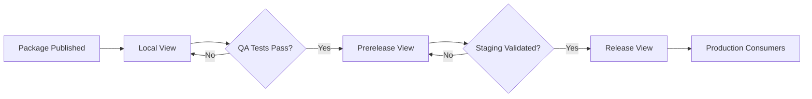

# How to Configure Azure Artifacts Feed Views for Promoting Packages Across Release Stages

Author: [nawazdhandala](https://www.github.com/nawazdhandala)

Tags: Azure Artifacts, Package Management, CI/CD, Azure DevOps, NuGet, npm, Release Management

Description: Learn how to configure Azure Artifacts feed views to promote packages through development, staging, and production release stages with quality gates.

---

Package management in any serious engineering organization needs more than just a single feed where you dump everything. You need a way to distinguish between packages that are still in development, those that have passed QA, and those that are approved for production use. Azure Artifacts feed views give you exactly that - a promotion model that lets packages move through stages as they gain confidence.

Feed views are essentially filtered perspectives on your artifact feed. Each view shows only the packages that have been promoted to that stage. By default, every feed comes with three views: Local, Prerelease, and Release. You can use these views to create a structured promotion pipeline that prevents unstable packages from reaching production systems.

## Understanding Feed Views

Think of feed views as quality gates for your packages. When you first publish a package to a feed, it sits in the Local view. This is the raw, unfiltered feed. From there, you promote packages to Prerelease (for staging and QA) and then to Release (for production consumption).

Downstream consumers connect to a specific view rather than the raw feed. A development team might point at the Local view to get the latest packages, while a production deployment pipeline connects to the Release view and only sees packages that have been explicitly promoted.



## Setting Up Feed Views in the Portal

Navigate to your Azure DevOps project, go to Artifacts, and select the feed you want to configure. Click the gear icon to access feed settings, then select Views.

You will see the three default views. For most teams, these three are sufficient, but you can rename them to match your workflow. For example, some teams rename Local to "dev," Prerelease to "staging," and Release to "prod."

To promote a package through the portal, find it in the feed, select the version you want to promote, click the three-dot menu, and choose "Promote." Then pick the target view.

## Automating Package Promotion in Pipelines

Manual promotion through the portal is fine for occasional use, but you want this automated in your CI/CD pipeline. The most common pattern is to promote packages after successful test runs.

Here is a pipeline that builds, tests, and then promotes a NuGet package through the views.

```yaml
# azure-pipelines.yml - Build, test, and promote a NuGet package
trigger:
  branches:
    include:
      - main
      - develop

stages:
  # Stage 1: Build and publish to feed (lands in @Local view)
  - stage: Build
    jobs:
      - job: BuildAndPublish
        pool:
          vmImage: 'ubuntu-latest'
        steps:
          - task: DotNetCoreCLI@2
            displayName: 'Restore packages'
            inputs:
              command: 'restore'
              projects: '**/*.csproj'
              feedsToUse: 'select'
              vstsFeed: 'my-feed'

          - task: DotNetCoreCLI@2
            displayName: 'Build solution'
            inputs:
              command: 'build'
              projects: '**/*.csproj'
              arguments: '--configuration Release'

          - task: DotNetCoreCLI@2
            displayName: 'Run unit tests'
            inputs:
              command: 'test'
              projects: '**/*Tests.csproj'
              arguments: '--configuration Release'

          - task: DotNetCoreCLI@2
            displayName: 'Pack NuGet package'
            inputs:
              command: 'pack'
              packagesToPack: '**/MyLibrary.csproj'
              versioningScheme: 'byBuildNumber'

          - task: NuGetCommand@2
            displayName: 'Push to feed'
            inputs:
              command: 'push'
              publishVstsFeed: 'my-feed'
              allowPackageConflicts: true

  # Stage 2: Integration tests, then promote to Prerelease
  - stage: IntegrationTest
    dependsOn: Build
    jobs:
      - job: TestAndPromote
        pool:
          vmImage: 'ubuntu-latest'
        steps:
          - task: DotNetCoreCLI@2
            displayName: 'Run integration tests'
            inputs:
              command: 'test'
              projects: '**/*IntegrationTests.csproj'
              arguments: '--configuration Release'

          # Promote the package to Prerelease view after tests pass
          - task: UniversalPackages@0
            displayName: 'Promote to Prerelease'
            inputs:
              command: 'promote'
              feedsToUse: 'internal'
              vstsFeed: 'my-feed'
              packageName: 'MyLibrary'
              packageVersion: '$(Build.BuildNumber)'
              viewId: 'Prerelease'

  # Stage 3: Staging validation, then promote to Release
  - stage: StagingValidation
    dependsOn: IntegrationTest
    condition: and(succeeded(), eq(variables['Build.SourceBranch'], 'refs/heads/main'))
    jobs:
      - deployment: PromoteToRelease
        environment: 'staging-approval'
        strategy:
          runOnce:
            deploy:
              steps:
                - task: UniversalPackages@0
                  displayName: 'Promote to Release'
                  inputs:
                    command: 'promote'
                    feedsToUse: 'internal'
                    vstsFeed: 'my-feed'
                    packageName: 'MyLibrary'
                    packageVersion: '$(Build.BuildNumber)'
                    viewId: 'Release'
```

## Promoting Packages with the REST API

For more flexibility, you can use the Azure DevOps REST API to promote packages. This is handy when you need to promote packages from scripts or custom tools.

```bash
# Promote a NuGet package to the Release view using the REST API
# Replace placeholders with your actual values

ORG="your-organization"
PROJECT="your-project"
FEED="my-feed"
PACKAGE_NAME="MyLibrary"
PACKAGE_VERSION="1.0.0"
VIEW="Release"
PAT="your-personal-access-token"

# Encode PAT for basic auth
AUTH=$(echo -n ":${PAT}" | base64)

# Promote the package using the PATCH endpoint
curl -X PATCH \
  "https://pkgs.dev.azure.com/${ORG}/${PROJECT}/_apis/packaging/feeds/${FEED}/nuget/packages/${PACKAGE_NAME}/versions/${PACKAGE_VERSION}?api-version=7.1" \
  -H "Authorization: Basic ${AUTH}" \
  -H "Content-Type: application/json" \
  -d "{\"views\": {\"op\": \"add\", \"path\": \"/views/-\", \"value\": \"${VIEW}\"}}"
```

## Configuring Consumers to Use Views

The real value of feed views comes from pointing consumers at the right view. When you configure a NuGet source in your project, you append the view name to the feed URL.

For NuGet packages, the feed URL format changes based on the view. Here is an example `nuget.config` that uses the Release view.

```xml
<?xml version="1.0" encoding="utf-8"?>
<configuration>
  <packageSources>
    <!-- Point to the Release view for stable packages only -->
    <add key="MyFeed-Release"
         value="https://pkgs.dev.azure.com/myorg/myproject/_packaging/my-feed@Release/nuget/v3/index.json" />
    <!-- Fallback to nuget.org for public packages -->
    <add key="nuget.org"
         value="https://api.nuget.org/v3/index.json" />
  </packageSources>
</configuration>
```

For npm packages, you configure the registry URL in `.npmrc`.

```ini
# .npmrc - Point to the Prerelease view for staging environments
registry=https://pkgs.dev.azure.com/myorg/myproject/_packaging/my-feed@Prerelease/npm/registry/
always-auth=true
```

## Managing View Permissions

Feed views inherit permissions from the parent feed, but you can also set up permissions so that only certain users or service accounts can promote packages. This is an important governance control.

In the feed settings, under Permissions, you can assign the "Feed and Upstream Reader (Collaborator)" role for consumers who should only read from a view, and "Feed Publisher (Contributor)" for accounts that can publish but not promote. The "Feed Owner" role can promote packages between views.

For automated promotion, create a dedicated service account with just enough permissions to promote packages. Do not use broad admin credentials in your pipelines.

## Handling npm and Python Packages

The promotion model works across all package types that Azure Artifacts supports. For npm packages, the promotion command in a pipeline looks like this.

```yaml
# Promote an npm package to the Release view
- script: |
    # Use the Azure DevOps CLI to promote the package
    az artifacts universal promote \
      --organization "https://dev.azure.com/myorg" \
      --project "myproject" \
      --feed "my-feed" \
      --name "my-npm-package" \
      --version "2.1.0" \
      --to-view "Release"
  displayName: 'Promote npm package to Release'
```

## Best Practices for Feed View Management

Keep your promotion criteria explicit and documented. Teams should know exactly what tests must pass before a package can be promoted to each view. Write this down in your team wiki and reference it in your pipeline comments.

Use environment approvals for the final promotion step. Azure DevOps environments let you require manual approval before a deployment job runs. Combine this with the promotion step so that a human must sign off before a package reaches the Release view.

Monitor your feed regularly. Packages that sit in the Local view for weeks without promotion might indicate stale code or abandoned efforts. Set up alerts or periodic reviews to keep your feed clean.

Version your packages using semantic versioning. Feed views work best when combined with clear version numbers. Prerelease versions (like 1.0.0-beta.1) naturally belong in the Prerelease view, while stable versions (1.0.0) get promoted to Release.

Consider feed retention policies. Azure Artifacts lets you configure how many versions to keep per package. Apply stricter retention to the Local view (keep last 10 versions) and more generous retention to the Release view (keep all versions) to balance storage costs with availability.

Feed views transform Azure Artifacts from a simple package repository into a promotion pipeline that gives you confidence about what is running in each environment. When combined with automated testing and approval gates, they provide a structured path from development to production that scales across teams and projects.
