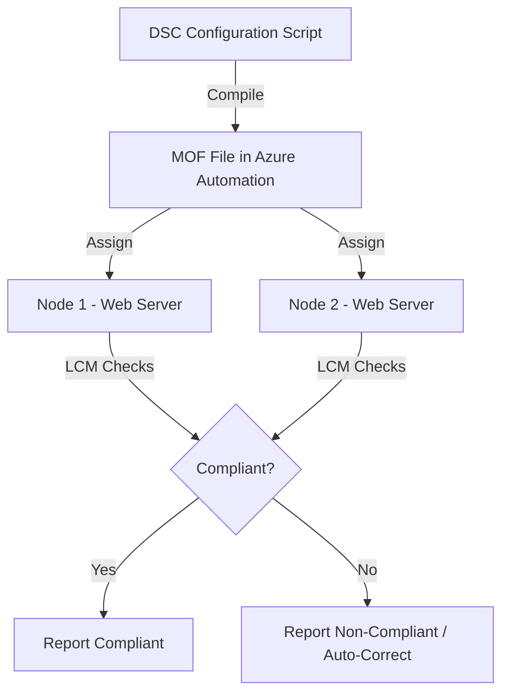

# How to Configure Azure Automation Desired State Configuration for Server Compliance

Author: [nawazdhandala](https://www.github.com/nawazdhandala)

Tags: Azure, Azure Automation, DSC, Desired State Configuration, Compliance, Configuration Management, PowerShell

Description: Learn how to use Azure Automation State Configuration (DSC) to define, apply, and enforce server configurations for compliance across your fleet.

---

Configuration drift is one of those problems that quietly erodes your infrastructure's reliability. A server that was configured perfectly six months ago might have accumulated manual changes, missed settings, or undone configurations since then. Azure Automation State Configuration, built on PowerShell Desired State Configuration (DSC), gives you a way to define what your servers should look like and then continuously enforce that definition. Servers that drift out of compliance get flagged - or automatically corrected.

In this post, I will walk through how DSC works in Azure Automation, how to write configurations, compile them, assign them to nodes, and monitor compliance.

## How DSC Works

The concept is straightforward:

1. You write a DSC configuration that describes the desired state of a server (which features should be installed, which files should exist, which services should be running, etc.)
2. You compile the configuration into a MOF file (Managed Object Format)
3. You assign the compiled configuration to one or more nodes (servers)
4. The Local Configuration Manager (LCM) on each node periodically checks whether the actual state matches the desired state
5. If there is a drift, the LCM either reports it (ApplyAndMonitor mode) or automatically corrects it (ApplyAndAutoCorrect mode)



## Step 1: Write a DSC Configuration

DSC configurations are PowerShell scripts that use a special syntax. Here is a practical example that configures a web server:

```powershell
# DSC Configuration: WebServerConfig
# Purpose: Ensure IIS is installed, the default website is configured,
# and required Windows features are present

Configuration WebServerConfig {
    # Import the DSC resources we need
    Import-DscResource -ModuleName PSDesiredStateConfiguration

    # This block applies to all nodes assigned this configuration
    Node "localhost" {

        # Ensure IIS is installed
        WindowsFeature IIS {
            Ensure = "Present"
            Name   = "Web-Server"
        }

        # Ensure IIS Management Console is installed
        WindowsFeature IISManagement {
            Ensure    = "Present"
            Name      = "Web-Mgmt-Console"
            DependsOn = "[WindowsFeature]IIS"
        }

        # Ensure ASP.NET 4.8 is installed
        WindowsFeature ASPNet48 {
            Ensure    = "Present"
            Name      = "Web-Asp-Net45"
            DependsOn = "[WindowsFeature]IIS"
        }

        # Ensure the default website directory exists
        File WebsiteDirectory {
            Ensure          = "Present"
            Type            = "Directory"
            DestinationPath = "C:\inetpub\myapp"
        }

        # Ensure the Windows Firewall service is running
        Service FirewallService {
            Name      = "MpsSvc"
            State     = "Running"
            StartType = "Automatic"
        }

        # Ensure Telnet Client is NOT installed (security hardening)
        WindowsFeature TelnetClient {
            Ensure = "Absent"
            Name   = "Telnet-Client"
        }

        # Ensure Remote Desktop is enabled
        Registry EnableRDP {
            Ensure    = "Present"
            Key       = "HKEY_LOCAL_MACHINE\SYSTEM\CurrentControlSet\Control\Terminal Server"
            ValueName = "fDenyTSConnections"
            ValueType = "Dword"
            ValueData = "0"
        }
    }
}
```

## Step 2: Upload and Compile the Configuration

Upload the configuration to Azure Automation and compile it:

### Through the Portal

1. Go to your Automation account
2. Click "State configuration (DSC)" under Configuration Management
3. Click the "Configurations" tab
4. Click "+ Add" and upload your .ps1 configuration file
5. Click on the uploaded configuration
6. Click "Compile" and wait for it to complete

### Through PowerShell

```powershell
# Import the configuration into Azure Automation
# This uploads the .ps1 file to the Automation account
Import-AzAutomationDscConfiguration `
    -ResourceGroupName "rg-automation" `
    -AutomationAccountName "aa-operations" `
    -SourcePath "./WebServerConfig.ps1" `
    -Published `
    -Force

# Compile the configuration into a MOF file
# This generates the node configuration that gets assigned to servers
Start-AzAutomationDscCompilationJob `
    -ResourceGroupName "rg-automation" `
    -AutomationAccountName "aa-operations" `
    -ConfigurationName "WebServerConfig"

# Check compilation status
Get-AzAutomationDscCompilationJob `
    -ResourceGroupName "rg-automation" `
    -AutomationAccountName "aa-operations" `
    -ConfigurationName "WebServerConfig"
```

After compilation, you will have a node configuration named `WebServerConfig.localhost` available for assignment.

## Step 3: Onboard Nodes

Nodes need the DSC extension installed and configured to pull their configuration from Azure Automation.

### Onboarding Azure VMs

```powershell
# Register an Azure VM as a DSC node
# This installs the DSC extension and configures the LCM
Register-AzAutomationDscNode `
    -ResourceGroupName "rg-automation" `
    -AutomationAccountName "aa-operations" `
    -AzureVMName "web-server-01" `
    -AzureVMResourceGroup "rg-webservers" `
    -AzureVMLocation "eastus" `
    -NodeConfigurationName "WebServerConfig.localhost" `
    -ConfigurationMode "ApplyAndAutoCorrect" `
    -RebootNodeIfNeeded $true `
    -RefreshFrequencyMins 30 `
    -ConfigurationModeFrequencyMins 30
```

The key parameters here are:

- **ConfigurationMode**: Controls what happens when drift is detected
  - `ApplyAndMonitor` - applies the configuration once and then only reports drift
  - `ApplyAndAutoCorrect` - continuously enforces the configuration, reverting any changes
  - `ApplyOnly` - applies once and does not check again until the next refresh
- **RebootNodeIfNeeded**: Whether the LCM can reboot the server if a configuration resource requires it
- **RefreshFrequencyMins**: How often the node checks for new configurations
- **ConfigurationModeFrequencyMins**: How often the node checks for compliance

### Onboarding On-Premises Servers

For on-premises servers, generate a registration key and URL, then install the DSC extension manually:

```powershell
# Get the DSC registration info for your Automation account
$registrationInfo = Get-AzAutomationRegistrationInfo `
    -ResourceGroupName "rg-automation" `
    -AutomationAccountName "aa-operations"

Write-Output "Registration URL: $($registrationInfo.Endpoint)"
Write-Output "Registration Key: $($registrationInfo.PrimaryKey)"
```

On the on-premises server, configure the LCM to point to Azure Automation:

```powershell
# Run this ON the on-premises server
# This configures the Local Configuration Manager to pull from Azure Automation

[DSCLocalConfigurationManager()]
Configuration LCMConfig {
    Node "localhost" {
        Settings {
            RefreshMode                    = "Pull"
            ConfigurationMode              = "ApplyAndAutoCorrect"
            RefreshFrequencyMins           = 30
            ConfigurationModeFrequencyMins = 30
            RebootNodeIfNeeded             = $true
        }

        ConfigurationRepositoryWeb AzureAutomation {
            ServerURL          = "https://eus2-agentservice-prod-1.azure-automation.net/accounts/<account-id>"
            RegistrationKey    = "<your-registration-key>"
            ConfigurationNames = @("WebServerConfig")
        }

        ReportServerWeb AzureAutomation {
            ServerURL       = "https://eus2-agentservice-prod-1.azure-automation.net/accounts/<account-id>"
            RegistrationKey = "<your-registration-key>"
        }
    }
}

# Generate the LCM meta-configuration
LCMConfig -OutputPath "C:\DSC"

# Apply the LCM configuration
Set-DscLocalConfigurationManager -Path "C:\DSC" -Force
```

## Step 4: Monitor Compliance

Once nodes are onboarded, the compliance dashboard becomes your primary monitoring tool.

### In the Portal

Go to your Automation account, click "State configuration (DSC)," and check the "Nodes" tab. Each node shows:

- **Status**: Compliant, Not Compliant, Failed, Pending, or Unresponsive
- **Last status time**: When the node last reported
- **Assigned configuration**: Which node configuration is assigned

### Through PowerShell

```powershell
# Get compliance status for all nodes
$nodes = Get-AzAutomationDscNode `
    -ResourceGroupName "rg-automation" `
    -AutomationAccountName "aa-operations"

foreach ($node in $nodes) {
    # Get the latest compliance report for each node
    $report = Get-AzAutomationDscNodeReport `
        -ResourceGroupName "rg-automation" `
        -AutomationAccountName "aa-operations" `
        -NodeId $node.Id `
        -Latest

    Write-Output "Node: $($node.Name)"
    Write-Output "  Status: $($node.Status)"
    Write-Output "  Configuration: $($node.NodeConfigurationName)"
    Write-Output "  Last Report: $($report.StartTime)"
    Write-Output "  Report Status: $($report.Status)"
    Write-Output "---"
}
```

## Using Configuration Data for Multiple Environments

In real scenarios, you want the same configuration structure but different values for dev, staging, and production. DSC Configuration Data handles this:

```powershell
# Configuration data separates environment-specific values from the configuration logic
$configData = @{
    AllNodes = @(
        @{
            NodeName         = "web-prod-01"
            Environment      = "Production"
            WebsitePath      = "C:\inetpub\prodapp"
            EnableDebugging  = $false
        },
        @{
            NodeName         = "web-dev-01"
            Environment      = "Development"
            WebsitePath      = "C:\inetpub\devapp"
            EnableDebugging  = $true
        }
    )
}

Configuration WebServerConfig {
    Import-DscResource -ModuleName PSDesiredStateConfiguration

    Node $AllNodes.NodeName {
        File WebsiteDirectory {
            Ensure          = "Present"
            Type            = "Directory"
            DestinationPath = $Node.WebsitePath
        }

        # Conditionally enable debugging based on environment
        if ($Node.EnableDebugging) {
            WindowsFeature WebDebugging {
                Ensure = "Present"
                Name   = "Web-ASP"
            }
        }
    }
}
```

Upload the configuration data when you compile:

```powershell
Start-AzAutomationDscCompilationJob `
    -ResourceGroupName "rg-automation" `
    -AutomationAccountName "aa-operations" `
    -ConfigurationName "WebServerConfig" `
    -ConfigurationData $configData
```

This produces separate node configurations for each node name in the configuration data.

## Common Compliance Issues and Fixes

**Node shows "Unresponsive"**: The server has not checked in within the expected interval. Check that the server is running, the LCM service is started, and network connectivity to Azure is working.

**Node shows "Failed"**: A resource in the configuration could not be applied. Check the DSC event log on the server (Applications and Services Logs > Microsoft > Windows > Desired State Configuration) for detailed error messages.

**Constant reboots**: If a resource keeps requiring reboots and `RebootNodeIfNeeded` is true, the server can get stuck in a reboot loop. Investigate which resource is causing the reboot requirement and fix the underlying issue.

## Wrapping Up

Azure Automation State Configuration gives you a declarative way to define and enforce server configurations across your fleet. The combination of continuous compliance checking and automatic correction means configuration drift gets caught and fixed without human intervention. Start with a simple configuration for one server role, verify it works in your dev environment, and then roll it out to production. Over time, build up a library of configurations that cover all your server roles and compliance requirements.
