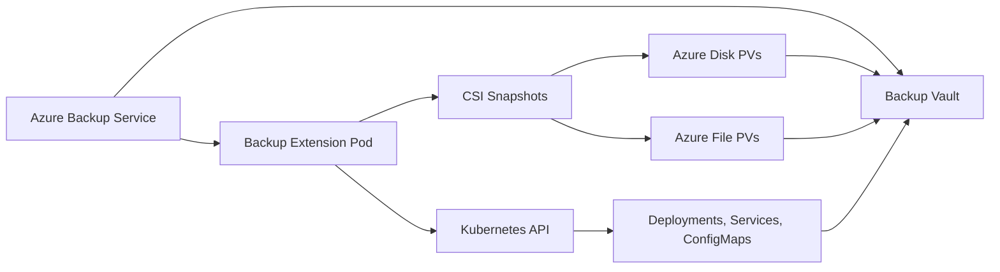

# How to Configure Azure Backup for Azure Kubernetes Service Persistent Volumes

Author: [nawazdhandala](https://www.github.com/nawazdhandala)

Tags: Azure Backup, AKS, Kubernetes, Persistent Volumes, Data Protection, Backup, Disaster Recovery

Description: A step-by-step guide to configuring Azure Backup for AKS persistent volumes to protect stateful workloads running in Azure Kubernetes Service.

---

Stateful workloads in Kubernetes - databases, message queues, file storage - store data on persistent volumes. If that data is lost due to accidental deletion, a misconfigured deployment, or a cluster failure, you need a backup to recover from. Azure Backup for AKS lets you back up persistent volumes (and optionally Kubernetes resources like deployments and services) and restore them when needed. This guide walks through the setup from installing the backup extension through running your first backup and restore.

## How AKS Backup Works

Azure Backup for AKS uses a backup extension that runs as a pod in your AKS cluster. This extension communicates with the Azure Backup service to coordinate backups. Here is the architecture:



The backup captures both the persistent volume data (through CSI snapshots) and the Kubernetes resource definitions. This means you can restore both the data and the Kubernetes objects that use that data.

## Prerequisites

- An AKS cluster (version 1.22 or later)
- A Backup vault (not a Recovery Services vault - AKS uses the newer Backup vault type)
- The AKS cluster must use CSI drivers for disk and/or file storage
- Azure CLI with the `aks-preview` and `dataprotection` extensions
- Contributor permissions on the AKS cluster and the Backup vault

## Step 1: Install Required CLI Extensions

```bash
# Install the required Azure CLI extensions
az extension add --name aks-preview --upgrade
az extension add --name dataprotection --upgrade
```

## Step 2: Register the Required Feature Flags

AKS backup requires specific feature flags to be enabled:

```bash
# Register the AKS backup feature flag
az feature register \
    --namespace Microsoft.ContainerService \
    --name TrustedAccessPreview

# Wait for registration to complete
az feature show \
    --namespace Microsoft.ContainerService \
    --name TrustedAccessPreview \
    --query "properties.state" -o tsv

# Propagate the registration
az provider register --namespace Microsoft.ContainerService
```

## Step 3: Create a Backup Vault

AKS uses the newer Backup vault type (not the legacy Recovery Services vault):

```bash
# Variables
RESOURCE_GROUP="rg-aks-production"
VAULT_NAME="bkv-aks-backups"
AKS_CLUSTER="aks-production"
LOCATION="eastus"

# Create the Backup vault
az dataprotection backup-vault create \
    --vault-name $VAULT_NAME \
    --resource-group $RESOURCE_GROUP \
    --location $LOCATION \
    --type SystemAssigned \
    --storage-setting "[{type:LocallyRedundant,datastore-type:VaultStore}]"
```

## Step 4: Install the Backup Extension on AKS

The backup extension runs as a pod inside your cluster:

```bash
# Create a storage account for backup metadata
STORAGE_ACCOUNT="aksbackupmeta$(openssl rand -hex 4)"
BLOB_CONTAINER="aks-backup"

az storage account create \
    --name $STORAGE_ACCOUNT \
    --resource-group $RESOURCE_GROUP \
    --location $LOCATION \
    --sku Standard_LRS

az storage container create \
    --name $BLOB_CONTAINER \
    --account-name $STORAGE_ACCOUNT

# Install the backup extension on the AKS cluster
az aks extension create \
    --name azure-aks-backup \
    --cluster-name $AKS_CLUSTER \
    --resource-group $RESOURCE_GROUP \
    --extension-type microsoft.dataprotection.kubernetes \
    --scope cluster \
    --configuration-settings \
        blobContainer=$BLOB_CONTAINER \
        storageAccount=$STORAGE_ACCOUNT \
        storageAccountResourceGroup=$RESOURCE_GROUP \
        storageAccountSubscriptionId=$(az account show --query id -o tsv)
```

Verify the extension is installed and running:

```bash
# Check the extension status
az aks extension show \
    --name azure-aks-backup \
    --cluster-name $AKS_CLUSTER \
    --resource-group $RESOURCE_GROUP \
    --query "provisioningState" -o tsv

# Verify the backup pod is running in the cluster
kubectl get pods -n dataprotection-microsoft
```

## Step 5: Configure RBAC Permissions

The Backup vault needs permissions to access the AKS cluster and the storage account:

```bash
# Get the Backup vault's managed identity
VAULT_IDENTITY=$(az dataprotection backup-vault show \
    --vault-name $VAULT_NAME \
    --resource-group $RESOURCE_GROUP \
    --query "identity.principalId" -o tsv)

# Get the AKS cluster resource ID
AKS_ID=$(az aks show \
    --name $AKS_CLUSTER \
    --resource-group $RESOURCE_GROUP \
    --query id -o tsv)

# Assign Reader role on the AKS cluster
az role assignment create \
    --role Reader \
    --assignee-object-id $VAULT_IDENTITY \
    --assignee-principal-type ServicePrincipal \
    --scope $AKS_ID

# Get the storage account resource ID
STORAGE_ID=$(az storage account show \
    --name $STORAGE_ACCOUNT \
    --resource-group $RESOURCE_GROUP \
    --query id -o tsv)

# Assign Storage Blob Data Contributor on the storage account
az role assignment create \
    --role "Storage Blob Data Contributor" \
    --assignee-object-id $VAULT_IDENTITY \
    --assignee-principal-type ServicePrincipal \
    --scope $STORAGE_ID

# Get the AKS node resource group for snapshot permissions
NODE_RG=$(az aks show \
    --name $AKS_CLUSTER \
    --resource-group $RESOURCE_GROUP \
    --query "nodeResourceGroup" -o tsv)

NODE_RG_ID=$(az group show --name $NODE_RG --query id -o tsv)

# Assign Disk Snapshot Contributor on the node resource group
az role assignment create \
    --role "Disk Snapshot Contributor" \
    --assignee-object-id $VAULT_IDENTITY \
    --assignee-principal-type ServicePrincipal \
    --scope $NODE_RG_ID
```

## Step 6: Create a Backup Policy

The backup policy defines how often backups run and how long they are retained:

```bash
# Create a backup policy for AKS
# This policy takes daily backups and retains them for 30 days
az dataprotection backup-policy create \
    --vault-name $VAULT_NAME \
    --resource-group $RESOURCE_GROUP \
    --name "aks-daily-30d" \
    --policy '{
        "policyRules": [
            {
                "name": "Default",
                "objectType": "AzureRetentionRule",
                "isDefault": true,
                "lifecycles": [
                    {
                        "deleteAfter": {
                            "objectType": "AbsoluteDeleteOption",
                            "duration": "P30D"
                        },
                        "sourceDataStore": {
                            "dataStoreType": "OperationalStore",
                            "objectType": "DataStoreInfoBase"
                        }
                    }
                ]
            },
            {
                "name": "BackupDaily",
                "objectType": "AzureBackupRule",
                "backupParameters": {
                    "objectType": "AzureBackupParams",
                    "backupType": "Incremental"
                },
                "dataStore": {
                    "dataStoreType": "OperationalStore",
                    "objectType": "DataStoreInfoBase"
                },
                "trigger": {
                    "objectType": "ScheduleBasedTriggerContext",
                    "schedule": {
                        "repeatingTimeIntervals": ["R/2026-02-16T04:00:00+00:00/P1D"]
                    },
                    "taggingCriteria": [
                        {
                            "isDefault": true,
                            "tagInfo": {
                                "tagName": "Default"
                            },
                            "taggingPriority": 99
                        }
                    ]
                }
            }
        ],
        "datasourceTypes": ["Microsoft.ContainerService/managedClusters"]
    }'
```

## Step 7: Configure Backup for the AKS Cluster

Now tie it all together by creating a backup instance:

```bash
# Configure backup for the AKS cluster
az dataprotection backup-instance create \
    --vault-name $VAULT_NAME \
    --resource-group $RESOURCE_GROUP \
    --backup-instance '{
        "objectType": "BackupInstanceResource",
        "properties": {
            "dataSourceInfo": {
                "resourceID": "'$AKS_ID'",
                "resourceUri": "'$AKS_ID'",
                "datasourceType": "Microsoft.ContainerService/managedClusters",
                "resourceName": "'$AKS_CLUSTER'",
                "resourceType": "Microsoft.ContainerService/managedClusters",
                "resourceLocation": "'$LOCATION'",
                "objectType": "Datasource"
            },
            "policyInfo": {
                "policyId": "/subscriptions/'$(az account show --query id -o tsv)'/resourceGroups/'$RESOURCE_GROUP'/providers/Microsoft.DataProtection/backupVaults/'$VAULT_NAME'/backupPolicies/aks-daily-30d"
            },
            "objectType": "BackupInstance"
        }
    }'
```

## Step 8: Trigger an On-Demand Backup

While scheduled backups will run automatically, trigger an initial backup to verify everything works:

```bash
# Trigger an on-demand backup
az dataprotection backup-instance adhoc-backup \
    --vault-name $VAULT_NAME \
    --resource-group $RESOURCE_GROUP \
    --backup-instance-name $AKS_CLUSTER \
    --rule-name "BackupDaily"
```

Monitor the backup job:

```bash
# Check backup job status
az dataprotection job list \
    --vault-name $VAULT_NAME \
    --resource-group $RESOURCE_GROUP \
    --query "[?properties.dataSourceName=='$AKS_CLUSTER'].{Status:properties.status, StartTime:properties.startTime}" \
    -o table
```

## Step 9: Restore from Backup

When you need to restore, you have two options: restore to the original cluster or restore to a different cluster.

### Restore to Original Cluster

```bash
# List available recovery points
az dataprotection recovery-point list \
    --vault-name $VAULT_NAME \
    --resource-group $RESOURCE_GROUP \
    --backup-instance-name $AKS_CLUSTER \
    --query "[].{Id:name, Time:properties.friendlyName}" -o table

# Trigger a restore using a specific recovery point
RECOVERY_POINT_ID="<recovery-point-id>"

az dataprotection backup-instance restore trigger \
    --vault-name $VAULT_NAME \
    --resource-group $RESOURCE_GROUP \
    --backup-instance-name $AKS_CLUSTER \
    --restore-request '{
        "objectType": "AzureKubernetesServiceRestoreRequest",
        "recoveryPointId": "'$RECOVERY_POINT_ID'",
        "restoreTargetInfo": {
            "restoreLocation": "'$LOCATION'",
            "objectType": "RestoreTargetInfo",
            "targetDetails": {
                "targetResourceArmId": "'$AKS_ID'",
                "fileShareOption": "CreateNewFileShares"
            }
        }
    }'
```

## What Gets Backed Up

Understanding what the backup captures is important for setting expectations:

- **Persistent Volume Claims and Persistent Volumes**: The actual data stored on Azure Disks and Azure Files
- **Kubernetes resources**: Deployments, StatefulSets, Services, ConfigMaps, Secrets, and other resource definitions
- **Namespaces**: You can scope backups to specific namespaces

What is NOT backed up:
- Cluster-level resources (nodes, RBAC bindings) - these are part of the cluster configuration
- In-memory state of running pods
- Data in emptyDir volumes (ephemeral by design)

## Summary

Azure Backup for AKS protects your stateful Kubernetes workloads by backing up persistent volumes and Kubernetes resource definitions. The setup involves installing the backup extension on your cluster, creating a Backup vault, configuring RBAC permissions, and defining a backup policy. Once configured, backups run automatically on schedule. Restores can target the original cluster or a different cluster, which is useful for both disaster recovery and testing. If you run databases, message queues, or any stateful workloads in AKS, configuring backup is essential to protect against data loss.
