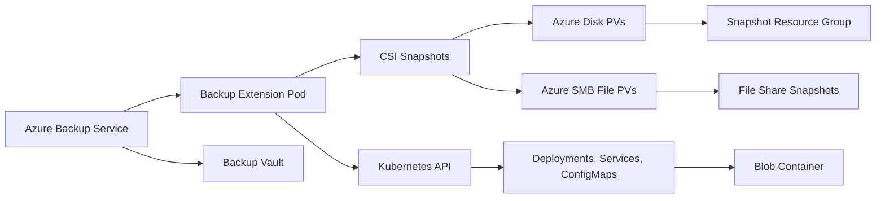

# How to Configure Azure Backup for Azure Kubernetes Service Persistent Volumes

Author: [nawazdhandala](https://www.github.com/nawazdhandala)

Tags: Azure Backup, AKS, Kubernetes, Persistent Volume, Data Protection, Backup, Disaster Recovery

Description: A step-by-step guide to configuring Azure Backup for AKS persistent volumes to protect stateful workloads running in Azure Kubernetes Service.

---

Stateful workloads in Kubernetes - databases, message queues, file storage - store data on persistent volumes. If that data is lost due to accidental deletion, a misconfigured deployment, or a cluster failure, you need a backup to recover from. Azure Backup for AKS lets you back up persistent volumes (and optionally Kubernetes resources like deployments and services) and restore them when needed. This guide walks through the CLI setup from installing the backup extension through running your first backup and restore for Azure Disk persistent volumes. Azure SMB Files persistent volumes are supported by AKS backup, but currently must be selected in the Azure portal backup configuration.

## How AKS Backup Works

Azure Backup for AKS uses a backup extension that runs as a pod in your AKS cluster. This extension communicates with the Azure Backup service to coordinate backups. Here is the architecture:


```mermaid
graph LR
    A[Azure Backup Service] --> B[Backup Extension Pod]
    B --> C[CSI Snapshots]
    C --> D[Azure Disk PVs]
    C --> E[Azure SMB File PVs]
    B --> F[Kubernetes API]
    F --> G[Deployments, Services, ConfigMaps]
    D --> H[Snapshot Resource Group]
    E --> I[File Share Snapshots]
    G --> J[Blob Container]
    A --> K[Backup Vault]
```

The backup captures both the persistent volume data (through CSI snapshots) and the Kubernetes resource definitions. This means you can restore both the data and the Kubernetes objects that use that data.

## Prerequisites

- An AKS cluster (version 1.21.1 or later)
- A Backup vault (not a Recovery Services vault - AKS uses the newer Backup vault type)
- The AKS cluster must use CSI drivers for disk and/or Azure SMB file storage. Azure Files backup requires Azure Files CSI driver version 1.32 or later and is currently configured through the Azure portal
- Azure CLI with the `dataprotection` and `k8s-extension` extensions
- Owner permissions on the AKS cluster, storage account, and snapshot resource group, and Backup Contributor permissions on the Backup vault resource group

## Step 1: Install Required CLI Extensions

```bash
# Install the required Azure CLI extensions

az extension add --name dataprotection --upgrade
az extension add --name k8s-extension --upgrade
```

## Step 2: Register the Required Resource Providers

AKS backup requires these Azure resource providers to be registered:

```bash
# Register the required resource providers
az provider register --namespace Microsoft.KubernetesConfiguration
az provider register --namespace Microsoft.DataProtection
az provider register --namespace Microsoft.ContainerService
```

## Step 3: Create a Backup Vault

AKS uses the newer Backup vault type (not the legacy Recovery Services vault):

```bash
# Variables
RESOURCE_GROUP="rg-aks-production"
VAULT_NAME="bkv-aks-backups"
AKS_CLUSTER="aks-production"
LOCATION="eastus"
SUBSCRIPTION_ID=$(az account show --query id -o tsv)
SNAPSHOT_RESOURCE_GROUP="rg-aks-backup-snapshots"

# Create the Backup vault
az dataprotection backup-vault create \
    --vault-name $VAULT_NAME \
    --resource-group $RESOURCE_GROUP \
    --location $LOCATION \
    --type SystemAssigned \
    --storage-setting datastore-type="VaultStore" type="LocallyRedundant"

# Create a resource group for Azure Disk snapshots
az group create \
    --name $SNAPSHOT_RESOURCE_GROUP \
    --location $LOCATION
```

## Step 4: Install the Backup Extension on AKS

The backup extension runs as a pod inside your cluster:

```bash
# Create a storage account for backup metadata
STORAGE_ACCOUNT="aksbackupmeta$(openssl rand -hex 4)"
BLOB_CONTAINER="aks-backup"

az storage account create \
    --name $STORAGE_ACCOUNT \
    --resource-group $RESOURCE_GROUP \
    --location $LOCATION \
    --sku Standard_LRS

az storage container create \
    --name $BLOB_CONTAINER \
    --account-name $STORAGE_ACCOUNT \
    --auth-mode login

# Install the backup extension on the AKS cluster
az k8s-extension create \
    --name azure-aks-backup \
    --extension-type microsoft.dataprotection.kubernetes \
    --scope cluster \
    --cluster-type managedClusters \
    --cluster-name $AKS_CLUSTER \
    --resource-group $RESOURCE_GROUP \
    --release-train stable \
    --configuration-settings \
        blobContainer=$BLOB_CONTAINER \
        storageAccount=$STORAGE_ACCOUNT \
        storageAccountResourceGroup=$RESOURCE_GROUP \
        storageAccountSubscriptionId=$SUBSCRIPTION_ID
```

Verify the extension is installed and running:

```bash
# Check the extension status
az k8s-extension show \
    --name azure-aks-backup \
    --cluster-name $AKS_CLUSTER \
    --resource-group $RESOURCE_GROUP \
    --cluster-type managedClusters \
    --query "provisioningState" -o tsv

# Verify the backup pod is running in the cluster
kubectl get pods -n dataprotection-microsoft
```

## Step 5: Configure RBAC Permissions

The Backup vault needs Trusted Access to the AKS cluster, and the Backup extension identity needs access to the storage account:

```bash
# Get the AKS cluster resource ID
AKS_ID=$(az aks show \
    --name $AKS_CLUSTER \
    --resource-group $RESOURCE_GROUP \
    --query id -o tsv)

# Enable Trusted Access between the Backup vault and AKS cluster
az aks trustedaccess rolebinding create \
    --cluster-name $AKS_CLUSTER \
    --resource-group $RESOURCE_GROUP \
    --name backuprolebinding \
    --roles Microsoft.DataProtection/backupVaults/backup-operator \
    --source-resource-id /subscriptions/$SUBSCRIPTION_ID/resourceGroups/$RESOURCE_GROUP/providers/Microsoft.DataProtection/BackupVaults/$VAULT_NAME

# Get the storage account resource ID
STORAGE_ID=$(az storage account show \
    --name $STORAGE_ACCOUNT \
    --resource-group $RESOURCE_GROUP \
    --query id -o tsv)

# Get the Backup extension identity
EXTENSION_IDENTITY=$(az k8s-extension show \
    --name azure-aks-backup \
    --cluster-name $AKS_CLUSTER \
    --resource-group $RESOURCE_GROUP \
    --cluster-type managedClusters \
    --query aksAssignedIdentity.principalId \
    -o tsv)

# Assign Storage Blob Data Contributor on the storage account
az role assignment create \
    --role "Storage Blob Data Contributor" \
    --assignee-object-id $EXTENSION_IDENTITY \
    --assignee-principal-type ServicePrincipal \
    --scope $STORAGE_ID
```

## Step 6: Create a Backup Policy

The backup policy defines how often backups run and how long they are retained:

```bash
# Create a backup policy for AKS
# This policy takes daily backups and retains them for 30 days
az dataprotection backup-policy get-default-policy-template \
    --datasource-type AzureKubernetesService > akspolicy.json

az dataprotection backup-policy retention-rule create-lifecycle \
    --count 30 \
    --retention-duration-type Days \
    --source-datastore OperationalStore > retentionrule.json

az dataprotection backup-policy retention-rule set \
    --lifecycles retentionrule.json \
    --name Default \
    --policy akspolicy.json > akspolicy-updated.json

az dataprotection backup-policy create \
    --vault-name $VAULT_NAME \
    --resource-group $RESOURCE_GROUP \
    --name "aks-daily-30d" \
    --policy akspolicy-updated.json
```

## Step 7: Configure Backup for the AKS Cluster

Now tie it all together by creating a backup instance:

```bash
# Prepare the backup configuration
# The default CLI backup configuration protects Kubernetes resources and Azure Disk PVs.
# Select Azure SMB Fileshares in the Azure portal backup configuration when backing up Azure Files PVs.
az dataprotection backup-instance initialize-backupconfig \
    --datasource-type AzureKubernetesService > aksbackupconfig.json

# Prepare the backup instance request
POLICY_ID="/subscriptions/$SUBSCRIPTION_ID/resourceGroups/$RESOURCE_GROUP/providers/Microsoft.DataProtection/backupVaults/$VAULT_NAME/backupPolicies/aks-daily-30d"

az dataprotection backup-instance initialize \
    --datasource-id $AKS_ID \
    --datasource-location $LOCATION \
    --datasource-type AzureKubernetesService \
    --policy-id $POLICY_ID \
    --backup-configuration aksbackupconfig.json \
    --friendly-name $AKS_CLUSTER \
    --snapshot-resource-group-name $SNAPSHOT_RESOURCE_GROUP > backupinstance.json

# Validate and assign any missing Backup vault or AKS managed identity permissions
az dataprotection backup-instance validate-for-backup \
    --backup-instance backupinstance.json \
    --ids /subscriptions/$SUBSCRIPTION_ID/resourceGroups/$RESOURCE_GROUP/providers/Microsoft.DataProtection/backupVaults/$VAULT_NAME

az dataprotection backup-instance update-msi-permissions \
    --datasource-type AzureKubernetesService \
    --operation Backup \
    --permissions-scope ResourceGroup \
    --vault-name $VAULT_NAME \
    --resource-group $RESOURCE_GROUP \
    --backup-instance backupinstance.json

# Configure backup for the AKS cluster
az dataprotection backup-instance create \
    --vault-name $VAULT_NAME \
    --resource-group $RESOURCE_GROUP \
    --backup-instance backupinstance.json
```

## Step 8: Trigger an On-Demand Backup

While scheduled backups will run automatically, trigger an initial backup to verify everything works:

```bash
# Get the backup instance ID
BACKUP_INSTANCE_ID=$(az dataprotection backup-instance list-from-resourcegraph \
    --datasource-type AzureKubernetesService \
    --datasource-id $AKS_ID \
    --query "[0].name" -o tsv)

# Trigger an on-demand backup
az dataprotection backup-instance adhoc-backup \
    --ids /subscriptions/$SUBSCRIPTION_ID/resourceGroups/$RESOURCE_GROUP/providers/Microsoft.DataProtection/backupVaults/$VAULT_NAME/backupInstances/$BACKUP_INSTANCE_ID \
    --rule-name "BackupDaily"
```

Monitor the backup job:

```bash
# Check backup job status
az dataprotection job list-from-resourcegraph \
    --datasource-type AzureKubernetesService \
    --datasource-id $AKS_ID \
    --operation OnDemandBackup \
    -o table
```

## Step 9: Restore from Backup

When you need to restore, you have two options: restore to the original cluster or restore to a different cluster.

### Restore to Original Cluster

```bash
# List available recovery points
az dataprotection recovery-point list \
    --vault-name $VAULT_NAME \
    --resource-group $RESOURCE_GROUP \
    --backup-instance-name $BACKUP_INSTANCE_ID \
    --query "[].{Id:name, Time:properties.friendlyName}" -o table

# Trigger a restore using a specific recovery point from the OperationalStore
RECOVERY_POINT_ID="<recovery-point-id>"

az dataprotection backup-instance restore initialize-for-data-recovery \
    --datasource-type AzureKubernetesService \
    --restore-location $LOCATION \
    --source-datastore OperationalStore \
    --recovery-point-id $RECOVERY_POINT_ID \
    --target-resource-id $AKS_ID > restorerequestobject.json

az dataprotection backup-instance restore trigger \
    --vault-name $VAULT_NAME \
    --resource-group $RESOURCE_GROUP \
    --backup-instance-name $BACKUP_INSTANCE_ID \
    --restore-request-object restorerequestobject.json
```

## What Gets Backed Up

Understanding what the backup captures is important for setting expectations:

- **Persistent Volume Claims and Persistent Volumes**: The actual data stored on CSI-based Azure Disks. Azure SMB Files are also supported by AKS backup when selected in the Azure portal backup configuration
- **Kubernetes resources**: Deployments, StatefulSets, Services, ConfigMaps, Secrets, and other resource definitions
- **Namespaces**: You can scope backups to specific namespaces

What is NOT backed up:
- Nodes and in-tree volumes - these are part of the cluster configuration or unsupported storage plugins
- In-memory state of running pods
- Data in emptyDir volumes (ephemeral by design)

## Summary

Azure Backup for AKS protects your stateful Kubernetes workloads by backing up persistent volumes and Kubernetes resource definitions. The setup involves installing the backup extension on your cluster, creating a Backup vault, configuring RBAC permissions, and defining a backup policy. Once configured, backups run automatically on schedule. Restores can target the original cluster or a different cluster, which is useful for both disaster recovery and testing. If you run databases, message queues, or any stateful workloads in AKS, configuring backup is essential to protect against data loss.
