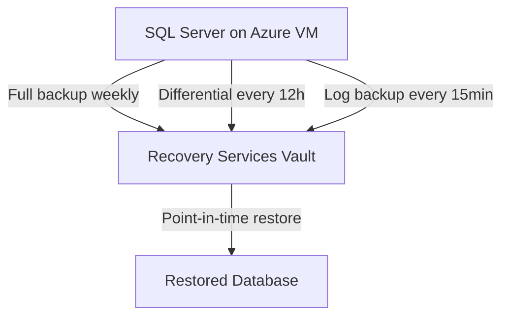

# How to Configure Azure Backup for SQL Server Databases Running on Azure VMs

Author: [nawazdhandala](https://www.github.com/nawazdhandala)

Tags: Azure Backup, SQL Server, Azure VMs, Database Backup, Recovery Services Vault, Transaction Log, RPO

Description: Step-by-step guide to configuring Azure Backup for SQL Server databases on Azure VMs with full, differential, and transaction log backup policies.

---

If you are running SQL Server on Azure VMs (IaaS), you are responsible for your own database backups. Azure does not automatically back up SQL Server databases just because the VM is backed up. VM-level backups capture the disk state, but they are not ideal for database recovery because they do not guarantee transaction-level consistency or allow point-in-time restores.

Azure Backup has a dedicated SQL Server backup feature that understands SQL Server natively. It takes full backups, differential backups, and transaction log backups, giving you point-in-time recovery with RPOs as low as 15 minutes. This guide covers how to set it up.

## Why Not Just Use VM Backups for SQL Server

VM-level backups take a snapshot of the entire disk. While they are application-consistent (thanks to VSS), they have limitations for databases:

- **No point-in-time recovery** - You can only restore to the exact time the snapshot was taken
- **Full VM restore required** - You cannot restore a single database; you have to restore the entire VM
- **Large restore times** - Restoring a 1 TB VM to recover a 50 GB database is wasteful
- **No transaction log management** - The transaction log keeps growing because nothing is truncating it

Azure Backup for SQL Server solves all of these. It takes SQL-native backups directly through SQL Server's backup APIs, giving you the same granularity you would get from traditional SQL Server backup strategies.

## How It Works

Azure Backup installs a workload backup extension on the Azure VM. This extension communicates with SQL Server to:

1. Take full backups on a schedule (default: weekly)
2. Take differential backups between full backups (default: every 12 hours)
3. Take transaction log backups at frequent intervals (default: every 15 minutes)
4. Stream backup data to the Recovery Services vault



This gives you a 15-minute RPO by default, and you can restore to any point in time within the retention period.

## Prerequisites

- SQL Server running on an Azure VM (SQL Server 2012 SP4 or later)
- The VM must be registered with a Recovery Services vault
- SQL Server must be installed with local system or NT Service accounts (not custom domain accounts on older versions)
- Network connectivity from the VM to Azure on port 443
- The VM must have the Azure VM Agent installed

## Step 1: Discover SQL Server Instances on the VM

Before you can back up databases, Azure Backup needs to discover what SQL Server instances are running.

1. Open the Recovery Services vault
2. Go to "Backup"
3. Select workload: "SQL Server in Azure VM"
4. Click "Start Discovery"
5. Select the subscription and resource group containing your SQL VMs
6. Click "Discover DBs"

Azure Backup installs the workload extension on the VM and scans for SQL Server instances and databases. This takes a few minutes.

After discovery, you can see all SQL Server instances and their databases in the portal.

## Step 2: Create a Backup Policy for SQL Server

The SQL Server backup policy is different from the VM backup policy. It has separate schedules for full, differential, and log backups.

### Using the Portal

1. In the vault, go to "Backup policies"
2. Click "Add"
3. Select "SQL Server in Azure VM"
4. Configure:

**Full backup schedule:**
- Frequency: Weekly (recommended) or Daily
- Day: Sunday (common choice for weekly)
- Time: 2:00 AM (during low-activity window)
- Retention: 30 days, 12 weeks, 12 months, 7 years

**Differential backup schedule:**
- Frequency: Every 12 hours (or 6, 8, 12, 24 hours)
- Retention: 30 days

**Transaction log backup schedule:**
- Frequency: Every 15 minutes (or 15, 30, 60, 120 minutes)
- Retention: 15 days

### Using Azure CLI

```bash
# Create a SQL Server backup policy with custom schedules
# Full weekly, differential every 12 hours, logs every 15 minutes

az backup policy create \
    --resource-group rg-backup-eastus2 \
    --vault-name rsv-backup-eastus2-001 \
    --name policy-sql-production \
    --backup-management-type AzureWorkload \
    --workload-type SQLDataBase \
    --policy '{
        "protectedItemsCount": 0,
        "settings": {
            "timeZone": "UTC",
            "issqlcompression": true
        },
        "subProtectionPolicy": [
            {
                "policyType": "Full",
                "schedulePolicy": {
                    "schedulePolicyType": "SimpleSchedulePolicy",
                    "scheduleRunFrequency": "Weekly",
                    "scheduleRunDays": ["Sunday"],
                    "scheduleRunTimes": ["2026-02-16T02:00:00Z"]
                },
                "retentionPolicy": {
                    "retentionPolicyType": "LongTermRetentionPolicy",
                    "weeklySchedule": {
                        "daysOfTheWeek": ["Sunday"],
                        "retentionTimes": ["2026-02-16T02:00:00Z"],
                        "retentionDuration": {
                            "count": 30,
                            "durationType": "Days"
                        }
                    }
                }
            },
            {
                "policyType": "Differential",
                "schedulePolicy": {
                    "schedulePolicyType": "SimpleSchedulePolicy",
                    "scheduleRunFrequency": "Weekly",
                    "scheduleRunDays": ["Monday","Tuesday","Wednesday","Thursday","Friday","Saturday"],
                    "scheduleRunTimes": ["2026-02-16T14:00:00Z"]
                },
                "retentionPolicy": {
                    "retentionPolicyType": "SimpleRetentionPolicy",
                    "retentionDuration": {
                        "count": 30,
                        "durationType": "Days"
                    }
                }
            },
            {
                "policyType": "Log",
                "schedulePolicy": {
                    "schedulePolicyType": "LogSchedulePolicy",
                    "scheduleFrequencyInMins": 15
                },
                "retentionPolicy": {
                    "retentionPolicyType": "SimpleRetentionPolicy",
                    "retentionDuration": {
                        "count": 15,
                        "durationType": "Days"
                    }
                }
            }
        ]
    }'
```

## Step 3: Configure Backup for Individual Databases

After policy creation, enable backup for each database:

1. In the vault, go to "Backup"
2. Select "SQL Server in Azure VM"
3. Click "Configure Backup"
4. Select the backup policy
5. Choose which databases to protect:
   - Select individual databases, or
   - Use "Autoprotect" on an instance to automatically protect all current and future databases

Autoprotect is especially useful because it catches new databases added after the initial setup. Without it, new databases are unprotected until someone manually adds them.

```powershell
# Enable autoprotection for a SQL Server instance
# This automatically protects all databases, including ones created in the future

# Register the SQL Server VM with the vault
Register-AzRecoveryServicesBackupContainer `
    -ResourceId "/subscriptions/<sub-id>/resourceGroups/rg-production/providers/Microsoft.Compute/virtualMachines/vm-sql-01" `
    -BackupManagementType AzureWorkload `
    -WorkloadType MSSQL `
    -VaultId $vault.ID `
    -Force

# Get the protectable SQL items (instances and databases)
$protectableItems = Get-AzRecoveryServicesBackupProtectableItem `
    -WorkloadType MSSQL `
    -VaultId $vault.ID

# Find the SQL instance
$sqlInstance = $protectableItems | Where-Object {
    $_.ProtectableItemType -eq "SQLInstance" -and
    $_.ServerName -eq "vm-sql-01"
}

# Enable auto-protection on the instance
Enable-AzRecoveryServicesBackupAutoProtection `
    -InputItem $sqlInstance `
    -BackupManagementType AzureWorkload `
    -WorkloadType MSSQL `
    -Policy $backupPolicy `
    -VaultId $vault.ID
```

## Step 4: Verify Backup Operations

After the first backup cycle completes, verify everything is working:

```bash
# List all protected SQL databases
az backup item list \
    --resource-group rg-backup-eastus2 \
    --vault-name rsv-backup-eastus2-001 \
    --backup-management-type AzureWorkload \
    --workload-type SQLDataBase \
    --output table

# Check recent backup jobs
az backup job list \
    --resource-group rg-backup-eastus2 \
    --vault-name rsv-backup-eastus2-001 \
    --backup-management-type AzureWorkload \
    --output table
```

Pay attention to:
- **Full backup status** - Should complete successfully on the scheduled day
- **Differential backup status** - Should run between full backups
- **Log backup status** - Should run every 15 minutes (or your configured interval)
- **Any warnings** - About log chain breaks or compression issues

## Step 5: Understand Point-in-Time Recovery

The combination of full, differential, and log backups gives you point-in-time recovery. When you restore, Azure Backup:

1. Finds the most recent full backup before your target time
2. Applies the most recent differential backup after that full
3. Replays transaction logs up to your exact target timestamp

This means you can restore a database to any second within the log retention period. If your log backups run every 15 minutes and you retain logs for 15 days, you can restore to any point within the last 15 days with at most 15 minutes of data loss.

## Step 6: Handle Special Database Configurations

### Always On Availability Groups

Azure Backup supports backing up databases in AG configurations. It preferentially backs up from the secondary replica to offload backup I/O from the primary. Configure the backup preference in the AG settings:

```sql
-- Set backup preference to prefer secondary replicas
-- This reduces I/O load on the primary during backup operations
ALTER AVAILABILITY GROUP [MyAG]
MODIFY REPLICA ON N'vm-sql-01' WITH (
    BACKUP_PRIORITY = 30  -- Lower priority for primary
);

ALTER AVAILABILITY GROUP [MyAG]
MODIFY REPLICA ON N'vm-sql-02' WITH (
    BACKUP_PRIORITY = 70  -- Higher priority for secondary
);
```

### TDE-Encrypted Databases

Databases with Transparent Data Encryption are fully supported. Azure Backup handles the encryption transparently. However, make sure you also back up the TDE certificate separately (to Azure Key Vault, for example) in case you need to restore to a different SQL Server instance.

### System Databases

Azure Backup protects the master, model, and msdb system databases. The tempdb database is excluded because it is recreated every time SQL Server starts.

## Monitoring and Alerting

Set up alerts for backup failures:

1. In the vault, go to "Alerts"
2. Enable notifications for:
   - SQL backup failures
   - Log chain break warnings
   - RPO threshold breaches

A log chain break means the sequence of transaction log backups was interrupted. This can happen if someone runs a manual full backup outside of Azure Backup, or if a database is taken offline. Azure Backup automatically takes a new full backup to restart the chain, but you should investigate the cause.

## Wrapping Up

Azure Backup for SQL Server on Azure VMs gives you enterprise-grade database protection with point-in-time recovery, automatic log management, and centralized monitoring. The 15-minute log backup frequency provides a tight RPO, and the autoprotect feature ensures new databases are never left unprotected. Set it up once, configure your policies, enable autoprotect, and let it run. Just make sure you periodically test restores to confirm your backups are actually recoverable.
