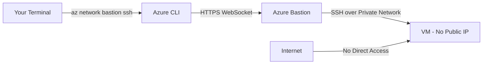

# How to Configure Azure Bastion for Native Client SSH Connections

Author: [nawazdhandala](https://www.github.com/nawazdhandala)

Tags: Azure, Bastion, SSH, Native Client, Security, Remote Access, Networking

Description: Learn how to configure Azure Bastion to support native SSH client connections from your local terminal without exposing VMs to the public internet.

---

Azure Bastion provides secure RDP and SSH access to your VMs without exposing them through public IP addresses. For a long time, Bastion only worked through the Azure Portal's browser-based interface. That was useful, but it did not give you the experience of a native SSH client - no file transfers, no SSH agent forwarding, no custom SSH config options.

Azure Bastion native client support changes that. With the Standard SKU, you can use your local SSH client (the `ssh` command on your terminal) to connect through Bastion. You get all the features of your native SSH client while Bastion handles the secure tunneling and eliminates the need for public IPs on your VMs.

## Why Native Client Matters

The browser-based SSH in the Portal works, but it has limitations:

- **No file transfer.** You cannot SCP or SFTP files through the browser session.
- **No agent forwarding.** SSH agent forwarding for accessing other servers from within the session does not work.
- **No custom SSH keys.** The browser prompts for username/password or lets you paste a key, but it does not integrate with your local SSH key management.
- **Terminal quality.** The browser terminal does not match the experience of iTerm, Windows Terminal, or your preferred terminal emulator.
- **No automation.** You cannot script browser-based SSH sessions.

Native client support solves all of these. You connect using the regular `ssh` command, and Bastion acts as a transparent tunnel.

## Prerequisites

1. **Azure Bastion Standard SKU** - Native client is not available on the Basic SKU
2. **Azure CLI** installed with the bastion extension
3. **A VM** in a VNet with Azure Bastion deployed
4. **No public IP needed** on the target VM
5. **SSH key pair** (recommended over password authentication)

## Step 1: Deploy Azure Bastion Standard SKU

If you do not have Bastion deployed yet, create it with the Standard SKU:

```bash
# Create the AzureBastionSubnet (required name and minimum /26)
az network vnet subnet create \
  --resource-group myResourceGroup \
  --vnet-name myVNet \
  --name AzureBastionSubnet \
  --address-prefixes 10.0.255.0/26

# Create a public IP for Bastion
az network public-ip create \
  --resource-group myResourceGroup \
  --name bastionPIP \
  --sku Standard \
  --allocation-method Static

# Create Bastion with Standard SKU and native client enabled
az network bastion create \
  --resource-group myResourceGroup \
  --name myBastion \
  --vnet-name myVNet \
  --public-ip-address bastionPIP \
  --sku Standard \
  --enable-tunneling true \
  --location eastus
```

The `--enable-tunneling true` flag is what enables native client connectivity. Without it, only browser-based access works.

If you already have a Bastion instance, upgrade to Standard and enable tunneling:

```bash
# Upgrade existing Bastion to Standard with native client support
az network bastion update \
  --resource-group myResourceGroup \
  --name myBastion \
  --sku Standard \
  --enable-tunneling true
```

## Step 2: Install the Azure CLI Bastion Extension

The native client feature works through the Azure CLI:

```bash
# Install or update the bastion extension
az extension add --name bastion --upgrade
```

Verify the extension is installed:

```bash
# Check installed extensions
az extension list --output table
```

## Step 3: Connect Using SSH Key Authentication

The recommended approach uses your existing SSH key pair:

```bash
# Connect to a Linux VM using SSH key through Bastion
az network bastion ssh \
  --resource-group myResourceGroup \
  --name myBastion \
  --target-resource-id "/subscriptions/<sub-id>/resourceGroups/myResourceGroup/providers/Microsoft.Compute/virtualMachines/myLinuxVM" \
  --auth-type ssh-key \
  --username azureuser \
  --ssh-key ~/.ssh/id_rsa
```

This opens a full native SSH session in your terminal. It looks and feels exactly like a regular SSH connection because it is - Bastion handles the tunneling underneath.

## Step 4: Connect Using Azure AD Authentication

If your VM supports Azure AD authentication (available for Linux VMs with the Azure AD login extension), you can connect without managing SSH keys:

```bash
# Connect using Azure AD authentication
az network bastion ssh \
  --resource-group myResourceGroup \
  --name myBastion \
  --target-resource-id "/subscriptions/<sub-id>/resourceGroups/myResourceGroup/providers/Microsoft.Compute/virtualMachines/myLinuxVM" \
  --auth-type AAD
```

This uses your Azure AD credentials. The VM must have the `AADSSHLoginForLinux` extension installed.

## Step 5: SSH Tunneling for Port Forwarding

Native client support enables SSH tunneling, which lets you forward local ports to services running on the VM:

```bash
# Create an SSH tunnel to forward local port 5432 to the VM's localhost:5432
az network bastion tunnel \
  --resource-group myResourceGroup \
  --name myBastion \
  --target-resource-id "/subscriptions/<sub-id>/resourceGroups/myResourceGroup/providers/Microsoft.Compute/virtualMachines/myLinuxVM" \
  --resource-port 5432 \
  --port 5432
```

This opens a tunnel. In another terminal, connect to the tunneled service:

```bash
# Connect to the database through the tunnel
psql -h 127.0.0.1 -p 5432 -U dbadmin -d myDatabase
```

This is incredibly useful for accessing databases, web applications, or any service running on VMs that do not have public IPs.

## Step 6: File Transfer with SCP

With native client support, you can use SCP to transfer files:

```bash
# First, open a tunnel on port 22
az network bastion tunnel \
  --resource-group myResourceGroup \
  --name myBastion \
  --target-resource-id "/subscriptions/<sub-id>/resourceGroups/myResourceGroup/providers/Microsoft.Compute/virtualMachines/myLinuxVM" \
  --resource-port 22 \
  --port 2222
```

In another terminal, use SCP through the tunnel:

```bash
# Upload a file to the VM
scp -P 2222 ./myfile.txt azureuser@127.0.0.1:/home/azureuser/

# Download a file from the VM
scp -P 2222 azureuser@127.0.0.1:/home/azureuser/report.csv ./
```

## Architecture

Here is how the connection flows:



The SSH traffic is wrapped in an HTTPS WebSocket connection to Bastion. From there, Bastion connects to the VM over the private VNet. At no point does the VM need a public IP or an open inbound port to the internet.

## Connecting to Multiple VMs

If you need sessions to multiple VMs, open multiple terminal windows and run separate `az network bastion ssh` commands. Each session is independent.

For frequently accessed VMs, create a shell alias or script:

```bash
#!/bin/bash
# save as ~/bin/bastion-ssh
# Usage: bastion-ssh <vm-name>

VM_NAME=$1
RESOURCE_GROUP="myResourceGroup"
BASTION_NAME="myBastion"
SUB_ID="your-subscription-id"

az network bastion ssh \
  --resource-group $RESOURCE_GROUP \
  --name $BASTION_NAME \
  --target-resource-id "/subscriptions/$SUB_ID/resourceGroups/$RESOURCE_GROUP/providers/Microsoft.Compute/virtualMachines/$VM_NAME" \
  --auth-type ssh-key \
  --username azureuser \
  --ssh-key ~/.ssh/id_rsa
```

Then connect with a simple command:

```bash
# Connect to any VM by name
bastion-ssh myLinuxVM
```

## Network Configuration Requirements

For native client to work:

1. **Bastion must be in Standard SKU** with tunneling enabled
2. **The target VM must be in the same VNet** or a peered VNet
3. **NSG on AzureBastionSubnet** must allow outbound to the VNet on ports 22 (SSH) and 3389 (RDP)
4. **NSG on the VM's subnet** must allow inbound from AzureBastionSubnet on port 22
5. **No public IP needed** on the target VM

```bash
# Verify NSG allows Bastion to reach VMs
az network nsg rule list \
  --resource-group myResourceGroup \
  --nsg-name vmSubnetNSG \
  --query "[?direction=='Inbound' && destinationPortRange=='22'].{name:name, source:sourceAddressPrefix, access:access}" \
  --output table
```

## Bastion Scaling for Multiple Users

If your team has many engineers connecting through Bastion simultaneously, you can scale the Bastion instance:

```bash
# Scale Bastion to handle more concurrent connections
az network bastion update \
  --resource-group myResourceGroup \
  --name myBastion \
  --scale-units 4
```

The default is 2 scale units (20 concurrent SSH connections). Each additional scale unit adds approximately 10 more concurrent connections.

## Pricing Considerations

Standard SKU Bastion is more expensive than Basic. As of early 2026, Standard costs roughly $0.35 per hour (compared to $0.19 for Basic). But native client support, tunneling, and scaling are only available on Standard. For teams that rely on SSH access to VMs daily, the productivity gain justifies the cost difference.

## Common Issues

**"Tunneling is not enabled" error.** The Bastion instance needs `--enable-tunneling true`. Update it if this was not set during creation.

**Connection times out.** Check NSG rules on both AzureBastionSubnet and the VM's subnet. Also verify the VM is running.

**"Extension not found" error.** Install the bastion CLI extension with `az extension add --name bastion`.

**Slow connection establishment.** The initial connection takes a few seconds because of the WebSocket tunnel setup. Subsequent sessions may be faster.

## Summary

Azure Bastion native client support brings the full power of your local SSH client to VMs that have no public IP addresses. Deploy Bastion with Standard SKU and tunneling enabled, then use `az network bastion ssh` for interactive sessions or `az network bastion tunnel` for port forwarding and file transfers. This eliminates the compromises of browser-based SSH while maintaining the security benefits of Bastion - no public IPs, no exposed ports, and all access audited through Azure.
