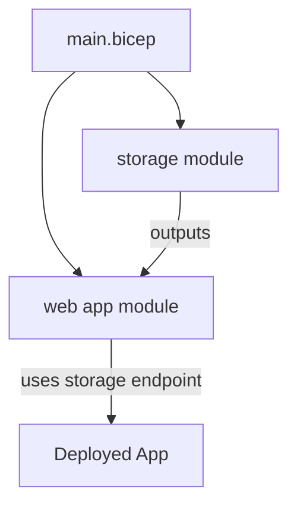

# How to Configure Azure Bicep Modules for Reusable Infrastructure Components

Author: [nawazdhandala](https://www.github.com/nawazdhandala)

Tags: Azure Bicep, Infrastructure as Code, Azure, Modules, DevOps, Cloud Infrastructure, ARM Templates

Description: Learn how to structure Azure Bicep modules to create reusable, maintainable infrastructure components for your Azure deployments.

---

Azure Bicep has become the go-to language for defining Azure infrastructure. It compiles down to ARM templates but reads and writes much more naturally. One of its best features is the module system, which lets you break complex deployments into smaller, reusable pieces that you can compose together.

If you have been writing Bicep files where everything lives in a single file, you are missing out on the real power of the language. In this post, I will show you how to design modules that are genuinely reusable, compose them into complete deployments, and share them across your organization.

## Why Modules?

Without modules, Bicep files for real-world deployments get long and unwieldy. A typical web application might need a resource group, an App Service plan, an App Service, a SQL database, a Key Vault, Application Insights, and a storage account. That is hundreds of lines of Bicep in a single file.

Modules solve several problems:

- **Encapsulation**: Each module hides the details of its resources and exposes only the parameters and outputs that consumers need
- **Reuse**: A well-designed storage account module can be used in every project
- **Testing**: Smaller modules are easier to validate and test in isolation
- **Separation of concerns**: The networking team can own the network modules, the database team can own the database modules, and application teams compose them

## Module Structure

A Bicep module is just a Bicep file that gets referenced from another file. There is no special syntax to declare something as a module. The convention is to organize them in a `modules` directory.

Here is a typical project structure.

```
infrastructure/
  main.bicep              # Entry point that composes modules
  parameters.dev.json     # Parameters for dev environment
  parameters.prod.json    # Parameters for prod environment
  modules/
    app-service.bicep     # App Service module
    sql-database.bicep    # SQL Database module
    key-vault.bicep       # Key Vault module
    storage.bicep         # Storage account module
    networking.bicep      # Virtual network module
```

## Creating Your First Module

Let us start with a storage account module. This is a good first module because storage accounts are used everywhere and have a fair number of configuration options that you want to standardize.

The following module creates a storage account with configurable SKU, access tier, and optional blob containers.

```bicep
// modules/storage.bicep
// Reusable module for creating Azure Storage accounts with optional containers

// Required parameters
@description('The name of the storage account. Must be globally unique.')
@minLength(3)
@maxLength(24)
param storageAccountName string

@description('The Azure region for the storage account.')
param location string = resourceGroup().location

// Optional parameters with sensible defaults
@description('The SKU for the storage account.')
@allowed([
  'Standard_LRS'
  'Standard_GRS'
  'Standard_ZRS'
  'Premium_LRS'
])
param skuName string = 'Standard_LRS'

@description('The access tier for blob storage.')
@allowed([
  'Hot'
  'Cool'
])
param accessTier string = 'Hot'

@description('List of blob container names to create.')
param containerNames array = []

@description('Tags to apply to the storage account.')
param tags object = {}

// Create the storage account
resource storageAccount 'Microsoft.Storage/storageAccounts@2023-01-01' = {
  name: storageAccountName
  location: location
  sku: {
    name: skuName
  }
  kind: 'StorageV2'
  tags: tags
  properties: {
    accessTier: accessTier
    supportsHttpsTrafficOnly: true
    minimumTlsVersion: 'TLS1_2'
    allowBlobPublicAccess: false
  }
}

// Create blob service (required for containers)
resource blobService 'Microsoft.Storage/storageAccounts/blobServices@2023-01-01' = {
  parent: storageAccount
  name: 'default'
}

// Create containers based on the input array
resource containers 'Microsoft.Storage/storageAccounts/blobServices/containers@2023-01-01' = [
  for name in containerNames: {
    parent: blobService
    name: name
    properties: {
      publicAccess: 'None'
    }
  }
]

// Outputs that consuming modules or main template might need
@description('The resource ID of the storage account.')
output storageAccountId string = storageAccount.id

@description('The name of the storage account.')
output storageAccountName string = storageAccount.name

@description('The primary blob endpoint.')
output primaryBlobEndpoint string = storageAccount.properties.primaryEndpoints.blob
```

## Consuming Modules

Now let us use this module from a main Bicep file.

```bicep
// main.bicep - Composes modules into a complete deployment

@description('The environment name (dev, staging, prod).')
@allowed(['dev', 'staging', 'prod'])
param environment string

@description('The Azure region for all resources.')
param location string = resourceGroup().location

// Generate a unique suffix for globally unique names
var uniqueSuffix = uniqueString(resourceGroup().id)
var baseName = 'myapp-${environment}'

// Deploy a storage account using the module
module appStorage 'modules/storage.bicep' = {
  name: 'deploy-app-storage'
  params: {
    storageAccountName: '${baseName}stor${uniqueSuffix}'
    location: location
    skuName: environment == 'prod' ? 'Standard_GRS' : 'Standard_LRS'
    accessTier: 'Hot'
    containerNames: [
      'uploads'
      'backups'
      'logs'
    ]
    tags: {
      environment: environment
      application: 'myapp'
    }
  }
}

// Reference outputs from the storage module
output storageEndpoint string = appStorage.outputs.primaryBlobEndpoint
```

Notice how the module call looks like a resource declaration but with `module` instead of `resource`. The `name` property is the deployment name (used for tracking in Azure), and `params` passes values to the module's parameters.

## Building a Complete Application Stack

Let me show a more realistic example that composes multiple modules together.

First, an App Service module.

```bicep
// modules/app-service.bicep
// Module for creating an App Service with its plan

param appName string
param location string = resourceGroup().location
param skuName string = 'B1'
param skuTier string = 'Basic'
param linuxFxVersion string = 'DOTNETCORE|8.0'
param appSettings object = {}
param tags object = {}

// Create the App Service Plan
resource appServicePlan 'Microsoft.Web/serverfarms@2023-01-01' = {
  name: '${appName}-plan'
  location: location
  tags: tags
  sku: {
    name: skuName
    tier: skuTier
  }
  kind: 'linux'
  properties: {
    reserved: true // Required for Linux
  }
}

// Build the app settings array from the object parameter
var appSettingsArray = [
  for item in items(appSettings): {
    name: item.key
    value: item.value
  }
]

// Create the App Service
resource appService 'Microsoft.Web/sites@2023-01-01' = {
  name: appName
  location: location
  tags: tags
  properties: {
    serverFarmId: appServicePlan.id
    siteConfig: {
      linuxFxVersion: linuxFxVersion
      appSettings: appSettingsArray
      alwaysOn: true
      httpLoggingEnabled: true
    }
    httpsOnly: true
  }
}

output appServiceUrl string = 'https://${appService.properties.defaultHostName}'
output appServiceId string = appService.id
output appServicePrincipalId string = appService.identity.principalId
```

Now compose everything in the main file.

```bicep
// main.bicep - Full application stack
param environment string
param location string = resourceGroup().location

var uniqueSuffix = uniqueString(resourceGroup().id)
var baseName = 'myapp-${environment}'

// Deploy storage
module storage 'modules/storage.bicep' = {
  name: 'deploy-storage'
  params: {
    storageAccountName: '${replace(baseName, '-', '')}${uniqueSuffix}'
    location: location
    containerNames: ['uploads', 'backups']
  }
}

// Deploy the web application
module webApp 'modules/app-service.bicep' = {
  name: 'deploy-webapp'
  params: {
    appName: '${baseName}-web'
    location: location
    skuName: environment == 'prod' ? 'P1v3' : 'B1'
    skuTier: environment == 'prod' ? 'PremiumV3' : 'Basic'
    appSettings: {
      STORAGE_ENDPOINT: storage.outputs.primaryBlobEndpoint
      ENVIRONMENT: environment
    }
  }
}
```

The dependency between modules is implicit. Because `webApp` references `storage.outputs.primaryBlobEndpoint`, Bicep knows to deploy storage first.



## Sharing Modules via Bicep Registry

For organization-wide sharing, Azure supports Bicep module registries backed by Azure Container Registry (ACR).

First, create a registry and publish your module.

```bash
# Create an Azure Container Registry for Bicep modules
az acr create \
  --resource-group rg-shared \
  --name mycompanybicep \
  --sku Basic

# Publish a module to the registry
az bicep publish \
  --file modules/storage.bicep \
  --target br:mycompanybicep.azurecr.io/bicep/modules/storage:v1.0
```

Then reference it from any project.

```bicep
// Reference a module from the Bicep registry
module storage 'br:mycompanybicep.azurecr.io/bicep/modules/storage:v1.0' = {
  name: 'deploy-storage'
  params: {
    storageAccountName: 'mystorageaccount'
    location: location
  }
}
```

Configure a `bicepconfig.json` to create aliases for cleaner references.

```json
{
  "moduleAliases": {
    "br": {
      "mycompany": {
        "registry": "mycompanybicep.azurecr.io",
        "modulePath": "bicep/modules"
      }
    }
  }
}
```

Now you can reference modules more cleanly.

```bicep
// Using the alias instead of the full registry path
module storage 'br/mycompany:storage:v1.0' = {
  name: 'deploy-storage'
  params: {
    storageAccountName: 'mystorageaccount'
    location: location
  }
}
```

## Module Design Best Practices

**Use parameter decorators liberally.** The `@description`, `@allowed`, `@minLength`, and `@maxLength` decorators make your modules self-documenting and prevent misconfiguration.

**Provide sensible defaults.** A module that requires 15 parameters before it does anything useful will not get adopted. Make common configurations easy and advanced configurations possible.

**Output everything consumers might need.** Resource IDs, names, endpoints, principal IDs. You cannot predict every use case, so be generous with outputs.

**Version your modules.** Whether you use a registry or Git tags, consumers need to pin to specific versions. Breaking changes should always bump the major version.

**Do not hardcode environment-specific values.** A module that only works in one subscription or region is not reusable. Pass everything in through parameters.

## Wrapping Up

Bicep modules transform infrastructure code from monolithic files into composable, testable building blocks. Start by extracting the resources you use most often - storage accounts, App Services, Key Vaults - into standalone modules. Once those are working well, publish them to a registry so other teams can benefit. The upfront investment in module design pays dividends every time someone provisions new infrastructure without reinventing the wheel.
