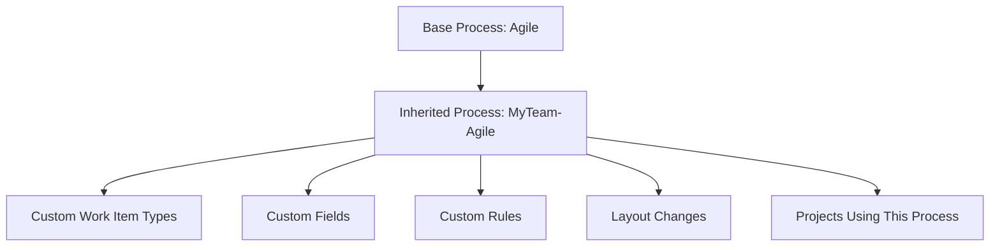

# How to Configure Azure Boards Process Customization to Add Custom Work Item Types and Fields

Author: [nawazdhandala](https://www.github.com/nawazdhandala)

Tags: Azure Boards, Process Customization, Work Items, Azure DevOps, Agile, Project Management, DevOps

Description: Learn how to customize Azure Boards processes by adding custom work item types, fields, rules, and layouts to match your team's specific workflow needs.

---

Out-of-the-box, Azure Boards gives you work item types like Epic, Feature, User Story, Task, and Bug. For many teams, these are enough. But as your processes mature, you often need to track things that do not fit neatly into the default types. Maybe you need a "Change Request" type with approval fields, a "Technical Debt" item with impact scoring, or a "Security Vulnerability" type with severity and CVSS scoring. Azure Boards process customization lets you mold the work tracking system to fit your workflow instead of the other way around.

In this post, I will walk through customizing an Azure Boards process to add custom work item types, custom fields, business rules, and layout changes. I will cover the Inherited process model, which is the approach available in Azure DevOps Services (cloud).

## Understanding Azure Boards Process Models

Azure DevOps uses processes to define work item types, fields, and rules. Every project is based on a process, and out of the box you get four:

- **Basic**: Simplified model with Issue, Task, and Epic
- **Agile**: User Story, Task, Bug, Epic, Feature
- **Scrum**: Product Backlog Item, Task, Bug, Epic, Feature
- **CMMI**: Requirement, Task, Bug, Change Request, Epic, Feature

You cannot modify these default processes directly. Instead, you create an Inherited process based on one of them and then customize the inherited copy. Your customizations are layered on top of the base process.



## Creating an Inherited Process

To start customizing:

1. Go to Organization Settings in Azure DevOps
2. Click on Boards, then Process
3. Click the three dots on the process you want to inherit from (e.g., Agile)
4. Select "Create inherited process"
5. Name it something descriptive like "Engineering-Agile" or "MyTeam-Agile"

Now you have a customizable copy. Any project using this inherited process gets the customizations automatically.

## Adding Custom Fields

Custom fields are the most common customization. Let's add some fields that track additional information on work items.

### Adding a Field Through the UI

1. Open your inherited process
2. Click on the work item type you want to add a field to (e.g., User Story)
3. Click "New field"
4. Configure the field:
   - **Name**: "Business Value Score"
   - **Type**: Integer
   - **Description**: "Relative business value of this story (1-100)"
   - **Layout**: Choose which group and page the field appears on

Field types available include:
- String (single line or multiline)
- Integer
- Decimal
- DateTime
- Boolean (checkbox)
- Picklist (dropdown with predefined values)
- Identity (Azure DevOps user)

### Picklist Fields for Controlled Values

Picklist fields are great for standardizing data entry. Here is how to add a "Risk Level" dropdown:

1. Create a new field on the desired work item type
2. Set the type to "Picklist (String)"
3. Define the allowed values:
   - Low
   - Medium
   - High
   - Critical
4. Optionally set a default value (e.g., "Medium")

### Adding Fields to Multiple Work Item Types

If you want the same field on multiple work item types, create it once and add it to each type. When you create a field, it is added to the process and can be reused. In the "New field" dialog, you can choose "Use an existing field" and select one you already created.

## Creating Custom Work Item Types

When the default types do not cover your needs, create new ones.

### Example: Creating a "Technical Debt" Work Item Type

1. In your inherited process, click "New work item type"
2. Name it "Technical Debt"
3. Choose an icon and color (helps with visual identification on boards)
4. The new type starts with the same layout as a base type

Now add fields specific to technical debt tracking:

- **Debt Category** (Picklist): Code quality, Architecture, Testing, Documentation, Infrastructure
- **Impact Score** (Integer, 1-10): How much this debt impacts development velocity
- **Effort to Resolve** (Integer): Estimated hours to fix
- **Accumulated Since** (DateTime): When this debt was first identified
- **Blocking Feature** (String): Which feature is blocked or impacted by this debt

### Example: Creating a "Security Vulnerability" Work Item Type

For security teams, create a dedicated vulnerability tracking type:

1. Create new work item type "Security Vulnerability"
2. Add custom fields:
   - **CVE ID** (String): The CVE identifier if applicable
   - **CVSS Score** (Decimal): The vulnerability severity score
   - **Attack Vector** (Picklist): Network, Adjacent, Local, Physical
   - **Affected Component** (String): Which service or component is affected
   - **Remediation Deadline** (DateTime): When the fix must be deployed
   - **Discovered By** (Picklist): Internal scan, External report, Penetration test, Bug bounty

## Adding Business Rules

Rules automate work item behavior based on conditions. They reduce manual work and enforce consistency.

### Common Rule Types

**Make a field required**: When the state changes to "Active," require the "Assigned To" field.

1. Go to your work item type
2. Click on "Rules"
3. Click "New rule"
4. Set the condition: "When State changes to Active"
5. Set the action: "Make required - Assigned To"

**Set a field value automatically**: When a bug is created, automatically set the Priority to 2.

1. Create a new rule
2. Condition: "When a work item is created"
3. Action: "Set the value of Priority to 2"

**Copy a field value**: When a work item moves to "Resolved," copy the current date to "Resolved Date."

**Hide a field based on conditions**: Hide the "Effort to Resolve" field unless the work item type is "Technical Debt."

### Rule Examples for Common Workflows

```
Rule: Auto-assign bugs to triage
  When: Work item type = Bug AND State = New
  Then: Set Assigned To = "Bug Triage Team"

Rule: Require description for production bugs
  When: State changes to Active AND Priority = 1
  Then: Make required - Description

Rule: Set resolved date when closing
  When: State changes to Closed
  Then: Set Resolved Date = Current Date

Rule: Clear assigned to on reactivation
  When: State changes from Resolved to Active
  Then: Clear Assigned To
```

## Customizing the Layout

The layout defines how fields are organized on the work item form. You can:

### Add Groups

Groups are sections on the form that contain related fields. For example, create a "Risk Assessment" group on your User Story type that contains Risk Level, Business Impact, and Compliance Requirements fields.

1. On the work item type layout, click "New group"
2. Name it "Risk Assessment"
3. Drag fields into the group

### Add Pages

Pages are tabs on the work item form. The default pages are Details, History, and Links. You can add custom pages for complex work item types:

1. Click "New page"
2. Name it (e.g., "Security Details" for the Security Vulnerability type)
3. Add groups and fields to the page

### Rearranging Fields

You can drag and drop fields between groups, reorder them within a group, and move groups between columns on the form. This is a visual editor, so you can see exactly how the form will look.

## Configuring the Backlog and Board

When you create a custom work item type, you need to decide where it appears on the backlog and board:

### Adding to the Backlog

1. In the process settings, go to "Backlog levels"
2. Choose which backlog level your custom type belongs to:
   - Portfolio backlog (alongside Epics and Features)
   - Requirements backlog (alongside User Stories)
   - Iteration backlog (alongside Tasks)
3. Add your custom work item type to the appropriate level

For example, "Technical Debt" might go on the Requirements backlog alongside User Stories, while a "Strategic Initiative" might go on the Portfolio backlog alongside Epics.

### Board Column Mapping

Custom work item types use the same state-to-column mapping as the default types. If your custom type has different states, configure the board columns to include those states:

1. Go to your board settings
2. Click on "Columns"
3. Map your custom states to board columns

## Migrating Projects to a Custom Process

If you have an existing project using a default process and want to apply your customizations:

1. Go to Organization Settings, then Process
2. Click on the default process your project uses
3. Find the project in the list
4. Click "Change process" and select your inherited process

This migration preserves all existing work items. Custom fields will appear empty initially, and you can backfill them as needed.

## Process Customization via REST API

For organizations managing multiple processes, the REST API provides programmatic control:

```bash
# List all processes in the organization
az devops invoke \
  --area processes \
  --resource processes \
  --org https://dev.azure.com/myorg \
  --http-method GET

# Create a new work item type field via REST API
curl -s -X POST \
  -H "Authorization: Basic $(echo -n :$PAT | base64)" \
  -H "Content-Type: application/json" \
  "https://dev.azure.com/myorg/_apis/work/processes/PROCESS_ID/workItemTypes/MyTeam.TechnicalDebt/fields?api-version=7.1" \
  -d '{
    "referenceName": "Custom.DebtCategory",
    "name": "Debt Category",
    "type": "string",
    "description": "The category of technical debt"
  }'
```

## Best Practices

**Start minimal.** Add only the fields and types you actually need. Too many custom fields lead to incomplete data because people skip the ones that seem irrelevant.

**Use picklist fields over free text when possible.** Picklists give you consistent data that is useful for reporting. Free text fields are flexible but hard to aggregate.

**Name fields clearly.** "Business Value Score" is better than "BV" or "Score." Others who join the team later need to understand what the field means without asking.

**Test customizations in a sandbox project first.** Create a test project on your inherited process before rolling changes out to production projects.

**Document your process customizations.** Keep a record of what you changed and why. When someone asks "why do we have a Risk Level field on bugs?" six months from now, the documentation should have the answer.

**Review and prune periodically.** Fields and types that seemed useful at the time might not be used in practice. Check usage and remove what is not providing value.

## Wrapping Up

Azure Boards process customization lets you shape the work tracking system to match how your team actually works. Custom fields capture the data you need for decision-making, custom work item types track the things that matter to your process, and rules automate the tedious parts. Start with the standard processes and add customizations incrementally as you identify gaps. The goal is a work tracking system that helps your team, not one that creates extra busywork.
