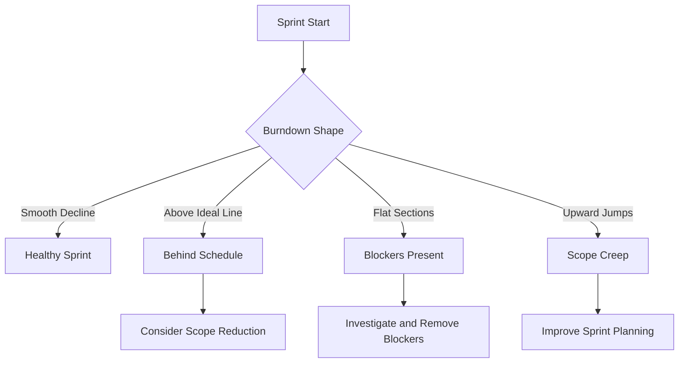

# How to Configure Azure Boards Sprint Burndown Charts and Velocity Tracking for Agile Teams

Author: [nawazdhandala](https://www.github.com/nawazdhandala)

Tags: Azure Boards, Sprint Burndown, Velocity, Agile, Scrum, Project Management, Sprint Planning

Description: Learn how to configure and interpret Azure Boards sprint burndown charts and velocity tracking to improve sprint planning accuracy and team predictability.

---

Sprint planning without historical data is guesswork. You pick a number of story points that feels right, commit to a set of work items, and hope for the best. After a few sprints, you realize you are consistently over-committing or under-committing. Burndown charts and velocity tracking in Azure Boards give you the data to replace guessing with evidence-based planning.

Burndown charts show you how work is being completed throughout a sprint. Velocity tracks how much work your team completes per sprint over time. Together, they answer the two most important questions in sprint planning: "Are we on track this sprint?" and "How much can we realistically commit to next sprint?"

## Setting Up Sprints in Azure Boards

Before burndown and velocity work, your project needs properly configured iterations (sprints). Navigate to Project Settings, then Boards, then Team Configuration, then Iterations.

Add your sprints with specific start and end dates. Azure Boards uses these dates to calculate the burndown ideal line and to associate completed work with specific sprints for velocity calculation.

```
Sprint structure example:
  Product Backlog
  Sprint 23 (Feb 3 - Feb 14, 2026)
  Sprint 24 (Feb 17 - Feb 28, 2026)
  Sprint 25 (Mar 3 - Mar 14, 2026)
```

Each sprint must have a start date and an end date. Without dates, the burndown chart cannot calculate the ideal trend line, and velocity cannot distinguish between sprints.

## Configuring the Burndown Chart

Azure Boards provides a built-in sprint burndown widget that you can add to dashboards, or you can view it directly from the sprint board.

Navigate to your team's sprint board and click on the "Analytics" tab. This shows the sprint burndown chart for the current sprint. The chart displays:

- Ideal trend line: A straight line from the total work at sprint start to zero at sprint end
- Actual remaining work: The real burndown of work items as they are completed
- Scope change indicators: Markers showing when work was added to or removed from the sprint

### Configuring What Gets Burned Down

The burndown can track different metrics. The most common options are:

**Story Points**: Burns down based on the effort field of user stories. This is the most popular choice for Scrum teams.

**Count of Work Items**: Simply counts work items regardless of their size. Useful for teams that do not estimate.

**Remaining Work (Hours)**: Burns down based on the remaining work field on tasks. This gives the most granular view but requires teams to update remaining hours daily.

To configure this, go to the dashboard, add the "Sprint Burndown" widget, and select your preferred metric.

## Adding the Sprint Burndown to a Dashboard

Create or edit a dashboard and add the Sprint Burndown widget.

Step 1: Navigate to your project dashboard (Overview, then Dashboards).

Step 2: Click Edit and then Add Widget.

Step 3: Search for "Sprint Burndown" and add it.

Step 4: Configure the widget settings:

```
Widget Configuration:
  Team: Your Team Name
  Sprint: Current sprint (or select a specific one)
  Burndown on: Story Points (recommended)
  Show: Completed work, Total scope, Ideal trend
```

The widget updates automatically as work items are completed during the sprint. It refreshes based on the analytics service, which typically processes data within a few hours.

## Interpreting the Burndown Chart

Reading a burndown chart tells you immediately whether the sprint is healthy.

A healthy burndown tracks close to or below the ideal line. This means work is being completed at a pace consistent with finishing everything by sprint end.

A burndown above the ideal line means the team is behind. The further above the line, the more likely it is that not all work will be completed. This is a signal to discuss scope reduction or investigate blockers.

A flat burndown (horizontal line) means no work is being completed. This usually indicates blockers, context switching, or work items that are too large to complete incrementally.

Scope creep shows up as upward jumps in the burndown. When someone adds work to the sprint mid-cycle, the total scope increases and the remaining work jumps up. Frequent scope changes are a sign that sprint planning or backlog refinement needs improvement.



## Setting Up Velocity Tracking

Velocity is the average amount of work your team completes per sprint. Azure Boards tracks this automatically based on your completed work items.

To view velocity, add the "Velocity" widget to your dashboard.

Configure it with:
- Team: Your team name
- Number of sprints to display: 6-12 sprints gives a good trend view
- Metric: Story Points (should match your burndown metric)
- Show: Completed work, Planned work, Completed late work

The velocity chart shows bars for each sprint, broken into:
- Completed work (green): Story points completed within the sprint
- Planned work (blue outline): Story points committed at sprint start
- Incomplete work (red): Story points not completed by sprint end
- Late completion (light green): Work completed after the sprint ended

## Calculating Team Capacity

Use velocity data to plan future sprints. The simplest approach is to use the average velocity of the last 3-6 sprints as your planning baseline.

```
Example velocity data:
  Sprint 18: 34 points
  Sprint 19: 28 points
  Sprint 20: 42 points
  Sprint 21: 31 points
  Sprint 22: 36 points
  Sprint 23: 33 points

Average velocity: (34 + 28 + 42 + 31 + 36 + 33) / 6 = 34 points

Recommendation for Sprint 24: Commit to approximately 34 story points
```

Do not use the highest velocity sprint as your target. That creates unrealistic expectations. The average is a sustainable, achievable target. Some teams use the rolling average of the last 3 sprints to give more weight to recent performance.

## Capacity Planning with Day-Off Adjustments

Azure Boards has a capacity planning feature that accounts for team members' time off and planned absences. Navigate to your sprint, then click on the Capacity tab.

For each team member, set:
- Activity: Development, Testing, Design, etc.
- Capacity per day: Typically 6 hours (accounting for meetings and overhead)
- Days off: Vacation, holidays, training days

The capacity tool then calculates the total available capacity for the sprint and compares it against the assigned work. If total remaining work exceeds capacity, the bar turns red.

```
Capacity calculation:
  Sprint duration: 10 working days
  Team member A: 6 hrs/day, 0 days off = 60 hours
  Team member B: 6 hrs/day, 2 days off = 48 hours
  Team member C: 6 hrs/day, 1 day off  = 54 hours

  Total capacity: 162 hours
  Assigned work: 145 hours
  Utilization: 89% (healthy range)
```

## Creating Custom Analytics Views

For deeper analysis, use Azure DevOps Analytics views to build custom reports in Power BI.

Navigate to Boards, then Analytics views, and create a new view. Configure it to include the fields and work item types you want to analyze, then connect it to Power BI for advanced charting.

Common custom reports include:
- Sprint-over-sprint velocity trends with trendlines
- Burndown variance analysis (how far off the ideal line each day)
- Story point estimation accuracy (planned vs. completed per sprint)
- Work item age distribution within sprints

## Improving Sprint Predictability

The goal of tracking burndown and velocity is not to generate pretty charts. It is to improve your team's predictability. Here are practical ways to use this data.

Review the burndown daily during standup. A quick glance at the chart tells you whether the sprint is on track. If it is not, discuss adjustments immediately rather than waiting until the retrospective.

Track velocity trends over quarters, not individual sprints. A single sprint's velocity can vary wildly due to holidays, sick days, or technical debt. The trend over 6-12 sprints is what matters.

Use velocity data in sprint planning ceremonies. When the team debates how much to commit to, reference the average velocity. "Our average is 34 points. We have two team members on vacation this sprint, so let us target 26 points."

Compare planned versus completed work in retrospectives. If the team consistently completes only 70% of planned work, either the estimates are too optimistic or there are systemic blockers worth investigating.

Burndown charts and velocity tracking transform sprint planning from an art into a science. They do not eliminate uncertainty, but they give you a data-driven foundation for making better planning decisions. The teams that use these tools consistently are the teams that deliver predictably.
