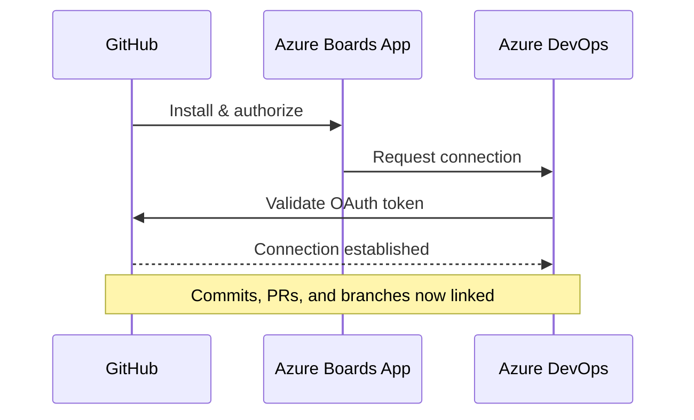

# How to Configure Azure Boards to Integrate with GitHub Repositories for Work Item Tracking

Author: [nawazdhandala](https://www.github.com/nawazdhandala)

Tags: Azure Boards, GitHub, Work Item Tracking, Azure DevOps, CI/CD, Project Management

Description: Learn how to connect Azure Boards with GitHub repositories to track work items, link commits, and streamline your development workflow.

---

If your team uses GitHub for source control but relies on Azure Boards for project management, you might feel like you are living in two separate worlds. The good news is that Azure Boards has a first-class integration with GitHub, and once it is set up, you can link commits, pull requests, and branches directly to work items. This guide walks through the full setup, practical usage patterns, and some tips I have picked up from running this integration across several projects.

## Why Integrate Azure Boards with GitHub?

Most teams do not pick their tools in a vacuum. Maybe your organization standardized on Azure DevOps for planning and tracking, but your open-source projects or acquired teams already live on GitHub. Rather than forcing a migration, you can bridge the gap.

With the integration in place, you get:

- Automatic state transitions on work items when PRs are merged
- Traceability from a user story all the way to the commit that implemented it
- The ability to mention work items in commit messages and have them show up in Azure Boards
- A single source of truth for project status without duplicating data

## Prerequisites

Before you start, make sure you have:

1. An Azure DevOps organization with at least one project using Azure Boards
2. A GitHub account with admin access to the repositories you want to connect
3. The Azure Boards app installed from the GitHub Marketplace (or permission to install it)

## Step 1: Install the Azure Boards App on GitHub

Head over to the GitHub Marketplace and search for "Azure Boards." Click Install and choose whether to install it for all repositories in your organization or only specific ones.

I recommend starting with specific repositories. You can always expand the scope later, and it keeps things cleaner during the initial setup.

During installation, GitHub will ask you to authorize the app. You will need to sign in with your Azure DevOps credentials and select the organization and project you want to connect.

## Step 2: Connect Your Azure DevOps Project to GitHub

Once the app is installed on the GitHub side, head to your Azure DevOps project. Navigate to Project Settings, then Boards, then GitHub connections.

Click "New Connection" and you should see the GitHub repositories that you granted access to in the previous step. Select the ones you want to link and confirm.

Here is what the connection flow looks like at a high level:



## Step 3: Link Work Items Using Commit Messages

With the connection established, you can start linking GitHub activity to Azure Boards work items. The syntax is straightforward - just include the work item ID prefixed with `AB#` in your commit messages.

Here is an example commit message that links to work item 1234:

```bash
# This commit message will automatically link to Azure Boards work item 1234
git commit -m "Fix null reference in user service AB#1234"
```

You can also reference multiple work items in a single commit:

```bash
# Linking a commit to multiple work items at once
git commit -m "Refactor authentication module AB#1234 AB#1235"
```

When Azure Boards processes these commits, it creates a link on the work item that points back to the specific commit in GitHub. You can click through from the work item to see the exact code changes.

## Step 4: Link Work Items in Pull Requests

Pull requests work the same way. Include `AB#` references in the PR title or description, and Azure Boards will pick them up.

Here is a PR description template that works well with the integration:

```markdown
## Summary
Fixes the null reference exception in the user service when
the email field is empty.

## Related Work Items
AB#1234 - Fix user service crash on empty email
AB#1235 - Add input validation for user profile fields

## Testing
- Unit tests added for empty email scenario
- Integration tests updated
```

## Step 5: Configure Automatic State Transitions

This is where the integration really shines. You can configure Azure Boards to automatically move work items through states based on GitHub activity.

Go to Project Settings, then Boards, then GitHub connections. Select your connection and configure the state mappings:

- When a PR is opened that references a work item, move it to "Active" or "In Progress"
- When a PR is merged, move the work item to "Resolved" or "Done"
- When a PR is closed without merging, optionally revert the state

These transitions save a surprising amount of time. Developers no longer need to context-switch to Azure Boards just to drag a card across the board.

## Step 6: Use Branch Naming Conventions

Another useful pattern is creating branches directly from work items. While the GitHub integration does not create branches for you automatically, you can establish a convention that makes tracking easier.

A common pattern is to include the work item ID in the branch name:

```bash
# Create a branch that references the work item
git checkout -b feature/AB1234-fix-user-service
```

This does not trigger an automatic link (only `AB#` in commit messages and PR descriptions does that), but it makes it easy for developers to find the related work item when they are reviewing code.

## Troubleshooting Common Issues

### Work Items Not Linking

If your commits mention `AB#1234` but the link does not show up in Azure Boards, check these things:

1. Make sure the GitHub repository is connected to the correct Azure DevOps project
2. Verify that the work item ID actually exists in that project
3. Check that the Azure Boards app still has access to the repository (GitHub org admins can revoke this)
4. Look at the webhook delivery logs in GitHub under Settings, then Webhooks

### Duplicate Connections

If you accidentally create multiple connections between the same GitHub repo and Azure DevOps project, you will see duplicate entries in the GitHub connections list. Remove the extras from Project Settings to avoid confusion.

### Permission Errors

The Azure Boards app needs specific permissions on GitHub:

- Read access to code (to process commits)
- Read access to pull requests
- Write access to checks (to post status updates)

If any of these are missing, the integration will silently fail on certain operations.

## Advanced: Using the REST API to Query Linked Items

If you want to build automation around the integration, you can use the Azure DevOps REST API to query work items and their GitHub links.

Here is an example using curl to fetch work item details including external links:

```bash
# Query a specific work item with its relations (includes GitHub links)
curl -u :$AZURE_PAT \
  "https://dev.azure.com/{org}/{project}/_apis/wit/workitems/1234?\$expand=relations&api-version=7.0"
```

The response will include a `relations` array where GitHub commits and PRs show up with a `url` field pointing to the GitHub resource.

## Best Practices

After running this integration for a while, here are some patterns that work well:

1. **Enforce AB# references in PRs.** You can use a GitHub Actions workflow or a branch policy to require that every PR description contains at least one `AB#` reference. This ensures nothing slips through without being tracked.

2. **Use a consistent work item type hierarchy.** Epics map to milestones, User Stories map to individual PRs, and Tasks map to specific commits. This gives you clean traceability at every level.

3. **Review the integration health regularly.** Check the GitHub connections page in Azure DevOps every few weeks. Connections can break if tokens expire or if someone changes the app permissions on the GitHub side.

4. **Do not over-link.** Not every typo-fix commit needs a work item. Reserve the `AB#` syntax for meaningful work that should be tracked. Otherwise your work items become cluttered with noise.

## Wrapping Up

The Azure Boards and GitHub integration is one of those setups that takes about 15 minutes to configure but pays dividends for months. Once your team gets in the habit of including `AB#` references in their commits and PRs, you get full traceability without anyone having to manually update boards. The automatic state transitions are the real time saver - developers can focus on writing code while project managers get real-time visibility into progress. If you are already using both tools, there is no reason not to connect them.
