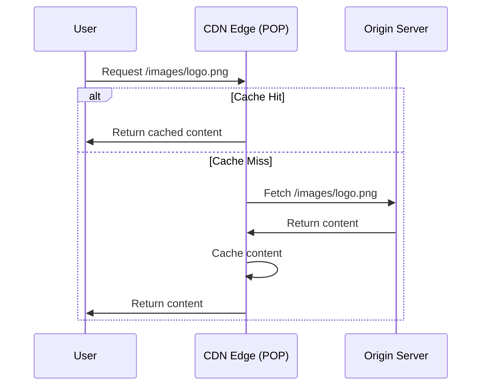

# How to Configure Azure CDN with a Custom Domain and Managed Certificate

Author: [nawazdhandala](https://www.github.com/nawazdhandala)

Tags: Azure, CDN, Custom Domain, HTTPS, Managed Certificate, Content Delivery, Azure Networking

Description: Learn how to set up Azure CDN with a custom domain and enable HTTPS using a managed certificate for secure content delivery.

---

A CDN (Content Delivery Network) caches your content at edge locations around the world so that users get faster response times regardless of their geographic location. Azure CDN integrates natively with Azure services like Blob Storage, App Services, and any custom origin. Adding a custom domain with HTTPS makes the CDN feel like a natural part of your application rather than a third-party service.

This guide walks through creating an Azure CDN profile, adding a custom domain, and enabling HTTPS with a managed certificate so you do not have to deal with certificate provisioning and renewals.

## How Azure CDN Works

When a user requests content from your CDN endpoint, the request hits the nearest edge location (point of presence, or POP). If the content is cached there, it is served immediately. If not, the edge node fetches it from your origin server, caches it, and then serves it. Subsequent requests from nearby users get the cached version.



## Prerequisites

- An Azure subscription
- A custom domain with access to DNS settings
- An origin endpoint (Blob Storage static website, App Service, etc.)
- Azure CLI installed

## Step 1: Create a CDN Profile and Endpoint

Azure CDN comes in several SKUs. We will use the Microsoft Standard tier which supports managed certificates.

```bash
# Create a resource group
az group create --name rg-cdn-demo --location eastus

# Create a CDN profile with Microsoft Standard tier
az cdn profile create \
  --resource-group rg-cdn-demo \
  --name cdn-profile-demo \
  --sku Standard_Microsoft

# Create a CDN endpoint pointing to your origin
az cdn endpoint create \
  --resource-group rg-cdn-demo \
  --profile-name cdn-profile-demo \
  --name myapp-cdn \
  --origin myapp.azurewebsites.net \
  --origin-host-header myapp.azurewebsites.net \
  --enable-compression true \
  --content-types-to-compress "text/html" "text/css" "application/javascript" "application/json"
```

The endpoint URL will be `myapp-cdn.azureedge.net`. This is the default Azure CDN hostname.

A few things to note:

- `--origin`: The hostname of your origin server
- `--origin-host-header`: The Host header sent to the origin. For App Services, this must match the app's hostname.
- `--enable-compression`: Enables Gzip/Brotli compression for specified content types

## Step 2: Create a CNAME Record

Before adding a custom domain to the CDN endpoint, you need a CNAME record at your DNS provider that points your custom domain to the CDN endpoint hostname.

Add this DNS record:

- **Record type:** CNAME
- **Name:** `cdn` (or whatever subdomain you want, like `static` or `assets`)
- **Value:** `myapp-cdn.azureedge.net`
- **TTL:** 3600 (or lower for faster propagation)

Wait for DNS propagation. You can check with:

```bash
# Verify DNS resolution
nslookup cdn.myapp.com
# Should resolve to myapp-cdn.azureedge.net
```

## Step 3: Add the Custom Domain

Once the CNAME record is propagating, add the custom domain to the CDN endpoint.

```bash
# Add a custom domain to the endpoint
az cdn custom-domain create \
  --resource-group rg-cdn-demo \
  --profile-name cdn-profile-demo \
  --endpoint-name myapp-cdn \
  --name myapp-custom-domain \
  --hostname cdn.myapp.com
```

If Azure cannot verify the CNAME record, this command will fail. Make sure DNS has propagated before running it.

## Step 4: Enable HTTPS with Managed Certificate

Now enable HTTPS on the custom domain. The managed certificate option tells Azure CDN to provision and manage a free TLS certificate from DigiCert.

```bash
# Enable HTTPS with a CDN-managed certificate
az cdn custom-domain enable-https \
  --resource-group rg-cdn-demo \
  --profile-name cdn-profile-demo \
  --endpoint-name myapp-cdn \
  --name myapp-custom-domain \
  --min-tls-version 1.2
```

The certificate provisioning process goes through several stages:

1. **Submitting** - The request is submitted to the certificate authority
2. **Domain validation** - Azure verifies domain ownership via the CNAME record
3. **Certificate provisioning** - The certificate is generated
4. **Deploying certificate** - The certificate is deployed to all CDN edge locations
5. **Complete** - HTTPS is active

This process can take anywhere from 1 to 8 hours. You can check the status with:

```bash
# Check HTTPS provisioning status
az cdn custom-domain show \
  --resource-group rg-cdn-demo \
  --profile-name cdn-profile-demo \
  --endpoint-name myapp-cdn \
  --name myapp-custom-domain \
  --query "customHttpsParameters.certificateSource" \
  --output tsv
```

## Step 5: Configure HTTP to HTTPS Redirect

You want all HTTP traffic to redirect to HTTPS. Azure CDN supports this through rules engine.

```bash
# Create a rules engine rule for HTTP to HTTPS redirect
az cdn endpoint rule add \
  --resource-group rg-cdn-demo \
  --profile-name cdn-profile-demo \
  --endpoint-name myapp-cdn \
  --order 1 \
  --rule-name "HttpsRedirect" \
  --match-variable RequestScheme \
  --operator Equal \
  --match-values HTTP \
  --action-name UrlRedirect \
  --redirect-protocol Https \
  --redirect-type Found
```

## Step 6: Verify the Setup

Test both HTTP and HTTPS access to your custom domain.

```bash
# Test HTTPS access
curl -I https://cdn.myapp.com/

# Test HTTP redirect
curl -I http://cdn.myapp.com/
# Should return a 302 redirect to HTTPS
```

## Using Apex Domains

If you want to use an apex domain (like `myapp.com` without a subdomain), you cannot use a CNAME record because DNS does not allow CNAMEs at the zone apex. Instead, you can:

1. **Use Azure DNS with alias records.** If your DNS is hosted in Azure DNS, you can create an alias record that points directly to the CDN endpoint.
2. **Use a DNS provider that supports CNAME flattening.** Providers like Cloudflare support CNAME-like records at the apex.

```bash
# Example: Create an alias record in Azure DNS
az network dns record-set a create \
  --resource-group rg-cdn-demo \
  --zone-name myapp.com \
  --name "@" \
  --target-resource "/subscriptions/{sub-id}/resourceGroups/rg-cdn-demo/providers/Microsoft.Cdn/profiles/cdn-profile-demo/endpoints/myapp-cdn"
```

## Caching Behavior

Azure CDN caches content based on the Cache-Control headers from your origin. You can override this behavior at the CDN level.

```bash
# Set a global caching rule to cache everything for 7 days
az cdn endpoint rule add \
  --resource-group rg-cdn-demo \
  --profile-name cdn-profile-demo \
  --endpoint-name myapp-cdn \
  --order 2 \
  --rule-name "CacheOverride" \
  --match-variable UrlFileExtension \
  --operator Equal \
  --match-values "js" "css" "png" "jpg" "gif" "svg" "woff2" \
  --action-name CacheExpiration \
  --cache-behavior Override \
  --cache-duration "7.00:00:00"
```

## Purging Cached Content

When you update content at the origin, the CDN might still serve stale cached versions. Purge the cache to force the CDN to fetch fresh content.

```bash
# Purge specific paths
az cdn endpoint purge \
  --resource-group rg-cdn-demo \
  --profile-name cdn-profile-demo \
  --name myapp-cdn \
  --content-paths "/css/*" "/js/*" "/images/logo.png"

# Purge everything
az cdn endpoint purge \
  --resource-group rg-cdn-demo \
  --profile-name cdn-profile-demo \
  --name myapp-cdn \
  --content-paths "/*"
```

## Troubleshooting

**Custom domain shows "Pending" forever.** Make sure the CNAME record is correctly configured. Some DNS providers add the domain automatically, so `cdn.myapp.com` might need just `cdn` as the record name.

**HTTPS certificate not provisioning.** Domain validation requires the CNAME to point directly to the CDN endpoint. If you have a proxy or WAF in front, validation may fail.

**Content not updating after deployment.** The CDN cache may still serve old content. Either purge the cache or use cache-busting techniques like versioned file names (e.g., `style.v2.css`).

## Cleanup

```bash
# Delete all resources
az group delete --name rg-cdn-demo --yes --no-wait
```

## Wrapping Up

Azure CDN with a custom domain and managed certificate gives your application fast, global content delivery with HTTPS, and zero certificate management overhead. The setup boils down to creating a CDN profile and endpoint, adding a CNAME record for your custom domain, enabling HTTPS with a managed certificate, and optionally configuring caching rules and HTTP-to-HTTPS redirects. The managed certificate handles renewals automatically, so once it is set up, you can focus on your application rather than infrastructure.
