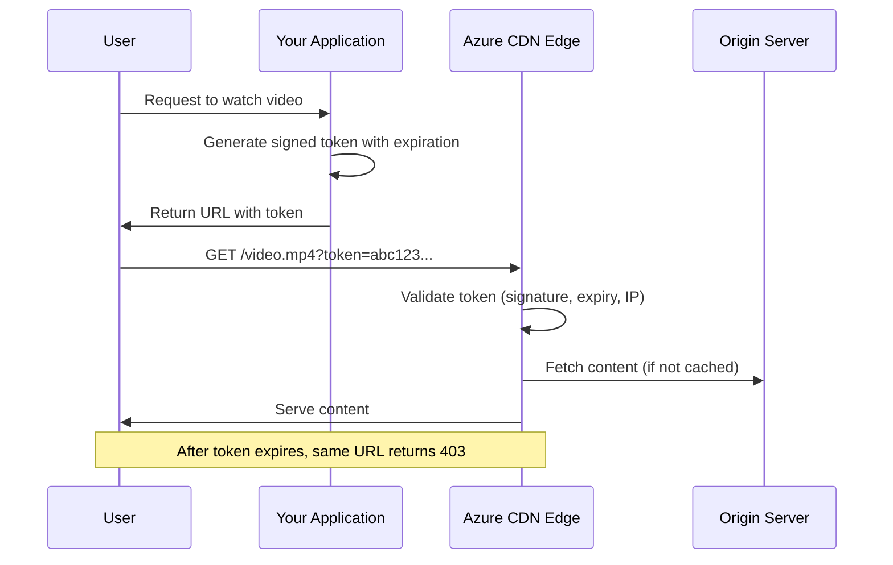

# How to Configure Azure CDN with Token Authentication for Content Protection

Author: [nawazdhandala](https://www.github.com/nawazdhandala)

Tags: Azure, CDN, Token Authentication, Content Protection, Security, Streaming

Description: Configure Azure CDN token authentication to protect premium content by requiring valid tokens in URLs before allowing access to CDN-served resources.

---

If you serve premium content through Azure CDN - paid videos, licensed software downloads, subscription-based documents - you need a way to ensure only authorized users can access it. URL-based token authentication lets you generate time-limited, signed URLs that the CDN validates before serving the content. Without a valid token, the CDN returns a 403 Forbidden response, even though the content is sitting right there on the edge server.

This guide covers how to set up token authentication on Azure CDN, generate tokens from your application, and handle the common edge cases.

## How Token Authentication Works

Token authentication adds a layer of authorization at the CDN edge. Your application generates a token that encodes parameters like expiration time, allowed IP, and the specific path being accessed. This token is appended to the content URL. When the CDN receives a request with a token, it validates the token before serving the content.



The token is typically an encrypted or HMAC-signed string that contains the content path, expiration timestamp, and optionally the client IP. The CDN edge server knows the encryption key and can validate the token without calling back to your application server.

## Prerequisites

- Azure CDN profile using **Verizon Premium** tier (token authentication is a Premium Verizon feature)
- A CDN endpoint with content you want to protect
- An application backend that can generate tokens
- Understanding of your content access patterns (expiration times, geographic restrictions, etc.)

## Step 1: Enable Token Authentication on Azure CDN

Token authentication is configured through the Verizon Premium rules engine. Access it through the Azure portal:

1. Navigate to your CDN profile (Premium Verizon)
2. Click **Manage** to open the Verizon management portal
3. Go to **HTTP Large** > **Token Auth**
4. You will see the default encryption key. Note this key - you need it in your application to generate tokens.
5. Enable Token Auth for the desired platform

You can also set a backup key for key rotation purposes. When you rotate keys, set the new key as the primary and the old key as the backup. The CDN accepts tokens generated with either key during the rotation period.

## Step 2: Configure Token Authentication Parameters

In the Token Auth settings, configure the validation parameters:

**Encryption Key**: The shared secret used to encrypt/decrypt tokens. This must be kept secure and shared only with your token generation service.

**Token parameter name**: The query string parameter name that contains the token. Default is `token`, but you can change it to something less obvious.

**Denied requests**: Configure whether denied requests receive a 403 response or are redirected to a specific URL.

## Step 3: Generate Tokens in Your Application

Your application needs to generate tokens for each content request. The token is an encrypted string that contains specific parameters.

Here is a token generation example in Node.js:

```javascript
// Token generation for Azure CDN Verizon Premium
// Uses the encryption key from the CDN Token Auth settings

const crypto = require('crypto');

function generateCdnToken(options) {
  const {
    encryptionKey,  // Your CDN token auth encryption key
    expiresInSeconds, // Token lifetime in seconds
    clientIp,       // Optional: restrict to specific client IP
    contentPath,    // The path to the content (e.g., /videos/premium/video1.mp4)
    allowedCountries // Optional: restrict to specific countries
  } = options;

  // Calculate expiration time as epoch timestamp
  const expirationTime = Math.floor(Date.now() / 1000) + expiresInSeconds;

  // Build the token parameter string
  // ec = expiration, url = allowed path, ip = client IP, co = countries
  let tokenParams = `ec=${expirationTime}`;

  if (contentPath) {
    tokenParams += `&url=${contentPath}`;
  }

  if (clientIp) {
    tokenParams += `&ip=${clientIp}`;
  }

  if (allowedCountries) {
    tokenParams += `&co=${allowedCountries.join(',')}`;
  }

  // Encrypt the token parameters using the CDN encryption key
  const key = Buffer.from(encryptionKey, 'hex');
  const iv = crypto.randomBytes(16);
  const cipher = crypto.createCipheriv('aes-256-cbc', key, iv);

  let encrypted = cipher.update(tokenParams, 'utf8', 'hex');
  encrypted += cipher.final('hex');

  // Combine IV and encrypted data
  const token = iv.toString('hex') + encrypted;

  return token;
}

// Usage example
const token = generateCdnToken({
  encryptionKey: 'your-cdn-encryption-key-hex',
  expiresInSeconds: 3600,  // Token valid for 1 hour
  contentPath: '/videos/premium/*',  // Wildcard allows all files in the folder
  clientIp: '203.0.113.50'  // Restrict to this client IP
});

// Build the protected URL
const protectedUrl = `https://mycdn.azureedge.net/videos/premium/video1.mp4?token=${token}`;
console.log('Protected URL:', protectedUrl);
```

Here is the same thing in Python:

```python
# Token generation for Azure CDN Verizon Premium
# Generates time-limited signed URLs for content protection

import time
import os
from cryptography.hazmat.primitives.ciphers import Cipher, algorithms, modes
from cryptography.hazmat.primitives import padding
from cryptography.hazmat.backends import default_backend

def generate_cdn_token(encryption_key_hex, expires_in_seconds,
                       content_path=None, client_ip=None):
    """Generate an encrypted token for Azure CDN token authentication."""

    # Calculate expiration timestamp
    expiration_time = int(time.time()) + expires_in_seconds

    # Build the token parameter string
    token_params = f"ec={expiration_time}"

    if content_path:
        token_params += f"&url={content_path}"

    if client_ip:
        token_params += f"&ip={client_ip}"

    # Encrypt the parameters
    key = bytes.fromhex(encryption_key_hex)
    iv = os.urandom(16)

    # Pad the plaintext to block size
    padder = padding.PKCS7(128).padder()
    padded_data = padder.update(token_params.encode()) + padder.finalize()

    # Encrypt using AES-256-CBC
    cipher = Cipher(algorithms.AES(key), modes.CBC(iv), backend=default_backend())
    encryptor = cipher.encryptor()
    encrypted = encryptor.update(padded_data) + encryptor.finalize()

    # Combine IV and encrypted data as hex string
    token = iv.hex() + encrypted.hex()

    return token

# Generate a token for a video file
token = generate_cdn_token(
    encryption_key_hex="your-cdn-encryption-key-hex",
    expires_in_seconds=3600,
    content_path="/videos/premium/*",
    client_ip="203.0.113.50"
)

protected_url = f"https://mycdn.azureedge.net/videos/premium/video1.mp4?token={token}"
print(f"Protected URL: {protected_url}")
```

## Step 4: Handle Token Parameters

The token can encode several useful parameters:

| Parameter | Code | Description |
|-----------|------|-------------|
| Expiration | ec | Unix timestamp after which the token is invalid |
| URL | url | The path the token is valid for (supports wildcards) |
| Client IP | ip | Restrict access to a specific client IP or CIDR |
| Country | co | Restrict access to specific country codes |
| Referrer | ref | Only allow access from specific referrer domains |

Using the URL parameter with wildcards is particularly useful for video streaming. If a video player needs to fetch multiple segments (like with HLS or DASH), you can generate a single token that covers the entire directory:

```javascript
// Token valid for all segments in a video directory
const token = generateCdnToken({
  encryptionKey: 'your-key',
  expiresInSeconds: 7200,
  contentPath: '/videos/stream123/*'  // Wildcard covers all .ts segments
});
```

## Step 5: Configure Rules Engine for Token Behavior

Use the Verizon Premium rules engine to customize token authentication behavior for different paths:

1. In the Verizon management portal, go to **HTTP Large** > **Rules Engine**
2. Create a new rule:
   - **Match condition**: URL Path matches `/premium/*`
   - **Feature**: Token Auth = Active
3. Create another rule for public content:
   - **Match condition**: URL Path matches `/public/*`
   - **Feature**: Token Auth = Off

This lets you protect some paths while leaving others publicly accessible.

## Step 6: Key Rotation

Periodically rotating your encryption key is a security best practice. The CDN supports two active keys (primary and backup) to make this seamless:

1. Generate a new encryption key
2. Set the new key as the **backup key** in the CDN Token Auth settings
3. Update your application to generate tokens using the new key
4. After all old tokens have expired (wait for the maximum token lifetime), promote the new key to primary
5. Remove the old key

During the transition period, the CDN validates tokens against both keys, so there is no downtime.

## Troubleshooting

**403 on valid tokens**: Check the system clock on your token generation server. If it is out of sync, the expiration timestamp might be in the past by the time the CDN validates it. Use NTP to keep clocks synchronized.

**Token works in browser but fails in video player**: Some video players strip query parameters when requesting segments. Use the URL parameter with wildcards and make sure the player passes the token with each segment request.

**Token too long for URL**: If your token parameters produce a very long encrypted string, some CDNs and proxies might truncate the URL. Keep parameters concise and consider using shorter path restrictions.

## Wrapping Up

Token authentication on Azure CDN gives you control over who can access your content without requiring users to authenticate directly with the CDN. Your application generates time-limited tokens that the CDN validates at the edge, which means no additional latency for authorized requests and no way to bypass the protection by directly accessing the CDN URL. The Verizon Premium tier is required for this feature, but for content that needs protection, the additional cost is well justified.
