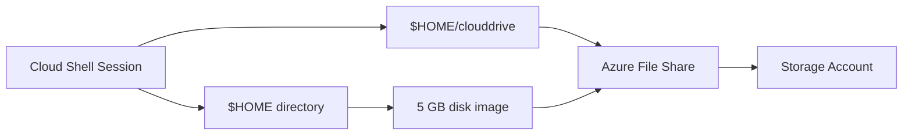

# How to Configure Azure Cloud Shell with Custom Scripts and Persistent File Storage

Author: [nawazdhandala](https://www.github.com/nawazdhandala)

Tags: Azure Cloud Shell, Azure Storage, Automation, DevOps, Bash, PowerShell, Cloud Management

Description: Set up Azure Cloud Shell with persistent storage, custom scripts, aliases, and environment configurations for a productive cloud management experience.

---

Azure Cloud Shell is one of those tools that looks simple on the surface but can be surprisingly powerful once you configure it properly. Out of the box, it gives you a browser-based terminal with Azure CLI and PowerShell pre-installed. But the default setup is bare bones. If you spend any meaningful time in Cloud Shell, you will want custom aliases, scripts that persist between sessions, and an environment that feels like your local terminal.

This guide covers everything from initial storage setup to building a personalized Cloud Shell environment that makes daily Azure management faster.

## How Cloud Shell Storage Works

When you first launch Azure Cloud Shell, it asks you to create or attach a storage account. This is not just a formality - it is how Cloud Shell persists your files between sessions.

Behind the scenes, Cloud Shell creates an Azure file share and mounts it at `$HOME/clouddrive`. Anything you put in that directory survives session restarts. Your home directory itself (`$HOME`) is also persisted via a disk image stored in the file share.



The important distinction is that `$HOME` is a disk image with a 5 GB limit, while `$HOME/clouddrive` is the raw file share with whatever capacity you provision.

## Setting Up Storage

### Automatic Setup

The easiest path is to let Cloud Shell create everything for you. Open Cloud Shell from the Azure portal and select either Bash or PowerShell. When prompted, click "Create storage" and Azure will create:

- A resource group named `cloud-shell-storage-<region>`
- A storage account with a generated name
- A file share named `cs-<user>-<hash>`

This works fine for personal use, but for teams or governance-conscious organizations, you will want to control these resources.

### Manual Setup

Create the storage resources yourself with Azure CLI:

```bash
# Create a dedicated resource group for Cloud Shell storage
az group create \
  --name "rg-cloudshell" \
  --location "eastus2"

# Create a storage account with a meaningful name
az storage account create \
  --name "stcloudshellteam001" \
  --resource-group "rg-cloudshell" \
  --location "eastus2" \
  --sku "Standard_LRS" \
  --kind "StorageV2"

# Create the file share with a specific quota (in GB)
az storage share create \
  --name "cloudshell" \
  --account-name "stcloudshellteam001" \
  --quota 10
```

Then in Cloud Shell, click "Show advanced settings" during setup and point to your existing storage account and file share.

## Customizing Your Bash Environment

### The .bashrc File

Your `.bashrc` file persists in the Cloud Shell disk image. This is where you put aliases, environment variables, and shell functions.

Here is a `.bashrc` configuration tailored for Azure management:

```bash
# ~/.bashrc - Cloud Shell customization

# Useful aliases for common Azure operations
alias rg='az group list --output table'
alias vms='az vm list --output table --show-details'
alias subs='az account list --output table'
alias current='az account show --output table'

# Quick resource group switching
rgset() {
    # Set default resource group for subsequent commands
    az configure --defaults group="$1"
    echo "Default resource group set to: $1"
}

# Fast subscription switching
subswitch() {
    # Switch active subscription by name or ID
    az account set --subscription "$1"
    echo "Switched to: $(az account show --query name -o tsv)"
}

# List all resources in a resource group with their types
rglist() {
    az resource list \
      --resource-group "${1:-$(az configure --list-defaults --query '[?name==`group`].value' -o tsv)}" \
      --output table
}

# Environment variables
export EDITOR=vim
export AZURE_DEV_COLLECT_TELEMETRY=no

# Colored prompt showing current subscription
PS1='\[\e[36m\][$(az account show --query name -o tsv 2>/dev/null || echo "no-sub")]\[\e[0m\] \[\e[32m\]\w\[\e[0m\] $ '
```

### Creating Persistent Scripts

For scripts you want to reuse across sessions, store them in `$HOME/clouddrive/scripts`:

```bash
# Create a scripts directory in the persistent file share
mkdir -p ~/clouddrive/scripts
```

Here is a useful script that checks the health of resources across all your subscriptions:

```bash
#!/bin/bash
# ~/clouddrive/scripts/resource-health.sh
# Checks resource health across all subscriptions

# Store the current subscription so we can switch back
ORIGINAL_SUB=$(az account show --query id -o tsv)

# Get all subscriptions
SUBS=$(az account list --query '[].id' -o tsv)

for sub in $SUBS; do
    SUB_NAME=$(az account show --subscription "$sub" --query name -o tsv)
    echo "=== $SUB_NAME ==="

    az account set --subscription "$sub"

    # Count resources by type
    az resource list --query '[].type' -o tsv | sort | uniq -c | sort -rn | head -10
    echo ""
done

# Switch back to original subscription
az account set --subscription "$ORIGINAL_SUB"
echo "Switched back to original subscription."
```

Make it executable and add the scripts directory to your PATH:

```bash
# Make the script executable
chmod +x ~/clouddrive/scripts/resource-health.sh

# Add scripts directory to PATH in .bashrc
echo 'export PATH="$HOME/clouddrive/scripts:$PATH"' >> ~/.bashrc
```

## Customizing Your PowerShell Profile

If you prefer PowerShell, customize the profile at `$PROFILE`:

```powershell
# $PROFILE - PowerShell profile for Cloud Shell

# Quick navigation aliases
function Get-ResourceGroups { az group list --output table }
Set-Alias -Name rg -Value Get-ResourceGroups

function Get-CurrentSubscription { az account show --output table }
Set-Alias -Name current -Value Get-CurrentSubscription

# Custom function to find expensive resources
function Get-ExpensiveResources {
    param(
        [string]$ResourceGroup
    )
    # List all resources sorted by type to identify cost drivers
    $resources = az resource list --resource-group $ResourceGroup --output json | ConvertFrom-Json
    $resources | Group-Object type | Sort-Object Count -Descending | Format-Table Count, Name
}

# Set default output format
$PSDefaultParameterValues['*:Output'] = 'Table'

# Custom prompt
function prompt {
    $sub = az account show --query name -o tsv 2>$null
    Write-Host "[$sub]" -ForegroundColor Cyan -NoNewline
    Write-Host " $(Get-Location) " -ForegroundColor Green -NoNewline
    return "> "
}
```

## Uploading and Downloading Files

Cloud Shell supports file transfers, which is handy for getting scripts and configuration files in and out.

### Using the Built-in Upload/Download

Click the upload/download icon in the Cloud Shell toolbar. Uploaded files land in your `$HOME` directory. For downloads, use:

```bash
# Download a file through the Cloud Shell browser interface
download ~/clouddrive/scripts/resource-health.sh
```

### Using Azure Storage Directly

For larger files or automated transfers, use Azure Storage commands:

```bash
# Upload a file to the Cloud Shell file share from your local machine
az storage file upload \
  --share-name "cloudshell" \
  --account-name "stcloudshellteam001" \
  --source "./local-script.sh" \
  --path "scripts/local-script.sh"

# Download a file from the share
az storage file download \
  --share-name "cloudshell" \
  --account-name "stcloudshellteam001" \
  --path "scripts/resource-health.sh" \
  --dest "./resource-health.sh"
```

## Installing Additional Tools

Cloud Shell comes with many tools pre-installed (az, kubectl, terraform, ansible, etc.), but you might need others. Since you do not have root access, install tools to your home directory:

```bash
# Install a tool to the persistent clouddrive
mkdir -p ~/clouddrive/bin

# Example: install yq (YAML processor)
wget https://github.com/mikefarah/yq/releases/latest/download/yq_linux_amd64 \
  -O ~/clouddrive/bin/yq
chmod +x ~/clouddrive/bin/yq

# Add to PATH
echo 'export PATH="$HOME/clouddrive/bin:$PATH"' >> ~/.bashrc
```

Python packages can be installed with pip using the `--user` flag:

```bash
# Install Python packages for the current user
pip install --user azure-identity azure-mgmt-resource
```

## Sharing Scripts Across a Team

If your team uses Cloud Shell, you can share scripts through the same storage account. Create a shared file share and mount it:

```bash
# Mount an additional file share for team scripts
mkdir -p ~/team-scripts

# Create a mount script that runs on each session start
cat >> ~/.bashrc << 'MOUNT_EOF'
# Mount team scripts share if not already mounted
if [ ! -f ~/team-scripts/.mounted ]; then
    clouddrive mount \
      --storage-account-name "stcloudshellteam001" \
      --file-share-name "team-scripts" \
      --mount-point ~/team-scripts 2>/dev/null
fi
MOUNT_EOF
```

## Troubleshooting

**Session timeouts.** Cloud Shell sessions time out after 20 minutes of inactivity. There is no way to change this, but you can run `while true; do echo "keepalive"; sleep 300; done &` in the background if you need to keep a session alive during a long-running operation.

**Storage issues.** If Cloud Shell fails to start, it is usually a storage problem. Check that the storage account and file share still exist and that your account has access. You can reset Cloud Shell storage from the settings gear icon.

**Slow startup.** Cloud Shell provisions a container each time you connect. If it is slow, check the Azure status page for your region. You can also try switching between Bash and PowerShell modes to get a fresh container.

## Wrapping Up

Azure Cloud Shell is much more useful once you invest a little time customizing it. With persistent scripts, custom aliases, and a well-organized clouddrive, it becomes a legitimate workstation for Azure management. The key insight is that your `$HOME` directory and the `clouddrive` mount survive between sessions, so anything you put there sticks around. Set up your environment once, and you will have a consistent, portable Azure management terminal accessible from any browser.
