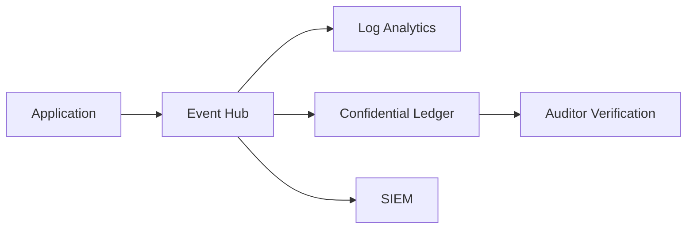

# How to Configure Azure Confidential Ledger for Tamper-Proof Audit Trail Storage

Author: [nawazdhandala](https://www.github.com/nawazdhandala)

Tags: Azure, Confidential Ledger, Audit Trail, Tamper-Proof, Compliance, Blockchain, Data Integrity

Description: A hands-on guide to setting up Azure Confidential Ledger for storing tamper-proof audit logs that meet regulatory compliance requirements.

---

When regulators or auditors ask you to prove that your logs have not been altered, you need more than just a database with access controls. You need a system where the integrity of every record is cryptographically guaranteed and where even administrators cannot modify historical entries. That is exactly what Azure Confidential Ledger provides. It is built on a blockchain-like append-only data structure running inside hardware-based trusted execution environments, and it is purpose-built for storing data that absolutely must not be tampered with.

In this post, I will show you how to set up a Confidential Ledger instance, write audit data to it, and verify the integrity of stored records.

## What Is Azure Confidential Ledger?

Azure Confidential Ledger is a managed service built on the Confidential Consortium Framework (CCF), which is an open-source framework developed by Microsoft Research. Under the hood, it uses a network of nodes running inside Intel SGX enclaves (trusted execution environments), which means the code and data are protected even from the cloud operator.

The key properties that make it suitable for audit trails are:

- **Append-only storage** - Once data is written, it cannot be modified or deleted. This is enforced at the protocol level, not just by access controls.
- **Cryptographic verification** - Every transaction gets a cryptographic receipt that can be independently verified. You can prove that a specific record existed at a specific time and has not been changed.
- **Tamper evidence** - The ledger maintains a Merkle tree of all transactions. Any attempt to modify historical data would break the hash chain, making tampering detectable.
- **Confidential computing** - Data is processed inside hardware enclaves, protecting it even from Azure operators.

## Common Use Cases

Before we get into the setup, here are the scenarios where Confidential Ledger shines:

- **Regulatory compliance** - Financial services, healthcare, and government organizations that need immutable audit logs for SOX, HIPAA, or FedRAMP compliance.
- **Supply chain integrity** - Recording the provenance and handling of goods with tamper-proof records.
- **Digital asset management** - Tracking ownership and transfers of digital assets.
- **Configuration change tracking** - Recording every change to critical infrastructure with a guarantee that the log has not been altered.

## Step 1: Create a Confidential Ledger Instance

Let us start by creating a Confidential Ledger instance. You will need to register the resource provider first if you have not used the service before.

This script registers the provider and creates a new Confidential Ledger instance with your Entra ID identity as an administrator:

```bash
# Register the Confidential Ledger resource provider
az provider register --namespace Microsoft.ConfidentialLedger

# Wait for registration to complete
az provider show \
  --namespace Microsoft.ConfidentialLedger \
  --query "registrationState" -o tsv

# Set variables
RG="rg-audit-ledger"
LEDGER_NAME="audit-trail-prod"
LOCATION="eastus"

# Get your Entra ID object ID (this will be the ledger administrator)
USER_OID=$(az ad signed-in-user show --query id -o tsv)

# Create the resource group
az group create --name $RG --location $LOCATION

# Create the Confidential Ledger
az confidentialledger create \
  --name $LEDGER_NAME \
  --resource-group $RG \
  --location $LOCATION \
  --ledger-type Public \
  --aad-based-security-principals "[{\"principalId\":\"$USER_OID\",\"tenantId\":\"$(az account show --query tenantId -o tsv)\",\"ledgerRoleName\":\"Administrator\"}]"
```

The `ledger-type` can be "Public" or "Private." Public means the ledger is accessible over the internet (with authentication, of course). Private means it is only accessible through a private endpoint.

## Step 2: Set Up Client Access

Once the ledger is created, you need the service endpoint and the identity service endpoint to connect to it.

This retrieves the connection details you will need for client applications:

```bash
# Get the ledger URI and identity service URI
az confidentialledger show \
  --name $LEDGER_NAME \
  --resource-group $RG \
  --query "{ledgerUri:ledgerUri, identityServiceUri:identityServiceUri}" -o json
```

The output will give you something like:
- Ledger URI: `https://audit-trail-prod.confidential-ledger.azure.com`
- Identity Service URI: `https://identity.confidential-ledger.core.azure.com`

## Step 3: Write Audit Records to the Ledger

Now let us write some audit data. I will use Python since the Confidential Ledger SDK is well-supported there.

This Python script connects to the ledger and writes an audit record:

```python
from azure.confidentialledger import ConfidentialLedgerClient
from azure.confidentialledger.certificate import (
    ConfidentialLedgerCertificateClient,
)
from azure.identity import DefaultAzureCredential
import json
from datetime import datetime, timezone

# Configuration - replace with your ledger name
LEDGER_NAME = "audit-trail-prod"
LEDGER_URI = f"https://{LEDGER_NAME}.confidential-ledger.azure.com"
IDENTITY_URI = "https://identity.confidential-ledger.core.azure.com"

# Retrieve the ledger's TLS certificate for secure communication
identity_client = ConfidentialLedgerCertificateClient(IDENTITY_URI)
network_identity = identity_client.get_ledger_identity(
    ledger_id=LEDGER_NAME
)

# Write the certificate to a temporary file for the TLS connection
ledger_tls_cert_file = "ledger_cert.pem"
with open(ledger_tls_cert_file, "w") as cert_file:
    cert_file.write(network_identity["ledgerTlsCertificate"])

# Create the ledger client using Entra ID authentication
credential = DefaultAzureCredential()
ledger_client = ConfidentialLedgerClient(
    endpoint=LEDGER_URI,
    credential=credential,
    ledger_certificate_path=ledger_tls_cert_file,
)

# Create an audit record with relevant details
audit_record = {
    "timestamp": datetime.now(timezone.utc).isoformat(),
    "event_type": "configuration_change",
    "actor": "admin@company.com",
    "resource": "/subscriptions/xxx/resourceGroups/rg-prod/providers/Microsoft.Compute/virtualMachines/vm-web-01",
    "action": "NetworkSecurityGroup.RuleModified",
    "details": {
        "rule_name": "Allow-SSH",
        "old_value": "Deny",
        "new_value": "Allow",
        "source_ip": "10.0.1.50",
    },
    "severity": "high",
}

# Write the audit record to the ledger
# The collection_id helps organize records into logical groups
entry = ledger_client.create_ledger_entry(
    entry_contents=json.dumps(audit_record),
    collection_id="security-audit",
)

# Get the transaction ID for future reference and verification
transaction_id = entry["transactionId"]
print(f"Audit record written. Transaction ID: {transaction_id}")
```

## Step 4: Verify Record Integrity with Transaction Receipts

One of the most powerful features of Confidential Ledger is the ability to get a cryptographic receipt for any transaction. This receipt proves that the data was written to the ledger at a specific point in time and has not been modified since.

This script retrieves and displays the cryptographic receipt for a transaction:

```python
# Wait for the transaction to be committed
# The ledger uses consensus, so there is a brief delay
from azure.confidentialledger import TransactionState

status = ledger_client.get_transaction_status(transaction_id)
while status["state"] == TransactionState.PENDING:
    print("Waiting for transaction to commit...")
    import time
    time.sleep(0.5)
    status = ledger_client.get_transaction_status(transaction_id)

print(f"Transaction state: {status['state']}")

# Get the cryptographic receipt for this transaction
# This receipt can be independently verified
receipt = ledger_client.get_transaction_receipt(transaction_id)
print(f"Receipt: {json.dumps(receipt, indent=2)}")
```

The receipt contains a Merkle proof that links the transaction to the root of the ledger's hash tree. Anyone with the receipt and the ledger's signing certificate can verify that the record is authentic and has not been tampered with.

## Step 5: Query Audit Records

You can read back records from the ledger by transaction ID or by enumerating entries in a collection.

This retrieves a specific entry and lists recent entries in a collection:

```python
# Read a specific entry by transaction ID
entry = ledger_client.get_ledger_entry(transaction_id=transaction_id)
record = json.loads(entry["entry"]["contents"])
print(f"Retrieved record: {json.dumps(record, indent=2)}")

# List recent entries in the security-audit collection
entries = ledger_client.list_ledger_entries(
    collection_id="security-audit"
)

for entry in entries:
    record = json.loads(entry["contents"])
    print(f"[{record['timestamp']}] {record['event_type']}: {record['action']}")
```

## Step 6: Set Up Role-Based Access

Confidential Ledger has three built-in roles:

- **Administrator** - Can manage users and read/write data.
- **Contributor** - Can read and write data but cannot manage users.
- **Reader** - Can only read data.

For an audit trail, you typically want your applications to have Contributor access (to write audit records) and your auditors to have Reader access (to verify records without being able to add new ones).

This adds a new user with Reader access for auditors:

```bash
# Add an auditor with read-only access
AUDITOR_OID="<auditor-user-or-group-object-id>"
TENANT_ID=$(az account show --query tenantId -o tsv)

az confidentialledger update \
  --name $LEDGER_NAME \
  --resource-group $RG \
  --aad-based-security-principals "[{\"principalId\":\"$USER_OID\",\"tenantId\":\"$TENANT_ID\",\"ledgerRoleName\":\"Administrator\"},{\"principalId\":\"$AUDITOR_OID\",\"tenantId\":\"$TENANT_ID\",\"ledgerRoleName\":\"Reader\"}]"
```

## Integrating with Your Existing Audit Pipeline

In a real-world setup, you probably have audit events flowing through Azure Event Grid, Event Hubs, or a similar messaging system. The pattern I recommend is to add a consumer that writes critical events to the Confidential Ledger while your existing pipeline continues to work as normal.



This way, you get the operational benefits of your existing logging infrastructure plus the tamper-proof guarantees of the Confidential Ledger for the subset of events that require it.

## Cost and Performance Considerations

Confidential Ledger pricing is based on the number of transactions. Write operations cost more than reads, and the per-transaction cost decreases at higher volumes. For a typical audit trail that writes a few thousand events per day, the cost is quite manageable.

Performance-wise, write operations have slightly higher latency than a regular database because the ledger needs consensus across its nodes before confirming a transaction. Expect write latencies in the range of 100-500 milliseconds. For audit trail use cases, this is perfectly acceptable.

## Wrapping Up

Azure Confidential Ledger gives you a genuinely tamper-proof audit trail backed by cryptographic guarantees and hardware-level protection. Unlike traditional databases where you are relying on access controls and hoping nobody with admin privileges modifies the logs, the Confidential Ledger makes tampering mathematically detectable. For organizations that need to prove the integrity of their audit data to regulators, this is exactly the kind of tool that turns a compliance headache into a straightforward technical solution.
