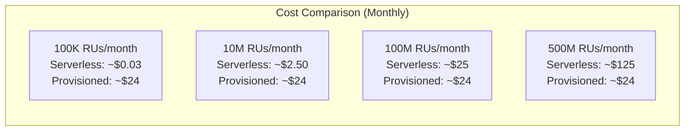

# How to Configure Azure Cosmos DB Serverless for Intermittent Workloads

Author: [nawazdhandala](https://www.github.com/nawazdhandala)

Tags: Azure, Cosmos DB, Serverless, Cost Optimization, NoSQL, Pay-Per-Use

Description: Set up Azure Cosmos DB in serverless mode for workloads with unpredictable or intermittent traffic patterns and only pay for the resources you actually consume.

---

Most Cosmos DB pricing models require you to provision throughput in advance - you pick a number of Request Units per second (RU/s) and pay for that capacity whether you use it or not. For workloads with unpredictable traffic - development environments, side projects, event-driven applications, or services that spike occasionally and sit idle the rest of the time - this provisioned model wastes money. Cosmos DB Serverless solves this by charging only for the RUs you actually consume, with no minimum commitment.

## How Serverless Differs from Provisioned

Here is a quick comparison of the two models:

| Feature | Provisioned Throughput | Serverless |
|---------|----------------------|------------|
| Pricing | Pay per RU/s provisioned | Pay per RU consumed |
| Minimum cost | ~$24/month (400 RU/s) | $0 when idle |
| Max throughput | Up to 1,000,000 RU/s | 5,000 RU/s burst |
| Storage limit | Unlimited | 1 TB per container |
| Multi-region | Yes | Single region only |
| SLA | 99.999% (multi-region) | 99.9% |
| Autoscale | Yes | Not needed (automatic) |

The key tradeoffs are: serverless has lower throughput limits, is single-region only, and has a lower SLA. But for the right workloads, the cost savings are dramatic.

## When to Use Serverless

Serverless is the right choice when:

- **Development and testing environments**: No traffic most of the time, burst during testing
- **Proof of concepts and prototypes**: You do not want to commit to a monthly spend
- **Event-driven architectures**: An Azure Function processes events sporadically
- **Seasonal or periodic workloads**: A reporting job that runs once a day
- **Low-traffic production services**: Internal tools with a handful of users
- **New projects**: You do not know your traffic patterns yet

Serverless is probably not the right choice when:

- You need consistent, high throughput (over 5,000 RU/s)
- You need multi-region distribution
- You need the 99.999% SLA
- Your workload is steady 24/7

## Creating a Serverless Account

Serverless is configured at the account level, not the container level. You cannot mix serverless and provisioned containers in the same account.

### Using Azure Portal

1. Go to the Azure Portal and click Create a resource
2. Search for Azure Cosmos DB
3. Select the API you want (SQL, MongoDB, Cassandra, etc.)
4. In the Capacity mode section, select Serverless
5. Choose your region (only single region is available)
6. Click Review + Create

### Using Azure CLI

```bash
# Create a new Cosmos DB account with serverless capacity mode
az cosmosdb create \
    --name myServerlessAccount \
    --resource-group myResourceGroup \
    --locations regionName=eastus \
    --capabilities EnableServerless
```

### Using Bicep/ARM Template

```json
{
    "type": "Microsoft.DocumentDB/databaseAccounts",
    "apiVersion": "2023-04-15",
    "name": "myServerlessAccount",
    "location": "eastus",
    "properties": {
        "databaseAccountOfferType": "Standard",
        "locations": [
            {
                "locationName": "eastus",
                "failoverPriority": 0
            }
        ],
        "capabilities": [
            {
                "name": "EnableServerless"
            }
        ]
    }
}
```

## Creating Databases and Containers

Creating databases and containers in a serverless account works the same as provisioned, except you do not specify any throughput:

```bash
# Create a database (no throughput specification needed)
az cosmosdb sql database create \
    --account-name myServerlessAccount \
    --name mydb \
    --resource-group myResourceGroup

# Create a container (no throughput specification needed)
az cosmosdb sql container create \
    --account-name myServerlessAccount \
    --database-name mydb \
    --name orders \
    --partition-key-path "/customerId" \
    --resource-group myResourceGroup
```

Notice there is no `--throughput` or `--max-throughput` parameter. The container automatically scales up and down based on demand.

### Using the .NET SDK

```csharp
// Create a database and container in serverless mode
// No throughput specification is needed
CosmosClient client = new CosmosClient(endpoint, key);

// Create database
Database database = await client.CreateDatabaseIfNotExistsAsync("mydb");

// Create container - no throughput parameter
ContainerProperties containerProperties = new ContainerProperties
{
    Id = "orders",
    PartitionKeyPath = "/customerId"
};

// Note: Do NOT pass a throughput value for serverless containers
Container container = await database.CreateContainerIfNotExistsAsync(containerProperties);
Console.WriteLine($"Container created: {container.Id}");
```

## Working with Serverless Containers

Day-to-day operations are identical to provisioned containers. Your application code does not need to change at all:

```csharp
// Write a document - works exactly the same as provisioned
var order = new
{
    id = Guid.NewGuid().ToString(),
    customerId = "cust-123",
    product = "Widget",
    quantity = 5,
    price = 29.99,
    orderDate = DateTime.UtcNow
};

ItemResponse<dynamic> response = await container.CreateItemAsync(
    item: order,
    partitionKey: new PartitionKey("cust-123")
);

// The RU charge for this operation
Console.WriteLine($"Write cost: {response.RequestCharge} RUs");

// Query documents - also identical to provisioned
FeedIterator<dynamic> iterator = container.GetItemQueryIterator<dynamic>(
    queryText: "SELECT * FROM c WHERE c.customerId = @customerId",
    requestOptions: new QueryRequestOptions
    {
        PartitionKey = new PartitionKey("cust-123")
    }
);

double totalRUs = 0;
while (iterator.HasMoreResults)
{
    FeedResponse<dynamic> batch = await iterator.ReadNextAsync();
    totalRUs += batch.RequestCharge;
    foreach (var item in batch)
    {
        Console.WriteLine($"Order: {item.id}");
    }
}
Console.WriteLine($"Query cost: {totalRUs} RUs");
```

## Understanding Serverless Pricing

With serverless, you pay for:

1. **Request Units consumed**: Every read, write, and query has an RU cost. You are billed for the total RUs consumed across all operations.

2. **Storage**: You pay per GB of data stored, same as provisioned accounts.

The RU pricing as of 2026 is approximately $0.25 per million RUs consumed. Compare this to provisioned throughput at 400 RU/s which costs about $24/month regardless of usage.

Here is a cost comparison for different usage levels:



The breakeven point is roughly around 100 million RUs per month. Below that, serverless is cheaper. Above that, provisioned throughput wins.

## Handling Burst Limits

Serverless containers can burst up to 5,000 RU/s. If your application temporarily needs more than that, requests will be throttled with HTTP 429 responses. Handle this in your code:

```csharp
// Handle throttling with retry logic
// The SDK has built-in retry, but you can customize it
CosmosClient client = new CosmosClient(endpoint, key, new CosmosClientOptions
{
    // Maximum number of retries on throttled requests
    MaxRetryAttemptsOnRateLimitedRequests = 10,

    // Maximum wait time for retries
    MaxRetryWaitTimeOnRateLimitedRequests = TimeSpan.FromSeconds(30)
});
```

If you are consistently hitting the 5,000 RU/s limit, it is a signal that your workload might be better served by provisioned throughput with autoscale.

## Migrating from Provisioned to Serverless

You cannot convert an existing provisioned account to serverless or vice versa. Migration requires creating a new serverless account and copying data.

```bash
# Step 1: Create a new serverless account
az cosmosdb create \
    --name myNewServerlessAccount \
    --resource-group myResourceGroup \
    --locations regionName=eastus \
    --capabilities EnableServerless

# Step 2: Use Data Migration Tool or Azure Data Factory to copy data
# Or use the Cosmos DB live data migrator
```

For small datasets, you can use the Cosmos DB Data Migration Tool. For larger datasets, Azure Data Factory with a Cosmos DB source and sink works well.

## Monitoring Serverless Usage

Track your RU consumption to understand costs:

```bash
# Check total RU consumption over the last hour
az monitor metrics list \
    --resource "/subscriptions/{sub}/resourceGroups/{rg}/providers/Microsoft.DocumentDB/databaseAccounts/myServerlessAccount" \
    --metric "TotalRequestUnits" \
    --interval PT1H \
    --aggregation Total
```

In the Azure Portal, useful metrics to watch:

- **Total Request Units**: Your cumulative RU consumption (directly maps to cost)
- **Total Requests**: Number of operations
- **429 responses**: Throttled requests (you might be hitting the burst limit)
- **Data Usage**: Storage consumption

## Serverless with Azure Functions

Serverless Cosmos DB pairs naturally with Azure Functions for event-driven architectures:

```csharp
// Azure Function triggered by HTTP that writes to serverless Cosmos DB
[FunctionName("CreateOrder")]
public static async Task<IActionResult> Run(
    [HttpTrigger(AuthorizationLevel.Function, "post")] HttpRequest req,
    [CosmosDB(
        databaseName: "mydb",
        containerName: "orders",
        Connection = "CosmosDBConnection")] IAsyncCollector<dynamic> ordersOut,
    ILogger log)
{
    string requestBody = await new StreamReader(req.Body).ReadToEndAsync();
    dynamic order = JsonConvert.DeserializeObject(requestBody);
    order.id = Guid.NewGuid().ToString();

    // Write to serverless Cosmos DB - only charged for RUs consumed
    await ordersOut.AddAsync(order);

    log.LogInformation($"Order created: {order.id}");
    return new OkObjectResult(new { id = order.id });
}
```

Both the Function and the database scale to zero when idle and only cost money when processing requests. For intermittent workloads, this combination is extremely cost-effective.

## Limitations to Be Aware Of

Before choosing serverless, understand these limitations:

1. **Single region only**: No multi-region replication or geo-redundancy
2. **1 TB storage per container**: Provisioned containers have no practical limit
3. **5,000 RU/s burst ceiling**: Provisioned can go up to 1,000,000 RU/s
4. **No shared throughput databases**: Each container gets independent throughput
5. **No continuous backup**: Only periodic backup is supported
6. **Cannot convert to provisioned**: You need to create a new account to switch

Serverless Cosmos DB is a perfect fit for the many workloads that do not need always-on throughput. Development environments, low-traffic services, event-driven processing, and prototypes all benefit from the pay-per-use model. Start serverless and upgrade to provisioned only when your traffic patterns justify the commitment.
