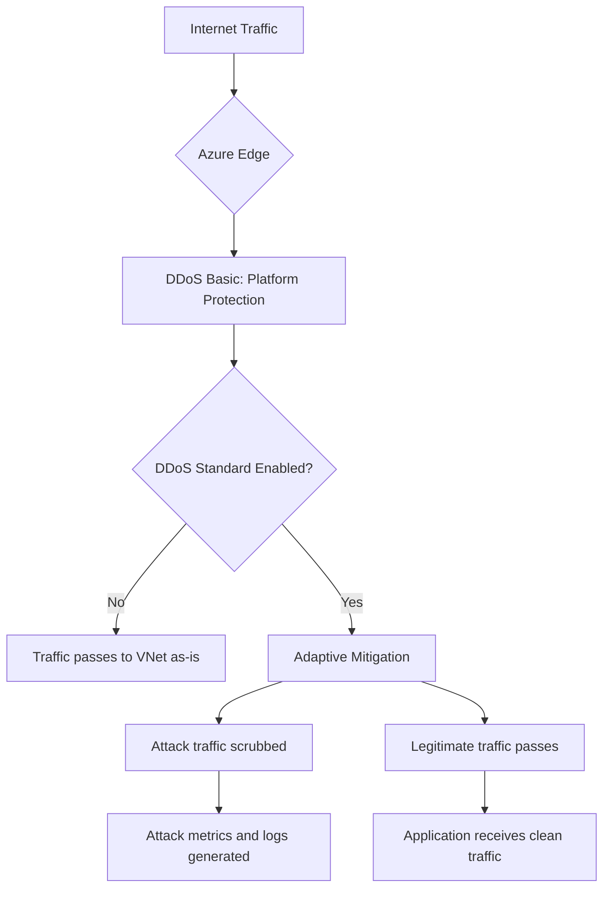

# How to Configure Azure DDoS Protection Standard and Set Up Alerts for Attack Mitigation

Author: [nawazdhandala](https://www.github.com/nawazdhandala)

Tags: Azure, DDoS Protection, Network Security, Azure Monitor, Alerts, Mitigation, Public IP

Description: Learn how to enable Azure DDoS Protection Standard, configure it for your virtual networks, and set up alerting to monitor attack mitigation in real time.

---

Distributed Denial of Service (DDoS) attacks are one of the most disruptive threats to any internet-facing application. Azure provides two tiers of DDoS protection - Basic (free, enabled by default) and Standard (paid, with advanced capabilities). While Basic protection handles common network-layer attacks, DDoS Protection Standard provides adaptive tuning based on your specific traffic patterns, real-time attack metrics, detailed diagnostics, and cost protection guarantees.

This guide walks through enabling DDoS Protection Standard, associating it with your resources, and setting up alerts so you know immediately when an attack is being mitigated.

## DDoS Protection Basic vs. Standard

Understanding the difference helps justify the cost of Standard:

| Feature | Basic (Free) | Standard (Paid) |
|---|---|---|
| Protection level | Platform-level, always on | Adaptive, application-specific |
| Traffic monitoring | No per-resource monitoring | Per-resource monitoring and metrics |
| Attack alerts | No | Yes, real-time |
| Diagnostics & logging | No | Full mitigation reports |
| Cost protection | No | Yes, DDoS cost credit during attacks |
| Rapid response support | No | DDoS Rapid Response (DRR) team access |
| Custom policies | No | Application-specific tuning |



## Prerequisites

Before enabling DDoS Protection Standard:

- Azure subscription with Contributor or Network Contributor role
- At least one virtual network with public IP addresses to protect
- Budget approval - DDoS Protection Standard costs approximately $2,944 per month per DDoS protection plan, plus data processing charges
- Understanding that the plan protects up to 100 public IP resources (additional IPs cost extra)

## Step 1: Create a DDoS Protection Plan

### Via the Azure Portal

1. Navigate to the Azure portal.
2. Search for "DDoS protection plans" and click on it.
3. Click Create.
4. Configure:
   - **Subscription**: Select your subscription
   - **Resource group**: Choose or create a resource group
   - **Name**: Give it a descriptive name like "ddos-protection-plan"
   - **Region**: Select the region closest to your resources
5. Click Review + create, then Create.

### Via PowerShell

```powershell
# Create a DDoS Protection Plan
$ddosPlan = New-AzDdosProtectionPlan `
    -ResourceGroupName "networking-rg" `
    -Name "ddos-protection-plan" `
    -Location "eastus"

Write-Host "DDoS Protection Plan created:"
Write-Host "  Name: $($ddosPlan.Name)"
Write-Host "  Resource ID: $($ddosPlan.Id)"
```

### Via Azure CLI

```bash
# Create a DDoS protection plan
az network ddos-protection create \
    --resource-group networking-rg \
    --name ddos-protection-plan \
    --location eastus
```

## Step 2: Associate the Plan with Virtual Networks

The DDoS protection plan needs to be associated with your virtual networks. All public IP resources within an associated VNet are automatically protected.

```powershell
# Associate the DDoS Protection Plan with a virtual network
$ddosPlan = Get-AzDdosProtectionPlan `
    -ResourceGroupName "networking-rg" `
    -Name "ddos-protection-plan"

$vnet = Get-AzVirtualNetwork `
    -ResourceGroupName "production-rg" `
    -Name "production-vnet"

# Enable DDoS protection on the VNet
$vnet.DdosProtectionPlan = @{ Id = $ddosPlan.Id }
$vnet.EnableDdosProtection = $true

# Apply the changes
$vnet | Set-AzVirtualNetwork

Write-Host "DDoS Protection enabled on $($vnet.Name)"
```

To protect multiple VNets:

```powershell
# Associate DDoS protection with all production VNets
$ddosPlan = Get-AzDdosProtectionPlan -ResourceGroupName "networking-rg" -Name "ddos-protection-plan"

$vnets = Get-AzVirtualNetwork | Where-Object {
    $_.Name -like "prod-*" -or $_.ResourceGroupName -like "production-*"
}

foreach ($vnet in $vnets) {
    $vnet.DdosProtectionPlan = @{ Id = $ddosPlan.Id }
    $vnet.EnableDdosProtection = $true
    $vnet | Set-AzVirtualNetwork
    Write-Host "Protected: $($vnet.Name) in $($vnet.ResourceGroupName)"
}
```

## Step 3: Verify Protection on Public IPs

Check which public IP addresses are now protected:

```powershell
# List all public IPs and their DDoS protection status
$publicIPs = Get-AzPublicIpAddress

foreach ($pip in $publicIPs) {
    # Get the VNet associated with this public IP (through NIC/LB)
    $protected = $false

    if ($pip.IpConfiguration) {
        # The public IP is attached to something - check the VNet
        $nicId = $pip.IpConfiguration.Id
        if ($nicId -match "networkInterfaces") {
            $nicName = ($nicId -split '/')[-3]
            $nicRg = ($nicId -split '/')[4]
            $nic = Get-AzNetworkInterface -Name $nicName -ResourceGroupName $nicRg
            $subnetId = $nic.IpConfigurations[0].Subnet.Id
            $vnetName = ($subnetId -split '/')[8]
            $vnetRg = ($subnetId -split '/')[4]
            $vnet = Get-AzVirtualNetwork -Name $vnetName -ResourceGroupName $vnetRg
            $protected = $vnet.EnableDdosProtection
        }
    }

    $status = if ($protected) { "PROTECTED" } else { "NOT PROTECTED" }
    Write-Host "$($pip.Name) ($($pip.IpAddress)) - $status"
}
```

## Step 4: Configure DDoS Protection Metrics and Diagnostics

Enable diagnostic logging on your public IP addresses to capture DDoS mitigation data:

```powershell
# Enable diagnostic settings on a public IP for DDoS metrics
$publicIP = Get-AzPublicIpAddress -Name "web-app-pip" -ResourceGroupName "production-rg"
$workspace = Get-AzOperationalInsightsWorkspace -ResourceGroupName "monitoring-rg" -Name "central-log-analytics"

# Create diagnostic setting to capture DDoS-specific logs and metrics
Set-AzDiagnosticSetting `
    -ResourceId $publicIP.Id `
    -Name "ddos-diagnostics" `
    -WorkspaceId $workspace.ResourceId `
    -Enabled $true `
    -Category @("DDoSProtectionNotifications", "DDoSMitigationFlowLogs", "DDoSMitigationReports") `
    -MetricCategory @("AllMetrics")

Write-Host "DDoS diagnostics enabled for $($publicIP.Name)"
```

The three log categories provide different levels of detail:

- **DDoSProtectionNotifications**: Alerts when mitigation starts and stops
- **DDoSMitigationFlowLogs**: Detailed per-flow information during an attack (very detailed)
- **DDoSMitigationReports**: Summary reports after mitigation completes

## Step 5: Set Up DDoS Attack Alerts

Configure alerts that fire when a DDoS attack is detected:

### Alert on Mitigation Triggered

```powershell
# Create an alert that fires when DDoS mitigation is triggered on any public IP
$publicIP = Get-AzPublicIpAddress -Name "web-app-pip" -ResourceGroupName "production-rg"

# Create the metric alert condition
# The "IfUnderDDoSAttack" metric equals 1 when an attack is active
$condition = New-AzMetricAlertRuleV2Criteria `
    -MetricName "IfUnderDDoSAttack" `
    -MetricNameSpace "Microsoft.Network/publicIPAddresses" `
    -TimeAggregation Maximum `
    -Operator GreaterThanOrEqual `
    -Threshold 1

# Create an action group for notifications
$emailReceiver = New-AzActionGroupReceiver `
    -Name "SecurityTeam" `
    -EmailAddress "security-team@contoso.com"

$actionGroup = Set-AzActionGroup `
    -ResourceGroupName "monitoring-rg" `
    -Name "ddos-alert-group" `
    -ShortName "DDoSAlert" `
    -Receiver $emailReceiver

# Create the alert rule
Add-AzMetricAlertRuleV2 `
    -Name "DDoS Attack Detected" `
    -ResourceGroupName "monitoring-rg" `
    -WindowSize (New-TimeSpan -Minutes 5) `
    -Frequency (New-TimeSpan -Minutes 1) `
    -TargetResourceId $publicIP.Id `
    -Condition $condition `
    -ActionGroupId $actionGroup.Id `
    -Severity 0 `
    -Description "A DDoS attack has been detected and mitigation is active."

Write-Host "DDoS attack alert configured."
```

### Alert on High Packet Drop Rate

```powershell
# Alert when the inbound packet drop rate exceeds a threshold
# This indicates significant attack traffic is being mitigated
$condition = New-AzMetricAlertRuleV2Criteria `
    -MetricName "DDoSTriggerTCPPackets" `
    -MetricNameSpace "Microsoft.Network/publicIPAddresses" `
    -TimeAggregation Maximum `
    -Operator GreaterThan `
    -Threshold 100000  # Adjust based on your normal traffic volume

Add-AzMetricAlertRuleV2 `
    -Name "High DDoS Packet Rate" `
    -ResourceGroupName "monitoring-rg" `
    -WindowSize (New-TimeSpan -Minutes 5) `
    -Frequency (New-TimeSpan -Minutes 1) `
    -TargetResourceId $publicIP.Id `
    -Condition $condition `
    -ActionGroupId $actionGroup.Id `
    -Severity 1 `
    -Description "High TCP packet rate detected - possible DDoS attack ramping up."

Write-Host "Packet rate alert configured."
```

## Step 6: Monitor During an Attack

When a DDoS attack is active, you can monitor the mitigation in real time:

1. Go to the public IP resource in the Azure portal.
2. Click on Metrics.
3. Add the following metrics:
   - **Under DDoS attack or not** (1 = under attack)
   - **Inbound packets dropped DDoS** (packets being scrubbed)
   - **Inbound packets forwarded DDoS** (clean traffic reaching your app)
   - **Inbound TCP packets DDoS** (total TCP packets arriving)

You can also query mitigation details in Log Analytics:

```kusto
// Query DDoS mitigation flow logs during an active attack
// Shows what traffic is being dropped vs forwarded
AzureDiagnostics
| where Category == "DDoSMitigationFlowLogs"
| where TimeGenerated > ago(1h)
| extend SourceIP = tostring(parse_json(properties_s).sourceIP)
| extend DestIP = tostring(parse_json(properties_s).destIP)
| extend DestPort = tostring(parse_json(properties_s).destPort)
| extend Protocol = tostring(parse_json(properties_s).protocol)
| extend MitigationAction = tostring(parse_json(properties_s).action)
| summarize FlowCount = count() by MitigationAction, Protocol, bin(TimeGenerated, 5m)
| render timechart
```

## Step 7: Review Post-Attack Reports

After an attack ends, review the mitigation report:

```kusto
// Get DDoS mitigation reports for post-attack analysis
AzureDiagnostics
| where Category == "DDoSMitigationReports"
| where TimeGenerated > ago(7d)
| extend AttackVectors = tostring(parse_json(properties_s).attackVectors)
| extend MitigationPeriod = tostring(parse_json(properties_s).mitigationPeriod)
| extend MaxAttackBandwidthMbps = tostring(parse_json(properties_s).maxAttackBandwidthInMbps)
| extend MaxPacketsPerSec = tostring(parse_json(properties_s).maxPacketsPerSecond)
| project
    TimeGenerated,
    AttackVectors,
    MitigationPeriod,
    MaxAttackBandwidthMbps,
    MaxPacketsPerSec
```

## DDoS Cost Protection

One often-overlooked benefit of DDoS Protection Standard is cost protection. During a DDoS attack, your resources may scale out (auto-scaling VMs, Application Gateway, etc.), incurring additional costs. Microsoft provides service credits for:

- Azure VM scale out costs
- Application Gateway with WAF data processing
- Public IP address costs
- Azure CDN data transfer

To claim credits, file a support request within 30 days of the attack with the mitigation report as evidence.

## Conclusion

Azure DDoS Protection Standard provides enterprise-grade DDoS protection that goes well beyond the basic platform protection. The setup involves creating a DDoS protection plan, associating it with your virtual networks, enabling diagnostics on public IP addresses, and configuring alerts for real-time notification during attacks. While the monthly cost is significant, the protection it provides against volumetric, protocol, and application-layer attacks, combined with the cost protection guarantee and access to the DDoS Rapid Response team, makes it essential for organizations running internet-facing workloads in Azure. Set up your alerts and diagnostics before an attack happens, not during one.
