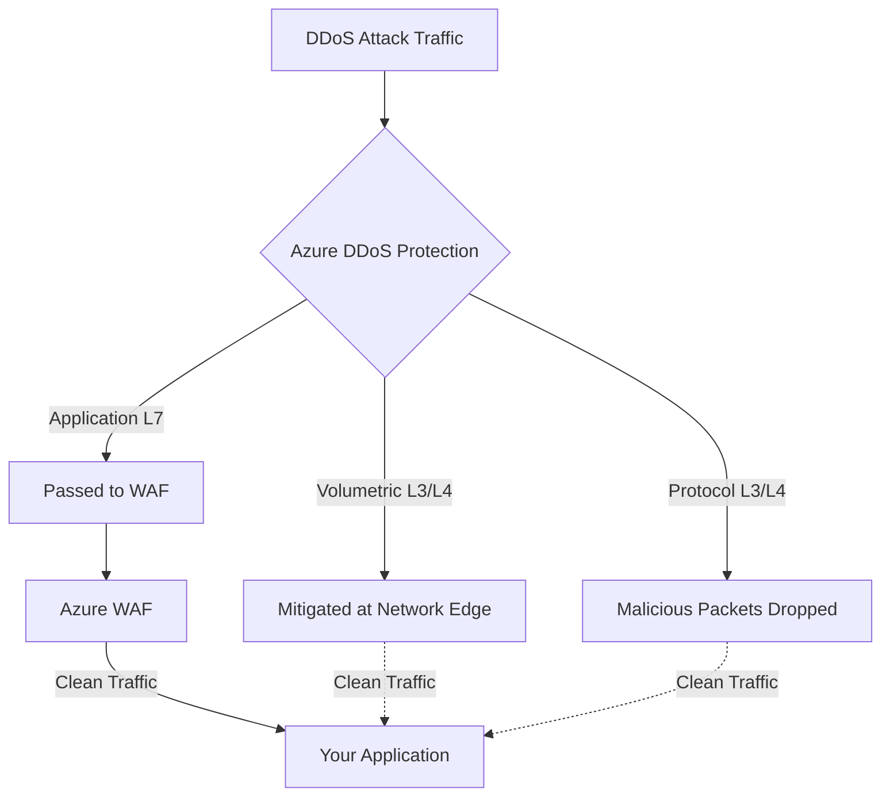

# How to Configure Azure DDoS Protection Standard for Internet-Facing Workloads

Author: [nawazdhandala](https://www.github.com/nawazdhandala)

Tags: Azure, DDoS Protection, Network Security, Internet-Facing, Azure Networking, Security, Infrastructure Protection

Description: Configure Azure DDoS Protection Standard to defend internet-facing workloads against volumetric, protocol, and application-layer DDoS attacks.

---

Every internet-facing workload is a potential DDoS target. It is not a matter of if but when. Azure provides basic DDoS protection for free on all public IPs, but this basic tier only mitigates common volumetric attacks. For workloads that matter to your business, Azure DDoS Protection Standard provides significantly more comprehensive protection, including adaptive tuning, attack analytics, and a cost protection guarantee.

I have helped several organizations configure DDoS Protection Standard after experiencing attacks that the basic tier could not mitigate. Setting it up is straightforward, but configuring it correctly for your specific workload requires understanding what types of attacks you need to defend against and how the protection mechanisms work.

## Basic vs Standard DDoS Protection

Azure DDoS Basic protection is automatically enabled for all Azure public IP addresses at no extra cost. It provides platform-level protection against common volumetric attacks (large volumes of traffic designed to overwhelm your network bandwidth).

DDoS Protection Standard adds:
- **Adaptive tuning**: Learns your traffic patterns and tunes detection thresholds specifically for your workload
- **Attack analytics**: Detailed telemetry and reporting on attacks
- **DDoS Rapid Response (DRR)**: Access to Microsoft's DDoS experts during active attacks
- **Cost protection**: Credit for Azure resources that scale up during an attack
- **WAF integration**: Works with Azure Web Application Firewall for application-layer protection
- **Alert integration**: Native integration with Azure Monitor for attack notifications

## Enabling DDoS Protection Standard

DDoS Protection Standard is enabled at the Virtual Network level through a DDoS Protection Plan. One plan can protect multiple VNets across subscriptions.

```bash
# Create a DDoS Protection Plan
az network ddos-protection create \
  --resource-group rg-security \
  --name ddos-plan-production \
  --location eastus2

# Associate the plan with a Virtual Network
az network vnet update \
  --resource-group rg-production \
  --name vnet-production \
  --ddos-protection-plan "/subscriptions/{sub-id}/resourceGroups/rg-security/providers/Microsoft.Network/ddosProtectionPlans/ddos-plan-production" \
  --ddos-protection true
```

Once the plan is associated with a VNet, all public IP resources within that VNet are protected. This includes public IPs on VMs, load balancers, Application Gateways, Azure Firewall, and VPN Gateways.

## Understanding What DDoS Protection Standard Covers

DDoS attacks come in three categories, and Standard protects against all of them:

**Volumetric attacks** (Layer 3/4) flood your network with massive amounts of traffic. Examples include UDP floods, ICMP floods, and amplification attacks. These aim to saturate your network bandwidth. DDoS Protection Standard mitigates these by absorbing the attack traffic at the Azure network edge before it reaches your resources.

**Protocol attacks** (Layer 3/4) exploit weaknesses in network protocols. SYN floods, ping-of-death attacks, and fragmented packet attacks fall into this category. Standard protection detects and drops these malicious packets while allowing legitimate traffic through.

**Application-layer attacks** (Layer 7) target specific application endpoints with seemingly legitimate requests. HTTP floods and slow-rate attacks are examples. DDoS Protection Standard provides some Layer 7 protection, but for comprehensive application-layer defense, you should combine it with Azure Web Application Firewall (WAF).



## Configuring Alerts for DDoS Events

Set up alerts so your team knows immediately when an attack starts and when it ends.

```bash
# Create an alert for when DDoS mitigation is triggered on a public IP
az monitor metrics alert create \
  --name "ddos-attack-detected" \
  --resource-group rg-security \
  --scopes "/subscriptions/{sub-id}/resourceGroups/rg-production/providers/Microsoft.Network/publicIPAddresses/pip-app-gateway" \
  --condition "max IfUnderDDoSAttack > 0" \
  --window-size 5m \
  --evaluation-frequency 1m \
  --severity 1 \
  --description "DDoS attack detected on production public IP" \
  --action "/subscriptions/{sub-id}/resourceGroups/rg-security/providers/microsoft.insights/actionGroups/ag-security-team"
```

Also configure alerts for metrics that indicate an attack is in progress:

```bash
# Alert on high packet count (potential volumetric attack)
az monitor metrics alert create \
  --name "ddos-high-packet-rate" \
  --resource-group rg-security \
  --scopes "/subscriptions/{sub-id}/resourceGroups/rg-production/providers/Microsoft.Network/publicIPAddresses/pip-app-gateway" \
  --condition "max PacketCount > 1000000" \
  --window-size 5m \
  --evaluation-frequency 1m \
  --severity 2 \
  --action "/subscriptions/{sub-id}/resourceGroups/rg-security/providers/microsoft.insights/actionGroups/ag-security-team"
```

## Enabling Diagnostic Logging

DDoS diagnostic logs provide detailed information about attack traffic, including top source IPs, attack vectors, and dropped packet counts.

```bash
# Enable diagnostic logging for a protected public IP
az monitor diagnostic-settings create \
  --name "ddos-diagnostics" \
  --resource "/subscriptions/{sub-id}/resourceGroups/rg-production/providers/Microsoft.Network/publicIPAddresses/pip-app-gateway" \
  --workspace "/subscriptions/{sub-id}/resourceGroups/rg-monitoring/providers/Microsoft.OperationalInsights/workspaces/law-security" \
  --logs '[
    {"category":"DDoSProtectionNotifications","enabled":true},
    {"category":"DDoSMitigationFlowLogs","enabled":true},
    {"category":"DDoSMitigationReports","enabled":true}
  ]'
```

During an attack, query the mitigation flow logs to understand the attack characteristics.

```
// KQL query to analyze DDoS attack traffic during mitigation
AzureDiagnostics
| where Category == "DDoSMitigationFlowLogs"
| where TimeGenerated > ago(1h)
| summarize
    TotalPackets = sum(toint(packetCount_d)),
    DroppedPackets = sumif(toint(packetCount_d), action_s == "Dropped")
  by bin(TimeGenerated, 1m), sourceIP_s
| order by TotalPackets desc
| take 50
```

## Combining DDoS Protection with WAF

For complete protection, deploy Azure Web Application Firewall (WAF) on Application Gateway or Front Door in front of your application, and enable DDoS Protection Standard on the VNet.

DDoS Protection Standard handles the volumetric and protocol attacks. WAF handles the application-layer attacks. Together, they provide defense in depth.

```bash
# The architecture: Public IP -> DDoS Protection -> Application Gateway with WAF -> Backend
# DDoS Protection is automatic once the VNet is associated with a DDoS Plan
# WAF needs to be configured on the Application Gateway

# Verify Application Gateway has WAF enabled
az network application-gateway show \
  --resource-group rg-production \
  --name appgw-production \
  --query "{sku:sku.name, wafEnabled:webApplicationFirewallConfiguration.enabled}" \
  -o json
```

## Adaptive Tuning and Traffic Profiling

DDoS Protection Standard continuously profiles your traffic to establish a baseline of normal activity. When traffic deviates significantly from this baseline, mitigation is triggered.

The profiling takes about 30 days to build an accurate baseline. During this period, the system uses conservative thresholds that may result in either false positives (legitimate traffic incorrectly mitigated) or false negatives (attack traffic not caught).

To help the system learn your traffic patterns:
- Enable DDoS Protection before you expect an attack, not during one
- Ensure your normal traffic patterns are representative during the profiling period
- If you have planned traffic spikes (marketing campaigns, product launches), consider adjusting the policy thresholds temporarily

## Cost Protection

DDoS Protection Standard includes a cost protection guarantee. If your Azure resources scale up during a DDoS attack (for example, autoscaling adds more VMs), Microsoft credits the incremental cost. To take advantage of this:

1. You must have DDoS Protection Standard enabled before the attack
2. You must file a cost protection claim within 30 days of the attack
3. Azure Rapid Response team must confirm it was a DDoS attack

## Pricing Considerations

DDoS Protection Standard is not cheap. The plan costs approximately $2,944 per month (as of early 2026), plus additional charges per protected public IP and data processing. This is a fixed monthly cost regardless of whether you experience an attack.

For cost-sensitive organizations, consider:
- Using one DDoS Protection Plan across multiple subscriptions and VNets
- Only associating VNets that contain internet-facing resources with the plan
- Using Azure Front Door with built-in DDoS protection instead of DDoS Protection Standard for web-only workloads

DDoS Protection Standard is essential for any workload where a DDoS attack would cause significant business impact. The cost is high, but it is a fraction of the cost of a successful DDoS attack that takes your services offline. Configure it proactively, set up alerts and diagnostics, and combine it with WAF for comprehensive protection.
