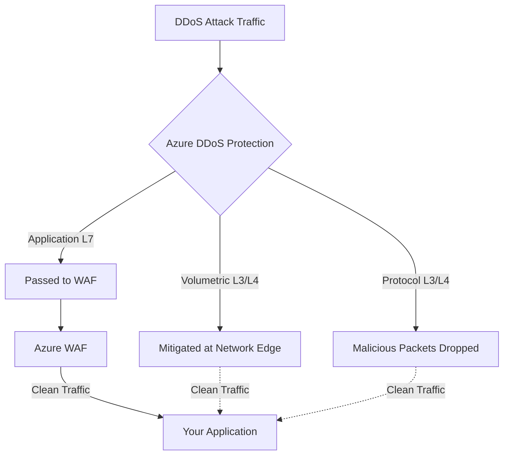

# How to Configure Azure DDoS Protection Standard for Internet-Facing Workloads

Author: [nawazdhandala](https://www.github.com/nawazdhandala)

Tags: Azure, DDoS Protection, Network Security, Internet-Facing, Azure Networking, Security, Infrastructure Protection

Description: Configure Azure DDoS Protection Standard to defend internet-facing workloads against volumetric, protocol, and application-layer DDoS attacks.

---

Every internet-facing workload is a potential DDoS target. It is not a matter of if but when. Azure provides infrastructure-level DDoS protection at no extra cost for Azure services that use public IPv4 and IPv6 addresses, but this default protection is not tuned to your specific workload. For workloads that matter to your business, Azure DDoS Network Protection provides significantly more comprehensive protection, including adaptive tuning, attack analytics, and a cost protection guarantee.

I have helped several organizations configure DDoS Network Protection after experiencing attacks that the default infrastructure protection could not mitigate. Setting it up is straightforward, but configuring it correctly for your specific workload requires understanding what types of attacks you need to defend against and how the protection mechanisms work.

## Infrastructure vs Network DDoS Protection

Azure DDoS infrastructure protection is automatically enabled for Azure services that use public IPv4 and IPv6 addresses at no extra cost. It provides platform-level protection against common network-layer attacks.

DDoS Network Protection adds:
- **Adaptive tuning**: Learns your traffic patterns and tunes detection thresholds specifically for your workload
- **Attack analytics**: Detailed telemetry and reporting on attacks
- **DDoS Rapid Response (DRR)**: Access to Microsoft's DDoS experts during active attacks
- **Cost protection**: Credit for Azure resources that scale up during an attack
- **WAF discount and integration**: Works with Azure Web Application Firewall for application-layer protection
- **Alert integration**: Native integration with Azure Monitor for attack notifications

## Enabling DDoS Network Protection

DDoS Network Protection is enabled at the Virtual Network level through a DDoS Protection Plan. One plan can protect multiple VNets across subscriptions in the same tenant.

```bash
# Create a DDoS Protection Plan

az network ddos-protection create \
  --resource-group rg-security \
  --name ddos-plan-production \
  --location eastus2

# Associate the plan with a Virtual Network
az network vnet update \
  --resource-group rg-production \
  --name vnet-production \
  --ddos-protection-plan "/subscriptions/{sub-id}/resourceGroups/rg-security/providers/Microsoft.Network/ddosProtectionPlans/ddos-plan-production" \
  --ddos-protection true
```

Once the plan is associated with a VNet, supported public IP resources within that VNet are protected. This includes public IPs on VMs, load balancers, Application Gateways, Azure Firewall, and VPN Gateways. VPN gateways are protected by a DDoS policy, but adaptive tuning is not supported for them.

## Understanding What DDoS Network Protection Covers

DDoS attacks come in three categories. DDoS Network Protection protects against Layer 3 and Layer 4 attacks; for Layer 7 application attacks, combine it with a WAF.

**Volumetric attacks** (Layer 3/4) flood your network with massive amounts of traffic. Examples include UDP floods, ICMP floods, and amplification attacks. These aim to saturate your network bandwidth. DDoS Network Protection mitigates these by absorbing the attack traffic at the Azure network edge before it reaches your resources.

**Protocol attacks** (Layer 3/4) exploit weaknesses in network protocols. SYN floods, ping-of-death attacks, and fragmented packet attacks fall into this category. Network Protection detects and drops these malicious packets while allowing legitimate traffic through.

**Application-layer attacks** (Layer 7) target specific application endpoints with seemingly legitimate requests. HTTP floods and slow-rate attacks are examples. DDoS Network Protection does not inspect application-layer payloads, so for application-layer defense, you should combine it with Azure Web Application Firewall (WAF).


```mermaid
graph TD
    A[DDoS Attack Traffic] --> B{Azure DDoS Protection}
    B -->|Volumetric L3/L4| C[Mitigated at Network Edge]
    B -->|Protocol L3/L4| D[Malicious Packets Dropped]
    B -->|Application L7| E[Passed to WAF]
    E --> F[Azure WAF]
    F -->|Clean Traffic| G[Your Application]
    C -.->|Clean Traffic| G
    D -.->|Clean Traffic| G
```

## Configuring Alerts for DDoS Events

Set up alerts so your team knows immediately when an attack starts and when it ends.

```bash
# Create an alert for when DDoS mitigation is triggered on a public IP
az monitor metrics alert create \
  --name "ddos-attack-detected" \
  --resource-group rg-security \
  --scopes "/subscriptions/{sub-id}/resourceGroups/rg-production/providers/Microsoft.Network/publicIPAddresses/pip-app-gateway" \
  --condition "max IfUnderDDoSAttack > 0" \
  --window-size 5m \
  --evaluation-frequency 1m \
  --severity 1 \
  --description "DDoS attack detected on production public IP" \
  --action "/subscriptions/{sub-id}/resourceGroups/rg-security/providers/microsoft.insights/actionGroups/ag-security-team"
```

Also configure alerts for metrics that indicate an attack is in progress:

```bash
# Alert on high packet count (potential volumetric attack)
az monitor metrics alert create \
  --name "ddos-high-packet-rate" \
  --resource-group rg-security \
  --scopes "/subscriptions/{sub-id}/resourceGroups/rg-production/providers/Microsoft.Network/publicIPAddresses/pip-app-gateway" \
  --condition "total PacketCount > 1000000" \
  --window-size 5m \
  --evaluation-frequency 1m \
  --severity 2 \
  --action "/subscriptions/{sub-id}/resourceGroups/rg-security/providers/microsoft.insights/actionGroups/ag-security-team"
```

## Enabling Diagnostic Logging

DDoS diagnostic logs provide detailed information about attack traffic, including top source IPs, attack vectors, and dropped packet counts.

```bash
# Enable diagnostic logging for a protected public IP
az monitor diagnostic-settings create \
  --name "ddos-diagnostics" \
  --resource "/subscriptions/{sub-id}/resourceGroups/rg-production/providers/Microsoft.Network/publicIPAddresses/pip-app-gateway" \
  --workspace "/subscriptions/{sub-id}/resourceGroups/rg-monitoring/providers/Microsoft.OperationalInsights/workspaces/law-security" \
  --logs '[
    {"category":"DDoSProtectionNotifications","enabled":true},
    {"category":"DDoSMitigationFlowLogs","enabled":true},
    {"category":"DDoSMitigationReports","enabled":true}
  ]'
```

During an attack, query the mitigation flow logs to understand the attack characteristics.

```text
// KQL query to analyze DDoS attack traffic during mitigation
AzureDiagnostics
| where Category == "DDoSMitigationFlowLogs"
| where TimeGenerated > ago(1h)
| summarize
    FlowLogRecords = count(),
    Protocols = make_set(Protocol, 10),
    DestinationPorts = make_set(DestPort, 20)
  by bin(TimeGenerated, 1m), SourcePublicIpAddress, DestPublicIpAddress
| order by FlowLogRecords desc
| take 50
```

## Combining DDoS Protection with WAF

For complete protection, deploy Azure Web Application Firewall (WAF) on Application Gateway or Front Door in front of your application, and enable DDoS Network Protection on the VNet that hosts the public origin resources.

DDoS Network Protection handles the volumetric and protocol attacks. WAF handles the application-layer attacks. Together, they provide defense in depth.

```bash
# The architecture: Public IP -> DDoS Protection -> Application Gateway with WAF -> Backend
# DDoS Network Protection is automatic once the VNet is associated with a DDoS Plan
# WAF needs to be configured on the Application Gateway

# Verify Application Gateway has WAF enabled
az network application-gateway show \
  --resource-group rg-production \
  --name appgw-production \
  --query "{sku:sku.name, tier:sku.tier, wafEnabled:webApplicationFirewallConfiguration.enabled, firewallPolicy:firewallPolicy.id}" \
  -o json
```

## Adaptive Tuning and Traffic Profiling

DDoS Network Protection continuously profiles your traffic to establish a baseline of normal activity. When traffic exceeds the automatically tuned policy thresholds, mitigation is triggered.

The service uses machine learning-based traffic profiling to tune TCP SYN, TCP, and UDP mitigation policies for each protected public IP. Protection starts immediately, and the profile adjusts as traffic changes over time.

To help the system learn your traffic patterns:
- Enable DDoS Protection before you expect an attack, not during one
- Ensure your normal traffic patterns are represented as the traffic profile evolves
- If you have planned traffic spikes (marketing campaigns, product launches), plan capacity and WAF/rate-limit rules ahead of time

## Cost Protection

DDoS Network Protection includes a cost protection guarantee. If your Azure resources scale up during a documented DDoS attack (for example, autoscaling adds more VMs), Microsoft credits eligible incremental costs. To take advantage of this:

1. You must have DDoS Network Protection enabled before the attack
2. You must have diagnostic evidence that the scale-out was caused by the attack
3. Azure Rapid Response team must confirm it was a DDoS attack

## Pricing Considerations

DDoS Network Protection is not cheap. It has a fixed monthly plan charge that includes protection for 100 public IP resources, with monthly overage charges for protected public IP resources beyond that included amount. Pricing varies by agreement, region, and currency, so verify the current price in the Azure pricing calculator before committing.

For cost-sensitive organizations, consider:
- Using one DDoS Protection Plan across multiple subscriptions and VNets in the same tenant
- Only associating VNets that contain internet-facing resources with the plan
- Using Azure Front Door with built-in DDoS protection instead of DDoS Network Protection for web-only workloads

DDoS Network Protection is essential for any workload where a DDoS attack would cause significant business impact. The cost is high, but it is a fraction of the cost of a successful DDoS attack that takes your services offline. Configure it proactively, set up alerts and diagnostics, and combine it with WAF for comprehensive protection.
