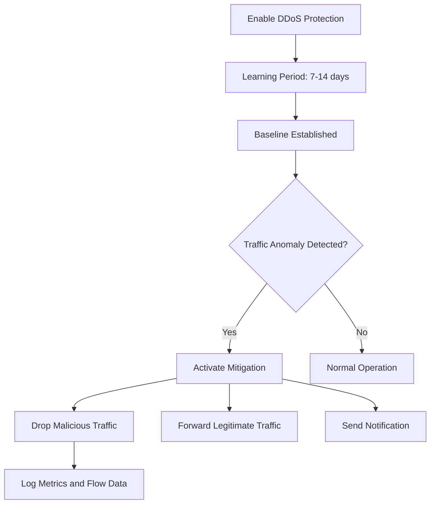

# How to Configure Azure DDoS Protection with Telemetry and Alerting

Author: [nawazdhandala](https://www.github.com/nawazdhandala)

Tags: Azure, DDoS Protection, Security, Telemetry, Alerting, Networking, Monitoring

Description: A step-by-step guide to configuring Azure DDoS Protection with telemetry, diagnostic logging, and alerting to detect and respond to distributed denial-of-service attacks.

---

Distributed denial-of-service attacks are not a matter of if but when. Any public-facing Azure resource is a potential target. Azure provides two tiers of DDoS protection: the basic tier (free, always-on, protects Azure infrastructure) and the DDoS Network Protection tier (paid, protects your specific resources with adaptive tuning, telemetry, and alerting).

The basic tier handles volumetric attacks at the platform level, but it does not give you visibility into what is happening. You will not know you are under attack until your service degrades. DDoS Network Protection adds the telemetry, diagnostics, and alerting that let you see attacks in real time and respond accordingly.

In this post, I will walk through enabling DDoS Protection, configuring telemetry, setting up alerts, and integrating with your monitoring workflow.

## DDoS Protection Tiers Compared

| Feature | Basic (Free) | Network Protection |
|---------|-------------|-------------------|
| Always-on monitoring | Yes | Yes |
| Automatic attack mitigation | Yes | Yes |
| Adaptive tuning to your traffic | No | Yes |
| Attack telemetry and metrics | No | Yes |
| Diagnostic logs | No | Yes |
| Alert notifications | No | Yes |
| DDoS Rapid Response support | No | Yes |
| Cost protection (credits for scaling during attack) | No | Yes |
| WAF discount | No | Yes |

For any production workload, DDoS Network Protection is worth the investment. The adaptive tuning alone makes a significant difference because it learns your normal traffic patterns and sets mitigation thresholds accordingly.

## Step 1: Create a DDoS Protection Plan

```bash
# Create a DDoS Protection Plan
az network ddos-protection create \
  --resource-group myResourceGroup \
  --name myDDoSPlan \
  --location eastus
```

A single DDoS plan can protect resources across multiple VNets and subscriptions. You do not need one plan per VNet.

## Step 2: Associate the Plan with Your VNet

```bash
# Associate the DDoS plan with your VNet
az network vnet update \
  --resource-group myResourceGroup \
  --name myVNet \
  --ddos-protection true \
  --ddos-protection-plan myDDoSPlan
```

After this, all public IP addresses in the VNet are protected by DDoS Network Protection. The protection applies to Standard SKU public IPs automatically.

## Step 3: Verify Protected Resources

Check which public IPs are protected:

```bash
# List public IPs in the VNet and their protection status
az network public-ip list \
  --resource-group myResourceGroup \
  --query "[].{name:name, ip:ipAddress, sku:sku.name, protection:ddosSettings.protectionMode}" \
  --output table
```

Only Standard SKU public IPs receive DDoS Network Protection. Basic SKU IPs are not eligible.

## Step 4: Enable Diagnostic Logging

This is where the telemetry comes in. Enable diagnostic settings on your protected public IPs to capture DDoS-related logs:

```bash
# Enable diagnostic logging for a protected public IP
az monitor diagnostic-settings create \
  --resource "/subscriptions/<sub-id>/resourceGroups/myResourceGroup/providers/Microsoft.Network/publicIPAddresses/myPublicIP" \
  --name ddosDiagnostics \
  --workspace myLogAnalyticsWorkspace \
  --logs '[
    {"category":"DDoSProtectionNotifications","enabled":true},
    {"category":"DDoSMitigationFlowLogs","enabled":true},
    {"category":"DDoSMitigationReports","enabled":true}
  ]' \
  --metrics '[{"category":"AllMetrics","enabled":true}]'
```

The three log categories:

- **DDoSProtectionNotifications:** Alerts when an attack starts and stops. This is the most important log for operational awareness.
- **DDoSMitigationFlowLogs:** Detailed packet-level information during an active attack. Useful for post-incident analysis.
- **DDoSMitigationReports:** Summary reports after mitigation completes. Includes attack vectors, peak traffic, and duration.

## Step 5: Configure DDoS Metrics

Azure Monitor provides real-time metrics for DDoS-protected resources. Key metrics include:

- **Under DDoS attack or not:** Binary indicator (0 or 1)
- **Inbound packets dropped (DDoS):** Packets dropped during mitigation
- **Inbound packets forwarded (DDoS):** Legitimate packets allowed through
- **Inbound bytes dropped (DDoS):** Volume of malicious traffic dropped
- **Inbound TCP/UDP/SYN packets:** Protocol-specific metrics

View metrics from the CLI:

```bash
# Check if currently under attack
az monitor metrics list \
  --resource "/subscriptions/<sub-id>/resourceGroups/myResourceGroup/providers/Microsoft.Network/publicIPAddresses/myPublicIP" \
  --metric "IfUnderDDoSAttack" \
  --interval PT1M \
  --output table

# Check inbound packets dropped during mitigation
az monitor metrics list \
  --resource "/subscriptions/<sub-id>/resourceGroups/myResourceGroup/providers/Microsoft.Network/publicIPAddresses/myPublicIP" \
  --metric "DDoSDroppedPackets" \
  --interval PT5M \
  --aggregation Total \
  --output table
```

## Step 6: Set Up Attack Alerts

Configure alerts to notify your team when a DDoS attack is detected:

```bash
# Alert when a DDoS attack is detected
az monitor metrics alert create \
  --resource-group myResourceGroup \
  --name ddosAttackAlert \
  --scopes "/subscriptions/<sub-id>/resourceGroups/myResourceGroup/providers/Microsoft.Network/publicIPAddresses/myPublicIP" \
  --condition "max IfUnderDDoSAttack > 0" \
  --window-size 5m \
  --evaluation-frequency 1m \
  --action-group securityTeam \
  --severity 1 \
  --description "DDoS attack detected on myPublicIP"
```

Set up additional alerts for traffic volume:

```bash
# Alert when dropped packets exceed a threshold
az monitor metrics alert create \
  --resource-group myResourceGroup \
  --name ddosDroppedPacketsAlert \
  --scopes "/subscriptions/<sub-id>/resourceGroups/myResourceGroup/providers/Microsoft.Network/publicIPAddresses/myPublicIP" \
  --condition "total DDoSDroppedPackets > 10000" \
  --window-size 5m \
  --evaluation-frequency 1m \
  --action-group securityTeam \
  --severity 2 \
  --description "High volume of DDoS-dropped packets on myPublicIP"
```

## Step 7: Create a DDoS Monitoring Dashboard

Build a workbook or dashboard in Azure Monitor for a real-time view of DDoS activity:

```
// KQL query for DDoS attack notifications
AzureDiagnostics
| where Category == "DDoSProtectionNotifications"
| project
    TimeGenerated,
    publicIpAddress_s,
    type_s,
    message_s
| order by TimeGenerated desc

// KQL query for active mitigation details
AzureDiagnostics
| where Category == "DDoSMitigationFlowLogs"
| summarize
    TotalPacketsDropped = sum(toint(droppedPackets_s)),
    TotalPacketsForwarded = sum(toint(forwardedPackets_s))
    by bin(TimeGenerated, 5m), publicIpAddress_s
| order by TimeGenerated desc

// KQL query for post-attack report
AzureDiagnostics
| where Category == "DDoSMitigationReports"
| project
    TimeGenerated,
    publicIpAddress_s,
    attackVectors_s,
    maxPacketsPerSecond_d,
    totalPackets_d,
    totalBytes_d
| order by TimeGenerated desc
```

## Understanding Adaptive Tuning

DDoS Network Protection learns your application's normal traffic patterns over time. It uses this baseline to set mitigation thresholds. For example, if your application normally receives 10,000 packets per second, a sudden spike to 100,000 packets per second triggers mitigation.

The adaptive tuning period is typically 7-14 days after enabling protection. During this learning period, the service uses conservative thresholds. After learning, the thresholds become more tailored to your traffic patterns, reducing false positives.



## Multi-VNet and Multi-Subscription Protection

A single DDoS plan can protect multiple VNets across subscriptions:

```bash
# Associate the plan with a VNet in a different subscription
az network vnet update \
  --resource-group rgOtherSub \
  --name vnetOtherSub \
  --ddos-protection true \
  --ddos-protection-plan "/subscriptions/<plan-sub-id>/resourceGroups/myResourceGroup/providers/Microsoft.Network/ddosProtectionPlans/myDDoSPlan"
```

The DDoS plan is billed per plan (not per VNet), so using one plan across multiple VNets is the most cost-effective approach.

## Integrating with SIEM

For organizations using a SIEM (Security Information and Event Management) tool, export DDoS logs via Event Hub:

```bash
# Export DDoS diagnostics to Event Hub for SIEM integration
az monitor diagnostic-settings create \
  --resource "/subscriptions/<sub-id>/resourceGroups/myResourceGroup/providers/Microsoft.Network/publicIPAddresses/myPublicIP" \
  --name ddosSIEMExport \
  --event-hub-name ddosEvents \
  --event-hub-rule "/subscriptions/<sub-id>/resourceGroups/myResourceGroup/providers/Microsoft.EventHub/namespaces/myEventHubNamespace/authorizationrules/RootManageSharedAccessKey" \
  --logs '[
    {"category":"DDoSProtectionNotifications","enabled":true},
    {"category":"DDoSMitigationReports","enabled":true}
  ]'
```

This feeds DDoS events into your SIEM for correlation with other security events.

## Incident Response Playbook

When a DDoS alert fires, here is a practical response workflow:

1. **Acknowledge the alert.** Confirm the attack is real (not a legitimate traffic spike like a marketing campaign going viral).
2. **Check mitigation status.** View the DDoS metrics to see if Azure is actively mitigating.
3. **Monitor service health.** Check if your application is still responding normally despite the attack.
4. **Review mitigation flow logs.** Identify the attack vectors (SYN flood, UDP amplification, etc.).
5. **Engage DDoS Rapid Response** if the attack is severe and mitigation is not effective (available with Network Protection).
6. **Post-incident review.** After the attack ends, review the mitigation report for lessons learned.

## Cost Considerations

DDoS Network Protection has a fixed monthly cost (approximately $2,944/month as of early 2026) plus per-resource charges. This covers up to 100 public IP resources. Additional public IPs are charged per resource.

The cost protection benefit offsets costs incurred during an attack (like autoscaling compute resources to absorb traffic). If an attack causes your VMs or App Services to scale up, Microsoft provides credits to cover the additional infrastructure cost.

## Common Issues

**Alerts not firing.** Verify diagnostic settings are configured on each protected public IP individually. The DDoS plan protects the resources, but diagnostics must be enabled per public IP.

**False positives during legitimate traffic spikes.** This can happen during the learning period or after traffic pattern changes. DDoS Rapid Response can help tune the mitigation thresholds.

**Basic SKU IPs not protected.** Only Standard SKU public IPs receive DDoS Network Protection. Upgrade your public IPs to Standard SKU.

## Summary

Azure DDoS Network Protection provides the visibility and control you need to handle DDoS attacks confidently. Enable the protection plan, associate it with your VNets, configure diagnostic logging on each protected public IP, and set up alerts for attack detection and dropped packet thresholds. The adaptive tuning learns your traffic patterns to minimize false positives, and the telemetry gives you real-time visibility into attacks. Combined with a clear incident response playbook and SIEM integration, you get a comprehensive DDoS defense that lets you detect, mitigate, and learn from attacks systematically.
