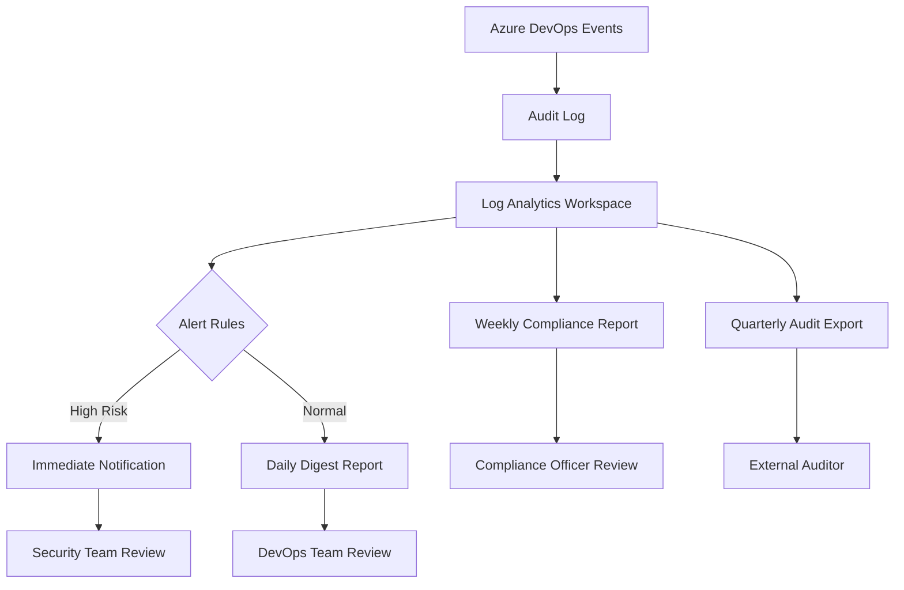

# How to Configure Azure DevOps Audit Logging and Compliance Tracking for Enterprise Teams

Author: [nawazdhandala](https://www.github.com/nawazdhandala)

Tags: Azure DevOps, Audit Logging, Compliance, Enterprise, Security, Governance, DevOps

Description: A comprehensive guide to setting up audit logging in Azure DevOps for compliance tracking, security monitoring, and governance in enterprise environments.

---

Enterprise teams running their software development lifecycle through Azure DevOps need visibility into who did what, when, and where. Whether you are meeting SOC 2 requirements, preparing for an ISO 27001 audit, or just want to keep track of sensitive changes in your organization, audit logging is essential.

Azure DevOps provides built-in auditing capabilities that capture a wide range of events across your organization. In this post, I will cover how to configure audit logging, stream audit data to external systems, and build compliance tracking workflows that satisfy auditors.

## What Azure DevOps Auditing Captures

The audit log records actions performed across your Azure DevOps organization. This includes:

- Permission changes (adding or removing users from groups, changing project-level permissions)
- Pipeline modifications (creating, editing, or deleting build and release definitions)
- Repository operations (branch policy changes, bypassing pull request policies)
- Service connection management (creating, editing, or using service connections)
- Project-level changes (creating or deleting projects, changing project settings)
- Organization-level settings (authentication policy changes, billing modifications)
- Artifact feed changes (creating feeds, changing access permissions)

Each audit event includes the timestamp, the identity of the user who performed the action, the IP address, the specific action, and relevant details about what changed.

## Accessing the Audit Log

The simplest way to view audit events is through the Azure DevOps portal. Navigate to Organization Settings and then Auditing. You will see a chronological list of events that you can filter by date range, user, and event type.

For programmatic access, use the Audit API:

```bash
# Fetch audit events from the last 24 hours
# Replace ORG with your organization name
PAT="your-personal-access-token"
ORG="myorganization"
AUTH=$(echo -n ":${PAT}" | base64)

# Get recent audit events with pagination
curl -s \
  -H "Authorization: Basic ${AUTH}" \
  "https://auditservice.dev.azure.com/${ORG}/_apis/audit/auditlog?startTime=$(date -u -v-1d +%Y-%m-%dT%H:%M:%SZ)&api-version=7.1" \
  | jq '.decoratedAuditLogEntries[:5]'
```

The API returns paginated results with a continuation token. Here is a Python script that fetches all events for a given time period:

```python
import requests
from datetime import datetime, timedelta

# Configuration
org = "myorganization"
pat = "your-pat"
auth = ("", pat)
base_url = f"https://auditservice.dev.azure.com/{org}/_apis/audit"

# Fetch events from the last 7 days
end_time = datetime.utcnow()
start_time = end_time - timedelta(days=7)

all_events = []
continuation_token = None

while True:
    params = {
        "startTime": start_time.strftime("%Y-%m-%dT%H:%M:%SZ"),
        "endTime": end_time.strftime("%Y-%m-%dT%H:%M:%SZ"),
        "api-version": "7.1"
    }

    # Include continuation token for pagination
    if continuation_token:
        params["continuationToken"] = continuation_token

    response = requests.get(
        f"{base_url}/auditlog",
        auth=auth,
        params=params
    )

    data = response.json()
    events = data.get("decoratedAuditLogEntries", [])
    all_events.extend(events)

    # Check if there are more pages
    continuation_token = data.get("continuationToken")
    if not continuation_token or not events:
        break

print(f"Retrieved {len(all_events)} audit events")
```

## Streaming Audit Logs to External Systems

For enterprise compliance, you typically need audit logs in a centralized logging system. Azure DevOps supports streaming audit data to three destinations:

1. **Azure Monitor Log Analytics** - Best for organizations already using Azure Monitor
2. **Splunk** - Common in enterprises with existing Splunk infrastructure
3. **Azure Event Grid** - For custom integrations and event-driven workflows

### Setting Up Log Analytics Streaming

To stream audit logs to a Log Analytics workspace:

1. Go to Organization Settings and then Auditing
2. Click on the "Streams" tab
3. Click "New Stream" and select "Azure Monitor Log Analytics"
4. Select your Azure subscription and Log Analytics workspace
5. Click "Create"

Once streaming is configured, audit events will appear in the `AzureDevOpsAuditing` table in your Log Analytics workspace within a few minutes.

You can then query audit data using Kusto Query Language (KQL):

```
// Find all permission changes in the last 24 hours
AzureDevOpsAuditing
| where TimeGenerated > ago(24h)
| where Area == "Permissions"
| project TimeGenerated, ActorDisplayName, ActionId, Details, IpAddress
| order by TimeGenerated desc

// Find all pipeline modifications by a specific user
AzureDevOpsAuditing
| where TimeGenerated > ago(7d)
| where ActorUPN == "developer@company.com"
| where Area == "Pipelines"
| project TimeGenerated, ActionId, Details
| order by TimeGenerated desc

// Count audit events by category over the last 30 days
AzureDevOpsAuditing
| where TimeGenerated > ago(30d)
| summarize count() by Area
| order by count_ desc
```

### Setting Up Splunk Streaming

For Splunk integration:

1. Create an HTTP Event Collector (HEC) token in Splunk
2. In Azure DevOps Organization Settings, go to Auditing then Streams
3. Click "New Stream" and select "Splunk"
4. Enter your Splunk HEC endpoint URL and token
5. Click "Create"

## Building Compliance Reports

Auditors want specific reports about access control, change management, and security events. Here are KQL queries that address common compliance requirements:

```
// SOC 2 - Access control changes report
// Shows all permission and group membership changes
AzureDevOpsAuditing
| where TimeGenerated > ago(90d)
| where Area in ("Permissions", "Group")
| project
    Timestamp = TimeGenerated,
    Actor = ActorDisplayName,
    Action = ActionId,
    Details,
    SourceIP = IpAddress
| order by Timestamp desc

// Change management - Pipeline definition changes
// Tracks who modified pipeline configurations
AzureDevOpsAuditing
| where TimeGenerated > ago(30d)
| where Area == "Pipelines"
| where ActionId has_any ("Pipeline.ModifyPipeline", "Release.UpdateReleaseDefinition")
| project
    Timestamp = TimeGenerated,
    ModifiedBy = ActorDisplayName,
    Action = ActionId,
    PipelineDetails = Details
| order by Timestamp desc

// Security events - Service connection usage
// Monitors who used or modified service connections
AzureDevOpsAuditing
| where TimeGenerated > ago(30d)
| where Area == "ServiceEndpoint"
| project
    Timestamp = TimeGenerated,
    Actor = ActorDisplayName,
    Action = ActionId,
    Details,
    SourceIP = IpAddress
| order by Timestamp desc
```

## Setting Up Alerts for Sensitive Actions

You should get notified when certain high-risk actions occur. Using Azure Monitor alert rules on your Log Analytics workspace:

```bash
# Create an alert rule that fires when someone bypasses a branch policy
az monitor scheduled-query create \
  --name "AzDO-Policy-Bypass-Alert" \
  --resource-group "monitoring-rg" \
  --scopes "/subscriptions/SUB_ID/resourceGroups/monitoring-rg/providers/Microsoft.OperationalInsights/workspaces/my-workspace" \
  --condition "count 'AzureDevOpsAuditing | where ActionId == \"Git.RefUpdatePoliciesBypassed\"' > 0" \
  --evaluation-frequency "5m" \
  --window-size "5m" \
  --severity 1 \
  --action-groups "/subscriptions/SUB_ID/resourceGroups/monitoring-rg/providers/Microsoft.Insights/actionGroups/security-team"
```

Common events worth alerting on include:

- Branch policy bypasses
- Service connection creation or modification
- Organization-level permission changes
- Personal access token creation
- Project deletion
- Audit log stream modifications (someone trying to disable audit logging)

## Compliance Tracking Workflow

Here is a practical workflow for ongoing compliance tracking:



## Retention and Export

Audit logs in Azure DevOps are retained for 90 days by default. For compliance purposes, you almost certainly need longer retention. When streaming to Log Analytics, you can configure retention per table:

```bash
# Set retention for the AzureDevOpsAuditing table to 2 years (730 days)
az monitor log-analytics workspace table update \
  --resource-group "monitoring-rg" \
  --workspace-name "my-workspace" \
  --name "AzureDevOpsAuditing" \
  --retention-time 730
```

For long-term archival, export data to Azure Blob Storage:

```bash
# Create a data export rule to archive audit logs to blob storage
az monitor log-analytics workspace data-export create \
  --resource-group "monitoring-rg" \
  --workspace-name "my-workspace" \
  --name "audit-archive" \
  --tables "AzureDevOpsAuditing" \
  --destination "/subscriptions/SUB_ID/resourceGroups/monitoring-rg/providers/Microsoft.Storage/storageAccounts/auditarchive"
```

## Managing Audit Permissions

Not everyone should have access to audit logs. In Azure DevOps, the ability to view and manage audit streams is controlled by organization-level permissions:

- **View audit log**: Can view audit events through the portal and API
- **Manage audit streams**: Can create, modify, and delete audit log streams
- **Delete audit streams**: Can remove existing streams

Limit these permissions to security and compliance personnel. Regular developers should not need access to the audit log.

## Common Compliance Frameworks and What They Need

Different compliance frameworks care about different aspects of your audit trail:

**SOC 2**: Focus on access control changes, authentication events, and change management. Auditors want to see that access reviews happen regularly and that changes to production follow an approval process.

**ISO 27001**: Requires logging of security-relevant events, regular review of logs, and defined retention periods. Emphasizes having an incident response process tied to audit findings.

**PCI DSS**: Strict requirements around who can access cardholder data environments. Audit logs must be retained for at least one year with the last three months immediately available.

**HIPAA**: Requires tracking access to systems containing protected health information. Focus on who accessed what data and when.

## Wrapping Up

Azure DevOps audit logging gives enterprise teams the visibility they need for compliance and security. The key steps are: enable audit streaming to a centralized log system, set up alert rules for high-risk actions, build regular reporting for compliance reviews, and configure appropriate retention. Do this early in your Azure DevOps adoption - retrofitting audit controls after the fact is always harder than building them in from the start.
