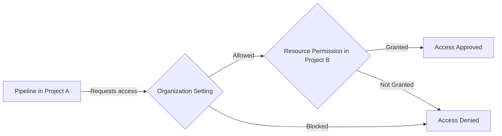

# How to Configure Azure DevOps Organization Settings for Cross-Project Pipeline Access

Author: [nawazdhandala](https://www.github.com/nawazdhandala)

Tags: Azure DevOps, Organization Settings, Pipelines, Cross-Project Access, Security, DevOps, Administration

Description: Learn how to configure Azure DevOps organization-level settings to enable and control cross-project pipeline access for repositories, feeds, and resources.

---

When your Azure DevOps organization grows beyond a single project, teams inevitably need to share resources across project boundaries. A pipeline in Project A needs to check out code from a repository in Project B. A build in the Platform project needs to push packages to a feed in the Shared Services project. A deployment pipeline needs to access service connections defined in another project.

By default, Azure DevOps restricts pipeline access to resources within the same project. This is a good security default, but it means you need to explicitly configure cross-project access when it is needed. In this post, I will walk through the organization and project settings that control cross-project pipeline access, how to set them up securely, and the common scenarios that require them.

## Understanding the Security Model

Azure DevOps pipelines run under a build service identity. Each project has its own build service identity:

- **Project Collection Build Service** - organization-level identity
- **Project Name Build Service** - project-level identity

When a pipeline tries to access a resource in another project, it needs the appropriate permissions granted to its build service identity in the target project. This is a two-step process:

1. The organization setting must allow cross-project access
2. The specific resource in the target project must grant permissions to the requesting project's build identity



## Organization-Level Settings

Several organization-level settings affect cross-project pipeline behavior. Navigate to Organization Settings in Azure DevOps to find them.

### Limit Job Authorization Scope

This is the primary setting that controls cross-project access. Go to Organization Settings, then Pipelines, then Settings.

You will find these options:

- **Limit job authorization scope to current project for non-release pipelines**: When enabled, YAML pipelines and classic build pipelines can only access resources in their own project. When disabled, they can access resources across projects.

- **Limit job authorization scope to current project for release pipelines**: Same as above but for classic release pipelines.

- **Limit job authorization scope to referenced Azure DevOps repositories**: When enabled, pipelines can only access repositories that are explicitly declared as resources in the YAML.

For cross-project access, you might need to disable the first two settings at the organization level. However, a more secure approach is to leave them enabled at the org level and disable them selectively at the project level.

### Project-Level Override

Each project can override the organization-level setting. Go to Project Settings, then Pipelines, then Settings. Here you can:

- Disable "Limit job authorization scope to current project" for just this project
- This allows pipelines in this specific project to access resources in other projects, without opening up the whole organization

```bash
# You can also manage these settings via the Azure DevOps CLI
# Check current organization-level pipeline settings
az devops invoke \
  --area build \
  --resource generalSettings \
  --org https://dev.azure.com/myorg \
  --http-method GET
```

## Granting Repository Access Across Projects

The most common cross-project scenario is checking out a repository from another project. Here is how to set it up:

### Step 1: Grant Build Service Access to the Target Repository

In the target project (the one that contains the repository you want to access):

1. Go to Project Settings, then Repositories
2. Select the specific repository
3. Click on Security
4. Find the build service identity of the source project. It will be named like "Project A Build Service (MyOrganization)"
5. Grant it "Read" permission

### Step 2: Declare the Repository in Your Pipeline

In your pipeline YAML, explicitly reference the cross-project repository:

```yaml
# Pipeline in Project A that needs code from Project B
resources:
  repositories:
    # Repository in a different project within the same organization
    - repository: shared-templates
      type: git
      name: ProjectB/shared-templates  # Format: ProjectName/RepoName
      ref: refs/heads/main

trigger:
  - main

pool:
  vmImage: 'ubuntu-latest'

steps:
  - checkout: self
  - checkout: shared-templates
    path: 'templates'

  - script: |
      echo "Files from Project B repository:"
      ls $(Pipeline.Workspace)/templates/
    displayName: 'List cross-project repo files'
```

## Granting Feed Access Across Projects

If your pipeline needs to publish to or consume from an Azure Artifacts feed in another project:

1. Go to the target project's Artifacts section
2. Open the feed settings
3. Click on Permissions
4. Add the source project's build service identity as a Collaborator (for publish) or Reader (for consume)

```yaml
# Pipeline that publishes to a feed in another project
steps:
  - task: NuGetAuthenticate@1
    inputs:
      nuGetServiceConnections: 'feed-in-other-project'

  - script: |
      dotnet nuget push ./output/*.nupkg \
        --source "https://pkgs.dev.azure.com/myorg/OtherProject/_packaging/shared-feed/nuget/v3/index.json" \
        --api-key az
    displayName: 'Push to cross-project feed'
```

## Sharing Service Connections Across Projects

Service connections (Azure subscriptions, Docker registries, Kubernetes clusters) are project-scoped by default. To share them:

1. Go to Project Settings in the project that owns the service connection
2. Navigate to Service connections
3. Select the connection you want to share
4. Click the three dots menu and select "Security"
5. Under "Project permissions," add the other projects that should have access

Alternatively, you can make a service connection organization-scoped when creating it, which makes it available to all projects.

```yaml
# Pipeline using a service connection from another project
# The service connection must be shared with this project first
steps:
  - task: AzureCLI@2
    inputs:
      azureSubscription: 'shared-azure-connection'  # Shared from another project
      scriptType: 'bash'
      scriptLocation: 'inlineScript'
      inlineScript: |
        az resource list --output table
    displayName: 'Use shared service connection'
```

## Sharing Environments Across Projects

Environments with approval gates can also be shared across projects. This is useful when you have a centralized "production" environment with approvals that multiple project pipelines deploy to:

1. In the project that owns the environment, go to Pipelines, then Environments
2. Select the environment
3. Go to Security
4. Add the build service identities from other projects with appropriate roles

## Agent Pool Access

If you use self-hosted agent pools, you need to grant access for cross-project use:

1. Go to Organization Settings, then Agent pools
2. Select the pool
3. Click on Security
4. Under "Pipeline permissions," add the pipelines or projects that need access

For organization-scoped pools, access is typically more open. For project-scoped pools, you need to explicitly grant cross-project access.

## Variable Groups Across Projects

Variable groups are project-scoped and cannot be directly shared across projects. However, there are workarounds:

- **Variable templates in a shared repository**: Put variable definitions in a YAML template file in a shared repo, then reference it from pipelines in other projects
- **Azure Key Vault integration**: Use a Key Vault variable group that points to a shared Azure Key Vault, and set up the same variable group in each project
- **Library REST API**: Script the creation of identical variable groups across projects

```yaml
# Using a variable template from a shared repository
resources:
  repositories:
    - repository: shared-config
      type: git
      name: SharedProject/pipeline-config

variables:
  - template: variables/common.yml@shared-config  # Load variables from shared repo
  - template: variables/staging.yml@shared-config

steps:
  - script: echo "Using shared variable: $(sharedApiUrl)"
    displayName: 'Use cross-project variables'
```

## Security Recommendations

Opening up cross-project access increases your attack surface. Here are some guidelines:

**Principle of least privilege.** Only grant the minimum permissions needed. If a pipeline only needs to read from a repository, grant Read permission, not Contribute.

**Use project-level overrides instead of organization-wide settings.** Only disable the job authorization scope limit for projects that actually need cross-project access, not the entire organization.

**Audit cross-project access regularly.** Review which build service identities have access to which resources. Remove permissions that are no longer needed.

**Prefer shared repositories over direct access.** Instead of giving every project direct access to a shared repo, consider publishing shared content as packages in Azure Artifacts feeds. This provides better versioning and access control.

**Document the dependencies.** When a pipeline depends on resources from another project, document this in the pipeline YAML with comments explaining why the cross-project access is needed:

```yaml
resources:
  repositories:
    # This pipeline needs the shared deployment templates from the Platform project.
    # Access was granted per ticket DEVOPS-456.
    # Contact: platform-team@company.com
    - repository: deploy-templates
      type: git
      name: Platform/deployment-templates
      ref: refs/heads/main
```

## Troubleshooting Access Issues

When cross-project access fails, the error messages can be vague. Here is how to debug:

1. **Check the pipeline run logs.** Look for "403 Forbidden" or "resource not authorized" messages.
2. **Verify the build service identity.** Go to the target resource's security settings and make sure the correct identity is listed.
3. **Check organization settings.** Make sure the job authorization scope is not blocking cross-project access.
4. **Re-authorize the pipeline.** Sometimes pipelines need to be re-authorized after permission changes. Go to the pipeline, click the authorization banner, and approve.

## Wrapping Up

Cross-project pipeline access in Azure DevOps requires deliberate configuration at both the organization and resource levels. The default restrictions are there for good reason - they prevent accidental data leaks and unauthorized access. When you do need cross-project access, set it up with the principle of least privilege, document the dependencies, and audit regularly. The combination of organization settings, build service permissions, and resource-level access controls gives you the flexibility to share what needs sharing while keeping everything else locked down.
