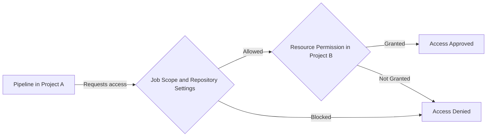

# Configure Azure DevOps Organization Settings for Cross-Project Pipeline Access

Author: [nawazdhandala](https://www.github.com/nawazdhandala)

Tags: Azure DevOps, Organization Settings, Pipeline, Cross-Project Access, Security, DevOps, Administration

Description: Learn how to configure Azure DevOps organization-level settings to enable and control cross-project pipeline access for repositories, feeds, and resources.

---

When your Azure DevOps organization grows beyond a single project, teams inevitably need to share resources across project boundaries. A pipeline in Project A needs to check out code from a repository in Project B. A build in the Platform project needs to push packages to a feed in the Shared Services project. A deployment pipeline needs to access service connections defined in another project.

Azure DevOps controls pipeline access with job access tokens, build service identities, and resource permissions. Depending on your organization and project settings, a pipeline can run with either a collection-scoped identity or a project-scoped identity. For secure cross-project access, use project-scoped identities and explicitly grant the needed permissions in the target project. In this post, I will walk through the organization and project settings that control cross-project pipeline access, how to set them up securely, and the common scenarios that require them.

## Understanding the Security Model

Azure DevOps pipelines run under a build service identity. Each project has its own build service identity:

- **Project Collection Build Service** - organization-level identity
- **Project Name Build Service** - project-level identity

When a pipeline tries to access a resource in another project, it needs the appropriate permissions granted to its build service identity in the target project. This is usually a two-step process:

1. The pipeline's job authorization scope and repository protection settings must allow the pipeline to request the resource
2. The target project and the specific resource must grant permissions to the requesting project's build identity


```mermaid
flowchart LR
    A[Pipeline in Project A] -->|Requests access| B{Job Scope and Repository Settings}
    B -->|Allowed| C{Resource Permission in Project B}
    C -->|Granted| D[Access Approved]
    B -->|Blocked| E[Access Denied]
    C -->|Not Granted| E
```

## Organization-Level Settings

Several organization-level settings affect cross-project pipeline behavior. Navigate to Organization Settings in Azure DevOps to find them.

### Limit Job Authorization Scope

This is the primary setting that controls which identity a pipeline uses and how broadly its job access token can reach. Go to Organization Settings, then Pipelines, then Settings.

You will find these options:

- **Limit job authorization scope to current project for non-release pipelines**: When enabled, YAML pipelines and classic build pipelines use a project-scoped job access token. Cross-project access then requires explicit permissions for that project-scoped build identity in the target project. When disabled, pipelines can use a collection-scoped token, which has broader access.

- **Limit job authorization scope to current project for release pipelines**: Same as above but for classic release pipelines.

- **Protect access to repositories in YAML pipelines**: When enabled, YAML pipelines can only access Azure Repos repositories that are explicitly referenced by a `checkout` step or `uses` statement.

For secure cross-project access, leave the job authorization scope limited to the current project when possible and grant the project-scoped build identity only the permissions it needs in the target project.

### Project-Level Override

Each project can configure these settings only when they are not already enforced at the organization level. If the organization-level setting is enabled, it cannot be disabled in a project. Go to Project Settings, then Pipelines, then Settings. Here you can:

- Enable "Limit job authorization scope to current project" for just this project
- Keep pipelines in this project on a project-scoped identity, then grant that identity access only to the target resources it needs

```bash
# You can also manage these settings via the Azure DevOps CLI

# Check current build general settings for a project
az devops invoke \
  --area build \
  --resource generalSettings \
  --org https://dev.azure.com/myorg \
  --route-parameters project=ProjectA \
  --http-method GET
```

## Granting Repository Access Across Projects

The most common cross-project scenario is checking out a repository from another project. Here is how to set it up:

### Step 1: Grant Build Service Access to the Target Repository

In the target project (the one that contains the repository you want to access):

1. Go to Project Settings, then Repositories
2. Select the specific repository
3. Click on Security
4. Find the build service identity of the source project. It will be named like "Project A Build Service (MyOrganization)"
5. Grant it "Read" permission

If the source pipeline uses a project-scoped identity, also grant that identity **View project-level information** in the target project. Without that project-level permission, repository-level Read permission alone may not be enough.

### Step 2: Declare the Repository in Your Pipeline

In your pipeline YAML, explicitly reference the cross-project repository:

```yaml
# Pipeline in Project A that needs code from Project B
resources:
  repositories:
    # Repository in a different project within the same organization
    - repository: shared-templates
      type: git
      name: ProjectB/shared-templates  # Format: ProjectName/RepoName
      ref: refs/heads/main

trigger:
  - main

pool:
  vmImage: 'ubuntu-latest'

steps:
  - checkout: self
  - checkout: shared-templates
    path: 'templates'

  - script: |
      echo "Files from Project B repository:"
      ls $(Pipeline.Workspace)/templates/
    displayName: 'List cross-project repo files'
```

## Granting Feed Access Across Projects

If your pipeline needs to publish to or consume from an Azure Artifacts feed in another project:

1. Go to the target project's Artifacts section
2. Open the feed settings
3. Click on Permissions
4. Add the source project's build service identity as a Feed Publisher (Contributor) for publish, or Feed Reader for consume. Use Feed and Upstream Reader (Collaborator) when the pipeline only needs read access plus the ability to save packages from upstream sources.

```yaml
# Pipeline that publishes to a feed in another project
steps:
  - task: NuGetAuthenticate@1

  - script: |
      dotnet nuget push ./output/*.nupkg \
        --source "https://pkgs.dev.azure.com/myorg/OtherProject/_packaging/shared-feed/nuget/v3/index.json" \
        --api-key AzureArtifacts
    displayName: 'Push to cross-project feed'
```

For Azure Artifacts feeds in the same organization, `NuGetAuthenticate@1` automatically authenticates matching feed URLs. The `nuGetServiceConnections` input is for feeds outside the organization or authenticated third-party package repositories.

## Sharing Service Connections Across Projects

Service connections (Azure subscriptions, Docker registries, Kubernetes clusters) are project-scoped by default. To share them:

1. Go to Project Settings in the project that owns the service connection
2. Navigate to Service connections
3. Select the connection you want to share
4. Click the three dots menu and select "Security"
5. Under "Project permissions," add the other projects that should have access

After a service connection is shared with a project, use its pipeline permissions to allow all pipelines in that project or restrict access to selected pipelines.

```yaml
# Pipeline using a service connection from another project
# The service connection must be shared with this project first
steps:
  - task: AzureCLI@2
    inputs:
      azureSubscription: 'shared-azure-connection'  # Shared from another project
      scriptType: 'bash'
      scriptLocation: 'inlineScript'
      inlineScript: |
        az resource list --output table
    displayName: 'Use shared service connection'
```

## Environments Across Projects

Azure DevOps environments are project-scoped YAML pipeline resources. You can secure an environment with user permissions and pipeline permissions inside the project that owns it, but it is not shared across projects in the same way a service connection can be shared. If multiple projects need the same approval model, either centralize the deployment pipelines in one project or create matching environments and checks in each project.

1. In each project that needs the environment, go to Pipelines, then Environments
2. Select the environment
3. Go to Security
4. Configure user permissions, checks, and pipeline permissions for that project's pipelines

## Agent Pool Access

If you use self-hosted agent pools, you need to grant access for cross-project use:

1. Go to Organization Settings, then Agent pools
2. Select the pool
3. Click on Security
4. Grant the target project or group the User role as needed, and use "Pipeline permissions" to open access for all pipelines in a project or restrict the pool to selected YAML pipelines

Use organization-scoped pools when the same self-hosted capacity must be available to multiple projects. Project-scoped pools are available only inside the project where they are created.

## Variable Groups Across Projects

Variable groups are project-scoped and cannot be directly shared across projects. However, there are workarounds:

- **Variable templates in a shared repository**: Put variable definitions in a YAML template file in a shared repo, then reference it from pipelines in other projects
- **Azure Key Vault integration**: Use a Key Vault variable group that points to a shared Azure Key Vault, and set up the same variable group in each project
- **Library REST API**: Script the creation of identical variable groups across projects

```yaml
# Using a variable template from a shared repository
resources:
  repositories:
    - repository: shared-config
      type: git
      name: SharedProject/pipeline-config

variables:
  - template: variables/common.yml@shared-config  # Load variables from shared repo
  - template: variables/staging.yml@shared-config

steps:
  - script: echo "Using shared variable: $(sharedApiUrl)"
    displayName: 'Use cross-project variables'
```

## Security Recommendations

Opening up cross-project access increases your attack surface. Here are some guidelines:

**Principle of least privilege.** Only grant the minimum permissions needed. If a pipeline only needs to read from a repository, grant Read permission, not Contribute.

**Prefer project-scoped job authorization.** Keep the job authorization scope limited to the current project and grant explicit target-project permissions instead of relying on broad collection-scoped tokens.

**Audit cross-project access regularly.** Review which build service identities have access to which resources. Remove permissions that are no longer needed.

**Prefer shared repositories over direct access.** Instead of giving every project direct access to a shared repo, consider publishing shared content as packages in Azure Artifacts feeds. This provides better versioning and access control.

**Document the dependencies.** When a pipeline depends on resources from another project, document this in the pipeline YAML with comments explaining why the cross-project access is needed:

```yaml
resources:
  repositories:
    # This pipeline needs the shared deployment templates from the Platform project.
    # Access was granted per ticket DEVOPS-456.
    # Contact: platform-team@company.com
    - repository: deploy-templates
      type: git
      name: Platform/deployment-templates
      ref: refs/heads/main
```

## Troubleshooting Access Issues

When cross-project access fails, the error messages can be vague. Here is how to debug:

1. **Check the pipeline run logs.** Look for "403 Forbidden" or "resource not authorized" messages.
2. **Verify the build service identity.** Go to the target resource's security settings and make sure the correct identity is listed.
3. **Check organization settings.** Make sure the job authorization scope is not blocking cross-project access.
4. **Re-authorize the pipeline.** Sometimes pipelines need to be re-authorized after permission changes. Go to the pipeline, click the authorization banner, and approve.

## Wrapping Up

Cross-project pipeline access in Azure DevOps requires deliberate configuration at both the organization and resource levels. The default restrictions are there for good reason - they prevent accidental data leaks and unauthorized access. When you do need cross-project access, set it up with the principle of least privilege, document the dependencies, and audit regularly. The combination of organization settings, build service permissions, and resource-level access controls gives you the flexibility to share what needs sharing while keeping everything else locked down.
