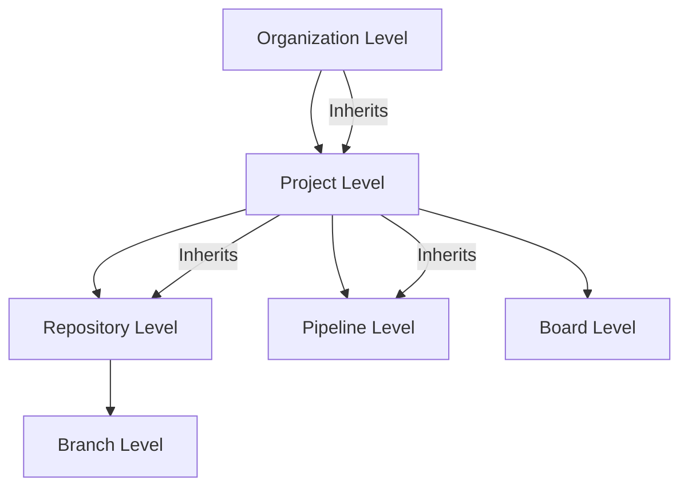

# How to Configure Azure DevOps Project-Level Permissions and Security Groups

Author: [nawazdhandala](https://www.github.com/nawazdhandala)

Tags: Azure DevOps, Security, Permissions, Security Groups, Access Control, DevOps, Governance

Description: Set up project-level permissions and custom security groups in Azure DevOps to control who can access repos, pipelines, boards, and artifacts.

---

Azure DevOps permissions can feel overwhelming at first. There are organization-level settings, project-level settings, repo-level settings, and pipeline-level settings, each with their own set of permissions and inheritance rules. But once you understand the structure, setting up proper access control is manageable and important. A well-configured permissions model prevents unauthorized changes, reduces the blast radius of compromised accounts, and gives teams the access they need without giving them access they do not.

This guide focuses on project-level permissions and security groups, which is where most of the day-to-day access control happens.

## Understanding the Permission Model

Azure DevOps uses a hierarchical permission model with three key concepts:

1. **Security groups**: Collections of users and other groups. Permissions are assigned to groups, not individual users.
2. **Permission states**: Allow, Deny, Not Set, and Inherited Allow/Deny. Deny always wins over Allow.
3. **Inheritance**: Permissions flow from higher scopes (organization) to lower scopes (project, repo, branch).



## Default Security Groups

Every Azure DevOps project comes with several built-in security groups:

- **Project Administrators**: Full control over the project. Can manage settings, security, and all resources.
- **Contributors**: Can create and modify code, work items, pipelines, and builds. The default group for most team members.
- **Readers**: Read-only access to all project resources. Good for stakeholders who need visibility but should not make changes.
- **Build Administrators**: Can manage build pipelines and their settings.
- **Release Administrators**: Can manage release pipelines.
- **Project Valid Users**: Automatically includes everyone who has access to the project.

## Creating Custom Security Groups

The built-in groups are a good start, but most organizations need more granular control. Here are some common custom groups and how to create them.

### Through the UI

Go to Project Settings, then Permissions. Click "New Group" and fill in:

- **Name**: A descriptive name like "Senior Engineers" or "QA Team"
- **Description**: What this group is for
- **Members**: Add users or other groups

### Through the Azure CLI

```bash
# Create a custom security group using the Azure DevOps CLI
az devops security group create \
  --name "Senior Engineers" \
  --description "Senior engineers with elevated permissions for code review and deployment" \
  --project "MyProject" \
  --organization "https://dev.azure.com/myorg"

# Add a user to the group
az devops security group membership add \
  --group-id "vssgp.{group-id}" \
  --member-id "user@contoso.com" \
  --organization "https://dev.azure.com/myorg"
```

### Recommended Custom Groups

Here is a group structure that works well for medium-sized teams:

```bash
# Create groups for different roles
az devops security group create --name "Frontend Developers" \
  --description "Frontend team - access to frontend repos and related pipelines" \
  --project "MyProject"

az devops security group create --name "Backend Developers" \
  --description "Backend team - access to backend repos and related pipelines" \
  --project "MyProject"

az devops security group create --name "QA Engineers" \
  --description "QA team - access to test plans and test environments" \
  --project "MyProject"

az devops security group create --name "DevOps Engineers" \
  --description "DevOps team - manage pipelines, service connections, and agent pools" \
  --project "MyProject"

az devops security group create --name "Tech Leads" \
  --description "Technical leads - approve deployments and manage branch policies" \
  --project "MyProject"

az devops security group create --name "External Contractors" \
  --description "External contractors - limited access to specific repos" \
  --project "MyProject"
```

## Configuring Repository Permissions

Repo permissions control who can push code, manage branches, and configure policies.

### Setting Permissions Through the UI

Go to Project Settings, then Repositories. Select a repository, then click the Security tab. Here you can set permissions for each security group.

### Common Repository Permission Configurations

For the **Contributors** group (most developers):
- Read: Allow
- Contribute: Allow
- Create branch: Allow
- Create tag: Allow
- Force push: Deny
- Bypass policies: Deny (this is important)
- Manage permissions: Deny

For the **Tech Leads** group:
- Everything Contributors have, plus:
- Bypass policies when completing pull requests: Allow (for emergency fixes)
- Manage permissions: Deny (leave this to Project Admins)

For the **External Contractors** group:
- Read: Allow (only for specific repos)
- Contribute: Allow (only for specific repos)
- Everything else: Deny or Not Set

### Limiting Repository Access

By default, all project members can see all repositories. To restrict access:

```bash
# Remove the Contributors group from a sensitive repository
# Then add only the specific group that should have access

# First, set the default group to Deny on the sensitive repo
# Then explicitly Allow the appropriate custom group
```

In the UI, go to Project Settings, then Repositories, select the repository, click Security, and set the "Read" permission to "Deny" for groups that should not access it. Then set "Allow" for the groups that should.

## Configuring Pipeline Permissions

Pipeline permissions control who can create, edit, and run pipelines, as well as who can manage service connections and agent pools.

### Pipeline-Level Permissions

For each pipeline, you can set permissions under the pipeline's security settings:

- **Queue builds**: Who can trigger pipeline runs
- **Edit build pipeline**: Who can modify the pipeline definition
- **Delete builds**: Who can remove build records
- **Manage build queue**: Who can cancel or reorder queued builds

### Service Connection Permissions

Service connections are particularly sensitive because they provide access to external resources like Azure subscriptions. Restrict them carefully:

Go to Project Settings, then Service connections. Select a connection and click the "Security" tab.

Recommended settings:
- **Project Administrators**: Administrator role
- **DevOps Engineers**: User role (can use the connection in pipelines)
- **Contributors**: Do not grant access by default

### Agent Pool Permissions

Go to Project Settings, then Agent pools. Select a pool and configure:

- **Reader**: Can view the pool and agents
- **User**: Can use the pool in pipelines
- **Administrator**: Can manage the pool, add/remove agents

## Configuring Board Permissions

For Azure Boards, permissions control who can create and modify work items, manage area paths, and configure the board.

Key permissions:
- **Create work items**: Most team members need this
- **Delete work items**: Restrict to leads and admins
- **Move work items out of this project**: Restrict to admins
- **Permanently delete work items**: Restrict to admins only

For area paths, you can control which teams can view and edit work items in specific areas:

```
Area Path: MyProject
  /Frontend    -> Frontend Developers (edit), Others (read)
  /Backend     -> Backend Developers (edit), Others (read)
  /Platform    -> DevOps Engineers (edit), Others (read)
```

## Auditing Permissions

Periodically review who has access to what. Azure DevOps provides some tools for this:

```bash
# List members of a security group
az devops security group membership list \
  --id "vssgp.{group-id}" \
  --organization "https://dev.azure.com/myorg" \
  --output table

# List all security groups in a project
az devops security group list \
  --project "MyProject" \
  --organization "https://dev.azure.com/myorg" \
  --output table
```

You can also use the Azure DevOps audit log (Organization Settings > Auditing) to see who changed permissions and when.

## Permission Inheritance and the Deny Override

Understanding how inheritance works is critical for troubleshooting access issues.

When Azure DevOps evaluates whether a user can perform an action, it checks:

1. The user's direct permissions
2. The permissions of all groups the user belongs to
3. Inherited permissions from higher scopes

The evaluation rules are:
- Explicit Deny at any level always wins
- If no Deny is found, an explicit Allow at any level grants access
- If nothing is set, the permission is implicitly denied

This means if a user is in both the "Contributors" group (Allow on push) and the "External Contractors" group (Deny on push), the Deny wins and they cannot push.

## Best Practices

1. **Never assign permissions to individual users.** Always use security groups. This makes it much easier to manage access as people join and leave the team.

2. **Use the principle of least privilege.** Start with minimal permissions and add more as needed. It is easier to grant additional access than to revoke access after a security incident.

3. **Keep Project Administrators small.** This group has full control over everything in the project. Limit it to people who genuinely need that level of access.

4. **Review permissions quarterly.** People change roles, leave the organization, or no longer need the access they once had. Regular reviews prevent permission sprawl.

5. **Use Deny sparingly.** Because Deny always overrides Allow, excessive use of Deny can create confusing permission structures that are hard to debug.

6. **Document your permission model.** Write down what each custom group is for and what access it grants. Future you will thank present you.

## Wrapping Up

Azure DevOps project-level permissions give you fine-grained control over who can do what in your project. The key is to invest time upfront in creating meaningful security groups that reflect your team structure, then assign permissions to those groups rather than individual users. This approach scales well as your team grows and makes it straightforward to onboard new members or adjust access when roles change. Start with the built-in groups, add custom groups for your specific needs, and review the configuration regularly to keep it aligned with your team's reality.
