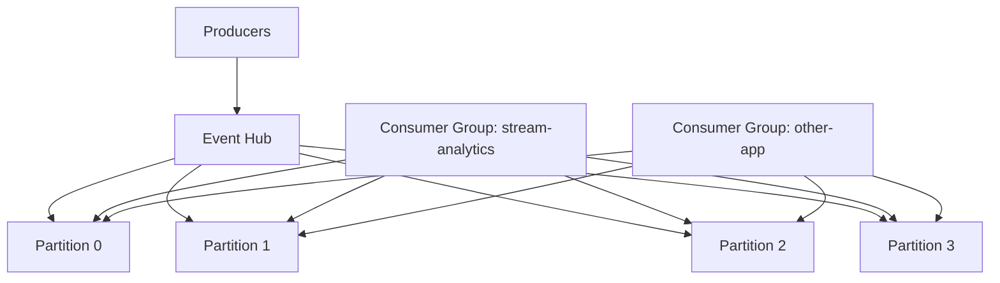

# How to Configure Azure Event Hubs as an Input for Azure Stream Analytics

Author: [nawazdhandala](https://www.github.com/nawazdhandala)

Tags: Azure Event Hubs, Azure Stream Analytics, Event Streaming, Real-Time Data, Azure, Input Configuration

Description: Learn how to configure Azure Event Hubs as a streaming input for Azure Stream Analytics including partitioning, consumer groups, and serialization settings.

---

Azure Event Hubs is one of the most common data sources for Azure Stream Analytics. It is a high-throughput, low-latency event ingestion service that can handle millions of events per second. When you pair Event Hubs with Stream Analytics, you get a scalable pipeline for processing real-time data from applications, IoT devices, logs, and clickstreams.

In this post, I will cover how to set up an Event Hub, configure it as an input for Stream Analytics, tune the configuration for performance, and handle common issues.

## How Event Hubs Works

Before diving into the configuration, it helps to understand the Event Hubs architecture.

An Event Hub is organized into:

- **Namespace** - the top-level container (similar to a Kafka cluster)
- **Event Hub** - a specific stream within the namespace (similar to a Kafka topic)
- **Partitions** - each Event Hub is divided into partitions for parallelism
- **Consumer Groups** - independent views of the event stream for different consumers



Events are distributed across partitions. Each partition maintains an ordered sequence of events. Consumer groups allow multiple consumers to independently read from the same Event Hub.

## Prerequisites

1. An Azure Event Hubs namespace
2. An Event Hub created within the namespace
3. An Azure Stream Analytics job
4. Producers sending events to the Event Hub

## Step 1: Create the Event Hub

If you do not already have an Event Hub, create one.

```bash
# Create an Event Hubs namespace
az eventhubs namespace create \
  --name my-eh-namespace \
  --resource-group my-resource-group \
  --location eastus \
  --sku Standard

# Create an Event Hub with 4 partitions and 1-day retention
az eventhubs eventhub create \
  --name telemetry-stream \
  --namespace-name my-eh-namespace \
  --resource-group my-resource-group \
  --partition-count 4 \
  --message-retention 1
```

### Choosing Partition Count

The partition count directly affects parallelism. Stream Analytics assigns one reader per partition, so more partitions allow more parallel processing.

- **4 partitions** - good for moderate throughput (up to 4 MB/s input)
- **8-16 partitions** - good for high throughput applications
- **32 partitions** - for very high volume scenarios

Important: you cannot change the partition count after creation. Choose a value that accommodates your expected growth.

## Step 2: Create a Dedicated Consumer Group

Always create a dedicated consumer group for Stream Analytics. Using the default `$Default` group creates conflicts if other applications also read from the Event Hub.

```bash
# Create a consumer group specifically for Stream Analytics
az eventhubs eventhub consumer-group create \
  --name streamanalytics-consumer \
  --namespace-name my-eh-namespace \
  --eventhub-name telemetry-stream \
  --resource-group my-resource-group
```

Each consumer group gets its own independent view of the event stream. Stream Analytics tracks its position in each partition using the consumer group.

## Step 3: Set Up Authentication

You have two options for authenticating Stream Analytics to Event Hubs.

### Option A: Shared Access Policy (Connection String)

The simpler approach. Create a shared access policy with Listen permission.

```bash
# Create a shared access policy with Listen permission for Stream Analytics
az eventhubs eventhub authorization-rule create \
  --name stream-analytics-reader \
  --namespace-name my-eh-namespace \
  --eventhub-name telemetry-stream \
  --resource-group my-resource-group \
  --rights Listen

# Get the connection string
az eventhubs eventhub authorization-rule keys list \
  --name stream-analytics-reader \
  --namespace-name my-eh-namespace \
  --eventhub-name telemetry-stream \
  --resource-group my-resource-group \
  --query primaryConnectionString \
  --output tsv
```

### Option B: Managed Identity (Recommended)

More secure. The Stream Analytics job authenticates using its managed identity.

1. Enable managed identity on your Stream Analytics job (it is on by default)
2. Assign the "Azure Event Hubs Data Receiver" role to the Stream Analytics managed identity

```bash
# Get the Stream Analytics managed identity principal ID
SA_PRINCIPAL_ID=$(az stream-analytics job show \
  --name iot-telemetry-processor \
  --resource-group my-resource-group \
  --query identity.principalId \
  --output tsv)

# Assign Event Hubs Data Receiver role
az role assignment create \
  --role "Azure Event Hubs Data Receiver" \
  --assignee-object-id $SA_PRINCIPAL_ID \
  --scope "/subscriptions/<sub-id>/resourceGroups/my-resource-group/providers/Microsoft.EventHub/namespaces/my-eh-namespace/eventhubs/telemetry-stream"
```

## Step 4: Configure the Input in Stream Analytics

Now add the Event Hub as an input to your Stream Analytics job.

### Using the Azure Portal

1. Open your Stream Analytics job
2. Go to **Inputs** > **Add stream input** > **Event Hub**
3. Configure:
   - **Input alias**: `telemetry-input`
   - **Event Hub namespace**: `my-eh-namespace`
   - **Event Hub name**: `telemetry-stream`
   - **Consumer group**: `streamanalytics-consumer`
   - **Authentication mode**: Connection string or Managed identity
   - **Event serialization format**: JSON
   - **Encoding**: UTF-8

### Using ARM Template

```json
// Event Hub input configuration
{
  "name": "telemetry-input",
  "properties": {
    "type": "Stream",
    "datasource": {
      "type": "Microsoft.ServiceBus/EventHub",
      "properties": {
        "serviceBusNamespace": "my-eh-namespace",
        "eventHubName": "telemetry-stream",
        "consumerGroupName": "streamanalytics-consumer",
        // For connection string auth:
        "sharedAccessPolicyName": "stream-analytics-reader",
        "sharedAccessPolicyKey": "<key>",
        // For managed identity auth (use this instead):
        // "authenticationMode": "Msi"
        "partitionCount": 4
      }
    },
    "serialization": {
      "type": "Json",
      "properties": {
        "encoding": "UTF8"
      }
    }
  }
}
```

## Step 5: Configure Serialization

The serialization format must match what your producers are sending. Stream Analytics supports:

- **JSON** - the most common format. Supports nested objects and arrays.
- **CSV** - delimited text with configurable delimiter and encoding.
- **Avro** - binary format with schema. Efficient but requires schema registry.
- **Parquet** - columnar binary format. Good for high-volume scenarios.

### JSON Serialization

```json
{
  "serialization": {
    "type": "Json",
    "properties": {
      "encoding": "UTF8"
    }
  }
}
```

For JSON events, Stream Analytics automatically maps JSON fields to columns in your query. Nested objects are accessible using dot notation.

```sql
-- Accessing nested JSON fields in a query
SELECT
    deviceId,
    -- Access nested temperature reading
    telemetry.temperature AS Temperature,
    telemetry.humidity AS Humidity,
    -- Access metadata object
    metadata.firmwareVersion AS FirmwareVersion
FROM [telemetry-input]
```

### CSV Serialization

```json
{
  "serialization": {
    "type": "Csv",
    "properties": {
      "fieldDelimiter": ",",
      "encoding": "UTF8"
    }
  }
}
```

## Step 6: Handle Event Time and Late Arrivals

Configure how Stream Analytics handles event ordering and late-arriving events.

1. In your Stream Analytics job, go to **Event ordering**
2. Set:
   - **Out-of-order events**: Adjust (reorder events within the tolerance window)
   - **Out-of-order tolerance**: 5 seconds
   - **Late arrival tolerance**: 5 minutes

In your query, always use `TIMESTAMP BY` to specify the event time column.

```sql
-- Use the event's timestamp, not the ingestion time
SELECT
    DeviceId,
    Temperature,
    EventTime AS RecordedAt
FROM [telemetry-input]
TIMESTAMP BY EventTime
```

If you do not specify `TIMESTAMP BY`, Stream Analytics uses the Event Hub's enqueued time, which is when the event arrived at the hub, not when it was generated.

## Step 7: Test the Configuration

Before starting the job, verify the input is working.

1. Go to **Inputs** and click on your Event Hub input
2. Click **Test connection** to verify connectivity
3. Click **Sample data** to pull a sample of events and check the schema

The sample data view shows you exactly what Stream Analytics sees, which helps you write correct queries.

## Scaling and Partitioning

For Stream Analytics to process Event Hub data in parallel, the number of streaming units must be sufficient to read from all partitions simultaneously.

The general formula:

- Each partition needs at least 1 SU to be read in parallel
- Complex queries need more SUs per partition
- A good starting point: 1 SU per partition for simple queries, 2-3 SUs per partition for complex queries with joins

### Enable Partition-Based Query Processing

Use PARTITION BY in your query to enable partition-level parallelism.

```sql
-- Partition-aware query for maximum parallelism
SELECT
    DeviceId,
    AVG(Temperature) AS AvgTemp,
    System.Timestamp() AS WindowEnd
INTO [output]
FROM [telemetry-input]
TIMESTAMP BY EventTime
-- Partition by the Event Hub partition ID
PARTITION BY PartitionId
GROUP BY
    DeviceId,
    PartitionId,
    TumblingWindow(minute, 5)
```

When using PARTITION BY, Stream Analytics processes each partition independently, which dramatically improves throughput.

## Monitoring the Input

Monitor the Event Hub input using the Stream Analytics metrics:

- **Input Events** - total events received from Event Hubs
- **Input Event Bytes** - total data volume received
- **Deserialization Errors** - events that could not be parsed (schema mismatch)
- **Backlogged Input Events** - events waiting to be processed (indicates the job is falling behind)

If you see growing backlog, increase the streaming units to add more processing capacity.

## Troubleshooting Common Issues

**No events being processed** - verify the consumer group is correct, the Event Hub has data, and the shared access policy has Listen permission.

**Deserialization errors** - the event format does not match the configured serialization. Check if the producer is sending JSON when you configured CSV, or if there are malformed events.

**High watermark delay** - the job is falling behind. Increase streaming units, optimize your query, or add PARTITION BY for better parallelism.

**Authentication errors** - for managed identity, verify the role assignment is correct and the scope matches the Event Hub resource.

## Wrapping Up

Azure Event Hubs and Stream Analytics are a natural pair for real-time data processing on Azure. The setup is straightforward: create an Event Hub with an appropriate partition count, set up a dedicated consumer group for Stream Analytics, configure authentication (preferably managed identity), and match the serialization to your producers' format. Use PARTITION BY in your queries for maximum throughput, and monitor the input metrics to catch issues early. With the right configuration, this combination handles everything from modest IoT telemetry to high-volume clickstream processing at millions of events per second.
