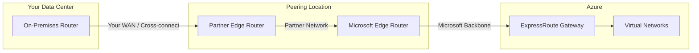

# How to Configure Azure ExpressRoute for Low-Latency Private Cloud Connectivity

Author: [nawazdhandala](https://www.github.com/nawazdhandala)

Tags: Azure, ExpressRoute, Networking, Private Connectivity, Hybrid Cloud, Low Latency, Enterprise

Description: Configure Azure ExpressRoute to establish a dedicated private connection between your data center and Azure with lower latency and higher reliability than VPN.

---

When a Site-to-Site VPN is not enough - when you need more bandwidth, lower latency, or a connection that does not traverse the public internet - Azure ExpressRoute is the answer. ExpressRoute provides a dedicated, private connection between your on-premises infrastructure and Azure through a connectivity provider. Traffic never touches the public internet, giving you predictable performance, higher security, and bandwidth options up to 100 Gbps.

In this post, I will cover the end-to-end process of setting up ExpressRoute, from choosing a provider and circuit to configuring peering and connecting it to your Azure virtual networks.

## How ExpressRoute Works

Unlike a VPN which creates an encrypted tunnel over the internet, ExpressRoute establishes a Layer 2 or Layer 3 connection through a partner network. You connect your on-premises router to the ExpressRoute partner's edge at a peering location (a colocation facility), and the partner connects to Microsoft's network.



There are three connectivity models:

- **Co-location at a cloud exchange** - your equipment is in the same facility as the Microsoft peering location
- **Point-to-point Ethernet** - a dedicated fiber connection from your data center to the peering location
- **Any-to-any (IPVPN)** - your existing MPLS network connects to Azure through the provider

## Choosing an ExpressRoute Circuit

The circuit determines bandwidth and pricing. Common bandwidth tiers are:

| Bandwidth | Use Case |
|-----------|----------|
| 50 Mbps | Small office with light Azure usage |
| 200 Mbps | Medium workloads, database replication |
| 1 Gbps | Large enterprise with significant cloud traffic |
| 10 Gbps | Data-intensive workloads, big data, migration |
| 100 Gbps | Ultra-high bandwidth requirements |

You can choose between metered (pay per GB of outbound data) and unlimited (flat rate) data plans. For consistent, high-volume traffic, unlimited is usually more cost-effective.

## Creating the ExpressRoute Circuit

Start by creating the circuit in Azure:

```bash
# Create the ExpressRoute circuit
# The provider and peering location depend on your connectivity provider
az network express-route create \
  --resource-group network-rg \
  --name my-expressroute-circuit \
  --bandwidth 1000 \
  --peering-location "Washington DC" \
  --provider "Equinix" \
  --sku-family MeteredData \
  --sku-tier Standard \
  --location eastus

# Get the service key - you'll give this to your connectivity provider
az network express-route show \
  --resource-group network-rg \
  --name my-expressroute-circuit \
  --query serviceKey \
  --output tsv
```

After creating the circuit, share the service key with your connectivity provider. They will use it to provision the connection on their side. The circuit status will change from "NotProvisioned" to "Provisioning" to "Provisioned" as the provider completes their setup.

```bash
# Check the provisioning status
az network express-route show \
  --resource-group network-rg \
  --name my-expressroute-circuit \
  --query "{circuitStatus: circuitProvisioningState, providerStatus: serviceProviderProvisioningState}"
```

## Configuring Peering

ExpressRoute supports two types of peering:

**Azure Private Peering** - connects to Azure virtual networks. This is the most common and is required for connecting to your VMs, databases, and other VNet resources.

**Microsoft Peering** - connects to Microsoft 365, Dynamics 365, and Azure PaaS services (like Azure Storage and Azure SQL) over their public endpoints.

Configure Azure Private Peering:

```bash
# Configure Azure Private Peering
# You need to provide a /30 subnet for the primary link
# and a /30 subnet for the secondary link
az network express-route peering create \
  --resource-group network-rg \
  --circuit-name my-expressroute-circuit \
  --peering-type AzurePrivatePeering \
  --peer-asn 65001 \
  --primary-peer-subnet 172.16.0.0/30 \
  --secondary-peer-subnet 172.16.0.4/30 \
  --vlan-id 200
```

The /30 subnets provide the point-to-point links between your router and Microsoft's router. The first usable IP in each /30 is yours, and the second is Microsoft's.

For Microsoft Peering (if you need access to Microsoft 365 or Azure PaaS services):

```bash
# Configure Microsoft Peering
# Requires public IP prefixes that you own
az network express-route peering create \
  --resource-group network-rg \
  --circuit-name my-expressroute-circuit \
  --peering-type MicrosoftPeering \
  --peer-asn 65001 \
  --primary-peer-subnet 203.0.113.0/30 \
  --secondary-peer-subnet 203.0.113.4/30 \
  --vlan-id 300 \
  --advertised-public-prefixes 203.0.113.0/24 \
  --customer-asn 65001 \
  --routing-registry-name ARIN
```

## Connecting to Virtual Networks

To connect your ExpressRoute circuit to Azure virtual networks, you need an ExpressRoute Gateway in the hub VNet:

```bash
# Create the ExpressRoute Gateway
# The gateway subnet should already exist in your hub VNet
az network public-ip create \
  --resource-group network-rg \
  --name er-gateway-pip \
  --allocation-method Static \
  --sku Standard

az network vnet-gateway create \
  --resource-group network-rg \
  --name hub-er-gateway \
  --vnet hub-vnet \
  --public-ip-addresses er-gateway-pip \
  --gateway-type ExpressRoute \
  --sku ErGw2AZ \
  --no-wait

# After the gateway is provisioned (takes 30-45 minutes),
# create the connection to the ExpressRoute circuit
CIRCUIT_ID=$(az network express-route show \
  --resource-group network-rg \
  --name my-expressroute-circuit \
  --query id --output tsv)

az network vpn-connection create \
  --resource-group network-rg \
  --name er-connection \
  --vnet-gateway1 hub-er-gateway \
  --express-route-circuit2 $CIRCUIT_ID
```

The ExpressRoute Gateway SKU affects performance:

| Gateway SKU | Max Circuits | Max Gbps |
|-------------|-------------|----------|
| Standard/ErGw1Az | 4 | 1 |
| HighPerformance/ErGw2Az | 8 | 2 |
| UltraPerformance/ErGw3Az | 16 | 10 |

For production use, I recommend ErGw2Az at minimum. The Az suffix means the gateway is zone-redundant, which protects against datacenter failures.

## Configuring Route Filters for Microsoft Peering

If you use Microsoft Peering, route filters control which Microsoft services are accessible. Without route filters, no routes are advertised:

```bash
# Create a route filter
az network route-filter create \
  --resource-group network-rg \
  --name ms-peering-filter \
  --location eastus

# Add a rule to allow Azure Storage routes
az network route-filter rule create \
  --resource-group network-rg \
  --filter-name ms-peering-filter \
  --name allow-azure-storage \
  --access Allow \
  --communities "12076:5040"

# Add a rule for Azure SQL
az network route-filter rule create \
  --resource-group network-rg \
  --filter-name ms-peering-filter \
  --name allow-azure-sql \
  --access Allow \
  --communities "12076:5030"

# Attach the route filter to Microsoft Peering
az network express-route peering update \
  --resource-group network-rg \
  --circuit-name my-expressroute-circuit \
  --name MicrosoftPeering \
  --route-filter ms-peering-filter
```

## Redundancy with ExpressRoute

ExpressRoute circuits come with built-in redundancy - each circuit has two connections (primary and secondary) through different paths. But for maximum resilience, deploy two circuits through different providers and different peering locations:

```bash
# Create a second circuit through a different provider/location
az network express-route create \
  --resource-group network-rg \
  --name my-expressroute-circuit-2 \
  --bandwidth 1000 \
  --peering-location "New York" \
  --provider "AT&T" \
  --sku-family MeteredData \
  --sku-tier Standard \
  --location eastus

# Connect both circuits to the same ExpressRoute gateway
# Azure automatically load balances and fails over between them
```

## Monitoring ExpressRoute

Set up monitoring to track circuit health, throughput, and BGP availability:

```bash
# Enable ExpressRoute circuit diagnostics
az monitor diagnostic-settings create \
  --resource $(az network express-route show \
    --resource-group network-rg \
    --name my-expressroute-circuit \
    --query id --output tsv) \
  --name er-diagnostics \
  --workspace $LOG_ANALYTICS_ID \
  --metrics '[{"category": "AllMetrics", "enabled": true}]'

# Create alerts for circuit health
az monitor metrics alert create \
  --resource-group network-rg \
  --name "er-bgp-down" \
  --scopes $(az network express-route show \
    --resource-group network-rg \
    --name my-expressroute-circuit \
    --query id --output tsv) \
  --condition "avg BgpAvailability < 90" \
  --window-size 5m \
  --action-group ops-team \
  --description "ExpressRoute BGP availability dropped below 90%"
```

## VPN as a Backup for ExpressRoute

A common pattern is to use a Site-to-Site VPN as a failover for ExpressRoute. If the ExpressRoute circuit goes down, traffic automatically routes over the VPN:

```bash
# Deploy a VPN gateway alongside the ExpressRoute gateway
# Both can coexist in the same GatewaySubnet
az network vnet-gateway create \
  --resource-group network-rg \
  --name hub-vpn-gateway \
  --vnet hub-vnet \
  --public-ip-addresses vpn-pip \
  --gateway-type Vpn \
  --vpn-type RouteBased \
  --sku VpnGw2 \
  --no-wait
```

Azure automatically prefers ExpressRoute over VPN because ExpressRoute routes have a shorter AS path. If the ExpressRoute circuit fails, BGP withdraws those routes, and traffic falls back to the VPN tunnel.

## Summary

Azure ExpressRoute is the premium connectivity option for organizations that need dedicated, private, and high-bandwidth connections between on-premises and Azure. The setup involves creating a circuit, working with a connectivity provider, configuring BGP peering, and connecting the circuit to your hub virtual network through an ExpressRoute gateway. For production workloads, use zone-redundant gateways, consider dual circuits for full redundancy, and always keep a VPN as a backup path. The investment in ExpressRoute pays off through predictable latency, higher throughput, and a more reliable connection than any internet-based VPN can provide.
