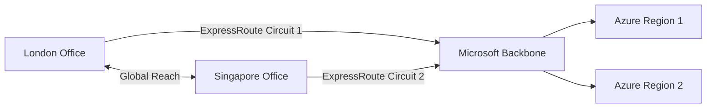

# How to Configure Azure ExpressRoute Global Reach Between Two Circuits

Author: [nawazdhandala](https://www.github.com/nawazdhandala)

Tags: Azure, ExpressRoute, Global Reach, Networking, Hybrid Cloud, WAN, Private Connectivity

Description: Step-by-step guide to configuring Azure ExpressRoute Global Reach to connect two ExpressRoute circuits for direct site-to-site communication over Microsoft backbone.

---

If your organization has offices in different regions, each with its own ExpressRoute circuit connecting to Azure, those offices cannot talk to each other directly through ExpressRoute by default. Traffic between them would need to go over the public internet or through a separate WAN solution. Azure ExpressRoute Global Reach changes that by allowing your two ExpressRoute circuits to exchange traffic directly over the Microsoft global backbone network.

This means your London office and your Singapore office can communicate through Microsoft's private network instead of the public internet, all without deploying additional VPN infrastructure.

## What is ExpressRoute Global Reach?

ExpressRoute Global Reach enables direct connectivity between your on-premises networks connected to different ExpressRoute circuits. The traffic flows through the Microsoft backbone - the same private fiber network that connects Azure regions.

Think of it as stitching two ExpressRoute circuits together so the on-premises networks behind them can reach each other directly.

## How Global Reach Differs from VNet Peering

Global Reach connects on-premises networks to each other. VNet peering connects Azure virtual networks. They solve different problems:

- **VNet Peering:** Azure VNet A can talk to Azure VNet B
- **ExpressRoute:** On-premises network can talk to Azure VNets
- **Global Reach:** On-premises network A can talk to on-premises network B through Azure



## Prerequisites

Before configuring Global Reach, confirm the following:

1. **Two active ExpressRoute circuits** in different peering locations, both provisioned and with private peering enabled
2. **Global Reach availability** in both peering locations (not all locations support it - check the Azure documentation for supported locations)
3. **Non-overlapping address spaces** between the two on-premises networks
4. **Owner or Contributor access** on both ExpressRoute circuits
5. **/29 or larger subnets** for Global Reach peering (two /29 subnets, one for each circuit)

The /29 subnet requirement is often overlooked. Global Reach needs IP addresses for the point-to-point link between the two circuits. You provide a /29, and Azure uses the first usable IPs from it.

## Step 1: Gather Circuit Information

First, get the resource IDs and peering details for both circuits:

```bash
# Get details of the first circuit (London)
az network express-route show \
  --resource-group rgLondon \
  --name londonCircuit \
  --query "{id:id, serviceKey:serviceKey, peeringLocation:peeringLocation}" \
  --output json

# Get details of the second circuit (Singapore)
az network express-route show \
  --resource-group rgSingapore \
  --name singaporeCircuit \
  --query "{id:id, serviceKey:serviceKey, peeringLocation:peeringLocation}" \
  --output json
```

Note down the resource IDs of both circuits. You will need them in the next step.

## Step 2: Verify Private Peering is Configured

Global Reach works over private peering. Make sure both circuits have it set up:

```bash
# Check private peering on the London circuit
az network express-route peering show \
  --resource-group rgLondon \
  --circuit-name londonCircuit \
  --name AzurePrivatePeering

# Check private peering on the Singapore circuit
az network express-route peering show \
  --resource-group rgSingapore \
  --circuit-name singaporeCircuit \
  --name AzurePrivatePeering
```

Both should return peering details with a `provisioningState` of `Succeeded`.

## Step 3: Enable Global Reach

Now configure Global Reach on the first circuit, referencing the second circuit. You need to provide the /29 address prefix for the Global Reach link:

```bash
# Enable Global Reach on the London circuit, connecting to Singapore
az network express-route peering connection create \
  --resource-group rgLondon \
  --circuit-name londonCircuit \
  --peering-name AzurePrivatePeering \
  --name globalReachConnection \
  --peer-circuit "/subscriptions/<sub-id>/resourceGroups/rgSingapore/providers/Microsoft.Network/expressRouteCircuits/singaporeCircuit" \
  --address-prefix "172.16.0.0/29"
```

The `--address-prefix` is a /29 subnet that does not overlap with any of your existing networks. Azure carves out IP addresses from this range for the point-to-point link.

If the two circuits are in different subscriptions, the owner of the peer circuit needs to authorize the connection first:

```bash
# On the Singapore circuit, create an authorization key
az network express-route auth create \
  --resource-group rgSingapore \
  --circuit-name singaporeCircuit \
  --name globalReachAuth

# Get the authorization key
az network express-route auth show \
  --resource-group rgSingapore \
  --circuit-name singaporeCircuit \
  --name globalReachAuth \
  --query authorizationKey \
  --output tsv
```

Then include the authorization key when creating the Global Reach connection:

```bash
# Enable Global Reach with authorization key for cross-subscription
az network express-route peering connection create \
  --resource-group rgLondon \
  --circuit-name londonCircuit \
  --peering-name AzurePrivatePeering \
  --name globalReachConnection \
  --peer-circuit "/subscriptions/<peer-sub-id>/resourceGroups/rgSingapore/providers/Microsoft.Network/expressRouteCircuits/singaporeCircuit" \
  --address-prefix "172.16.0.0/29" \
  --authorization-key "<auth-key>"
```

## Step 4: Verify the Connection

After creating the connection, check its status:

```bash
# Verify Global Reach connection status
az network express-route peering connection show \
  --resource-group rgLondon \
  --circuit-name londonCircuit \
  --peering-name AzurePrivatePeering \
  --name globalReachConnection \
  --query "circuitConnectionStatus" \
  --output tsv
```

The status will go through `Connecting` and should settle on `Connected`. This can take a few minutes.

## Step 5: Verify Route Exchange

Once connected, verify that routes from each on-premises network are being advertised through the circuits:

```bash
# Check the route table for the London circuit's private peering
az network express-route list-route-tables \
  --resource-group rgLondon \
  --name londonCircuit \
  --peering-name AzurePrivatePeering \
  --path primary
```

You should see routes from the Singapore on-premises network appearing in the London circuit's route table, and vice versa.

## Understanding the Traffic Flow

When a server in London sends a packet to a server in Singapore through Global Reach, the path looks like this:

1. Packet leaves London server, enters the London ExpressRoute circuit through the provider's edge router
2. The London MSEE (Microsoft Enterprise Edge) router forwards the packet over the Microsoft backbone
3. The packet arrives at the Singapore MSEE router
4. The Singapore MSEE forwards the packet through the Singapore ExpressRoute circuit to the Singapore on-premises network

The entire path stays within the Microsoft network. At no point does the traffic touch the public internet.

## Bandwidth and Performance Considerations

Global Reach bandwidth is limited by the smallest circuit in the pair. If your London circuit is 1 Gbps and your Singapore circuit is 500 Mbps, the Global Reach link is effectively 500 Mbps.

Latency depends on the physical distance between peering locations and the Microsoft backbone path. While Microsoft's network is well-optimized, you will still see latency proportional to the geographic distance. London to Singapore will always have higher latency than London to Amsterdam.

## Cost

Global Reach has its own billing. You pay a per-GB data transfer fee for traffic flowing between the two circuits. This is in addition to your regular ExpressRoute circuit costs. The rates vary by region, so check the Azure pricing page for current numbers.

For workloads with heavy inter-site traffic, compare the Global Reach cost against your current WAN or MPLS costs. Many organizations find Global Reach cheaper, especially when they are already paying for ExpressRoute circuits.

## Limitations

- **Not available in all peering locations.** Check the Azure docs for current availability.
- **Does not support IPv6.** Global Reach currently works only with IPv4 traffic.
- **Requires non-overlapping address spaces.** If both on-premises networks use the same IP ranges, Global Reach will not work. You would need to implement NAT, which Global Reach does not support natively.
- **Maximum of 4 Global Reach connections per circuit.**

## Deleting a Global Reach Connection

If you need to remove the connection:

```bash
# Delete the Global Reach connection
az network express-route peering connection delete \
  --resource-group rgLondon \
  --circuit-name londonCircuit \
  --peering-name AzurePrivatePeering \
  --name globalReachConnection
```

This immediately stops traffic flow between the two circuits. Plan for this in your change management process.

## Summary

ExpressRoute Global Reach is a clean solution for connecting geographically distributed offices through the Microsoft backbone. The setup is straightforward: ensure both circuits have private peering, allocate a /29 for the link, create the connection, and verify route exchange. The main thing to plan for is making sure your peering locations support Global Reach and that your address spaces do not overlap. Once configured, you get private, low-latency connectivity between your sites without any additional infrastructure to manage.
