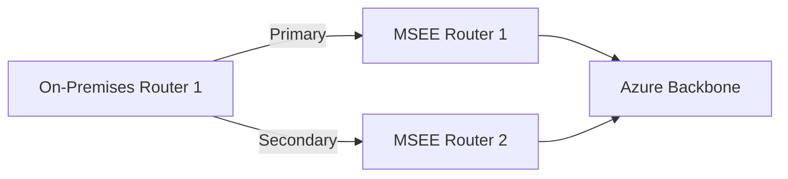
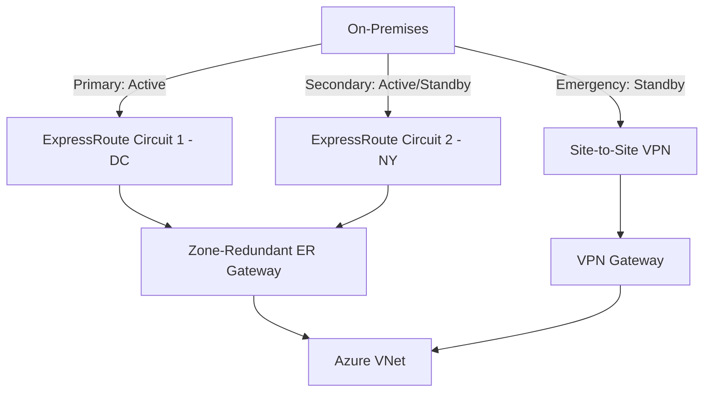

# How to Configure Azure ExpressRoute with Redundant Connections for High Availability

Author: [nawazdhandala](https://www.github.com/nawazdhandala)

Tags: Azure, ExpressRoute, High Availability, Redundancy, Networking, Hybrid Cloud, Disaster Recovery

Description: A comprehensive guide to configuring Azure ExpressRoute with redundant connections to ensure high availability for critical hybrid cloud workloads.

---

A single ExpressRoute circuit gives you a private connection to Azure, but a single anything is a single point of failure. When that circuit goes down - due to a provider outage, fiber cut, or planned maintenance - your on-premises to Azure connectivity disappears. For production workloads, that is not acceptable.

Achieving high availability with ExpressRoute requires redundancy at multiple levels: within a circuit, across circuits, and across peering locations. In this post, I will walk through each layer of redundancy and how to configure them.

## Understanding ExpressRoute Built-in Redundancy

Every ExpressRoute circuit comes with two physical connections by default. These are the primary and secondary connections that terminate at the Microsoft Enterprise Edge (MSEE) routers. This gives you resilience against a single link failure within the same peering location.



But both connections go through the same peering location and typically the same connectivity provider. This means you are still vulnerable to:
- Provider-wide outages
- Peering location facility failures
- Regional disasters

## Redundancy Levels

Here is how to think about ExpressRoute redundancy:

| Level | What it Protects Against | How |
|-------|------------------------|-----|
| Circuit built-in | Single link failure | Primary + Secondary connections |
| Dual circuits, same location | Provider failure | Two circuits from different providers |
| Dual circuits, different locations | Facility/regional failure | Circuits in geographically separate peering locations |
| ExpressRoute + VPN | ExpressRoute total failure | VPN as backup path |

For mission-critical workloads, I recommend at minimum dual circuits in different peering locations plus VPN as an emergency backup.

## Step 1: Set Up the Primary Circuit

Create your first ExpressRoute circuit in your primary peering location:

```bash
# Create the primary ExpressRoute circuit
az network express-route create \
  --resource-group myResourceGroup \
  --name primaryCircuit \
  --bandwidth 1000 \
  --peering-location "Washington DC" \
  --provider "Equinix" \
  --sku-family MeteredData \
  --sku-tier Premium
```

After provisioning with your provider, configure private peering:

```bash
# Configure private peering on the primary circuit
az network express-route peering create \
  --resource-group myResourceGroup \
  --circuit-name primaryCircuit \
  --peering-type AzurePrivatePeering \
  --peer-asn 65010 \
  --primary-peer-subnet "172.16.0.0/30" \
  --secondary-peer-subnet "172.16.0.4/30" \
  --vlan-id 100
```

## Step 2: Set Up the Secondary Circuit

Create a second circuit in a different peering location with a different provider if possible:

```bash
# Create the secondary circuit in a different peering location
az network express-route create \
  --resource-group myResourceGroup \
  --name secondaryCircuit \
  --bandwidth 1000 \
  --peering-location "New York" \
  --provider "AT&T" \
  --sku-family MeteredData \
  --sku-tier Premium

# Configure private peering on the secondary circuit
az network express-route peering create \
  --resource-group myResourceGroup \
  --circuit-name secondaryCircuit \
  --peering-type AzurePrivatePeering \
  --peer-asn 65010 \
  --primary-peer-subnet "172.16.1.0/30" \
  --secondary-peer-subnet "172.16.1.4/30" \
  --vlan-id 200
```

Using a different provider and peering location gives you maximum resilience. A fiber cut or provider issue at one location does not affect the other.

## Step 3: Connect Both Circuits to the Same VNet

Both circuits need to connect to your Azure VNet through a virtual network gateway. Create the gateway and connect both circuits:

```bash
# Create the ExpressRoute gateway (make it zone-redundant for additional HA)
az network public-ip create \
  --resource-group myResourceGroup \
  --name erGatewayPIP \
  --sku Standard \
  --allocation-method Static \
  --zone 1 2 3

az network vnet-gateway create \
  --resource-group myResourceGroup \
  --name myERGateway \
  --vnet myVNet \
  --public-ip-addresses erGatewayPIP \
  --gateway-type ExpressRoute \
  --sku ErGw2AZ \
  --no-wait
```

The `ErGw2AZ` SKU is zone-redundant, meaning the gateway spans availability zones. This protects against zone-level failures within the Azure region.

After the gateway is created, connect both circuits:

```bash
# Connect the primary circuit
az network vpn-connection create \
  --resource-group myResourceGroup \
  --name primaryConnection \
  --vnet-gateway1 myERGateway \
  --express-route-circuit2 "/subscriptions/<sub-id>/resourceGroups/myResourceGroup/providers/Microsoft.Network/expressRouteCircuits/primaryCircuit" \
  --routing-weight 10

# Connect the secondary circuit
az network vpn-connection create \
  --resource-group myResourceGroup \
  --name secondaryConnection \
  --vnet-gateway1 myERGateway \
  --express-route-circuit2 "/subscriptions/<sub-id>/resourceGroups/myResourceGroup/providers/Microsoft.Network/expressRouteCircuits/secondaryCircuit" \
  --routing-weight 20
```

The `--routing-weight` parameter influences route selection. Lower weight means higher preference. With primary at weight 10 and secondary at weight 20, Azure prefers the primary circuit. If the primary goes down, traffic automatically shifts to the secondary.

## Step 4: Configure Active-Active Routing

For true active-active where both circuits carry traffic simultaneously:

```bash
# Set equal routing weights for active-active
az network vpn-connection update \
  --resource-group myResourceGroup \
  --name primaryConnection \
  --routing-weight 10

az network vpn-connection update \
  --resource-group myResourceGroup \
  --name secondaryConnection \
  --routing-weight 10
```

With equal weights, Azure load balances traffic across both circuits. This doubles your available bandwidth and ensures both paths are always exercised (you will know immediately if one fails, rather than discovering it during a failover).

## Step 5: Configure On-Premises BGP for Redundancy

Your on-premises routers should be configured with BGP sessions to both circuits. Use BGP attributes to control traffic flow:

```
! On-premises BGP configuration for dual ExpressRoute
router bgp 65010
  ! Primary circuit BGP neighbor
  neighbor 172.16.0.1 remote-as 12076
  neighbor 172.16.0.1 description "Primary ER Circuit"

  ! Secondary circuit BGP neighbor
  neighbor 172.16.1.1 remote-as 12076
  neighbor 172.16.1.1 description "Secondary ER Circuit"

  address-family ipv4
    ! Advertise on-premises networks through both circuits
    network 10.100.0.0 mask 255.255.0.0
    neighbor 172.16.0.1 activate
    neighbor 172.16.1.1 activate

    ! Prefer primary circuit by setting higher local preference
    neighbor 172.16.0.1 route-map PRIMARY-PREF in
    neighbor 172.16.1.1 route-map SECONDARY-PREF in
  exit-address-family

! Route maps for preference control
route-map PRIMARY-PREF permit 10
  set local-preference 200

route-map SECONDARY-PREF permit 10
  set local-preference 100
```

With this configuration, the primary circuit is preferred for return traffic (Azure to on-premises) via higher local preference. If the primary fails, BGP automatically withdraws its routes and the secondary takes over.

## Step 6: Add VPN Gateway as Emergency Backup

For an additional safety net, configure a site-to-site VPN as a backup path:

```bash
# Create a VPN gateway in the same VNet (using a different GatewaySubnet is not possible)
# So use the same gateway with both types, or create in a separate peered VNet

# Create the VPN connection as backup
az network local-gateway create \
  --resource-group myResourceGroup \
  --name onPremVPNGateway \
  --gateway-ip-address 203.0.113.10 \
  --local-address-prefixes "10.100.0.0/16"

# Note: VPN and ExpressRoute coexistence requires specific gateway SKUs
```

VPN bandwidth is much lower than ExpressRoute, but it provides connectivity when both ExpressRoute circuits are down. This is your last line of defense.

## Monitoring Redundant Connections

Monitor both circuits continuously to detect issues before they cause outages:

```bash
# Check the status of both circuits
az network express-route show \
  --resource-group myResourceGroup \
  --name primaryCircuit \
  --query "{name:name, provisioningState:provisioningState, serviceProviderProvisioningState:serviceProviderProvisioningState}" \
  --output json

az network express-route show \
  --resource-group myResourceGroup \
  --name secondaryCircuit \
  --query "{name:name, provisioningState:provisioningState, serviceProviderProvisioningState:serviceProviderProvisioningState}" \
  --output json

# Check BGP peer status
az network express-route list-route-tables \
  --resource-group myResourceGroup \
  --name primaryCircuit \
  --peering-name AzurePrivatePeering \
  --path primary
```

Set up alerts for circuit state changes:

```bash
# Alert when an ExpressRoute circuit goes down
az monitor metrics alert create \
  --resource-group myResourceGroup \
  --name erCircuitAlert \
  --scopes "/subscriptions/<sub-id>/resourceGroups/myResourceGroup/providers/Microsoft.Network/expressRouteCircuits/primaryCircuit" \
  --condition "avg BgpAvailability < 100" \
  --window-size 5m \
  --evaluation-frequency 1m \
  --action-group networkOpsTeam \
  --description "Primary ExpressRoute BGP availability dropped"
```

## Failover Architecture



## Testing Failover

Regularly test your failover by simulating circuit failures:

1. Disable the primary circuit's BGP peering and verify traffic shifts to secondary
2. Re-enable primary and verify traffic returns
3. Disable both circuits and verify VPN backup takes over
4. Document failover times and any application impact

Do not wait for a real outage to discover your redundancy does not work. Test it regularly.

## Cost Considerations

Running dual ExpressRoute circuits doubles your circuit costs. Here is how to manage costs:

- Use metered billing on the secondary circuit if it is in standby mode
- Choose a lower bandwidth for the secondary if it only needs to handle a portion of traffic during failover
- The zone-redundant gateway does not cost more than a standard gateway
- VPN backup costs are minimal since it is a pay-per-use connection

## Summary

True high availability for ExpressRoute requires redundancy at multiple layers. Start with the built-in primary/secondary connections within each circuit, then add a second circuit in a different peering location with a different provider. Connect both circuits to a zone-redundant ExpressRoute gateway, configure BGP on your on-premises routers for automatic failover, and add a VPN backup as a last resort. Monitor both circuits continuously and test failover regularly. The investment in redundancy pays for itself the first time a provider has an outage and your connectivity stays up.
