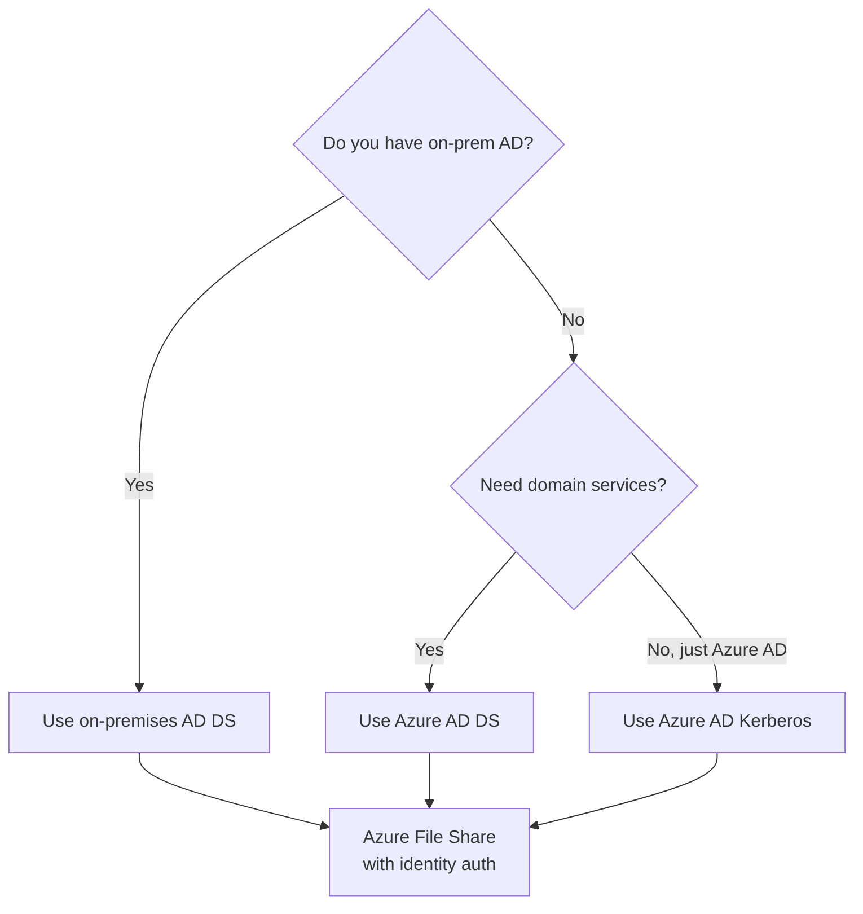

# How to Configure Azure Files with Active Directory Authentication

Author: [nawazdhandala](https://www.github.com/nawazdhandala)

Tags: Azure, Azure Files, Active Directory, Authentication, Identity, Azure Storage, Security

Description: Learn how to configure Azure Files with Active Directory authentication for identity-based access control using on-premises AD DS or Azure AD DS.

---

By default, Azure File Shares use storage account keys or SAS tokens for authentication. These are shared secrets - anyone with the key can access everything. Active Directory authentication changes this by letting users and groups access file shares using their existing AD credentials, with file-level and folder-level permissions enforced through standard NTFS ACLs.

This is essential for enterprise environments where you need per-user access control, audit trails tied to specific identities, and integration with existing permission models.

## Authentication Options

Azure Files supports three identity-based authentication methods:

1. **On-premises Active Directory Domain Services (AD DS)** - Your existing on-premises AD. Requires AD DS synced to Azure AD via Azure AD Connect.
2. **Azure Active Directory Domain Services (Azure AD DS)** - Microsoft's managed AD service in Azure. No on-premises infrastructure needed.
3. **Azure AD Kerberos** - For hybrid identities accessing file shares from Azure AD-joined devices.

The right choice depends on your existing infrastructure:

- Have on-premises AD and want to use it? Go with AD DS.
- Cloud-only environment with no on-premises AD? Use Azure AD DS.
- Azure AD-joined devices accessing file shares? Consider Azure AD Kerberos.



## Setting Up AD DS Authentication (On-Premises AD)

This is the most common scenario for organizations with existing Windows Server AD.

### Prerequisites

- On-premises AD DS domain
- Azure AD Connect configured and syncing identities to Azure AD
- Storage account in the same Azure AD tenant
- A domain-joined machine with the AzFilesHybrid PowerShell module

### Step 1: Download and Install the AzFilesHybrid Module

```powershell
# Download the AzFilesHybrid module
# Get the latest release from https://github.com/Azure-Samples/azure-files-samples/releases

# Extract and import the module
Expand-Archive -Path "AzFilesHybrid.zip" -DestinationPath "C:\AzFilesHybrid"
Import-Module "C:\AzFilesHybrid\AzFilesHybrid.psd1"

# Connect to Azure
Connect-AzAccount
```

### Step 2: Register the Storage Account with AD

This creates a computer account (or service logon account) in your AD that represents the storage account:

```powershell
# Register the storage account with on-premises AD
# This must be run from a domain-joined machine
Join-AzStorageAccountForAuth `
  -ResourceGroupName "myresourcegroup" `
  -StorageAccountName "myfilesaccount" `
  -DomainAccountType "ComputerAccount" `
  -OrganizationalUnitDistinguishedName "OU=StorageAccounts,DC=contoso,DC=com"
```

The `-DomainAccountType` can be:
- `ComputerAccount` - Creates a computer object in AD (recommended, no password expiration)
- `ServiceLogonAccount` - Creates a user object (may need password rotation)

### Step 3: Verify the Registration

```powershell
# Verify that AD DS authentication is enabled
$storageAccount = Get-AzStorageAccount -ResourceGroupName "myresourcegroup" -Name "myfilesaccount"
$storageAccount.AzureFilesIdentityBasedAuth.DirectoryServiceOptions
# Should output: AD

$storageAccount.AzureFilesIdentityBasedAuth.ActiveDirectoryProperties
# Should show your domain information
```

### Step 4: Enable AD DS Authentication via CLI

Alternatively, if you have already created the AD object manually:

```bash
# Enable AD DS authentication on the storage account
az storage account update \
  --name myfilesaccount \
  --resource-group myresourcegroup \
  --enable-files-adds true \
  --domain-name "contoso.com" \
  --net-bios-domain-name "CONTOSO" \
  --forest-name "contoso.com" \
  --domain-guid "xxxxxxxx-xxxx-xxxx-xxxx-xxxxxxxxxxxx" \
  --domain-sid "S-1-5-21-xxxxxxxxx-xxxxxxxxx-xxxxxxxxx" \
  --azure-storage-sid "S-1-5-21-xxxxxxxxx-xxxxxxxxx-xxxxxxxxx-xxxx"
```

## Setting Up Azure AD DS Authentication

If you do not have on-premises AD, Azure AD DS is a managed alternative.

### Prerequisites

- Azure AD DS instance deployed and running
- VMs joined to the Azure AD DS domain
- Users synced from Azure AD to Azure AD DS

### Enable Azure AD DS Authentication

```bash
# Enable Azure AD DS authentication on the storage account
az storage account update \
  --name myfilesaccount \
  --resource-group myresourcegroup \
  --enable-files-aadds true
```

That is it for the storage account side. Azure AD DS authentication is simpler to configure than on-premises AD DS because there is no manual domain join process.

## Configuring Share-Level Permissions

After enabling AD authentication, you need to assign Azure RBAC roles at the file share level. These roles determine what a user can do at the share level:

- **Storage File Data SMB Share Reader** - Read access to files and directories
- **Storage File Data SMB Share Contributor** - Read, write, and delete access
- **Storage File Data SMB Share Elevated Contributor** - Read, write, delete, and modify NTFS permissions

### Assign Share-Level Permissions

```bash
# Get the file share resource ID
SHARE_ID=$(az storage account show \
  --name myfilesaccount \
  --resource-group myresourcegroup \
  --query "id" --output tsv)/fileServices/default/fileshares/myfileshare

# Assign the Contributor role to a user
az role assignment create \
  --role "Storage File Data SMB Share Contributor" \
  --assignee "user@contoso.com" \
  --scope "$SHARE_ID"

# Assign the Reader role to a security group
az role assignment create \
  --role "Storage File Data SMB Share Reader" \
  --assignee "xxxxxxxx-xxxx-xxxx-xxxx-xxxxxxxxxxxx" \
  --scope "$SHARE_ID"
```

### Common Role Assignments

```bash
# Give the IT admins elevated access (can modify permissions)
az role assignment create \
  --role "Storage File Data SMB Share Elevated Contributor" \
  --assignee-object-id $(az ad group show --group "IT-Admins" --query id --output tsv) \
  --scope "$SHARE_ID"

# Give all employees read/write access
az role assignment create \
  --role "Storage File Data SMB Share Contributor" \
  --assignee-object-id $(az ad group show --group "All-Employees" --query id --output tsv) \
  --scope "$SHARE_ID"
```

## Configuring Directory and File-Level Permissions (NTFS ACLs)

Share-level permissions are the first gate. For granular control within the share, you configure NTFS ACLs on directories and files. This requires mounting the share with the storage account key (using superuser permissions) and then setting ACLs:

```powershell
# Mount the share with the storage account key (for initial ACL setup)
$storageKey = (Get-AzStorageAccountKey -ResourceGroupName "myresourcegroup" -Name "myfilesaccount")[0].Value
net use Z: \\myfilesaccount.file.core.windows.net\myfileshare /user:AZURE\myfilesaccount $storageKey

# Set NTFS permissions on a directory
$acl = Get-Acl "Z:\department-data\finance"

# Add read permission for the Finance group
$rule = New-Object System.Security.AccessControl.FileSystemAccessRule(
    "CONTOSO\Finance-Team",
    "ReadAndExecute",
    "ContainerInherit,ObjectInherit",
    "None",
    "Allow"
)
$acl.AddAccessRule($rule)

# Add full control for Finance managers
$rule2 = New-Object System.Security.AccessControl.FileSystemAccessRule(
    "CONTOSO\Finance-Managers",
    "FullControl",
    "ContainerInherit,ObjectInherit",
    "None",
    "Allow"
)
$acl.AddAccessRule($rule2)

# Apply the ACL
Set-Acl "Z:\department-data\finance" $acl

# Verify the permissions
Get-Acl "Z:\department-data\finance" | Format-List
```

After setting ACLs, unmount the key-based connection. Users should mount the share using their AD credentials instead.

## Mounting with AD Credentials

Once everything is configured, users mount the share with their domain credentials:

```powershell
# Mount the share using AD authentication (no storage key needed)
# The user must be logged into a domain-joined machine
net use Z: \\myfilesaccount.file.core.windows.net\myfileshare

# The user's Kerberos ticket is used for authentication automatically
```

On a domain-joined machine where the user is logged in with their AD credentials, the mount happens transparently without prompting for credentials.

## Troubleshooting

### "Access Denied" When Mounting

Verify that the user has a share-level RBAC role assigned:

```bash
# List role assignments on the file share
az role assignment list --scope "$SHARE_ID" --output table
```

### Kerberos Ticket Issues

On the client machine, check for valid Kerberos tickets:

```powershell
# List current Kerberos tickets
klist

# If no tickets for the storage account, try refreshing
klist purge
# Then re-mount the share
```

### SPN Not Found

If the storage account's computer object in AD does not have the correct Service Principal Names:

```powershell
# Check the SPNs on the storage account's computer object
setspn -L myfilesaccount

# If missing, add the required SPN
setspn -S cifs/myfilesaccount.file.core.windows.net myfilesaccount
```

## Best Practices

**Use security groups, not individual users.** Assign RBAC roles to AD security groups for easier management and auditability.

**Follow the principle of least privilege.** Give users Reader access by default and Contributor only where needed. Reserve Elevated Contributor for administrators.

**Document your permission structure.** Map out which groups have access to which directories. This documentation is invaluable during audits and troubleshooting.

**Test with a pilot group first.** Before rolling out AD authentication to the entire organization, test with a small group to catch configuration issues.

**Keep Azure AD Connect healthy.** If the sync between on-premises AD and Azure AD breaks, new users and group changes will not propagate, and authentication can fail for affected users.

## Wrapping Up

Active Directory authentication for Azure Files brings enterprise-grade access control to cloud file shares. The setup varies in complexity depending on whether you use on-premises AD DS or Azure AD DS, but the end result is the same: per-user access with familiar NTFS permissions. Plan your share-level RBAC roles carefully, set directory-level ACLs for granular control, and use security groups for manageable permission structures.
