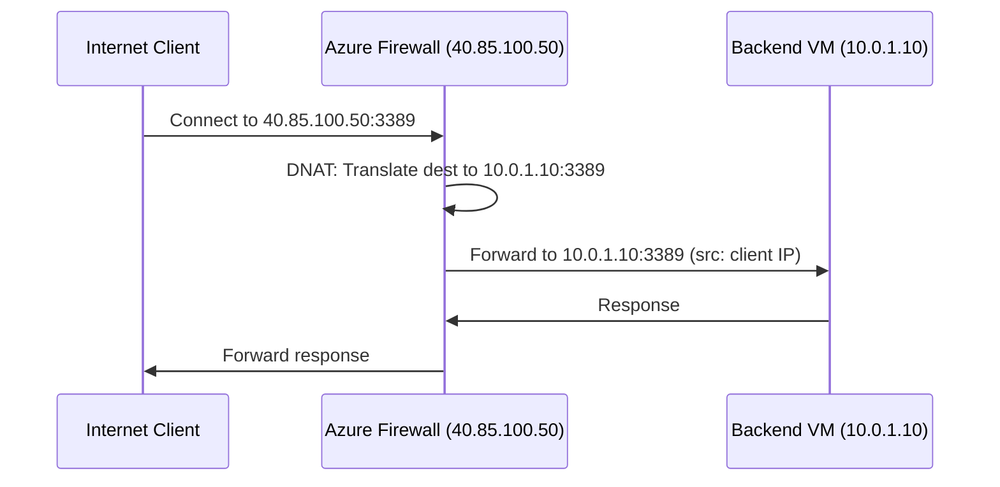

# How to Configure Azure Firewall DNAT Rules for Inbound Traffic

Author: [nawazdhandala](https://www.github.com/nawazdhandala)

Tags: Azure, Firewall, DNAT, Inbound Traffic, Networking, Security, NAT Rules

Description: Learn how to configure Azure Firewall DNAT rules to translate and forward inbound traffic from the internet to backend services in your virtual network.

---

When you want to expose a backend service in your Azure VNet to the internet but route all traffic through Azure Firewall first, Destination Network Address Translation (DNAT) rules are the mechanism to use. DNAT rules translate the destination IP and port of incoming packets from the firewall's public IP to a private IP and port inside your VNet.

This gives you a single point of ingress where you can inspect, log, and filter inbound traffic before it reaches your backend services.

## What DNAT Does

DNAT translates the destination address of incoming packets. When a client connects to your firewall's public IP on a specific port, the firewall rewrites the destination to an internal IP and port, then forwards the packet.

For example:
- Client connects to `40.85.100.50:3389` (firewall public IP)
- Firewall translates destination to `10.0.1.10:3389` (backend VM)
- Backend VM receives the connection and responds through the firewall

The source IP is preserved by default, so the backend sees the original client IP.



## Prerequisites

1. Azure Firewall deployed in a VNet with `AzureFirewallSubnet`
2. At least one public IP associated with the firewall
3. Backend VMs or services in the same VNet or a peered VNet
4. A route table on the backend subnet with a default route pointing to the firewall's private IP (for return traffic)

## Step 1: Ensure the Firewall Has a Public IP

Your firewall needs a public IP for clients to connect to. Most firewall deployments already have one, but you can verify:

```bash
# Check public IPs associated with the firewall
az network firewall show \
  --resource-group myResourceGroup \
  --name myFirewall \
  --query "ipConfigurations[].publicIpAddress.id" \
  --output tsv
```

If you need to add a second public IP (for example, to separate traffic for different DNAT rules):

```bash
# Create a new public IP
az network public-ip create \
  --resource-group myResourceGroup \
  --name firewallPIP2 \
  --sku Standard \
  --allocation-method Static

# Add it to the firewall
az network firewall ip-config create \
  --resource-group myResourceGroup \
  --firewall-name myFirewall \
  --name ipconfig2 \
  --public-ip-address firewallPIP2 \
  --vnet-name myVNet
```

## Step 2: Create a DNAT Rule Collection

DNAT rules are organized into rule collections. Each collection has a priority and an action (always "Dnat" for DNAT collections).

Using classic rules:

```bash
# Create a DNAT rule collection with a rule to forward RDP traffic
az network firewall nat-rule create \
  --resource-group myResourceGroup \
  --firewall-name myFirewall \
  --collection-name inboundDNAT \
  --priority 100 \
  --action Dnat \
  --name allowRDP \
  --source-addresses "*" \
  --destination-addresses "40.85.100.50" \
  --destination-ports 3389 \
  --protocols TCP \
  --translated-address "10.0.1.10" \
  --translated-port 3389
```

Let me break down each parameter:

- `--source-addresses "*"` allows connections from any source. In production, restrict this to known IP ranges.
- `--destination-addresses` is the firewall's public IP that clients connect to.
- `--destination-ports` is the port on the firewall's public IP.
- `--translated-address` is the internal IP where traffic gets forwarded.
- `--translated-port` is the port on the internal service.

## Step 3: Create DNAT Rules with Azure Firewall Policy

If you are using Azure Firewall Policy (recommended for newer deployments), the approach is slightly different:

```bash
# Create a firewall policy if you do not have one
az network firewall policy create \
  --resource-group myResourceGroup \
  --name myFirewallPolicy \
  --location eastus

# Create a DNAT rule collection group
az network firewall policy rule-collection-group create \
  --resource-group myResourceGroup \
  --policy-name myFirewallPolicy \
  --name dnatRuleGroup \
  --priority 100

# Add a DNAT rule collection with rules
az network firewall policy rule-collection-group collection add-nat-collection \
  --resource-group myResourceGroup \
  --policy-name myFirewallPolicy \
  --rule-collection-group-name dnatRuleGroup \
  --name inboundNATRules \
  --priority 100 \
  --action DNAT \
  --rule-name allowWebServer \
  --source-addresses "*" \
  --destination-addresses "40.85.100.50" \
  --destination-ports 443 \
  --ip-protocols TCP \
  --translated-address "10.0.1.20" \
  --translated-port 443
```

## Step 4: Port Translation (Different External and Internal Ports)

You can map different external and internal ports. This is useful when you want to expose a service on a non-standard port externally:

```bash
# Forward external port 8080 to internal port 80
az network firewall policy rule-collection-group collection rule add \
  --resource-group myResourceGroup \
  --policy-name myFirewallPolicy \
  --rule-collection-group-name dnatRuleGroup \
  --collection-name inboundNATRules \
  --name webOnCustomPort \
  --rule-type NatRule \
  --source-addresses "*" \
  --destination-addresses "40.85.100.50" \
  --destination-ports 8080 \
  --ip-protocols TCP \
  --translated-address "10.0.1.20" \
  --translated-port 80
```

Now clients connect to `40.85.100.50:8080` and reach the web server running on port 80 internally.

## Step 5: Configure Return Traffic Routing

This is critical. Return traffic from the backend VM must go back through the firewall. Otherwise, the client receives responses from a different IP than it connected to, and the connection fails.

Create a route table on the backend subnet with a default route through the firewall:

```bash
# Create a route table for the backend subnet
az network route-table create \
  --resource-group myResourceGroup \
  --name backendRouteTable \
  --location eastus

# Add a default route pointing to the firewall's private IP
az network route-table route create \
  --resource-group myResourceGroup \
  --route-table-name backendRouteTable \
  --name defaultToFirewall \
  --address-prefix 0.0.0.0/0 \
  --next-hop-type VirtualAppliance \
  --next-hop-ip-address 10.0.0.4

# Associate the route table with the backend subnet
az network vnet subnet update \
  --resource-group myResourceGroup \
  --vnet-name myVNet \
  --name backendSubnet \
  --route-table backendRouteTable
```

The `10.0.0.4` is the firewall's private IP address in `AzureFirewallSubnet`.

## Restricting Source IPs

Never leave `--source-addresses "*"` in production for sensitive services like RDP or SSH. Restrict to known IP ranges:

```bash
# DNAT rule restricted to specific source IPs
az network firewall nat-rule create \
  --resource-group myResourceGroup \
  --firewall-name myFirewall \
  --collection-name restrictedDNAT \
  --priority 200 \
  --action Dnat \
  --name allowSSHFromOffice \
  --source-addresses "203.0.113.0/24" "198.51.100.50" \
  --destination-addresses "40.85.100.50" \
  --destination-ports 22 \
  --protocols TCP \
  --translated-address "10.0.1.15" \
  --translated-port 22
```

This only allows SSH from the office network `203.0.113.0/24` and one specific IP.

## DNAT with Multiple Backend Servers

If you have multiple backend servers, you need separate DNAT rules with different external ports or different public IPs:

```bash
# Server 1: External port 33891 -> Internal 10.0.1.10:3389
az network firewall nat-rule create \
  --resource-group myResourceGroup \
  --firewall-name myFirewall \
  --collection-name multiServerDNAT \
  --priority 300 \
  --action Dnat \
  --name rdpServer1 \
  --source-addresses "203.0.113.0/24" \
  --destination-addresses "40.85.100.50" \
  --destination-ports 33891 \
  --protocols TCP \
  --translated-address "10.0.1.10" \
  --translated-port 3389

# Server 2: External port 33892 -> Internal 10.0.1.11:3389
az network firewall nat-rule create \
  --resource-group myResourceGroup \
  --firewall-name myFirewall \
  --collection-name multiServerDNAT \
  --name rdpServer2 \
  --source-addresses "203.0.113.0/24" \
  --destination-addresses "40.85.100.50" \
  --destination-ports 33892 \
  --protocols TCP \
  --translated-address "10.0.1.11" \
  --translated-port 3389
```

## Monitoring DNAT Traffic

Azure Firewall logs DNAT activity to Azure Monitor. Enable diagnostics to track which DNAT rules are being hit:

```bash
# Enable diagnostic logging for the firewall
az monitor diagnostic-settings create \
  --resource "/subscriptions/<sub-id>/resourceGroups/myResourceGroup/providers/Microsoft.Network/azureFirewalls/myFirewall" \
  --name firewallDiagnostics \
  --workspace myLogAnalyticsWorkspace \
  --logs '[{"category":"AzureFirewallNetworkRule","enabled":true},{"category":"AzureFirewallDnsProxy","enabled":true}]'
```

Query the logs in Log Analytics:

```
// KQL query to find DNAT rule hits
AzureFirewallNetworkRule
| where Action == "DNAT"
| project TimeGenerated, SourceIP, DestinationIP, DestinationPort, TranslatedIP, TranslatedPort
| order by TimeGenerated desc
```

## Common Issues

**Connection times out.** Check the route table on the backend subnet. Return traffic must route through the firewall.

**Asymmetric routing.** If the backend VM has a public IP, responses may bypass the firewall. Remove public IPs from backend VMs or add more specific routes.

**DNAT rule not matching.** Verify the destination address in the rule matches exactly the firewall's public IP. Check the rule priority - lower numbers are evaluated first.

## Summary

Azure Firewall DNAT rules provide controlled inbound access to your backend services. Create the rules mapping public IP and port combinations to internal destinations, restrict source addresses for sensitive services, and make sure return traffic routes through the firewall. Combined with Azure Firewall's logging and threat intelligence features, DNAT gives you visibility and control over every inbound connection to your environment.
