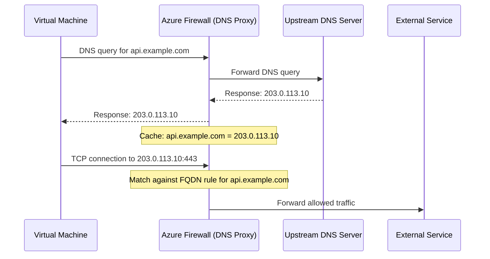
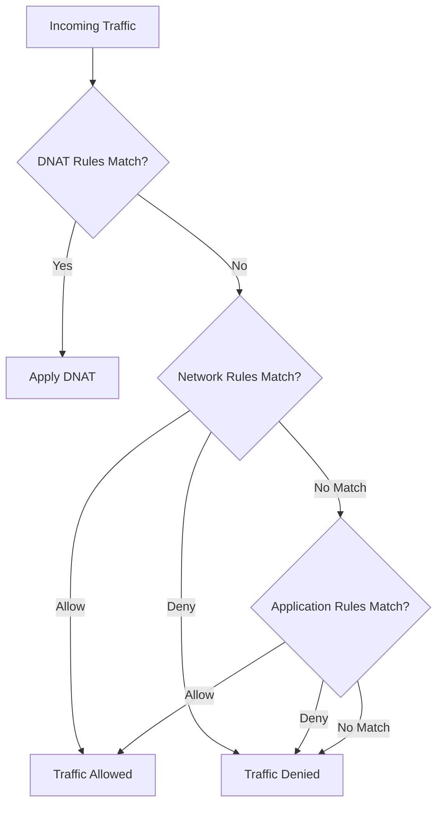

# How to Configure Azure Firewall DNS Proxy and FQDN-Based Filtering Rules

Author: [nawazdhandala](https://www.github.com/nawazdhandala)

Tags: Azure, Azure Firewall, DNS, FQDN Filtering, Network Security, Firewall Rules, DNS Proxy

Description: A practical guide to enabling the Azure Firewall DNS proxy feature and creating FQDN-based network and application rules for outbound traffic filtering.

---

Azure Firewall supports filtering traffic based on fully qualified domain names (FQDNs) instead of just IP addresses. This is powerful because cloud services change their IP addresses constantly, but their domain names stay the same. To make FQDN filtering work reliably, you need to enable the Azure Firewall DNS proxy feature so the firewall can resolve and inspect DNS queries from your workloads.

This guide covers the DNS proxy configuration, FQDN-based rule creation, and the troubleshooting steps you will need when things do not resolve as expected.

## Why DNS Proxy Matters for FQDN Filtering

Without the DNS proxy, Azure Firewall faces a challenge with FQDN-based rules. Here is the problem: when a virtual machine makes a DNS query, it goes to whatever DNS server is configured (often Azure's default 168.63.129.16 or a custom DNS server). The VM gets back an IP address and then opens a connection to that IP. The firewall sees the connection to the IP address but does not inherently know which domain name the VM was trying to reach.

When you enable DNS proxy mode, the firewall itself resolves the DNS query and caches the result. It knows the mapping between the domain name and the IP address. When the subsequent connection comes through, the firewall can match it against FQDN rules.



## Prerequisites

You need:

- An Azure Firewall (Standard or Premium SKU) deployed in a hub virtual network
- Spoke virtual networks with routes pointing to the firewall as the next hop
- DNS servers configured (either Azure default or custom)
- Azure Firewall Manager or direct firewall policy access

## Step 1: Enable DNS Proxy on Azure Firewall

Go to your Azure Firewall resource in the portal. Under Settings, click "DNS."

You will see two settings:

- **DNS Servers:** Choose "Custom" if you have your own DNS servers, or "Default (Azure provided)" to use Azure DNS. If you use custom DNS servers, enter their IP addresses.
- **DNS Proxy:** Toggle this to "Enabled."

When you enable DNS proxy, the firewall starts listening on port 53 for DNS queries. It forwards them to the upstream DNS servers you configured and caches the responses.

Here is the same configuration using Azure CLI:

```bash
# Enable DNS proxy on an existing Azure Firewall
# The firewall will listen on port 53 and forward queries upstream
az network firewall update \
  --name myAzureFirewall \
  --resource-group myResourceGroup \
  --enable-dns-proxy true \
  --dns-servers 10.0.1.4 10.0.1.5

# If you want to use Azure default DNS instead of custom servers
az network firewall update \
  --name myAzureFirewall \
  --resource-group myResourceGroup \
  --enable-dns-proxy true
```

If you are using a Firewall Policy instead of classic rules:

```bash
# Update the firewall policy to enable DNS proxy
az network firewall policy update \
  --name myFirewallPolicy \
  --resource-group myResourceGroup \
  --enable-dns-proxy true \
  --dns-servers 10.0.1.4 10.0.1.5
```

## Step 2: Point Spoke VNets to the Firewall for DNS

For the DNS proxy to work, the virtual machines in your spoke networks must send their DNS queries to the firewall's private IP address. You configure this at the virtual network level.

```bash
# Get the firewall's private IP address
FIREWALL_IP=$(az network firewall show \
  --name myAzureFirewall \
  --resource-group myResourceGroup \
  --query "ipConfigurations[0].privateIPAddress" \
  --output tsv)

echo "Firewall private IP: $FIREWALL_IP"

# Update the spoke VNet to use the firewall as its DNS server
az network vnet update \
  --name mySpokeVNet \
  --resource-group mySpokeResourceGroup \
  --dns-servers $FIREWALL_IP
```

After changing DNS servers on a VNet, you need to restart the VMs in that VNet (or wait for the DHCP lease to renew) for the change to take effect. The quickest way is to restart the VMs.

## Step 3: Create FQDN-Based Application Rules

Application rules in Azure Firewall operate at layer 7 (HTTP/HTTPS) and natively support FQDN filtering. They perform SNI inspection on HTTPS traffic to determine the target domain.

Let us create application rules that allow outbound access to specific domains:

```bash
# Create a rule collection group (if using firewall policy)
az network firewall policy rule-collection-group create \
  --name "ApplicationRules" \
  --policy-name myFirewallPolicy \
  --resource-group myResourceGroup \
  --priority 200

# Create an application rule collection with FQDN-based rules
az network firewall policy rule-collection-group collection add-filter-collection \
  --name "AllowWebServices" \
  --collection-priority 100 \
  --rule-collection-group-name "ApplicationRules" \
  --policy-name myFirewallPolicy \
  --resource-group myResourceGroup \
  --rule-type ApplicationRule \
  --action Allow \
  --rule-name "AllowGitHub" \
  --protocols Https=443 \
  --source-addresses "10.1.0.0/24" \
  --target-fqdns "github.com" "*.github.com" "*.githubusercontent.com"
```

You can use wildcards in FQDN rules. The `*` matches any subdomain. Note that `*.github.com` matches `api.github.com` but does not match `github.com` itself, so you need both entries.

## Step 4: Create FQDN-Based Network Rules

Network rules operate at layer 3/4 and traditionally use IP addresses. But with DNS proxy enabled, network rules also support FQDNs. This is useful for non-HTTP protocols like database connections, MQTT, or custom TCP services.

```bash
# Create a network rule collection with FQDN targets
az network firewall policy rule-collection-group collection add-filter-collection \
  --name "AllowDatabaseAccess" \
  --collection-priority 200 \
  --rule-collection-group-name "NetworkRules" \
  --policy-name myFirewallPolicy \
  --resource-group myResourceGroup \
  --rule-type NetworkRule \
  --action Allow \
  --rule-name "AllowPostgres" \
  --protocols TCP \
  --source-addresses "10.1.0.0/24" \
  --destination-fqdns "mydb.postgres.database.azure.com" \
  --destination-ports 5432
```

The key difference: application rules use `--target-fqdns` and network rules use `--destination-fqdns`. This is a common source of confusion in the CLI.

## Step 5: Using FQDN Tags

Azure Firewall supports FQDN tags, which are predefined groups of domains maintained by Microsoft. Instead of listing individual domains, you reference a tag that Microsoft keeps updated.

Common FQDN tags include:

- **WindowsUpdate:** All domains needed for Windows Update
- **AzureBackup:** Domains for Azure Backup service
- **MicrosoftActiveProtectionService:** Microsoft Defender for Endpoint URLs
- **WindowsDiagnostics:** Windows telemetry and diagnostics

```bash
# Create a rule using FQDN tags for Windows Update
az network firewall policy rule-collection-group collection add-filter-collection \
  --name "AllowWindowsUpdate" \
  --collection-priority 300 \
  --rule-collection-group-name "ApplicationRules" \
  --policy-name myFirewallPolicy \
  --resource-group myResourceGroup \
  --rule-type ApplicationRule \
  --action Allow \
  --rule-name "WindowsUpdateAccess" \
  --protocols Http=80 Https=443 \
  --source-addresses "10.1.0.0/24" \
  --fqdn-tags "WindowsUpdate"
```

## Troubleshooting DNS Resolution Issues

When FQDN filtering does not work as expected, the problem is almost always DNS-related. Here is a systematic approach to debugging:

**Check DNS resolution from a VM:**

```bash
# Test from a VM in the spoke network
# This should resolve through the firewall's DNS proxy
nslookup github.com

# Verify that the DNS server being used is the firewall's IP
nslookup github.com 10.0.0.4
```

**Check the firewall's DNS proxy logs:**

Enable diagnostic logging on the firewall and send logs to a Log Analytics workspace. Then query:

```
# KQL query to check DNS proxy activity
AzureDiagnostics
| where Category == "AzureFirewallDnsProxy"
| where TimeGenerated > ago(1h)
| project TimeGenerated, msg_s
| order by TimeGenerated desc
| take 50
```

**Common issues:**

1. **VM still using old DNS server:** After changing VNet DNS settings, VMs need a restart to pick up the new DNS server.
2. **Firewall cannot reach upstream DNS:** Check that the firewall's subnet has a route to the DNS servers and that NSG rules allow DNS traffic.
3. **FQDN not matching:** Wildcards in FQDN rules only match one subdomain level. `*.example.com` matches `sub.example.com` but not `deep.sub.example.com`.
4. **DNS response caching:** The firewall caches DNS responses. If a domain's IP changes, there might be a delay before the new IP is used. The cache respects TTL values from DNS responses.

## Rule Processing Order

Understanding how Azure Firewall processes rules is critical for FQDN filtering:

1. Network rules are evaluated first (by priority)
2. Application rules are evaluated second
3. If a network rule matches, application rules are not evaluated
4. If no rule matches, the default action is deny

This means if you have a network rule denying traffic to port 443, an application rule allowing `*.github.com` on HTTPS will never be reached. Plan your rule priorities carefully.



## Performance Considerations

DNS proxy adds some latency to DNS queries because the firewall is in the resolution path. In practice, this is usually 1-3 milliseconds per query, and the caching significantly reduces repeat query latency.

For high-throughput environments:

- Use the Premium SKU which has higher DNS query throughput
- Keep the DNS proxy cache size in mind - it defaults to a reasonable size but can be a factor under extreme load
- Monitor the `FirewallHealth` metric to ensure the firewall is not overloaded

## Wrapping Up

Azure Firewall DNS proxy and FQDN filtering give you a practical way to control outbound traffic based on domain names rather than constantly updating IP-based rules. Enable DNS proxy, point your spoke VNets to the firewall for DNS, and build application rules for HTTP/HTTPS traffic or network rules for other protocols. Monitor the DNS proxy logs when things are not working, and remember that the VM DNS configuration is the most common source of issues.
