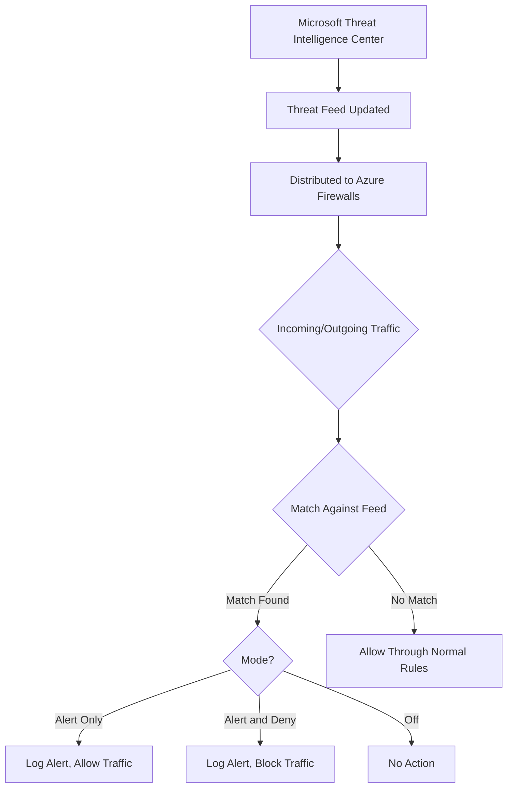

# How to Configure Azure Firewall Threat Intelligence-Based Filtering

Author: [nawazdhandala](https://www.github.com/nawazdhandala)

Tags: Azure, Firewall, Threat Intelligence, Security, Networking, Cyber Defense, Traffic Filtering

Description: A guide to enabling and configuring Azure Firewall threat intelligence-based filtering to automatically block traffic from known malicious IP addresses and domains.

---

Azure Firewall includes a threat intelligence feature that automatically blocks traffic to and from known malicious IP addresses and domains. Microsoft maintains a curated feed of threat indicators sourced from their own security research, third-party feeds, and the Microsoft Threat Intelligence Center. When this feature is enabled, the firewall cross-references every connection against this feed and either alerts or blocks matching traffic.

This is one of the easiest security wins you can get with Azure Firewall. It requires minimal configuration and provides immediate protection against known threats.

## What Threat Intelligence Filtering Does

The threat intelligence feed contains IP addresses and fully qualified domain names (FQDNs) that are associated with:

- **Known command and control (C2) servers** used by malware families
- **Botnets** used for DDoS attacks and spam
- **Phishing infrastructure** hosting credential harvesting pages
- **Malware distribution sites** serving exploit kits and payloads
- **Cryptocurrency mining pools** used by cryptojacking malware
- **Known threat actor infrastructure** used in targeted attacks

When a VM in your VNet tries to connect to a known bad IP or domain, Azure Firewall catches it. Similarly, inbound connections from known malicious IPs are flagged or blocked.

## Threat Intelligence Modes

Azure Firewall supports three threat intelligence modes:

| Mode | Behavior |
|------|----------|
| Off | Threat intelligence is disabled |
| Alert only | Logs the traffic but allows it through |
| Alert and deny | Logs and blocks the traffic |

For production environments, `Alert and deny` is the recommended setting. `Alert only` is useful when you first enable the feature and want to see what would be blocked without impacting traffic.

## Step 1: Enable Threat Intelligence on Azure Firewall

If you are using Azure Firewall directly (classic rules):

```bash
# Enable threat intelligence with alert and deny mode
az network firewall update \
  --resource-group myResourceGroup \
  --name myFirewall \
  --threat-intel-mode Deny
```

The modes map as follows:
- `Off` - Disabled
- `Alert` - Alert only
- `Deny` - Alert and deny

## Step 2: Enable Through Azure Firewall Policy

If you are using Azure Firewall Policy (which is the recommended approach for managing rules):

```bash
# Create or update a firewall policy with threat intelligence
az network firewall policy create \
  --resource-group myResourceGroup \
  --name myFirewallPolicy \
  --location eastus \
  --threat-intel-mode Deny

# If the policy already exists, update it
az network firewall policy update \
  --resource-group myResourceGroup \
  --name myFirewallPolicy \
  --threat-intel-mode Deny
```

Then associate the policy with the firewall:

```bash
# Associate the policy with the firewall
az network firewall update \
  --resource-group myResourceGroup \
  --name myFirewall \
  --firewall-policy "/subscriptions/<sub-id>/resourceGroups/myResourceGroup/providers/Microsoft.Network/firewallPolicies/myFirewallPolicy"
```

## Step 3: Configure Threat Intelligence Allowlists

Sometimes the threat feed includes false positives that block legitimate traffic. You can add IP addresses, FQDNs, and IP ranges to an allowlist to prevent them from being blocked:

```bash
# Update the firewall policy with threat intelligence allowlists
az network firewall policy update \
  --resource-group myResourceGroup \
  --name myFirewallPolicy \
  --threat-intel-mode Deny \
  --threat-intel-allowlist-fqdns "partner-api.example.com" "legitimate-service.example.org" \
  --threat-intel-allowlist-ipaddresses "203.0.113.50" "198.51.100.0/24"
```

Use allowlists carefully. Only add entries after confirming the traffic is genuinely legitimate. Every allowlist entry is a hole in your threat intelligence coverage.

## Step 4: Enable Diagnostic Logging

To see threat intelligence alerts and blocks, enable diagnostic logging for the firewall:

```bash
# Enable diagnostic logging to Log Analytics
az monitor diagnostic-settings create \
  --resource "/subscriptions/<sub-id>/resourceGroups/myResourceGroup/providers/Microsoft.Network/azureFirewalls/myFirewall" \
  --name firewallDiagnostics \
  --workspace myLogAnalyticsWorkspace \
  --logs '[
    {"category":"AzureFirewallNetworkRule","enabled":true},
    {"category":"AzureFirewallApplicationRule","enabled":true},
    {"category":"AzureFirewallThreatIntelLog","enabled":true},
    {"category":"AzureFirewallDnsProxy","enabled":true}
  ]'
```

The `AzureFirewallThreatIntelLog` category specifically captures threat intelligence events.

## Step 5: Query Threat Intelligence Logs

Once logging is enabled, query the logs in Log Analytics to see threat intelligence activity:

```
// KQL query for threat intelligence hits
AzureFirewallThreatIntelLog
| where TimeGenerated > ago(24h)
| project
    TimeGenerated,
    SourceIP,
    DestinationIP,
    DestinationPort,
    ThreatDescription,
    Action
| order by TimeGenerated desc
```

For a summary of the most frequently blocked threats:

```
// KQL query for top threats by frequency
AzureFirewallThreatIntelLog
| where TimeGenerated > ago(7d)
| summarize Count = count() by ThreatDescription, DestinationIP
| order by Count desc
| take 20
```

To identify which internal VMs are triggering the most alerts:

```
// KQL query for internal machines hitting threat indicators
AzureFirewallThreatIntelLog
| where TimeGenerated > ago(24h)
| summarize
    HitCount = count(),
    UniqueThreats = dcount(ThreatDescription)
    by SourceIP
| order by HitCount desc
```

A machine with many threat intelligence hits might be compromised and worth investigating.

## Step 6: Set Up Alerts for Threat Intelligence Events

Configure Azure Monitor alerts to notify your security team when threats are detected:

```bash
# Create a log-based alert for threat intelligence blocks
az monitor scheduled-query create \
  --resource-group myResourceGroup \
  --name threatIntelAlert \
  --scopes "/subscriptions/<sub-id>/resourceGroups/myResourceGroup/providers/Microsoft.OperationalInsights/workspaces/myLogAnalyticsWorkspace" \
  --condition "count 'AzureFirewallThreatIntelLog | where TimeGenerated > ago(5m)' > 0" \
  --action-groups "/subscriptions/<sub-id>/resourceGroups/myResourceGroup/providers/microsoft.insights/actionGroups/securityTeam" \
  --description "Alert when Azure Firewall blocks threat intelligence traffic" \
  --severity 2 \
  --evaluation-frequency 5m \
  --window-size 5m
```

## How the Threat Feed Works



The feed is updated automatically by Microsoft. You do not need to manage or update it. New threat indicators are pushed to your firewall continuously.

## Premium Tier: IDPS Integration

If you are using Azure Firewall Premium, threat intelligence integrates with the Intrusion Detection and Prevention System (IDPS). Premium adds signature-based detection on top of the IP/FQDN-based threat intelligence:

```bash
# Enable IDPS on Premium firewall policy
az network firewall policy update \
  --resource-group myResourceGroup \
  --name myPremiumPolicy \
  --sku Premium \
  --threat-intel-mode Deny \
  --idps-mode Deny
```

Premium IDPS can detect threats that basic threat intelligence misses, such as exploit attempts using known vulnerability signatures, even if the source IP is not in the threat feed.

## Best Practices

**Start with Alert mode.** Enable threat intelligence in Alert mode first and run it for a week. Review the logs to identify any false positives. Add legitimate services to the allowlist. Then switch to Alert and Deny.

**Monitor the allowlist.** Periodically review your allowlist entries. A service that was legitimate six months ago might have been compromised. Keep the allowlist as small as possible.

**Investigate frequent hits.** If an internal VM consistently triggers threat intelligence alerts, investigate it. It may be compromised, running unauthorized software, or connecting to services that have fallen into malicious hands.

**Combine with other firewall features.** Threat intelligence works alongside application rules, network rules, and DNAT rules. It acts as an additional layer. Do not rely on it as your sole security control.

**Enable structured logging.** Use the resource-specific logging mode for easier log analysis and integration with SIEM tools.

## Limitations

- Threat intelligence only covers known threats. Zero-day attacks and novel infrastructure will not be in the feed.
- The feed is managed by Microsoft. You cannot add your own custom threat indicators (for that, use custom network rules or a third-party threat intelligence platform).
- FQDN-based filtering requires DNS proxy to be enabled on the firewall.
- There may be a brief delay between a new threat being identified and the indicator being distributed to your firewall.

## Summary

Azure Firewall threat intelligence is a low-effort, high-impact security feature. Enable it in Alert mode, review the logs for false positives, configure allowlists for legitimate traffic, then switch to Alert and Deny. Set up log queries and alerts so your security team knows when threats are detected. For machines that frequently trigger threat intelligence hits, investigate whether they might be compromised. Combined with proper network rules and application rules, threat intelligence adds a valuable automatic defense layer against known threats.
