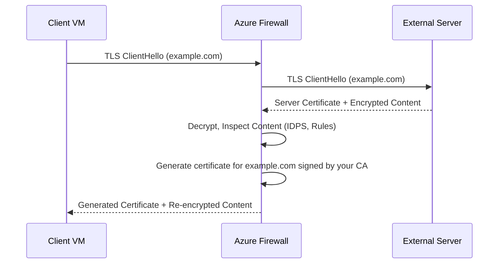

# How to Configure Azure Firewall TLS Inspection with Key Vault Certificate Integration

Author: [nawazdhandala](https://www.github.com/nawazdhandala)

Tags: Azure, Azure Firewall, TLS Inspection, Key Vault, Network Security, SSL Decryption, Certificate Management

Description: Step-by-step instructions for configuring Azure Firewall Premium TLS inspection using certificates stored in Azure Key Vault for encrypted traffic analysis.

---

Most network traffic today is encrypted with TLS. While encryption protects data in transit, it also creates a blind spot for security inspection. An attacker can use an HTTPS connection to exfiltrate data or download malware, and a standard firewall cannot see the content. Azure Firewall Premium supports TLS inspection, which decrypts traffic, inspects it against your firewall rules and IDPS signatures, and then re-encrypts it before forwarding.

The key component is the certificate. Azure Firewall needs a certificate authority (CA) certificate to generate on-the-fly certificates for intercepted connections. This guide covers the full setup, including creating the CA certificate, storing it in Key Vault, and configuring the firewall.

## How TLS Inspection Works

When a client behind the firewall makes an HTTPS connection to an external server:

1. The firewall intercepts the connection
2. The firewall connects to the external server using TLS and retrieves the server's real certificate
3. The firewall generates a new certificate for the external server's domain, signed by your intermediate CA
4. The firewall presents this generated certificate to the client
5. The firewall decrypts the traffic, inspects it, and re-encrypts it



For this to work, the client must trust your intermediate CA. You need to deploy the CA certificate to all machines behind the firewall.

## Prerequisites

- Azure Firewall Premium SKU (Standard does not support TLS inspection)
- Azure Key Vault for certificate storage
- An intermediate CA certificate (not a self-signed certificate - must be an intermediate CA)
- The ability to deploy the CA certificate to client machines (via Group Policy, MDM, etc.)

## Step 1: Create an Intermediate CA Certificate

Azure Firewall requires an intermediate CA certificate, not a root CA or self-signed certificate. The intermediate CA must chain up to a root CA that your clients trust.

You can use an existing PKI infrastructure or create one for this purpose. Here is how to create one using OpenSSL:

```bash
# Create the root CA private key
openssl genrsa -aes256 -out rootCA.key 4096

# Create the root CA certificate (valid for 10 years)
# This is the certificate you deploy to client machines
openssl req -x509 -new -nodes \
  -key rootCA.key \
  -sha256 \
  -days 3650 \
  -out rootCA.pem \
  -subj "/C=US/ST=Washington/O=Contoso/CN=Contoso Root CA"

# Create the intermediate CA private key
openssl genrsa -out intermediateCA.key 4096

# Create a certificate signing request for the intermediate CA
openssl req -new \
  -key intermediateCA.key \
  -out intermediateCA.csr \
  -subj "/C=US/ST=Washington/O=Contoso/CN=Contoso Firewall Intermediate CA"

# Sign the intermediate CA certificate with the root CA
# The intermediate CA is valid for 5 years
openssl x509 -req \
  -in intermediateCA.csr \
  -CA rootCA.pem \
  -CAkey rootCA.key \
  -CAcreateserial \
  -out intermediateCA.pem \
  -days 1825 \
  -sha256 \
  -extfile <(printf "basicConstraints=CA:TRUE,pathlen:0\nkeyUsage=critical,keyCertSign,cRLSign")

# Create a PFX file containing the intermediate CA cert and private key
# Azure Key Vault expects PFX format for import
openssl pkcs12 -export \
  -out intermediateCA.pfx \
  -inkey intermediateCA.key \
  -in intermediateCA.pem \
  -certfile rootCA.pem \
  -passout pass:YourSecurePassword123
```

## Step 2: Import the Certificate to Azure Key Vault

Store the intermediate CA certificate in Key Vault. The Azure Firewall will reference it from there.

```bash
# Create a Key Vault if you do not have one
az keyvault create \
  --name myFirewallCertVault \
  --resource-group myResourceGroup \
  --location eastus \
  --sku standard

# Import the intermediate CA certificate (PFX) to Key Vault
az keyvault certificate import \
  --vault-name myFirewallCertVault \
  --name "firewall-intermediate-ca" \
  --file intermediateCA.pfx \
  --password "YourSecurePassword123"

# Verify the certificate was imported
az keyvault certificate show \
  --vault-name myFirewallCertVault \
  --name "firewall-intermediate-ca" \
  --query "{Name:name, Thumbprint:x509ThumbprintHex, Expires:attributes.expires}" \
  --output table
```

## Step 3: Grant Azure Firewall Access to Key Vault

Azure Firewall needs to read the certificate from Key Vault. Create a managed identity for the firewall and grant it access:

```bash
# The Azure Firewall should already have a system-assigned managed identity
# If not, enable it
az network firewall update \
  --name myFirewallPremium \
  --resource-group myResourceGroup \
  --identity-type SystemAssigned

# Get the firewall's managed identity principal ID
FIREWALL_IDENTITY=$(az network firewall show \
  --name myFirewallPremium \
  --resource-group myResourceGroup \
  --query "identity.principalId" --output tsv)

# Grant the firewall Key Vault Secrets User and Key Vault Certificate User roles
az role assignment create \
  --assignee $FIREWALL_IDENTITY \
  --role "Key Vault Secrets User" \
  --scope "/subscriptions/{sub-id}/resourceGroups/{rg}/providers/Microsoft.KeyVault/vaults/myFirewallCertVault"

az role assignment create \
  --assignee $FIREWALL_IDENTITY \
  --role "Key Vault Certificate User" \
  --scope "/subscriptions/{sub-id}/resourceGroups/{rg}/providers/Microsoft.KeyVault/vaults/myFirewallCertVault"

# If using Key Vault access policies instead of RBAC
az keyvault set-policy \
  --name myFirewallCertVault \
  --object-id $FIREWALL_IDENTITY \
  --secret-permissions get list \
  --certificate-permissions get list
```

## Step 4: Configure TLS Inspection in the Firewall Policy

TLS inspection is configured at the firewall policy level (Premium tier only):

```bash
# Create or update a Premium firewall policy with TLS inspection
az network firewall policy create \
  --name myPremiumPolicy \
  --resource-group myResourceGroup \
  --location eastus \
  --sku Premium \
  --key-vault-secret-id "https://myFirewallCertVault.vault.azure.net/secrets/firewall-intermediate-ca" \
  --identity-type SystemAssigned
```

If you already have a firewall policy, update it:

```bash
# Update existing policy to enable TLS inspection
az network firewall policy update \
  --name myPremiumPolicy \
  --resource-group myResourceGroup \
  --key-vault-secret-id "https://myFirewallCertVault.vault.azure.net/secrets/firewall-intermediate-ca"
```

## Step 5: Create Application Rules with TLS Inspection Enabled

TLS inspection is enabled per rule, not globally. This lets you selectively inspect traffic - you might inspect general web browsing but exclude traffic to known sensitive services like banking sites.

```bash
# Create a rule collection with TLS inspection enabled
az network firewall policy rule-collection-group create \
  --name "TLSInspectionRules" \
  --policy-name myPremiumPolicy \
  --resource-group myResourceGroup \
  --priority 100

# Add an application rule with TLS inspection
az network firewall policy rule-collection-group collection add-filter-collection \
  --name "InspectWebTraffic" \
  --collection-priority 100 \
  --rule-collection-group-name "TLSInspectionRules" \
  --policy-name myPremiumPolicy \
  --resource-group myResourceGroup \
  --rule-type ApplicationRule \
  --action Allow \
  --rule-name "AllowAndInspectWeb" \
  --protocols Https=443 \
  --source-addresses "10.0.0.0/8" \
  --target-fqdns "*" \
  --enable-tls-inspection true
```

## Step 6: Create Bypass Rules for Sensitive Traffic

Some traffic should not be inspected. Certificate pinning in certain applications will break if TLS is intercepted. Common exclusions include:

- Windows Update endpoints
- Microsoft 365 traffic (some clients use cert pinning)
- Banking and financial services
- Healthcare applications with strict compliance requirements

```bash
# Create rules that bypass TLS inspection for specific destinations
az network firewall policy rule-collection-group collection add-filter-collection \
  --name "BypassTLSInspection" \
  --collection-priority 50 \
  --rule-collection-group-name "TLSInspectionRules" \
  --policy-name myPremiumPolicy \
  --resource-group myResourceGroup \
  --rule-type ApplicationRule \
  --action Allow \
  --rule-name "BypassBanking" \
  --protocols Https=443 \
  --source-addresses "10.0.0.0/8" \
  --target-fqdns "*.bank.com" "*.paypal.com" \
  --enable-tls-inspection false
```

Bypass rules must have a lower priority number (higher priority) than the inspection rules so they are evaluated first.

## Step 7: Deploy the CA Certificate to Clients

For TLS inspection to work without certificate errors, all client machines must trust the root CA that signed your intermediate CA. Deploy the root CA certificate to the Trusted Root Certification Authorities store.

**Windows (via Group Policy):**

1. Open Group Policy Management
2. Create or edit a GPO linked to your OU
3. Navigate to Computer Configuration, Policies, Windows Settings, Security Settings, Public Key Policies
4. Right-click "Trusted Root Certification Authorities" and import the rootCA.pem

**Linux:**

```bash
# Copy the root CA certificate to the trusted store
sudo cp rootCA.pem /usr/local/share/ca-certificates/contoso-root-ca.crt

# Update the certificate store
sudo update-ca-certificates
```

**macOS (via MDM or manual):**

```bash
# Import the root CA certificate to the system keychain
sudo security add-trusted-cert -d -r trustRoot \
  -k /Library/Keychains/System.keychain rootCA.pem
```

## Troubleshooting TLS Inspection

**Certificate errors in browsers:** The root CA is not trusted on the client. Verify the certificate chain is complete and the root CA is in the trusted store.

**Applications breaking:** Some applications use certificate pinning and will refuse connections when the certificate is intercepted. Add these to the bypass list.

**Performance impact:** TLS inspection adds CPU overhead to the firewall. Monitor the firewall's health metrics and consider scaling if latency increases. The Premium SKU handles TLS inspection better than Standard.

**Specific websites failing:** Some sites use HSTS preloading or certificate transparency (CT) logs that may conflict with intercepted certificates. Add problematic sites to the bypass list.

Check the firewall logs for TLS-related issues:

```
// Query for TLS inspection failures
AzureDiagnostics
| where Category == "AzureFirewallApplicationRule"
| where msg_s contains "TLS"
| project TimeGenerated, msg_s, DestinationHost = fqdn_s
| order by TimeGenerated desc
| take 50
```

## Certificate Rotation

The intermediate CA certificate has an expiration date. Plan for rotation before it expires:

1. Generate a new intermediate CA certificate (signed by the same root CA)
2. Import the new certificate to Key Vault as a new version of the same certificate name
3. The firewall automatically picks up the new version (it checks Key Vault periodically)
4. No changes needed on client machines since the root CA stays the same

```bash
# Import the renewed intermediate CA certificate as a new version
az keyvault certificate import \
  --vault-name myFirewallCertVault \
  --name "firewall-intermediate-ca" \
  --file new-intermediateCA.pfx \
  --password "NewSecurePassword456"
```

## IDPS Integration with TLS Inspection

TLS inspection pairs with Azure Firewall's Intrusion Detection and Prevention System (IDPS). Without TLS inspection, IDPS can only analyze unencrypted traffic. With TLS inspection enabled, IDPS can inspect the decrypted content for malicious signatures.

Enable IDPS in the firewall policy:

```bash
# Enable IDPS in Alert and Deny mode
az network firewall policy intrusion-detection update \
  --policy-name myPremiumPolicy \
  --resource-group myResourceGroup \
  --mode "Alert"
```

## Best Practices

- Start with TLS inspection in audit mode (if available) or on a limited scope. Monitor for broken applications before expanding.
- Maintain a comprehensive bypass list. Certificate pinning is common in mobile apps, IoT devices, and certain desktop applications.
- Use an intermediate CA, not a root CA. This limits the scope of what the intercepting certificate can sign.
- Monitor the intermediate CA certificate expiration and rotate proactively.
- Keep the root CA private key offline in a secure location. It should only be used to sign new intermediate CAs.
- Review the IDPS findings that TLS inspection reveals. The whole point is to detect threats hiding in encrypted traffic.

## Summary

Azure Firewall Premium TLS inspection gives you visibility into encrypted traffic that would otherwise be a blind spot. The setup involves creating an intermediate CA certificate, storing it in Key Vault, configuring the firewall policy, enabling inspection on specific rules, and deploying the root CA to clients. The effort is worth it for the security visibility gain, but plan your bypass list carefully and monitor for application compatibility issues.
