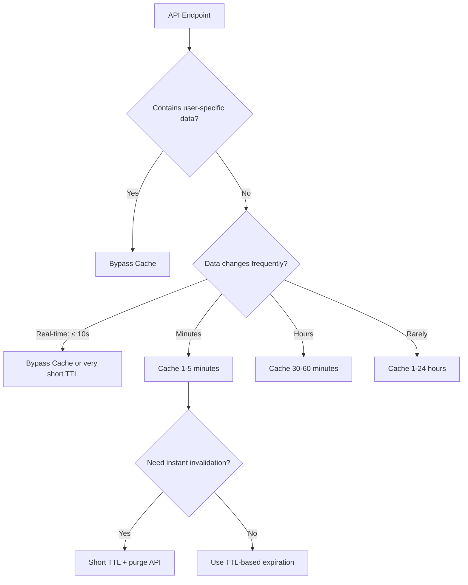

# How to Configure Azure Front Door Caching Rules for API Responses

Author: [nawazdhandala](https://www.github.com/nawazdhandala)

Tags: Azure, Front Door, Caching, API, CDN, Performance, Edge Caching

Description: Learn how to configure Azure Front Door caching rules for API responses to reduce origin load, improve latency, and handle cache invalidation properly.

---

Caching static assets at the edge is common practice, but caching API responses is trickier. API responses are often dynamic, personalized, or time-sensitive. Getting the caching rules wrong means serving stale data to users or, worse, serving one user's private data to another.

Azure Front Door provides granular caching controls that let you safely cache API responses at the edge. In this post, I will show you how to configure caching rules that make sense for different types of API responses, from public reference data to user-specific content.

## Why Cache API Responses at the Edge?

API caching at Front Door has real benefits:

- **Reduced origin load.** If 1,000 users request the same product catalog endpoint per minute, caching means your origin serves it once per cache TTL instead of 1,000 times.
- **Lower latency.** Front Door serves cached responses from the nearest POP, typically in 1-5ms instead of the 50-200ms it takes to hit the origin.
- **Better availability.** Cached responses survive origin outages for the duration of the TTL.
- **Cost savings.** Less origin compute means lower infrastructure costs.

But not all API responses should be cached. The key is identifying which responses are safe to cache and for how long.

## What to Cache vs. What Not to Cache

Safe to cache:
- Public reference data (product catalogs, configuration lists, exchange rates)
- Search results for common queries
- Aggregated data (analytics dashboards, leaderboards)
- API responses with explicit `Cache-Control` headers

Never cache:
- User-specific data (profile information, account details)
- Authentication tokens or session data
- POST/PUT/DELETE responses
- Responses with `Set-Cookie` headers
- Real-time data where staleness of even seconds matters

## Setting Up Basic Caching

Front Door Standard/Premium uses rule sets to configure caching behavior. First, create a route with caching enabled:

```bash
# Create origin group and origin first
az afd origin-group create \
  --resource-group myResourceGroup \
  --profile-name myFrontDoor \
  --origin-group-name apiOrigin \
  --probe-protocol Https \
  --probe-path "/api/health" \
  --probe-interval-in-seconds 30

az afd origin create \
  --resource-group myResourceGroup \
  --profile-name myFrontDoor \
  --origin-group-name apiOrigin \
  --origin-name apiBackend \
  --host-name api.myapp.com \
  --origin-host-header api.myapp.com \
  --http-port 80 \
  --https-port 443 \
  --priority 1

# Create a route with caching enabled
az afd route create \
  --resource-group myResourceGroup \
  --profile-name myFrontDoor \
  --endpoint-name myEndpoint \
  --route-name apiRoute \
  --origin-group apiOrigin \
  --supported-protocols Https \
  --patterns-to-match "/api/*" \
  --enable-caching true \
  --query-string-caching-behavior IncludeSpecifiedQueryStrings \
  --query-parameters "category,page,sort"
```

The `--query-string-caching-behavior` parameter is critical for APIs:

| Behavior | Description |
|----------|-------------|
| IgnoreQueryString | All query strings are ignored. Same cache entry for `/api/items?page=1` and `/api/items?page=2` |
| IncludeSpecifiedQueryStrings | Only listed parameters create unique cache keys |
| UseQueryString | Full query string is part of the cache key. Each unique query string gets its own cache entry |
| IgnoreSpecifiedQueryStrings | Listed parameters are excluded from cache key |

For APIs, `IncludeSpecifiedQueryStrings` or `UseQueryString` is usually the right choice, since different query parameters typically return different data.

## Configuring Cache Duration with Rule Sets

Create a rule set to control cache duration for different API endpoints:

```bash
# Create a rule set for API caching rules
az afd rule-set create \
  --resource-group myResourceGroup \
  --profile-name myFrontDoor \
  --rule-set-name apiCacheRules

# Cache the product catalog for 10 minutes
az afd rule create \
  --resource-group myResourceGroup \
  --profile-name myFrontDoor \
  --rule-set-name apiCacheRules \
  --rule-name cacheProductCatalog \
  --order 1 \
  --match-variable UrlPath \
  --operator BeginsWith \
  --match-values "/api/products" \
  --action-name CacheExpiration \
  --cache-behavior Override \
  --cache-duration "00:10:00"

# Cache reference data for 1 hour
az afd rule create \
  --resource-group myResourceGroup \
  --profile-name myFrontDoor \
  --rule-set-name apiCacheRules \
  --rule-name cacheReferenceData \
  --order 2 \
  --match-variable UrlPath \
  --operator BeginsWith \
  --match-values "/api/reference" \
  --action-name CacheExpiration \
  --cache-behavior Override \
  --cache-duration "01:00:00"
```

## Disabling Cache for Sensitive Endpoints

Make sure user-specific or authenticated endpoints are never cached:

```bash
# Disable caching for user-specific endpoints
az afd rule create \
  --resource-group myResourceGroup \
  --profile-name myFrontDoor \
  --rule-set-name apiCacheRules \
  --rule-name noCacheUserData \
  --order 0 \
  --match-variable UrlPath \
  --operator BeginsWith \
  --match-values "/api/user" "/api/account" "/api/auth" \
  --action-name CacheExpiration \
  --cache-behavior BypassCache
```

Setting this rule with order 0 ensures it is evaluated first. Any request to user-related endpoints bypasses the cache entirely.

## Honoring Origin Cache-Control Headers

If your API backend sets proper `Cache-Control` headers, you can configure Front Door to respect them:

```bash
# Create a rule that honors origin cache headers
az afd rule create \
  --resource-group myResourceGroup \
  --profile-name myFrontDoor \
  --rule-set-name apiCacheRules \
  --rule-name honorOriginHeaders \
  --order 10 \
  --match-variable UrlPath \
  --operator BeginsWith \
  --match-values "/api/" \
  --action-name CacheExpiration \
  --cache-behavior HonorOrigin
```

With `HonorOrigin`, Front Door follows the `Cache-Control` and `Expires` headers from your backend. This is the ideal approach when your API team already manages caching headers.

Common origin headers and how Front Door handles them:

```
Cache-Control: public, max-age=600    -> Cached for 10 minutes
Cache-Control: private                 -> Not cached at edge
Cache-Control: no-cache, no-store      -> Not cached at edge
Cache-Control: s-maxage=300            -> Cached for 5 minutes (s-maxage takes priority)
```

## Cache Key Customization

By default, the cache key includes the URL path and selected query parameters. For APIs, you might need to vary the cache based on request headers:

```bash
# Vary cache by Accept-Language header for localized APIs
az afd rule create \
  --resource-group myResourceGroup \
  --profile-name myFrontDoor \
  --rule-set-name apiCacheRules \
  --rule-name cacheByLanguage \
  --order 3 \
  --match-variable UrlPath \
  --operator BeginsWith \
  --match-values "/api/content" \
  --action-name CacheKeyQueryString \
  --query-string-behavior IncludeAll
```

For more complex cache key variations (like by `Accept` header for content negotiation), you may need to configure at the route level or use the Rules Engine.

## Cache Purging

When your data changes, you need to invalidate the cached version. Front Door supports purging by URL path:

```bash
# Purge a specific API endpoint from cache
az afd endpoint purge \
  --resource-group myResourceGroup \
  --profile-name myFrontDoor \
  --endpoint-name myEndpoint \
  --content-paths "/api/products/*"

# Purge a specific URL
az afd endpoint purge \
  --resource-group myResourceGroup \
  --profile-name myFrontDoor \
  --endpoint-name myEndpoint \
  --content-paths "/api/products/123"
```

You can integrate cache purging into your CI/CD pipeline or trigger it from application events (like a product update webhook).

## Monitoring Cache Performance

Track cache hit rates to see if your caching strategy is effective:

The key metrics to watch in Azure Monitor:

- **Cache Hit Ratio:** Percentage of requests served from cache. Higher is better.
- **Origin Request Count:** Number of requests that reached the origin. Should decrease as caching improves.
- **Total Latency:** Overall response time. Cached responses should have significantly lower latency.

You can also check response headers to verify caching:

```bash
# Check cache status in response headers
curl -I https://myendpoint.azurefd.net/api/products

# Look for:
# X-Cache: TCP_HIT        -> Served from cache
# X-Cache: TCP_MISS       -> Fetched from origin
# X-Cache: CONFIG_NOCACHE -> Caching disabled for this request
```

## Cache Strategy Decision Flow



## Summary

Caching API responses at Azure Front Door can significantly reduce origin load and improve response times, but it requires thoughtful configuration. Start by identifying which endpoints are safe to cache, set appropriate TTLs based on data freshness requirements, and always exclude user-specific and authenticated endpoints. Use query string parameters in cache keys to differentiate between different API requests, and set up cache purging for when you need immediate invalidation. Monitor your cache hit ratio to verify the strategy is working and adjust TTLs based on real traffic patterns.
