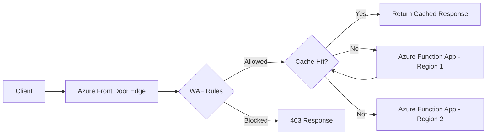

# How to Configure Azure Functions Behind Azure Front Door

Author: [nawazdhandala](https://www.github.com/nawazdhandala)

Tags: Azure Functions, Azure Front Door, CDN, Load Balancing, WAF, Azure, Networking

Description: Set up Azure Front Door in front of your Azure Functions for global load balancing, caching, WAF protection, and custom domain support with SSL.

---

Azure Functions HTTP endpoints are perfectly functional on their own, but they lack several things that production APIs need: global load balancing, DDoS protection, Web Application Firewall (WAF) rules, caching, custom domains with managed SSL, and traffic routing across regions. Azure Front Door provides all of these capabilities as a managed service that sits in front of your function app.

In this post, I will walk through configuring Azure Front Door in front of an Azure Function app, setting up WAF rules, enabling caching, and locking down the function app so it only accepts traffic from Front Door.

## Architecture Overview

When you put Front Door in front of Azure Functions, the request flow changes. Instead of clients hitting your function app directly, they hit a Front Door edge node (there are hundreds globally). Front Door handles SSL termination, WAF inspection, caching, and routing before forwarding the request to your function app.



## Creating the Azure Front Door Profile

Start by creating a Front Door profile. I recommend the Premium tier if you need WAF with managed rule sets.

```bash
# Create a Front Door profile
az afd profile create \
  --profile-name fd-functions \
  --resource-group rg-functions \
  --sku Premium_AzureFrontDoor

# Create an endpoint (this is the public-facing URL)
az afd endpoint create \
  --endpoint-name my-api \
  --profile-name fd-functions \
  --resource-group rg-functions \
  --enabled-state Enabled
```

## Adding Your Function App as an Origin

An "origin" in Front Door terminology is the backend server that handles requests. In this case, it is your function app.

```bash
# Create an origin group (a logical grouping of origins)
az afd origin-group create \
  --origin-group-name func-origins \
  --profile-name fd-functions \
  --resource-group rg-functions \
  --probe-request-type GET \
  --probe-protocol Https \
  --probe-interval-in-seconds 30 \
  --probe-path "/api/health" \
  --sample-size 4 \
  --successful-samples-required 3 \
  --additional-latency-in-milliseconds 50

# Add the function app as an origin
az afd origin create \
  --origin-name func-primary \
  --origin-group-name func-origins \
  --profile-name fd-functions \
  --resource-group rg-functions \
  --host-name my-function-app.azurewebsites.net \
  --origin-host-header my-function-app.azurewebsites.net \
  --http-port 80 \
  --https-port 443 \
  --priority 1 \
  --weight 1000 \
  --enabled-state Enabled
```

The `origin-host-header` is important. Without it, Front Door sends the request with its own hostname, and Azure Functions might not route it correctly.

## Creating a Route

Routes define which requests go to which origin group.

```bash
# Create a route that sends /api/* requests to the function app
az afd route create \
  --route-name api-route \
  --endpoint-name my-api \
  --profile-name fd-functions \
  --resource-group rg-functions \
  --origin-group func-origins \
  --supported-protocols Https \
  --patterns-to-match "/api/*" \
  --forwarding-protocol HttpsOnly \
  --https-redirect Enabled \
  --link-to-default-domain Enabled
```

## Adding a Custom Domain

Most production APIs use a custom domain instead of the auto-generated Front Door hostname.

```bash
# Add a custom domain
az afd custom-domain create \
  --custom-domain-name api-domain \
  --profile-name fd-functions \
  --resource-group rg-functions \
  --host-name api.mycompany.com \
  --certificate-type ManagedCertificate \
  --minimum-tls-version TLS12

# Associate the custom domain with the endpoint
az afd route update \
  --route-name api-route \
  --endpoint-name my-api \
  --profile-name fd-functions \
  --resource-group rg-functions \
  --custom-domains api-domain
```

You will also need to add a CNAME record in your DNS that points `api.mycompany.com` to the Front Door endpoint hostname, and a TXT record for domain validation.

## Enabling WAF Protection

The Web Application Firewall protects your function app from common web attacks like SQL injection, cross-site scripting, and other OWASP top-10 vulnerabilities.

```bash
# Create a WAF policy
az network front-door waf-policy create \
  --name waf-functions \
  --resource-group rg-functions \
  --sku Premium_AzureFrontDoor \
  --mode Prevention

# Enable the Microsoft managed rule set (OWASP rules)
az network front-door waf-policy managed-rules add \
  --policy-name waf-functions \
  --resource-group rg-functions \
  --type Microsoft_DefaultRuleSet \
  --version 2.1 \
  --action Block

# Enable bot protection rules
az network front-door waf-policy managed-rules add \
  --policy-name waf-functions \
  --resource-group rg-functions \
  --type Microsoft_BotManagerRuleSet \
  --version 1.0 \
  --action Block

# Add a custom rate-limiting rule
az network front-door waf-policy rule create \
  --policy-name waf-functions \
  --resource-group rg-functions \
  --name RateLimitRule \
  --priority 100 \
  --rule-type RateLimitRule \
  --rate-limit-duration-in-minutes 1 \
  --rate-limit-threshold 100 \
  --action Block

# Associate the WAF policy with the Front Door endpoint
az afd security-policy create \
  --security-policy-name waf-policy \
  --profile-name fd-functions \
  --resource-group rg-functions \
  --waf-policy "/subscriptions/<SUB>/resourceGroups/rg-functions/providers/Microsoft.Network/FrontDoorWebApplicationFirewallPolicies/waf-functions" \
  --domains "/subscriptions/<SUB>/resourceGroups/rg-functions/providers/Microsoft.Cdn/profiles/fd-functions/afdEndpoints/my-api"
```

## Locking Down the Function App

With Front Door in place, you should restrict your function app to only accept traffic from Front Door. Otherwise, attackers can bypass the WAF by hitting the function app directly.

```bash
# Add an access restriction to only allow Front Door traffic
az functionapp config access-restriction add \
  --name my-function-app \
  --resource-group rg-functions \
  --priority 100 \
  --service-tag AzureFrontDoor.Backend \
  --http-header x-azure-fdid=<YOUR_FRONT_DOOR_ID> \
  --rule-name AllowFrontDoor \
  --action Allow

# Deny all other traffic
az functionapp config access-restriction set \
  --name my-function-app \
  --resource-group rg-functions \
  --default-action Deny
```

The `x-azure-fdid` header check is critical. Without it, any Front Door instance (including ones owned by other Azure customers) could reach your function app. The Front Door ID uniquely identifies your specific Front Door profile.

```bash
# Get your Front Door ID
az afd profile show \
  --profile-name fd-functions \
  --resource-group rg-functions \
  --query frontDoorId -o tsv
```

## Configuring Caching

For read-heavy API endpoints, caching at the Front Door edge can dramatically reduce load on your function app and improve response times for users worldwide.

```bash
# Update the route to enable caching
az afd route update \
  --route-name api-route \
  --endpoint-name my-api \
  --profile-name fd-functions \
  --resource-group rg-functions \
  --query-string-caching-behavior IncludeSpecifiedQueryStrings \
  --query-parameters "page size category" \
  --enable-caching true
```

In your function code, set appropriate cache headers so Front Door knows how long to cache responses.

```csharp
[Function("GetProducts")]
public async Task<HttpResponseData> GetProducts(
    [HttpTrigger(AuthorizationLevel.Anonymous, "get")] HttpRequestData req)
{
    var products = await _repository.GetProductsAsync();

    var response = req.CreateResponse(System.Net.HttpStatusCode.OK);

    // Tell Front Door (and browsers) to cache this response for 5 minutes
    response.Headers.Add("Cache-Control", "public, max-age=300");

    // Add a Vary header if the response depends on specific request headers
    response.Headers.Add("Vary", "Accept-Encoding");

    await response.WriteAsJsonAsync(products);
    return response;
}
```

## Health Check Endpoint

The health probe you configured earlier needs a corresponding endpoint in your function app.

```csharp
// Simple health check endpoint for Front Door probes
// Must return 200 for the origin to be considered healthy
[Function("Health")]
public HttpResponseData HealthCheck(
    [HttpTrigger(AuthorizationLevel.Anonymous, "get", Route = "health")]
    HttpRequestData req)
{
    var response = req.CreateResponse(System.Net.HttpStatusCode.OK);
    response.Headers.Add("Content-Type", "application/json");
    response.WriteString("{\"status\":\"healthy\"}");
    return response;
}
```

## Multi-Region Setup

For high availability, deploy your function app to multiple regions and add both as origins. Front Door will automatically route traffic to the closest healthy origin.

```bash
# Add a secondary origin in a different region
az afd origin create \
  --origin-name func-secondary \
  --origin-group-name func-origins \
  --profile-name fd-functions \
  --resource-group rg-functions \
  --host-name my-function-app-westus.azurewebsites.net \
  --origin-host-header my-function-app-westus.azurewebsites.net \
  --http-port 80 \
  --https-port 443 \
  --priority 2 \
  --weight 1000 \
  --enabled-state Enabled
```

With `priority 2`, the secondary origin only receives traffic if the primary (priority 1) fails its health checks.

## Summary

Azure Front Door adds a production-grade networking layer to your Azure Functions. You get global load balancing, WAF protection, DDoS mitigation, caching, custom domains with managed SSL, and multi-region failover. The key steps are: create the Front Door profile with origins pointing to your function apps, configure WAF rules for security, lock down the function app to only accept Front Door traffic, and enable caching for read-heavy endpoints. This setup is particularly valuable for public-facing APIs where security and global performance are non-negotiable.
