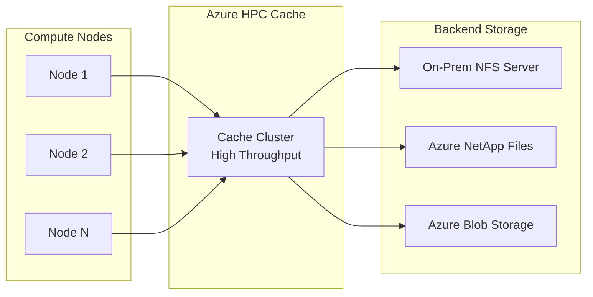

# How to Configure Azure HPC Cache for Accelerating NFS Storage Access

Author: [nawazdhandala](https://www.github.com/nawazdhandala)

Tags: Azure, HPC Cache, NFS, High Performance Computing, Caching, Storage Performance, Hybrid Storage

Description: How to deploy and configure Azure HPC Cache to accelerate NFS storage access for compute-intensive workloads in Azure.

---

When your compute nodes in Azure need fast access to data stored on NFS servers - whether those servers are on-premises, in another cloud, or in Azure itself - Azure HPC Cache acts as a caching layer that brings the data closer to the compute. Instead of every node reaching back to the origin storage for every read, the cache serves hot data at high throughput and low latency. This is especially valuable for HPC workloads where hundreds of compute nodes read the same dataset simultaneously.

## What Azure HPC Cache Does

Think of Azure HPC Cache as a read-through (and optionally write-through) cache that sits between your compute cluster and your backend NFS storage. It presents a unified NFS namespace to clients while transparently caching data from one or more backend storage targets.



The key benefits are:

- **Reduced latency**: Data served from cache is much faster than fetching from a remote NFS server
- **Reduced backend load**: The origin server sees fewer requests since the cache absorbs most reads
- **Aggregated namespace**: Multiple backend storage systems appear as a single mount point
- **Protocol translation**: Azure Blob Storage can be exposed as NFS through the cache

## Prerequisites

You need the following before setting up HPC Cache:

1. A virtual network with a dedicated subnet (at least /24) for the cache
2. The subnet must not have any NSGs or service endpoints
3. Backend NFS servers must be accessible from the cache subnet (via VPN, ExpressRoute, or within the same VNet)
4. The HPC Cache resource provider registered in your subscription

```bash
# Register the HPC Cache resource provider
az provider register --namespace Microsoft.StorageCache

# Verify registration
az provider show --namespace Microsoft.StorageCache --query "registrationState" -o tsv
```

Set up the networking:

```bash
# Create a resource group
az group create --name hpc-cache-rg --location eastus

# Create a VNet and subnet
az network vnet create \
  --resource-group hpc-cache-rg \
  --name hpc-vnet \
  --address-prefix 10.0.0.0/16 \
  --location eastus

# Create a dedicated subnet for HPC Cache
# Must be at least /24, no NSGs or service endpoints
az network vnet subnet create \
  --resource-group hpc-cache-rg \
  --vnet-name hpc-vnet \
  --name cache-subnet \
  --address-prefix 10.0.2.0/24
```

## Creating the HPC Cache

Create the cache cluster, specifying the size and throughput tier:

```bash
# Create an HPC Cache instance
# cache-size-gb determines the total cache capacity
# sku determines the throughput tier
az hpc-cache create \
  --resource-group hpc-cache-rg \
  --name my-hpc-cache \
  --location eastus \
  --cache-size-gb 3072 \
  --sku-name "Standard_2G" \
  --subnet "/subscriptions/{sub-id}/resourceGroups/hpc-cache-rg/providers/Microsoft.Network/virtualNetworks/hpc-vnet/subnets/cache-subnet"
```

Available SKUs and their throughput:

| SKU | Read Throughput | Cache Sizes |
|-----|----------------|-------------|
| Standard_2G | 2 GB/s | 3 TB, 6 TB, 12 TB |
| Standard_4G | 4 GB/s | 6 TB, 12 TB, 24 TB |
| Standard_8G | 8 GB/s | 12 TB, 24 TB, 48 TB |

Choose the SKU based on how much aggregate read throughput your compute cluster needs. For example, if you have 100 nodes each reading at 100 MB/s, you need about 10 GB/s total, so you would want the Standard_8G with a large enough cache to hold your working set.

Cache creation takes 20-30 minutes. Monitor the progress:

```bash
# Check cache provisioning state
az hpc-cache show \
  --resource-group hpc-cache-rg \
  --name my-hpc-cache \
  --query "provisioningState" -o tsv
```

## Adding NFS Storage Targets

Once the cache is running, add your backend NFS servers as storage targets. Each storage target maps a backend NFS export to a namespace path in the cache.

### Adding an On-Premises NFS Server

```bash
# Add an NFS storage target
# The NFS server must be reachable from the cache subnet
az hpc-cache nfs-storage-target add \
  --resource-group hpc-cache-rg \
  --cache-name my-hpc-cache \
  --name onprem-nfs \
  --nfs3-target "10.100.1.50" \
  --nfs3-usage-model "READ_HEAVY_INFREQ" \
  --junction "/data/training" "/training-data"
```

The junction parameter maps a backend NFS export path to a namespace path in the cache:
- First value: the namespace path clients will use when mounting the cache
- Second value: the export path on the backend NFS server

### Adding Azure Blob Storage as a Target

HPC Cache can front Azure Blob Storage and present it as NFS, which is useful for working with datasets stored in blob:

```bash
# Add an Azure Blob storage target
# The storage account must have hierarchical namespace enabled or use NFS 3.0
az hpc-cache blob-storage-target add \
  --resource-group hpc-cache-rg \
  --cache-name my-hpc-cache \
  --name blob-target \
  --storage-account "/subscriptions/{sub-id}/resourceGroups/hpc-cache-rg/providers/Microsoft.Storage/storageAccounts/hpcdatastorage" \
  --container-name "datasets" \
  --virtual-namespace-path "/data/datasets"
```

### Understanding Usage Models

When adding NFS storage targets, you select a usage model that tells the cache how to handle caching and write-back behavior:

| Usage Model | Description | Best For |
|------------|-------------|----------|
| READ_HEAVY_INFREQ | Cache reads, write-through to backend | Workloads that mostly read, with occasional writes |
| WRITE_WORKLOAD_15 | Cache writes, flush to backend within 15 min | Mixed read/write workloads |
| WRITE_AROUND | Writes go directly to backend, reads are cached | When backend must have immediate consistency |
| READ_HEAVY_CHECK_180 | Cache reads, re-verify with backend every 180 sec | When backend data changes occasionally |

For most HPC workloads where compute nodes read a dataset that does not change during the job, `READ_HEAVY_INFREQ` is the right choice.

## Mounting the Cache on Compute Nodes

Clients mount the HPC Cache instead of the backend storage. The cache presents a unified NFS namespace.

First, get the cache's mount addresses:

```bash
# Get the cache mount addresses
az hpc-cache show \
  --resource-group hpc-cache-rg \
  --name my-hpc-cache \
  --query "mountAddresses" -o tsv
```

The cache provides multiple mount addresses for load distribution. Use round-robin DNS or distribute clients across the addresses manually.

On each compute node:

```bash
# Install NFS client
sudo apt-get update && sudo apt-get install -y nfs-common

# Create mount points
sudo mkdir -p /data/training
sudo mkdir -p /data/datasets

# Mount the cache namespace paths
# Use one of the mount addresses returned by the az command
sudo mount -t nfs -o hard,proto=tcp,mountproto=tcp,retry=30 \
  10.0.2.4:/data/training /data/training

sudo mount -t nfs -o hard,proto=tcp,mountproto=tcp,retry=30 \
  10.0.2.5:/data/datasets /data/datasets
```

The compute nodes see `/data/training` and `/data/datasets` as regular NFS mounts. They do not know or care that one is backed by an on-premises NFS server and the other by Azure Blob Storage. The cache handles everything transparently.

## Cache Warming

For workloads where you know exactly which data will be needed, you can pre-warm the cache before starting the compute job. This avoids cache misses during the critical computation phase.

The simplest approach is to walk the file tree to trigger reads:

```bash
# Pre-warm the cache by reading all files in the dataset directory
# This runs on one compute node before the job starts
find /data/training -type f -exec cat {} > /dev/null \;
```

For large datasets, run the warming from multiple nodes in parallel to speed up the process.

## Monitoring and Troubleshooting

Azure HPC Cache exposes metrics through Azure Monitor:

- **Client-facing IOPS**: Total IOPS served to compute nodes
- **Cache hit rate**: Percentage of reads served from cache vs. fetched from backend
- **Backend target health**: Connectivity status to each storage target
- **Throughput**: Read and write throughput in bytes per second

A healthy cache should show a high cache hit rate during the computation phase. If the hit rate is low, either the working set is larger than the cache or the access pattern is very random with no locality.

```bash
# Check cache health status
az hpc-cache show \
  --resource-group hpc-cache-rg \
  --name my-hpc-cache \
  --query "health" -o json
```

## Cleanup

HPC Cache is billed per hour while it is running. When your HPC job is done, flush any pending writes and delete the cache:

```bash
# Flush all pending writes to backend storage
az hpc-cache flush \
  --resource-group hpc-cache-rg \
  --name my-hpc-cache

# Delete the cache after flush completes
az hpc-cache delete \
  --resource-group hpc-cache-rg \
  --name my-hpc-cache \
  --yes
```

Always flush before deleting to make sure any cached writes make it to the backend storage.

Azure HPC Cache is a solid solution when you need to bridge the gap between where your data lives and where your compute runs. The ability to aggregate multiple storage backends behind a single namespace is particularly valuable for hybrid scenarios where some data is on-premises and some is in Azure. Set it up, warm the cache, run your job, and tear it down. That ephemeral pattern keeps costs under control while giving you the performance you need during computation.
