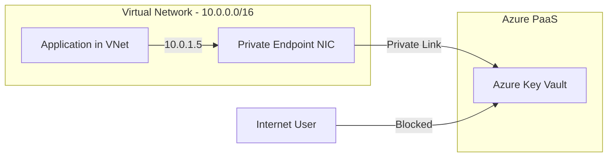

# How to Configure Azure Key Vault Private Endpoints to Restrict Access to Your Virtual Network

Author: [nawazdhandala](https://www.github.com/nawazdhandala)

Tags: Azure, Key Vault, Private Endpoints, Private Link, Virtual Network, Network Security, Zero Trust

Description: Learn how to set up private endpoints for Azure Key Vault to ensure that all traffic stays within your virtual network and never traverses the public internet.

---

By default, Azure Key Vault is accessible over the public internet. Even though access is protected by authentication and authorization, the fact that the endpoint is publicly reachable means it is a potential target for network-level attacks. Private endpoints solve this by giving your Key Vault a private IP address within your virtual network. All traffic between your applications and Key Vault stays on the Azure backbone network, and you can disable public access entirely.

This guide walks through the complete setup of Key Vault private endpoints, including DNS configuration, which is the part that trips most people up.

## How Private Endpoints Work

When you create a private endpoint for Key Vault, Azure provisions a network interface with a private IP address in your VNet and creates a private connection to the Key Vault service:



After creating the private endpoint, the Key Vault's public FQDN (e.g., mykeyvault.vault.azure.net) resolves to the private IP address when queried from within the VNet. From outside the VNet, it either resolves to nothing (if public access is disabled) or to the public IP (if public access is still enabled).

## Prerequisites

You need:
- Azure subscription with a Key Vault and at least one virtual network
- Contributor role on the VNet and the Key Vault
- A private DNS zone (Azure will create this, or you can use an existing one)
- Understanding of your network topology

## Step 1: Create the Private Endpoint

### Via the Azure Portal

1. Navigate to your Key Vault in the Azure portal.
2. Click Networking in the left menu.
3. Click the Private endpoint connections tab.
4. Click Create private endpoint.
5. On the Basics tab:
   - Name: "kv-private-endpoint"
   - Region: Same as your VNet
6. On the Resource tab:
   - Resource type: Microsoft.KeyVault/vaults
   - Resource: Select your Key Vault
   - Target sub-resource: vault
7. On the Virtual Network tab:
   - Virtual network: Select your VNet
   - Subnet: Select the subnet where the private endpoint should be placed
8. On the DNS tab:
   - Integrate with private DNS zone: Yes
   - Private DNS zone: Select or create "privatelink.vaultcore.azure.net"
9. Click Review + create, then Create.

### Via PowerShell

```powershell
# Step 1: Get the Key Vault and VNet resources
$keyVault = Get-AzKeyVault -VaultName "mykeyvault" -ResourceGroupName "myapp-rg"
$vnet = Get-AzVirtualNetwork -Name "app-vnet" -ResourceGroupName "networking-rg"
$subnet = $vnet.Subnets | Where-Object { $_.Name -eq "private-endpoints-subnet" }

# Step 2: Disable private endpoint network policies on the subnet
# This is required for private endpoints to work
$subnet.PrivateEndpointNetworkPolicies = "Disabled"
$vnet | Set-AzVirtualNetwork

Write-Host "Private endpoint network policies disabled on subnet."

# Step 3: Create the private link service connection
$privateLinkConnection = New-AzPrivateLinkServiceConnection `
    -Name "kv-private-link-connection" `
    -PrivateLinkServiceId $keyVault.ResourceId `
    -GroupId "vault"  # The sub-resource type for Key Vault

# Step 4: Create the private endpoint
$privateEndpoint = New-AzPrivateEndpoint `
    -ResourceGroupName "networking-rg" `
    -Name "kv-private-endpoint" `
    -Location "eastus" `
    -Subnet $subnet `
    -PrivateLinkServiceConnection $privateLinkConnection

Write-Host "Private endpoint created."
Write-Host "Private IP: Check the NIC associated with the endpoint."

# Get the private IP address
$nic = Get-AzNetworkInterface -ResourceId $privateEndpoint.NetworkInterfaces[0].Id
$privateIP = $nic.IpConfigurations[0].PrivateIpAddress
Write-Host "Key Vault private IP: $privateIP"
```

### Via Azure CLI

```bash
# Create the private endpoint
az network private-endpoint create \
    --name kv-private-endpoint \
    --resource-group networking-rg \
    --vnet-name app-vnet \
    --subnet private-endpoints-subnet \
    --private-connection-resource-id /subscriptions/SUB_ID/resourceGroups/myapp-rg/providers/Microsoft.KeyVault/vaults/mykeyvault \
    --group-id vault \
    --connection-name kv-private-link-connection \
    --location eastus
```

## Step 2: Configure Private DNS

This is the most critical step. Without proper DNS configuration, your applications will not be able to resolve the Key Vault hostname to the private IP address.

### Create the Private DNS Zone

```powershell
# Create the private DNS zone for Key Vault
$dnsZone = New-AzPrivateDnsZone `
    -ResourceGroupName "networking-rg" `
    -Name "privatelink.vaultcore.azure.net"

Write-Host "Private DNS zone created: privatelink.vaultcore.azure.net"

# Link the DNS zone to your VNet
# This allows VMs and services in the VNet to use this zone for resolution
New-AzPrivateDnsVirtualNetworkLink `
    -ResourceGroupName "networking-rg" `
    -ZoneName "privatelink.vaultcore.azure.net" `
    -Name "kv-dns-link" `
    -VirtualNetworkId $vnet.Id `
    -EnableRegistration $false

Write-Host "DNS zone linked to VNet."
```

### Create the DNS Record

```powershell
# Create an A record that maps the Key Vault hostname to the private IP
# The record name is just the vault name (without the domain suffix)
$privateIP = "10.0.2.4"  # The private IP from the endpoint NIC

New-AzPrivateDnsRecordSet `
    -ResourceGroupName "networking-rg" `
    -ZoneName "privatelink.vaultcore.azure.net" `
    -Name "mykeyvault" `
    -RecordType A `
    -Ttl 300 `
    -PrivateDnsRecord (New-AzPrivateDnsRecordConfig -Ipv4Address $privateIP)

Write-Host "DNS record created: mykeyvault.privatelink.vaultcore.azure.net -> $privateIP"
```

If you used the portal and selected "Integrate with private DNS zone: Yes," the DNS zone, VNet link, and DNS record are created automatically.

### Verify DNS Resolution

From a VM in the VNet, verify that the Key Vault resolves to the private IP:

```powershell
# Run this on a VM within the VNet
$result = Resolve-DnsName "mykeyvault.vault.azure.net"
Write-Host "Resolved to: $($result.IPAddress)"

# You should see:
# mykeyvault.vault.azure.net -> mykeyvault.privatelink.vaultcore.azure.net -> 10.0.2.4
# If you see a public IP, DNS is not configured correctly
```

The DNS resolution chain works like this:

1. Application queries `mykeyvault.vault.azure.net`
2. Public DNS returns a CNAME to `mykeyvault.privatelink.vaultcore.azure.net`
3. The private DNS zone resolves this to the private IP `10.0.2.4`

## Step 3: Disable Public Network Access

Once your private endpoint is working, disable public access to the Key Vault:

```powershell
# Disable public network access to the Key Vault
# After this, the vault is only accessible through the private endpoint
Update-AzKeyVaultNetworkRuleSet `
    -VaultName "mykeyvault" `
    -DefaultAction Deny `
    -Bypass None

# Or completely disable public network access
Update-AzKeyVault `
    -VaultName "mykeyvault" `
    -ResourceGroupName "myapp-rg" `
    -PublicNetworkAccess "Disabled"

Write-Host "Public network access disabled. Key Vault is only accessible via private endpoint."
```

Be careful with this step. Make sure all your applications, pipelines, and administrators can access the Key Vault through the private endpoint before disabling public access. If you lock yourself out, you can re-enable public access from the portal or CLI using a network that still has access.

## Step 4: Configure Key Vault Firewall Exceptions

In some cases, you need to allow specific public access alongside the private endpoint:

```powershell
# Allow specific trusted IPs alongside the private endpoint
# Useful for administrators who need portal access or CI/CD pipelines
Update-AzKeyVaultNetworkRuleSet `
    -VaultName "mykeyvault" `
    -DefaultAction Deny `
    -Bypass AzureServices `  # Allow trusted Azure services
    -IpAddressRange @(
        "203.0.113.50/32",   # Admin office IP
        "198.51.100.0/24"    # CI/CD pipeline IPs
    )

Write-Host "Firewall configured with selective public access."
```

The "AzureServices" bypass is important if you have Azure services outside your VNet that need to access the Key Vault (like Azure Backup, Azure Policy, or Defender for Cloud).

## Step 5: Connect Multiple VNets

If you have applications in multiple VNets that need Key Vault access, you have several options:

### Option A: Create Multiple Private Endpoints

```powershell
# Create a private endpoint in a second VNet
$vnet2 = Get-AzVirtualNetwork -Name "app-vnet-westus" -ResourceGroupName "networking-westus-rg"
$subnet2 = $vnet2.Subnets | Where-Object { $_.Name -eq "private-endpoints-subnet" }

$privateLinkConnection2 = New-AzPrivateLinkServiceConnection `
    -Name "kv-private-link-connection-westus" `
    -PrivateLinkServiceId $keyVault.ResourceId `
    -GroupId "vault"

$privateEndpoint2 = New-AzPrivateEndpoint `
    -ResourceGroupName "networking-westus-rg" `
    -Name "kv-private-endpoint-westus" `
    -Location "westus2" `
    -Subnet $subnet2 `
    -PrivateLinkServiceConnection $privateLinkConnection2

# Link the private DNS zone to the second VNet
New-AzPrivateDnsVirtualNetworkLink `
    -ResourceGroupName "networking-rg" `
    -ZoneName "privatelink.vaultcore.azure.net" `
    -Name "kv-dns-link-westus" `
    -VirtualNetworkId $vnet2.Id `
    -EnableRegistration $false

Write-Host "Second private endpoint created and DNS configured."
```

### Option B: Use VNet Peering

If your VNets are peered, traffic can flow through the peering connection to a single private endpoint. Just make sure the private DNS zone is linked to all peered VNets.

## Step 6: Verify Application Connectivity

After configuring everything, verify that your applications can still access Key Vault:

```powershell
# Test from a VM in the VNet or from an App Service with VNet integration
try {
    $secret = Get-AzKeyVaultSecret -VaultName "mykeyvault" -Name "test-secret"
    Write-Host "Successfully retrieved secret: $($secret.Name)"
    Write-Host "Connection is using private endpoint."
}
catch {
    Write-Error "Failed to access Key Vault: $($_.Exception.Message)"
    Write-Host "Check DNS resolution and network connectivity."
}
```

## Troubleshooting Common Issues

### DNS Resolution Returns Public IP

If the Key Vault still resolves to a public IP from within the VNet:
- Verify the private DNS zone exists and has the correct A record.
- Verify the DNS zone is linked to the VNet.
- If using custom DNS servers, configure conditional forwarding to Azure DNS (168.63.129.16) for the `privatelink.vaultcore.azure.net` zone.

### Access Denied After Disabling Public Access

If applications get access denied errors:
- Verify the private endpoint connection is in "Approved" state.
- Check that the application's outbound traffic goes through the VNet (for App Service, this requires VNet integration).
- Verify that the managed identity has the correct RBAC role on the Key Vault.

### Pipeline Access Issues

CI/CD pipelines running outside the VNet cannot access the Key Vault through the private endpoint. Options:
- Use self-hosted build agents in the VNet.
- Add the pipeline's public IPs to the Key Vault firewall.
- Use a VPN or ExpressRoute connection from your on-premises build infrastructure.

## Architecture Best Practices

When designing your private endpoint architecture:

Create a dedicated subnet for private endpoints. This makes it easier to manage NSGs and routing.

Use a centralized private DNS zone. Link it to all VNets rather than creating separate zones per VNet.

Document the private IP addresses. When troubleshooting DNS issues, knowing the expected IP address makes it much faster.

Plan for hybrid connectivity. If on-premises applications need to access the Key Vault, configure DNS forwarding from your on-premises DNS to Azure Private DNS.

Monitor private endpoint connectivity. Use Azure Monitor to track the health of your private endpoints and alert on failures.

## Conclusion

Private endpoints for Azure Key Vault remove the public internet from the equation entirely. All communication between your applications and Key Vault happens over private IP addresses within your virtual network. The setup requires careful attention to DNS configuration, but once it is working, you have a fundamentally more secure architecture. Combined with RBAC authorization, managed identities, and logging, private endpoints complete the defense-in-depth picture for secret management in Azure. Start by creating the private endpoint and DNS zone, verify connectivity from your applications, and then disable public access to lock down the vault completely.
