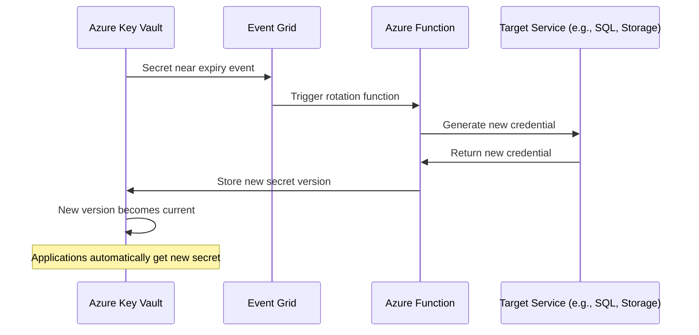

# How to Configure Azure Key Vault Secret Rotation Using Azure Functions and Event Grid

Author: [nawazdhandala](https://www.github.com/nawazdhandala)

Tags: Azure, Key Vault, Secret Rotation, Azure Functions, Event Grid, Security, Automation

Description: A complete guide to automating secret rotation in Azure Key Vault using Azure Functions triggered by Event Grid near-expiry events.

---

Secrets that never get rotated are a ticking time bomb. Database connection strings, API keys, storage account keys - if any of these are compromised and they have been the same for months or years, an attacker has a long window to exploit them. Azure Key Vault supports automatic secret rotation through a combination of Event Grid notifications and Azure Functions. When a secret approaches its expiration date, Key Vault fires an event, an Azure Function catches it, rotates the secret with the target service, and stores the new value back in Key Vault.

This guide walks through setting up this entire pipeline from scratch.

## How the Rotation Architecture Works

The rotation flow involves several Azure services working together:



The beauty of this approach is that applications pulling secrets from Key Vault automatically get the latest version without any code changes or redeployment.

## Prerequisites

You need:

- An Azure subscription
- An existing Azure Key Vault
- Azure Functions runtime (PowerShell or C#)
- A target service whose credentials you want to rotate (I will use an Azure Storage Account as the example)
- Appropriate permissions to create Event Grid subscriptions and Azure Functions

## Step 1: Set Up the Key Vault Secret with Expiration

First, create a secret in Key Vault with an expiration date and a near-expiry notification:

```powershell
# Connect to Azure
Connect-AzAccount

# Create or update a secret with an expiration date
# The expiration date triggers the near-expiry event
$secretValue = ConvertTo-SecureString -String "initial-secret-value" -AsPlainText -Force

Set-AzKeyVaultSecret `
    -VaultName "mykeyvault" `
    -Name "storage-account-key" `
    -SecretValue $secretValue `
    -Expires (Get-Date).AddDays(90) `
    -ContentType "storage-account-key" `
    -Tag @{
        TargetService = "storageaccount"
        TargetResourceGroup = "myresourcegroup"
        TargetResourceName = "mystorageaccount"
    }

Write-Host "Secret created with 90-day expiration."
```

The tags on the secret are important - they tell the rotation function which service and resource to rotate. This makes the function generic enough to handle multiple secrets.

## Step 2: Create the Azure Function for Rotation

Create an Azure Function App that will handle the rotation logic. I will use PowerShell for this example, but you can use C# or Python as well.

First, create the Function App:

```powershell
# Create a resource group for the rotation infrastructure
New-AzResourceGroup -Name "secret-rotation-rg" -Location "eastus"

# Create a storage account for the Function App
$funcStorage = New-AzStorageAccount `
    -ResourceGroupName "secret-rotation-rg" `
    -Name "secretrotationfuncstor" `
    -Location "eastus" `
    -SkuName "Standard_LRS"

# Create the Function App with system-assigned managed identity
$functionApp = New-AzFunctionApp `
    -ResourceGroupName "secret-rotation-rg" `
    -Name "secret-rotation-func" `
    -StorageAccountName "secretrotationfuncstor" `
    -Location "eastus" `
    -Runtime "PowerShell" `
    -RuntimeVersion "7.4" `
    -FunctionsVersion "4" `
    -OSType "Windows"

# Enable system-assigned managed identity
Update-AzFunctionApp `
    -ResourceGroupName "secret-rotation-rg" `
    -Name "secret-rotation-func" `
    -IdentityType "SystemAssigned"

Write-Host "Function App created with managed identity."
```

## Step 3: Grant Permissions to the Managed Identity

The Function App's managed identity needs permissions on both the Key Vault and the target service:

```powershell
# Get the managed identity principal ID
$funcApp = Get-AzFunctionApp -ResourceGroupName "secret-rotation-rg" -Name "secret-rotation-func"
$principalId = $funcApp.IdentityPrincipalId

# Grant the function access to Key Vault secrets
Set-AzKeyVaultAccessPolicy `
    -VaultName "mykeyvault" `
    -ObjectId $principalId `
    -PermissionsToSecrets Get, Set, List

# Grant the function the Storage Account Key Operator role
# This allows it to regenerate storage account keys
New-AzRoleAssignment `
    -ObjectId $principalId `
    -RoleDefinitionName "Storage Account Key Operator Service Role" `
    -Scope "/subscriptions/SUB_ID/resourceGroups/myresourcegroup/providers/Microsoft.Storage/storageAccounts/mystorageaccount"

Write-Host "Permissions granted to managed identity."
```

## Step 4: Write the Rotation Function Code

Here is the Azure Function code that handles the rotation. This example rotates an Azure Storage Account key:

```powershell
# run.ps1 - Azure Function to rotate storage account keys
# Triggered by Event Grid when a Key Vault secret is near expiry

param($eventGridEvent, $TriggerMetadata)

# Extract information from the Event Grid event
$secretName = $eventGridEvent.subject
$vaultName = ($eventGridEvent.topic -split '/')[-1]

Write-Host "Rotation triggered for secret: $secretName in vault: $vaultName"

# Get the current secret to read its tags
$secret = Get-AzKeyVaultSecret -VaultName $vaultName -Name $secretName

if (-not $secret) {
    Write-Error "Secret $secretName not found in vault $vaultName"
    return
}

# Read rotation metadata from tags
$targetResourceGroup = $secret.Tags["TargetResourceGroup"]
$targetResourceName = $secret.Tags["TargetResourceName"]
$targetService = $secret.Tags["TargetService"]

Write-Host "Target: $targetService - $targetResourceName in $targetResourceGroup"

if ($targetService -eq "storageaccount") {
    # Determine which key to rotate (alternate between key1 and key2)
    $currentKeyName = $secret.Tags["CurrentKeyName"]
    if ($currentKeyName -eq "key1") {
        $newKeyName = "key2"
    } else {
        $newKeyName = "key1"
    }

    Write-Host "Regenerating $newKeyName for storage account $targetResourceName"

    # Regenerate the storage account key
    $newKey = New-AzStorageAccountKey `
        -ResourceGroupName $targetResourceGroup `
        -Name $targetResourceName `
        -KeyName $newKeyName

    # Get the new key value
    $keys = Get-AzStorageAccountKey `
        -ResourceGroupName $targetResourceGroup `
        -Name $targetResourceName
    $newKeyValue = ($keys | Where-Object { $_.KeyName -eq $newKeyName }).Value

    # Store the new key in Key Vault as a new version
    $newSecretValue = ConvertTo-SecureString -String $newKeyValue -AsPlainText -Force

    # Update tags to track which key is current
    $tags = $secret.Tags
    $tags["CurrentKeyName"] = $newKeyName
    $tags["LastRotated"] = (Get-Date -Format "yyyy-MM-dd HH:mm:ss")

    Set-AzKeyVaultSecret `
        -VaultName $vaultName `
        -Name $secretName `
        -SecretValue $newSecretValue `
        -Expires (Get-Date).AddDays(90) `
        -ContentType "storage-account-key" `
        -Tag $tags

    Write-Host "Secret rotated successfully. New key: $newKeyName, expires in 90 days."
}
else {
    Write-Warning "Unknown target service: $targetService. No rotation performed."
}
```

And the function.json binding configuration:

```json
{
    "bindings": [
        {
            "type": "eventGridTrigger",
            "name": "eventGridEvent",
            "direction": "in"
        }
    ]
}
```

## Step 5: Set Up the Event Grid Subscription

Now connect Key Vault to the Azure Function through Event Grid:

```powershell
# Get the Function App resource ID for the event subscription endpoint
$functionApp = Get-AzFunctionApp `
    -ResourceGroupName "secret-rotation-rg" `
    -Name "secret-rotation-func"

# Create the Event Grid subscription on the Key Vault
# This triggers the function when secrets are near expiry
$kvResourceId = (Get-AzKeyVault -VaultName "mykeyvault").ResourceId

$eventSubParams = @{
    EventSubscriptionName = "secret-nearexpiry-rotation"
    ResourceId = $kvResourceId
    EndpointType = "AzureFunction"
    Endpoint = "$($functionApp.Id)/functions/RotateSecret"
    # Only subscribe to the SecretNearExpiry event type
    IncludedEventType = @("Microsoft.KeyVault.SecretNearExpiry")
    # Optional: filter for specific secrets using subject filters
    SubjectBeginsWith = "storage-account-key"
}

New-AzEventGridSubscription @eventSubParams

Write-Host "Event Grid subscription created."
```

## Step 6: Configure the Near-Expiry Event Timing

By default, Key Vault fires the SecretNearExpiry event 30 days before the secret expires. You can customize this through the Key Vault event settings or by setting a notification trigger on the secret itself.

If your secrets expire every 90 days and you want the rotation to happen 30 days before expiry, the secret will effectively be rotated every 60 days. Adjust the timing based on your needs.

## Step 7: Test the Rotation

You can test the rotation by temporarily setting a secret to expire soon:

```powershell
# Set a secret to expire in 1 day to trigger the near-expiry event
$testValue = ConvertTo-SecureString -String "test-value" -AsPlainText -Force

Set-AzKeyVaultSecret `
    -VaultName "mykeyvault" `
    -Name "storage-account-key" `
    -SecretValue $testValue `
    -Expires (Get-Date).AddDays(1) `
    -ContentType "storage-account-key" `
    -Tag @{
        TargetService = "storageaccount"
        TargetResourceGroup = "myresourcegroup"
        TargetResourceName = "mystorageaccount"
        CurrentKeyName = "key1"
    }

Write-Host "Test secret set to expire in 1 day. Monitor the function for execution."
```

Then monitor the Function App logs to see if the rotation function executes:

1. Go to the Function App in the Azure portal.
2. Click on Functions, then select your rotation function.
3. Click Monitor to see recent executions.
4. Check the logs for success or error messages.

## Step 8: Set Up Monitoring and Alerting

You want to know if a rotation fails. Set up alerts for function failures:

```powershell
# Create an alert rule for rotation function failures
$actionGroup = Get-AzActionGroup -ResourceGroupName "secret-rotation-rg" -Name "security-alerts"

$condition = New-AzMetricAlertRuleV2Criteria `
    -MetricName "FunctionExecutionCount" `
    -MetricNameSpace "Microsoft.Web/sites" `
    -TimeAggregation Total `
    -Operator GreaterThan `
    -Threshold 0 `
    -DimensionSelection @(
        New-AzMetricAlertRuleV2DimensionSelection `
            -DimensionName "FunctionName" `
            -ValuesToInclude "RotateSecret"
    )

Write-Host "Configure alerts through Azure Monitor for function execution failures."
```

Also monitor Key Vault diagnostic logs to verify that new secret versions are being created as expected.

## Handling Multiple Secret Types

The rotation function can handle different secret types by using the tags on each secret to determine the rotation logic. You can extend the function to support:

- SQL Server passwords: Reset the password in Azure SQL and store the new one
- Cosmos DB keys: Regenerate Cosmos DB primary or secondary keys
- Service Bus connection strings: Regenerate the shared access keys
- Custom API keys: Call the target service's key regeneration API

The tag-based approach keeps the function generic and maintainable as you add more secrets to the rotation pipeline.

## Conclusion

Automated secret rotation with Key Vault, Event Grid, and Azure Functions eliminates the operational burden and security risk of manual secret management. The initial setup requires some work, but once in place, secrets rotate themselves on schedule without human intervention. The key principles are: set expiration dates on all secrets, use the SecretNearExpiry event to trigger rotation, store rotation metadata in secret tags for flexibility, and monitor the rotation function for failures. With this pipeline running, you can confidently tell auditors that your secrets are rotated regularly and that the process is fully automated and auditable.
