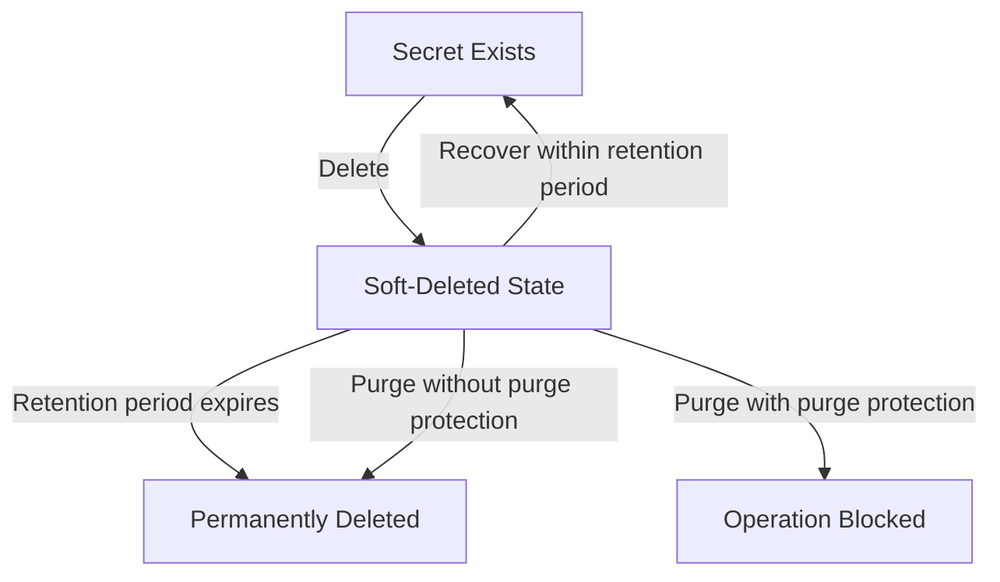

# How to Configure Azure Key Vault Soft-Delete and Purge Protection for Data Recovery Compliance

Author: [nawazdhandala](https://www.github.com/nawazdhandala)

Tags: Azure, Key Vault, Soft-Delete, Purge Protection, Data Recovery, Compliance, Secret Management

Description: Learn how to configure Azure Key Vault soft-delete and purge protection to prevent accidental or malicious deletion of secrets, keys, and certificates.

---

Deleting a Key Vault secret by accident is stressful. Deleting a Key Vault secret and discovering there is no way to recover it because soft-delete was not enabled is a nightmare. Azure Key Vault's soft-delete and purge protection features exist precisely to prevent this scenario. Soft-delete gives you a recovery window after deletion, and purge protection prevents anyone from permanently destroying data during that window - even administrators.

In this post, I will explain how these features work, how to enable and configure them, and walk through recovery scenarios so you know exactly what to do when the inevitable accidental deletion happens.

## Understanding Soft-Delete and Purge Protection

**Soft-delete** means that when you delete a vault, key, secret, or certificate, it enters a "soft-deleted" state instead of being permanently destroyed. During the retention period (7 to 90 days), you can recover the deleted item. After the retention period expires, the item is automatically purged and cannot be recovered.

**Purge protection** is an additional safeguard that prevents anyone from purging (permanently deleting) a soft-deleted item before the retention period expires. When purge protection is enabled, there is no way to bypass the retention period - not even with Owner or Contributor permissions. The only way to permanently delete the data is to wait for the retention period to expire.



As of February 2023, Microsoft enforced soft-delete on all new Key Vaults by default, with a minimum retention period of 7 days. However, older vaults created before this enforcement may not have soft-delete enabled, and purge protection is still optional. Both should be enabled for any production vault.

## Step 1: Check Current Settings on Existing Vaults

Before making changes, check which of your vaults have soft-delete and purge protection enabled.

This script checks all Key Vaults in your subscription and reports their protection status:

```bash
# List all Key Vaults with their soft-delete and purge protection settings
az keyvault list --query "[].{name:name, resourceGroup:resourceGroup, softDelete:properties.enableSoftDelete, purgeProtection:properties.enablePurgeProtection, retentionDays:properties.softDeleteRetentionInDays}" -o table
```

If you see vaults with `softDelete: null` or `purgeProtection: null`, those need to be updated.

## Step 2: Enable Soft-Delete and Purge Protection

For existing vaults that do not have these features enabled, update them. Note that enabling purge protection is a one-way operation - once enabled, it cannot be disabled.

This enables soft-delete with a 90-day retention period and purge protection on an existing vault:

```bash
# Enable soft-delete with 90-day retention and purge protection
# WARNING: Enabling purge protection is irreversible
az keyvault update \
  --name kv-production-secrets \
  --resource-group rg-production \
  --enable-soft-delete true \
  --retention-days 90 \
  --enable-purge-protection true

# Verify the settings
az keyvault show \
  --name kv-production-secrets \
  --query "{name:name, softDelete:properties.enableSoftDelete, purgeProtection:properties.enablePurgeProtection, retentionDays:properties.softDeleteRetentionInDays}" -o json
```

For new vaults, include these settings at creation time:

```bash
# Create a new vault with soft-delete and purge protection from the start
az keyvault create \
  --name kv-new-production \
  --resource-group rg-production \
  --location eastus \
  --enable-soft-delete true \
  --retention-days 90 \
  --enable-purge-protection true \
  --enable-rbac-authorization true
```

## Step 3: Choose the Right Retention Period

The retention period can be set between 7 and 90 days. The right value depends on your use case:

- **7 days** - Minimum. Use for development vaults where quick cleanup is more important than long recovery windows.
- **30 days** - A reasonable middle ground for most workloads. Gives enough time to notice and recover from accidental deletions.
- **90 days** - Maximum. Use for production vaults and any vault subject to compliance requirements. This gives the longest possible recovery window.

For compliance scenarios (SOX, HIPAA, PCI-DSS), I recommend 90 days. The storage cost for soft-deleted items is negligible, and the extended recovery window provides a significant safety margin.

## Step 4: Recover Deleted Secrets

When a secret (or key or certificate) is accidentally deleted, recovering it is straightforward as long as soft-delete is enabled.

This shows how to list deleted secrets and recover a specific one:

```bash
# List all soft-deleted secrets in the vault
az keyvault secret list-deleted \
  --vault-name kv-production-secrets \
  --query "[].{name:name, deletedDate:deletedDate, scheduledPurgeDate:scheduledPurgeDate}" \
  -o table

# Recover a specific deleted secret
az keyvault secret recover \
  --vault-name kv-production-secrets \
  --name database-connection-string

# Verify the secret is back
az keyvault secret show \
  --vault-name kv-production-secrets \
  --name database-connection-string \
  --query "{name:name, enabled:attributes.enabled, created:attributes.created}"
```

The same commands work for keys and certificates with the appropriate subcommands:

```bash
# Recover a deleted key
az keyvault key recover \
  --vault-name kv-production-secrets \
  --name encryption-key

# Recover a deleted certificate
az keyvault certificate recover \
  --vault-name kv-production-secrets \
  --name tls-certificate
```

## Step 5: Recover a Deleted Vault

If someone deletes the entire Key Vault (not just items within it), you can recover the vault itself during the soft-delete retention period.

This lists deleted vaults and recovers a specific one:

```bash
# List all soft-deleted vaults in your subscription
az keyvault list-deleted \
  --query "[].{name:name, location:properties.location, deletionDate:properties.deletionDate, scheduledPurgeDate:properties.scheduledPurgeDate}" \
  -o table

# Recover the deleted vault
az keyvault recover \
  --name kv-production-secrets

# Verify the vault is back and accessible
az keyvault show --name kv-production-secrets
```

Important: when you recover a vault, all its contents (secrets, keys, certificates) come back with it, including any items that were individually soft-deleted before the vault itself was deleted.

## Step 6: Enforce Soft-Delete and Purge Protection with Azure Policy

To make sure all vaults in your organization have these protections, use Azure Policy to enforce them.

This assigns built-in policies that require soft-delete and purge protection:

```bash
# Policy: Key Vault should have soft-delete enabled
az policy assignment create \
  --name "require-kv-soft-delete" \
  --display-name "Require soft-delete on Key Vaults" \
  --policy "/providers/Microsoft.Authorization/policyDefinitions/1e66c121-a66a-4b1f-9b83-0fd99bf0fc2d" \
  --scope "/subscriptions/$(az account show --query id -o tsv)" \
  --enforcement-mode Default

# Policy: Key Vault should have purge protection enabled
az policy assignment create \
  --name "require-kv-purge-protection" \
  --display-name "Require purge protection on Key Vaults" \
  --policy "/providers/Microsoft.Authorization/policyDefinitions/0b60c0b2-2dc2-4e1c-b5c9-abbed971de53" \
  --scope "/subscriptions/$(az account show --query id -o tsv)" \
  --enforcement-mode Default
```

With these policies in place, any attempt to create a Key Vault without soft-delete or purge protection will be denied.

## Step 7: Monitor Deletion Events

Set up alerts for Key Vault deletion events so you are notified immediately when someone deletes a vault or its contents.

This creates an alert rule that fires when Key Vault resources are deleted:

```bash
# Create an action group for Key Vault alerts
az monitor action-group create \
  --name ag-keyvault-alerts \
  --resource-group rg-monitoring \
  --short-name KVAlerts \
  --email-receivers "name=SecurityTeam email=security@yourcompany.com"

# Create an activity log alert for Key Vault deletions
az monitor activity-log alert create \
  --name "KeyVault-Deletion-Alert" \
  --resource-group rg-monitoring \
  --condition "category=Administrative and operationName=Microsoft.KeyVault/vaults/delete" \
  --action-group ag-keyvault-alerts \
  --description "Alert when a Key Vault is deleted"
```

For monitoring secret and key deletions within a vault, enable Key Vault diagnostic logging and create alerts on specific operations:

```bash
# Enable diagnostic logging on the Key Vault
az monitor diagnostic-settings create \
  --name kv-audit-logs \
  --resource "/subscriptions/<sub-id>/resourceGroups/rg-production/providers/Microsoft.KeyVault/vaults/kv-production-secrets" \
  --workspace "/subscriptions/<sub-id>/resourceGroups/rg-monitoring/providers/Microsoft.OperationalInsights/workspaces/law-monitoring" \
  --logs '[{"category":"AuditEvent","enabled":true,"retentionPolicy":{"enabled":true,"days":365}}]'
```

Then query the audit logs to see deletion activity:

```kusto
// Find all delete operations on Key Vault items in the past 24 hours
AzureDiagnostics
| where ResourceProvider == "MICROSOFT.KEYVAULT"
| where TimeGenerated > ago(24h)
| where OperationName contains "Delete"
| project
    TimeGenerated,
    OperationName,
    CallerIPAddress,
    identity_claim_upn_s,
    id_s,
    ResultType
| order by TimeGenerated desc
```

## Handling the "Vault Name Already Exists" Error

A common frustration: you delete a vault and try to create a new one with the same name, but Azure says the name is already taken. This happens because the soft-deleted vault still exists and occupies the name.

You have two options:

1. **Recover the old vault** with `az keyvault recover` and use it.
2. **Purge the old vault** with `az keyvault purge` (only works if purge protection is not enabled) and then create a new one.

```bash
# If purge protection is NOT enabled, you can purge the vault
az keyvault purge --name kv-old-vault

# Then create a new vault with the same name
az keyvault create --name kv-old-vault --resource-group rg-new --location eastus
```

If purge protection is enabled, you cannot purge the vault. You either need to recover it or wait for the retention period to expire. This is by design - it prevents an attacker who gains delete access from permanently destroying your keys.

## Cost Implications

Soft-deleted items continue to incur storage costs during the retention period, but the cost is minimal. Key Vault pricing is based on operations (transactions) and the number of keys/secrets stored. A soft-deleted secret counts as a stored secret until it is purged.

For most organizations, the cost of soft-deleted items is negligible compared to the risk of permanent data loss. I have never seen a case where the soft-delete storage cost was a meaningful concern.

## Best Practices Summary

1. **Enable purge protection on all production vaults.** Yes, it is irreversible, but that is the point. You want the guarantee that data cannot be permanently destroyed prematurely.
2. **Use 90-day retention for production.** It is the maximum, and it gives you the most flexibility for recovery.
3. **Assign Azure Policy to enforce these settings.** Do not rely on teams remembering to enable them manually.
4. **Monitor deletion events.** Set up alerts for both vault deletions and item deletions.
5. **Document the recovery process.** Make sure your operations team knows how to recover deleted secrets and vaults. Practice the recovery procedure before you need it.
6. **Limit who can purge.** The `purge` permission is separate from the `delete` permission. Restrict purge access to a small number of trusted administrators.

## Wrapping Up

Soft-delete and purge protection are foundational data protection features for Azure Key Vault. They protect against accidental deletion, malicious insiders, and compromised accounts that might try to destroy your cryptographic material. Enabling them takes seconds, the cost is negligible, and the protection they provide is significant. If you have any production Key Vaults without these features enabled, that should be your first task after reading this post.
