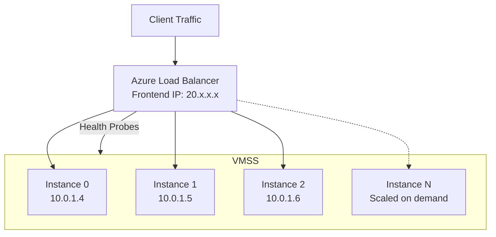

# How to Configure Azure Load Balancer Backend Pool with Virtual Machine Scale Sets

Author: [nawazdhandala](https://www.github.com/nawazdhandala)

Tags: Azure, Load Balancer, VMSS, Scale Sets, Auto Scaling, High Availability

Description: Configure Azure Load Balancer backend pools with Virtual Machine Scale Sets for automatic scaling and load distribution across VM instances.

---

Virtual Machine Scale Sets (VMSS) and Azure Load Balancer are a natural pairing. VMSS handles scaling your compute capacity up and down based on demand, and Load Balancer distributes traffic across all the healthy instances. The integration between them is tight - when VMSS adds or removes instances, Load Balancer automatically picks up the changes without manual intervention.

This guide walks through setting up a Load Balancer with a VMSS backend pool, configuring health probes that work correctly with scale sets, handling upgrades, and optimizing the configuration for production workloads.

## How VMSS and Load Balancer Integrate

When you associate a VMSS with a Load Balancer backend pool, every VM instance in the scale set automatically joins the pool. The Load Balancer uses health probes to determine which instances can receive traffic. During scale-out events, new instances are added to the pool as soon as they pass the health probe. During scale-in events, instances are removed from the pool before being deleted.



## Prerequisites

- An Azure subscription
- A virtual network with a subnet for the VMSS
- Azure CLI installed
- A VM image or reference image for the scale set

## Step 1: Create the Load Balancer

Create a Standard SKU Load Balancer. Always use Standard for production because Basic SKU has limitations with VMSS and does not support availability zones:

```bash
# Create a public IP for the Load Balancer
az network public-ip create \
  --name lb-public-ip \
  --resource-group myResourceGroup \
  --location eastus \
  --sku Standard \
  --allocation-method Static

# Create the Load Balancer
az network lb create \
  --name myLoadBalancer \
  --resource-group myResourceGroup \
  --sku Standard \
  --public-ip-address lb-public-ip \
  --frontend-ip-name myFrontend \
  --backend-pool-name vmssBackendPool
```

## Step 2: Configure Health Probes

Health probes determine which VMSS instances receive traffic. Configure a probe that checks your application health endpoint:

```bash
# Create an HTTP health probe
# This checks the /health endpoint on port 80
az network lb probe create \
  --name httpHealthProbe \
  --resource-group myResourceGroup \
  --lb-name myLoadBalancer \
  --protocol Http \
  --port 80 \
  --path "/health" \
  --interval 15 \
  --threshold 2
```

For HTTPS backends:

```bash
# Create an HTTPS health probe
az network lb probe create \
  --name httpsHealthProbe \
  --resource-group myResourceGroup \
  --lb-name myLoadBalancer \
  --protocol Https \
  --port 443 \
  --path "/health" \
  --interval 15 \
  --threshold 2
```

## Step 3: Create Load Balancing Rules

Define how traffic is distributed to the backend pool:

```bash
# Create a load balancing rule for HTTP traffic
az network lb rule create \
  --name httpRule \
  --resource-group myResourceGroup \
  --lb-name myLoadBalancer \
  --frontend-ip-name myFrontend \
  --backend-pool-name vmssBackendPool \
  --probe-name httpHealthProbe \
  --protocol Tcp \
  --frontend-port 80 \
  --backend-port 80 \
  --idle-timeout 15 \
  --enable-tcp-reset true

# Create a load balancing rule for HTTPS traffic
az network lb rule create \
  --name httpsRule \
  --resource-group myResourceGroup \
  --lb-name myLoadBalancer \
  --frontend-ip-name myFrontend \
  --backend-pool-name vmssBackendPool \
  --probe-name httpsHealthProbe \
  --protocol Tcp \
  --frontend-port 443 \
  --backend-port 443 \
  --idle-timeout 15 \
  --enable-tcp-reset true
```

The `--enable-tcp-reset true` option sends TCP RST packets when connections hit the idle timeout, which helps clients detect broken connections faster.

## Step 4: Create the Virtual Machine Scale Set

Create the VMSS and associate it with the Load Balancer backend pool:

```bash
# Create the VMSS with Load Balancer association
az vmss create \
  --name myVMSS \
  --resource-group myResourceGroup \
  --location eastus \
  --image Ubuntu2204 \
  --vm-sku Standard_D2s_v3 \
  --instance-count 3 \
  --admin-username azureuser \
  --generate-ssh-keys \
  --vnet-name myVNet \
  --subnet mySubnet \
  --lb myLoadBalancer \
  --backend-pool-name vmssBackendPool \
  --upgrade-policy-mode Rolling \
  --health-probe httpHealthProbe \
  --custom-data cloud-init.txt
```

Key parameters:

- **lb**: References the Load Balancer created earlier
- **backend-pool-name**: Specifies which backend pool to join
- **upgrade-policy-mode Rolling**: Enables rolling upgrades for zero-downtime deployments
- **health-probe**: Associates the health probe for rolling upgrade decisions
- **custom-data**: Cloud-init script to configure your application on each instance

## Step 5: Configure Auto-Scaling Rules

Set up auto-scaling so the VMSS scales based on demand:

```bash
# Create an auto-scale profile
az monitor autoscale create \
  --name vmss-autoscale \
  --resource-group myResourceGroup \
  --resource "/subscriptions/{sub-id}/resourceGroups/myResourceGroup/providers/Microsoft.Compute/virtualMachineScaleSets/myVMSS" \
  --min-count 2 \
  --max-count 20 \
  --count 3

# Scale out when CPU exceeds 70%
az monitor autoscale rule create \
  --autoscale-name vmss-autoscale \
  --resource-group myResourceGroup \
  --condition "Percentage CPU > 70 avg 5m" \
  --scale out 2

# Scale in when CPU drops below 30%
az monitor autoscale rule create \
  --autoscale-name vmss-autoscale \
  --resource-group myResourceGroup \
  --condition "Percentage CPU < 30 avg 10m" \
  --scale in 1 \
  --cooldown 5
```

When VMSS scales out, new instances automatically join the Load Balancer backend pool and start receiving traffic once they pass the health probe. When scaling in, instances are removed from the pool before being deleted.

## Step 6: Configure NAT Rules for Management Access

If you need SSH or RDP access to individual VMSS instances, create inbound NAT rules:

```bash
# Create an inbound NAT pool for SSH access
# This maps a range of frontend ports to port 22 on each backend instance
az network lb inbound-nat-pool create \
  --name sshNatPool \
  --resource-group myResourceGroup \
  --lb-name myLoadBalancer \
  --frontend-ip-name myFrontend \
  --protocol Tcp \
  --frontend-port-range-start 50000 \
  --frontend-port-range-end 50099 \
  --backend-port 22
```

With this configuration, SSH to instance 0 is on port 50000, instance 1 is on port 50001, and so on.

## Step 7: Configure Rolling Upgrades

Rolling upgrades ensure zero-downtime deployments by upgrading instances in batches:

```bash
# Configure rolling upgrade policy
az vmss update \
  --name myVMSS \
  --resource-group myResourceGroup \
  --set upgradePolicy.rollingUpgradePolicy.maxBatchInstancePercent=20 \
  --set upgradePolicy.rollingUpgradePolicy.maxUnhealthyInstancePercent=20 \
  --set upgradePolicy.rollingUpgradePolicy.maxUnhealthyUpgradedInstancePercent=5 \
  --set upgradePolicy.rollingUpgradePolicy.pauseTimeBetweenBatches="PT2S"
```

These settings mean:

- Upgrade 20% of instances at a time
- Pause if more than 20% of all instances are unhealthy
- Pause if more than 5% of upgraded instances are unhealthy
- Wait 2 seconds between batches

## Step 8: Monitor the VMSS and Load Balancer

Set up monitoring for both resources:

```bash
# Enable diagnostic logging for the Load Balancer
az monitor diagnostic-settings create \
  --name "lb-diagnostics" \
  --resource "/subscriptions/{sub-id}/resourceGroups/myResourceGroup/providers/Microsoft.Network/loadBalancers/myLoadBalancer" \
  --workspace "/subscriptions/{sub-id}/resourceGroups/myResourceGroup/providers/Microsoft.OperationalInsights/workspaces/myWorkspace" \
  --metrics '[{"category": "AllMetrics", "enabled": true}]'

# Create an alert for unhealthy instances
az monitor metrics alert create \
  --name "VMSS-UnhealthyInstances" \
  --resource-group myResourceGroup \
  --scopes "/subscriptions/{sub-id}/resourceGroups/myResourceGroup/providers/Microsoft.Network/loadBalancers/myLoadBalancer" \
  --condition "avg HealthProbeStatus < 100" \
  --window-size 5m \
  --evaluation-frequency 1m \
  --action myActionGroup \
  --severity 2 \
  --description "One or more VMSS instances failed the health probe"
```

Key metrics to monitor:

- **HealthProbeStatus**: Percentage of healthy backend instances
- **SYNCount**: Number of SYN packets (new connections)
- **PacketCount**: Total packets processed
- **ByteCount**: Total bytes processed

## Handling Scale-In Gracefully

When VMSS scales in, it removes instances from the Load Balancer pool and then deletes them. To handle in-flight requests gracefully, implement connection draining:

The Load Balancer does not have a built-in connection draining feature like Application Gateway, but you can implement it at the application level:

```python
# Example: Graceful shutdown handler in Python
# Stops accepting new requests and waits for in-flight requests to complete

import signal
import sys
import time

# Track in-flight requests
in_flight_count = 0

def shutdown_handler(signum, frame):
    """Handle SIGTERM from VMSS scale-in."""
    print("Received shutdown signal, draining connections...")

    # Stop accepting new requests
    # (implementation depends on your web framework)
    server.stop_accepting()

    # Wait for in-flight requests to complete (max 30 seconds)
    timeout = 30
    while in_flight_count > 0 and timeout > 0:
        time.sleep(1)
        timeout -= 1

    print(f"Shutdown complete. Remaining requests: {in_flight_count}")
    sys.exit(0)

signal.signal(signal.SIGTERM, shutdown_handler)
```

## Wrapping Up

Azure Load Balancer and VMSS together give you a scalable, self-healing infrastructure that handles traffic distribution and capacity management automatically. The setup involves creating the Load Balancer first with health probes and rules, then creating the VMSS with a reference to the Load Balancer backend pool. Auto-scaling rules handle capacity, rolling upgrades handle deployments, and health probes handle failover. Monitor both the Load Balancer health metrics and VMSS instance metrics to stay on top of your fleet's health.
